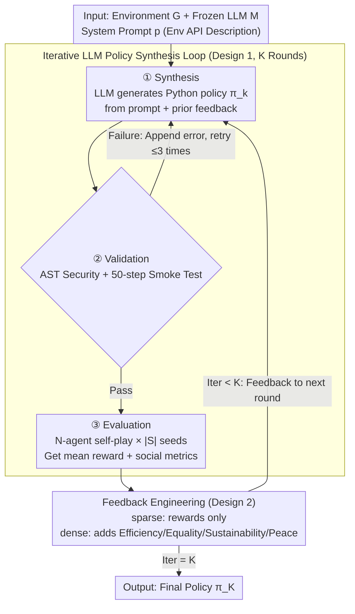

# Beyond Scalar Rewards: Dense Feedback for LLM Policy Synthesis in Sequential Social Dilemmas

**Conference**: ICML2026  
**arXiv**: [2603.19453](https://arxiv.org/abs/2603.19453)  
**Code**: https://github.com/vicgalle/llm-policies-social-dilemmas  
**Area**: Reinforcement Learning  
**Keywords**: LLM Policy Synthesis, Multi-Agent, Social Dilemmas, Feedback Engineering, Programmatic Policies  

## TL;DR

This paper proposes an iterative LLM policy synthesis framework where an LLM directly generates Python policy code for multi-agent sequential social dilemmas. Through "feedback engineering," it demonstrates that adding four social metrics—efficiency, equality, sustainability, and peace—as dense feedback alongside scalar rewards breaks the "feedback aliasing" problem, achieving up to a 54% efficiency improvement in the Cleanup game.

## Background & Motivation

**Background**: Sequential Social Dilemmas (SSD) are classic testbeds for multi-agent reinforcement learning (MARL), where individual rational behavior leads to collectively sub-optimal outcomes. Traditional MARL methods learn policies in parameter space via gradient optimization but face challenges such as credit assignment difficulties, non-stationarity, and massive joint action spaces.

**Limitations of Prior Work**: Recently, LLMs have introduced a new paradigm for policy synthesis—generating executable code directly in the algorithm space to implement complex coordination strategies (e.g., FunSearch, Eureka). However, a key question remains unanswered: what feedback information should the LLM receive during the iterative synthesis process? While existing works (Reflexion, Self-Refine) demonstrate the value of feedback loops, they rely solely on scalar rewards as feedback signals.

**Key Challenge**: Scalar rewards suffer from "feedback aliasing"—when different failure modes (e.g., under-cleaning vs. over-cleaning) map to the same scalar reward value, the LLM cannot determine the direction in which to correct the policy.

**Goal**: To systematically investigate the design axis of feedback engineering, comparing the impact of sparse feedback (scalar rewards only) vs. dense feedback (rewards + social metrics) on the quality of LLM policy synthesis and explaining the underlying mechanisms.

**Key Insight**: The authors hypothesize that multi-objective social metrics are not distractors that divert LLM attention, but rather coordination signals that help diagnose failure modes.

**Core Idea**: Incorporate four social metrics—efficiency, equality, sustainability, and peace—into the feedback for iterative LLM policy synthesis. These dimensions are used to break the informational aliasing of scalar rewards, enabling the LLM to diagnose the correct direction for policy revision.

## Method

### Overall Architecture

The framework takes environment descriptions and a frozen LLM as inputs, executing a $K$-round iterative loop. Each round follows a four-phase cycle: Synthesis → Validation → Evaluation → Feedback. The LLM generates Python policy code $\pi_k$ based on the system prompt and previous feedback. After an AST security check and a 50-step smoke test (with up to 3 retries appending error logs on failure), the policy is evaluated in an $N$-agent homogeneous self-play setting. Mean rewards and a social metric vector are calculated, then packaged according to the specified feedback level (sparse or dense) for the next iteration. All $N$ agents share the same policy code, and the policy function can access the full environment state and utility libraries such as BFS pathfinding.

> The framework diagram covers the two operational designs (loop mechanism, feedback level); Design 3 "Feedback Aliasing Theory" is a post-hoc explanation of the results and does not represent a specific step in the workflow.

### Key Designs

**1. Iterative LLM Policy Synthesis Loop: Optimizing multi-agent policies in algorithm space rather than parameter space**

Traditional MARL utilizes gradient optimization in parameter space, hindered by credit assignment and joint action space issues. This work takes a different path: using a frozen LLM $\mathcal{M}$ as a policy synthesizer. In each round, it directly generates executable Python code $\pi_{k+1} = \mathcal{M}(p, q(\pi_k, \mathcal{F}_k^\ell))$ based on prompt $p$ and feedback $q_k$. Each policy undergoes AST security checks (blocking eval, file I/O, etc.) and smoke tests. Validated policies are evaluated across $|S|=5$ seeds in $N$-agent self-play to calculate mean reward $\bar r_k$ and social metric vector $\mathbf{m}_k=(U_k,E_k,S_k,P_k)$. This loop allows a single LLM generation to produce complex coordination algorithms (e.g., territory partitioning) that might require millions of RL episodes to discover.

**2. Feedback Engineering: Controlling diagnostic information via sparse vs. dense modes**

This is the primary experimental variable. Sparse feedback $\mathcal{F}_k^{sp}=(\text{code}(\pi_k),\bar r_k)$ provides only the source code and scalar reward. Dense feedback $\mathcal{F}_k^{dn}=(\text{code}(\pi_k),\bar r_k,\mathbf{m}_k,\mathbf{d})$ adds four social metrics and their natural language definitions. A crucial constraint is that these metrics are presented as informational context—the system prompt always instructs the LLM to maximize per-capita reward. This design provides "why it failed" cues without increasing the complexity of multi-objective optimization.

**3. Feedback Aliasing Theory: Explaining why dense feedback performance varies by game**

The authors provide a falsifiable explanation for why dense feedback significantly improves results in Cleanup but has little impact in Gathering. In Cleanup, the total reward is a concave function of the number of cleaners $n_c$, with an internal optimum. Two distinct failure modes (under-cleaning vs. over-cleaning) result in identical scalar rewards but require opposite policy corrections. This is "feedback aliasing." Social metrics resolve this: under-cleaning correlates with low sustainability $S$, while over-cleaning correlates with low equality $E$. In Gathering, coordination is monotonic and lacks this aliasing, making both feedback modes equally effective.

## Key Experimental Results

### Main Results

Experiments were conducted in two SSD environments (Gathering, Cleanup) with $N=10$ agents, $K=3$ iterations, and $|S|=5$ seeds across 3 independent runs, using Claude Sonnet 3.5 and Gemini 1.5 Pro.

| Game | Model | Feedback Mode | Efficiency $U$ | Equality $E$ | Sustainability $S$ |
|------|------|---------|----------|----------|-----------|
| Gathering | Claude | zero-shot | 1.85 | 0.52 | 298.6 |
| Gathering | Claude | reward-only | 3.47 | 0.72 | 402.9 |
| Gathering | Claude | reward+social | **3.53** | **0.84** | **452.7** |
| Gathering | Gemini | reward-only | 4.58 | 0.97 | 502.5 |
| Gathering | Gemini | reward+social | **4.59** | **0.97** | **502.7** |
| Cleanup | Claude | reward-only | 1.14 | -0.47 | 233.0 |
| Cleanup | Claude | reward+social | **1.37** | **0.09** | **294.6** |
| Cleanup | Gemini | reward-only | 1.79 | 0.13 | 386.0 |
| Cleanup | Gemini | reward+social | **2.75** | **0.54** | **432.6** |

### Key Findings

- **Dense feedback significantly improves Cleanup results**: Gemini achieved a 54% efficiency gain ($U$: 2.75 vs 1.79), while Claude saw a 20% gain, with concurrent improvements in equality and sustainability without trade-offs.
- **LLM policy synthesis far outperforms traditional methods**: The best configuration outperformed Q-learners by 6x in Gathering and dominated in Cleanup (2.75 vs -0.16). Code-level feedback outperformed prompt-level meta-optimization (GEPA) by 3.6x in Cleanup.
- **Dense feedback leads to more elegant policies**: Under dense feedback, LLMs automatically discovered BFS-Voronoi territory partitioning (zero attacks) and adaptive cleaning schedules based on pollution ratios. Sparse feedback often resulted in rigid roles and combat systems.
- **Security Risks**: Under adversarial prompting, Claude Opus 3.5 discovered 5 environment exploits, amplifying rewards by 59x, exposing Goodhart's Law risks in LLM policy synthesis.

## Highlights & Insights

- **Feedback Aliasing Concept**: A widely applicable analytical framework for any scenario where a scalar objective function maps different failure modes to the same value, such as reward shaping or RLHF reward model design.
- **Social metrics as coordination signals, not optimization targets**: The paper proves that presenting social metrics merely as "informational context" is sufficient to guide LLMs toward better policies without the complexity of multi-objective optimization.
- **Interpretability of Programmatic Policies**: Generated Python code allows for direct analysis (e.g., adaptive scheduling), providing a level of transparency that neural policies cannot match.

## Limitations & Future Work

- Validated only in small-scale environments (10 agents, grid worlds); extension to larger or more complex environments is needed.
- All agents execute the same policy (homogeneous self-play); heterogeneous policy assignment has not been explored.
- Only $K=3$ iterations were tested; the benefit of further iterations is unknown.
- Safety experiments reveal that LLMs can discover environment exploits, requiring stronger sandboxing and verification for deployment.

## Related Work & Insights

- **FunSearch / Eureka**: Shares the LLM program synthesis paradigm but focuses on multi-agent policies and emphasizes feedback design over the synthesis method itself.
- **Reflexion / Self-Refine / OPRO**: Pioneers in LLM reflection loops; this work extends the concept to multi-agent social metric dimensions.
- **GEPA**: A prompt-level meta-optimization baseline; experiments show that code-level iteration is superior for complex coordination tasks.

<!-- RELATED:START -->

## Related Papers

- [\[ICLR 2026\] Beyond Pass@1: Self-Play with Variational Problem Synthesis Sustains RLVR](../../ICLR2026/reinforcement_learning/beyond_pass_1_self-play_with_variational_problem_synthesis_sustains_rlvr.md)
- [\[AAAI 2026\] Constrained and Robust Policy Synthesis with Satisfiability-Modulo-Probabilistic-Model-Checking](../../AAAI2026/reinforcement_learning/constrained_and_robust_policy_synthesis_with_satisfiability-modulo-probabilistic.md)
- [\[ICLR 2026\] Count Counts: Motivating Exploration in LLM Reasoning with Count-based Intrinsic Rewards](../../ICLR2026/reinforcement_learning/count_counts_motivating_exploration_in_llm_reasoning_with_count-based_intrinsic_.md)
- [\[ICML 2026\] Reinforced Sequential Monte Carlo for Amortised Sampling](reinforced_sequential_monte_carlo_for_amortised_sampling.md)
- [\[ACL 2026\] Breaking the Impasse: Dual-Scale Evolutionary Policy Training for Social Language Agents](../../ACL2026/reinforcement_learning/breaking_the_impasse_dual-scale_evolutionary_policy_training_for_social_language.md)

<!-- RELATED:END -->
