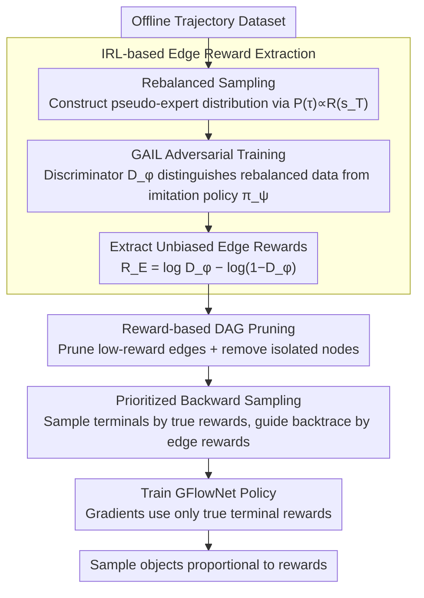

# Beyond the Proxy: Trajectory-Distilled Guidance for Offline GFlowNet Training

**Conference**: ICML2026  
**arXiv**: [2505.20110](https://arxiv.org/abs/2505.20110)  
**Code**: https://github.com/Chenruishuo/TD-GFN  
**Area**: Reinforcement Learning  
**Keywords**: GFlowNet, offline training, inverse reinforcement learning, DAG pruning, proxy-free rewards  

## TL;DR
The paper proposes TD-GFN, an offline GFlowNet training framework that eliminates the need for proxy reward models. It extracts edge-level rewards from offline trajectories via inverse reinforcement learning, followed by indirect policy guidance through DAG pruning and prioritized backward sampling. This approach ensures that gradient updates rely exclusively on ground-truth terminal rewards, significantly outperforming existing baselines in tasks such as molecular design and sequence generation.

## Background & Motivation

**Background**: Generative Flow Networks (GFlowNets) are a class of generative models that sample combinatorial objects on Directed Acyclic Graph (DAG) structures, aiming to sample terminal nodes with probabilities proportional to given rewards. They have been widely applied in molecule discovery, protein sequence design, and combinatorial optimization. However, in many practical scenarios, actively querying the reward function is extremely costly (e.g., wet-lab experiments, human evaluation), necessitating GFlowNet training from pre-collected offline datasets.

**Limitations of Prior Work**: The standard paradigm involves training a proxy reward model on the offline dataset, which GFlowNet then queries for reward signals. However, constructing reliable proxy models requires large amounts of diverse data and domain expertise. More critically, when GFlowNet generates out-of-distribution (OOD) samples and queries the proxy, estimation errors propagate through gradients, damaging policy quality. Existing proxy-free methods like RO-GFlowNet and COFlowNet attempt to learn directly from offline trajectories but only impose coarse-grained constraints to align policies with data distributions, limiting generalization and exploration efficiency.

**Key Challenge**: Offline GFlowNet training faces a fundamental dilemma: proxy models introduce error propagation, while coarse constraints in proxy-free methods restrict exploration. In a DAG, the contributions of different edges to learning an effective policy are unequal (e.g., critical edges leading to high-reward terminals vs. edges leading to low-reward ones), but existing methods fail to exploit these structural differences.

**Goal**: Design a proxy-free offline GFlowNet training framework that can (1) extract fine-grained transition-level guidance signals from trajectories and (2) effectively guide the policy to explore high-reward regions without relying on proxy rewards for gradient updates.

**Key Insight**: Leveraging the theoretical equivalence between GFlowNet training and entropy-regularized RL, the authors apply Maximum Causal Entropy Inverse Reinforcement Learning (IRL) to a rebalanced offline dataset to extract importance scores for each edge (edge rewards). These edge rewards do not predict terminal rewards but instead quantify the structural contribution of transitions to policy learning.

**Core Idea**: Distill edge-level rewards from trajectories using IRL to indirectly guide the policy through DAG pruning and prioritized backward sampling. Gradient updates rely solely on ground-truth terminal rewards, achieving both efficient exploration and error isolation.

## Method

### Overall Architecture
TD-GFN training consists of two stages: (1) **Edge reward extraction stage**—after rebalanced sampling of the offline dataset, an adversarial IRL (GAIL-based) approach is used to learn an edge-level reward function $R_E(s, s')$, quantifying the contribution of each edge in the DAG. (2) **Policy training stage**—DAG pruning is performed using edge rewards to remove inefficient transitions, followed by constructing training trajectories via prioritized backward sampling. Finally, the GFlowNet policy is trained using these trajectories and the ground-truth rewards from the dataset. Throughout the process, gradient updates depend only on ground-truth rewards; edge rewards are used solely for sampling guidance.

### Key Designs

**1. IRL-based Edge Reward Extraction: Distilling structural preferences from trajectories**

The problem with proxy reward models is that they predict terminal rewards; any misestimation on OOD samples propagates through gradients. TD-GFN instead learns an edge reward $R_E(s, s')$ that quantifies "how important each DAG edge is for policy learning." The approach involves rebalanced sampling of trajectories $P(\tau) \propto R(s_T)$ to construct an approximate expert distribution, followed by GAIL training where a discriminator $D_\phi$ distinguishes rebalanced data from transitions generated by an imitation policy $\pi_\psi$. The unbiased edge reward is read as $R_E(s, s') = \log D_\phi(s, s') - \log(1 - D_\phi(s, s'))$. Theoretically, in the population limit, $R_E$ recovers the log conditional inflow scores (log of the canonical backward policy $\mathcal{P}_B^*$). Learning errors $\|R_E - r^*\|_\infty \le \varepsilon$ guarantee that the TV distance of the backward policy does not exceed $\frac{1}{2}(e^{2\varepsilon} - 1)$. Because edge rewards capture structural preferences rather than terminal rewards, approximation errors do not damage the policy via gradients, and experiments show good generalization to unobserved transitions.

**2. Reward-based DAG Pruning: Applying edge rewards to action space instead of gradients**

Directly using edge rewards for reward shaping in gradients can amplify function approximation errors from IRL. TD-GFN adopts more robust indirect usage: pruning. Transitions are sampled using the imitation policy $\pi_\psi$ to calculate the edge reward distribution. If an edge reward is below a threshold $R_E(s, s') < \text{mean}(\mathcal{D}_{R_E}) - K \cdot \text{std}(\mathcal{D}_{R_E})$, it is pruned from the DAG. This focuses the policy's attention on high-value regions while completely bypassing error propagation. Theoretical guarantees ensure that terminal nodes with high bottleneck scores $\beta(x) > \tau + \varepsilon$ remain reachable after pruning, and the relative reward proportions on surviving terminals are preserved.

**3. Prioritized Backward Sampling: Generating high-value training trajectories on the pruned DAG**

Pruning shrinks the action space, but training trajectories must also be guided toward high-value regions. TD-GFN samples starting points $x$ from the dataset's terminal nodes proportional to rewards, then backtraces to the root using a backward policy $\mathcal{P}_B(s_t | s_{t+1}) = \exp\{R_E(s_t, s_{t+1})\} / \sum_{(s, s_{t+1}) \in E'} \exp\{R_E(s, s_{t+1})\}$ defined by edge rewards. Terminal sampling biases toward high rewards and path sampling biases toward important transitions, inherently focusing trajectories on high-value regions. Crucially, policy gradients only utilize the true terminal rewards recorded in the dataset, isolating potential IRL errors from the optimization process.

### Loss & Training
The policy can be trained using any GFlowNet objective (FM, TB, SubTB, DB). Experiments demonstrate that TD-GFN's pruning and sampling modules are orthogonal to the specific objective and provide consistent gains. Flow Matching (FM) is used in main experiments for fair comparison with COFlowNet.

## Key Experimental Results

### Main Results

| Task | Method | Core Metric | Convergence Speed |
|------|------|----------|----------|
| Hypergrid $8^4$ | TD-GFN | Lowest L1 Error, 16/16 modes | <5,000 state visits (6x speedup) |
| Hypergrid $8^4$ | COFlowNet | Second lowest L1 Error | >10,000 state visits |
| Biological Sequences (AMP) | TD-GFN | Highest Top-100 Reward & Diversity | — |
| Biological Sequences (AMP) | Proxy-GFN | Reward lower than TD-GFN | — |

| Method | Reward-10 ↑ | Reward-100 ↑ | Reward-1000 ↑ | Converged Trajectories ↓ |
|------|-------------|--------------|---------------|-------------|
| Oracle-GFN (Ref) | 7.718 | 7.408 | 6.801 | 44.1×10⁴ |
| Proxy-GFN | 7.625 | 7.281 | 6.636 | 43.7×10⁴ |
| QM-COFlowNet | 7.611 | 7.296 | 6.638 | 4.4×10⁴ |
| FM-COFlowNet | 7.582 | 7.201 | 6.485 | 5.8×10⁴ |
| Dataset-GFN | 7.550 | 7.198 | 6.474 | 6.0×10⁴ |
| **TD-GFN** | **7.733** | **7.450** | **6.810** | **2.7×10⁴** |

### Ablation Study

| Setting | TD-GFN Performance | Notes |
|----------|------------|------|
| Mixed Dataset (with random trajectories) | Maintains optimal L1 Error | Robust to noisy data |
| 1/10 Dataset (only 150 trajectories) | Outperforms baselines | Effective in data-scarce scenarios |
| Median Behavior Policy | Faster convergence | Robust to sub-optimal data collection |
| Bad Behavior Policy (inverted rewards) | Significantly better than baselines | Strong performance under extreme degradation |
| Molecular Diversity (Tanimoto modes) | 1.5-2x stronger baselines | Pruning enhances exploration instead of overfitting |
| Different GFN Objectives (TB/SubTB/DB) | Consistent gains | Orthogonal to specific objectives |

## Highlights & Insights
- Essence of edge rewards vs. proxy rewards: Edge rewards capture structural preferences for transitions rather than predicting terminal rewards, allowing indirect usage without introducing gradient error propagation.
- In molecular design, TD-GFN matches the performance of online GFNs using a real Oracle while using only 1/20 of the trajectories.
- Despite DAG pruning, TD-GFN discovers 1.5-2x more high-reward modes than baselines, suggesting that reducing action space is not contradictory to enhancing exploration.
- Rebalancing is inherently effective: Even simple rebalanced GAIL imitation learning outperforms Dataset-GFN trained directly on the dataset.

## Limitations & Future Work
- The IRL stage requires additional training of a discriminator and an imitation policy, increasing computational overhead.
- The pruning threshold $K$ is a hyperparameter and requires tuning for different tasks.
- Theoretical guarantees depend on the approximation error $\varepsilon$ of edge rewards, which is difficult to measure directly in practice.
- Validated only on discrete DAG environments; extensions to continuous state spaces or non-DAG structures remain to be explored.

## Related Work & Insights
- **COFlowNet / RO-GFlowNet**: Existing proxy-free offline GFlowNet methods use coarse-grained constraints; TD-GFN significantly outperforms them via fine-grained edge-level guidance.
- **GAIL / MaxEntIRL**: TD-GFN's edge reward extraction is built directly upon the Maximum Causal Entropy IRL framework.
- **GFlowNet-RL Equivalence (Tiapkin et al., 2024)**: Treating GFlowNet training as entropy-regularized RL provides the theoretical foundation for this methodology.
- Insight: In other generative models requiring offline training, the paradigm of "distilling structural guidance from trajectories + indirect usage to isolate errors" may have broad applicability.

## Rating
- Novelty: 9/10 — Introducing IRL to offline GFlowNet training is a novel paradigm with elegant indirect reward usage.
- Experimental Thoroughness: 9/10 — Comprehensive evaluation across three benchmarks, various data qualities, and multiple GFN objectives with theoretical support.
- Writing Quality: 8/10 — Clear structure, well-defined motivation, and tight integration of theory and experiments.
- Value: 8/10 — Establishes a new SOTA paradigm for offline GFlowNets with significant implications for practical applications like molecular design.

<!-- RELATED:START -->

## Related Papers

- [\[ICML 2026\] Offline Reinforcement Learning with Generative Trajectory Policies](offline_reinforcement_learning_with_generative_trajectory_policies.md)
- [\[ICML 2026\] Trajectory-Level Data Augmentation for Offline Reinforcement Learning](trajectory-level_data_augmentation_for_offline_reinforcement_learning.md)
- [\[ICML 2026\] Counterfactual Transport Flows for Offline Conservative Trajectory Refinement](counterfactual_transport_flows_for_offline_conservative_trajectory_refinement.md)
- [\[ICLR 2026\] Beyond Binary Rewards: Training LMs to Reason About Their Uncertainty](../../ICLR2026/reinforcement_learning/beyond_binary_rewards_training_lms_to_reason_about_their_uncertainty.md)
- [\[ICML 2026\] Beyond Scalar Rewards: Dense Feedback for LLM Policy Synthesis in Sequential Social Dilemmas](beyond_scalar_rewards_dense_feedback_for_llm_policy_synthesis_in_sequential_soci.md)

<!-- RELATED:END -->
