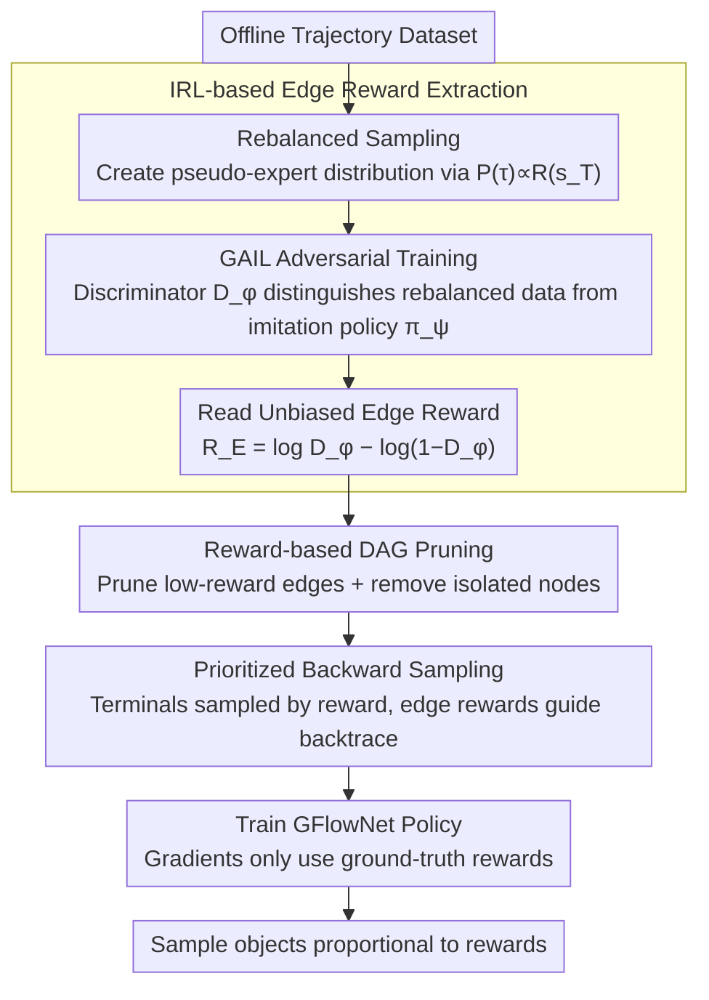

# Beyond the Proxy: Trajectory-Distilled Guidance for Offline GFlowNet Training

**Conference**: ICML2026  
**arXiv**: [2505.20110](https://arxiv.org/abs/2505.20110)  
**Code**: https://github.com/Chenruishuo/TD-GFN  
**Area**: Reinforcement Learning  
**Keywords**: GFlowNet, Offline Training, Inverse Reinforcement Learning, DAG Pruning, Proxy-free Reward  

## TL;DR
The authors propose TD-GFN, a proxy-free offline GFlowNet training framework that extracts edge-level rewards from offline trajectories via inverse reinforcement learning. These rewards indirectly guide policy learning through DAG pruning and prioritized backward sampling, while ensuring that gradient updates rely solely on ground-truth terminal rewards. This approach significantly outperforms existing baselines in tasks such as molecular design and sequence generation.

## Background & Motivation

**Background**: Generative Flow Networks (GFlowNet) are a class of generative models designed to sample combinatorial objects in DAG-structured environments, aiming to sample terminal nodes with probabilities proportional to a given reward. They have been widely applied in molecule discovery, protein sequence design, and combinatorial optimization. However, in many real-world scenarios, actively querying the reward function is extremely costly (e.g., wet-lab experiments or human evaluation), necessitating the training of GFlowNets from pre-collected offline datasets.

**Limitations of Prior Work**: The standard paradigm involves training a proxy reward model on the offline dataset, which the GFlowNet then queries for reward signals. However, building a reliable proxy requires large-scale diverse data and domain expertise. More critically, when the GFlowNet generates out-of-distribution (OOD) samples and queries the proxy, estimation errors propagate through gradients, degrading policy quality. Existing proxy-free methods like RO-GFlowNet and COFlowNet attempt to learn directly from offline trajectories but only impose coarse-grained constraints to align the policy with the data distribution, which limits generalization and exploration efficiency.

**Key Challenge**: Offline GFlowNet training faces a fundamental dilemma: proxy models introduce error propagation, while proxy-free methods utilize coarse constraints that restrict exploration. In a DAG, the contribution of different edges to learning an effective policy is unequal (e.g., critical edges leading to high-reward terminals vs. edges leading to low-reward ones), but existing methods fail to exploit these structural differences.

**Goal**: To design a proxy-free offline GFlowNet training framework that can (1) extract fine-grained transition-level guidance signals from trajectories, and (2) effectively guide the policy to explore high-reward regions without relying on a proxy reward for gradient updates.

**Key Insight**: Leveraging the theoretical equivalence between GFlowNet training and entropy-regularized RL, the authors apply Maximum Causal Entropy Inverse Reinforcement Learning to a rebalanced offline dataset to extract importance scores for each edge (edge rewards). These edge rewards do not predict terminal rewards but rather quantify the structural contribution of transitions to policy learning.

**Core Idea**: Distill edge-level rewards from trajectories using IRL. Use these for indirect guidance via DAG pruning and prioritized backward sampling, while keeping gradient updates dependent only on ground-truth terminal rewards to achieve both efficient exploration and error isolation.

## Method

### Overall Architecture
The training of TD-GFN consists of two stages: (1) **Edge Reward Extraction Phase**—after performing rebalanced sampling on the offline dataset, an adversarial IRL (based on GAIL) is used to learn an edge-level reward function $R_E(s, s')$, which quantifies the contribution of each edge in the DAG to policy learning; (2) **Policy Training Phase**—the edge rewards are utilized to perform DAG pruning to remove inefficient transitions, followed by prioritized backward sampling to construct training trajectories. Finally, these trajectories and the ground-truth terminal rewards from the dataset are used to train the GFlowNet policy. Throughout the process, gradient updates depend only on ground-truth rewards; edge rewards are used solely for sampling guidance.

### Key Designs

**1. IRL-based Edge Reward Extraction: Distilling structural preferences from trajectories**

The issue with proxy reward models is their prediction of terminal rewards; estimation errors on OOD samples pollute the policy via gradients. TD-GFN adopts a different approach: instead of predicting terminal rewards, it learns an edge reward $R_E(s, s')$ that quantifies "how important each DAG edge is for policy learning." The process starts by rebalancing trajectories in the dataset proportional to terminal rewards $P(\tau) \propto R(s_T)$ to construct an approximate expert distribution. Then, GAIL is used for adversarial training—where a discriminator $D_\phi$ distinguishes rebalanced data from transitions generated by an imitation policy $\pi_\psi$. Finally, unbiased edge rewards are extracted as $R_E(s, s') = \log D_\phi(s, s') - \log(1 - D_\phi(s, s'))$. Theoretically, in the population limit, $R_E$ recovers the log-conditional inflow score (i.e., the log of the canonical backward policy $\mathcal{P}_B^*$). The learning error $\|R_E - r^*\|_\infty \le \varepsilon$ ensures that the TV distance of the backward policy does not exceed $\frac{1}{2}(e^{2\varepsilon} - 1)$. Because edge rewards capture structural preferences rather than terminal rewards, approximation errors do not damage the policy via gradients, and experiments show good generalization to unobserved transitions.

**2. Reward-based DAG Pruning: Applying edge rewards indirectly to the action space rather than gradients**

Directly using edge rewards for reward shaping in gradients can amplify function approximation errors from IRL. TD-GFN chooses a more robust indirect application—pruning. A batch of state-action pairs is sampled using the imitation policy $\pi_\psi$ to calculate the edge reward distribution. If an edge's reward is below a threshold $R_E(s, s') < \text{mean}(\mathcal{D}_{R_E}) - K \cdot \text{std}(\mathcal{D}_{R_E})$ (where $K$ is a hyperparameter), it is pruned from the DAG, and isolated nodes disconnected from the root are removed. This focuses the policy's attention on high-value regions while completely bypassing error propagation. A theoretical guarantee is provided: terminal nodes with high bottleneck scores $\beta(x) > \tau + \varepsilon$ remain reachable after pruning, and the relative reward proportions among surviving terminals are preserved—only "useless edges" are pruned, thus maintaining the GFlowNet sampling objective.

**3. Prioritized Backward Sampling: Creating high-value-focused training trajectories on the pruned DAG**

Pruning shrinks the action space, but training trajectories must also be directed toward high-value regions. TD-GFN starts from dataset terminal nodes sampled proportional to their rewards $x$, then recursively backtraces to the root using a backward policy defined by the edge rewards $\mathcal{P}_B(s_t | s_{t+1}) = \exp\{R_E(s_t, s_{t+1})\} / \sum_{(s, s_{t+1}) \in E'} \exp\{R_E(s, s_{t+1})\}$, generating full trajectories. Terminal sampling biases toward high rewards, while path sampling biases toward important transitions, naturally focusing trajectories in high-value regions. This reinforces GFlowNet's core inductive bias of "allocating sampling resources proportional to rewards." Crucially, policy gradients only utilize the ground-truth terminal rewards recorded in the dataset; potential errors from the IRL stage remain isolated within the sampling guidance and never enter the gradient updates.

### Loss & Training
The policy can be trained using any GFlowNet objective (FM, TB, SubTB, DB). Experiments indicate that TD-GFN's pruning and sampling modules are orthogonal to the specific objective and provide consistent improvements. Flow Matching (FM) was used in the main experiments for a fair comparison with COFlowNet.

## Key Experimental Results

### Main Results

| Task | Method | Core Metric | Convergence Speed |
|------|------|----------|----------|
| Hypergrid $8^4$ | TD-GFN | Lowest L1 Error, 16/16 modes | <5,000 state visits (6x faster) |
| Hypergrid $8^4$ | COFlowNet | Second lowest L1 Error | >10,000 state visits |
| Bio-sequence (AMP) | TD-GFN | Highest Top-100 Reward & Diversity | — |
| Bio-sequence (AMP) | Proxy-GFN | Rewards lower than TD-GFN | — |

| Method | Reward-10 ↑ | Reward-100 ↑ | Reward-1000 ↑ | Convergence Trajectories ↓ |
|------|-------------|--------------|---------------|-------------|
| Oracle-GFN (Ref.) | 7.718 | 7.408 | 6.801 | 44.1×10⁴ |
| Proxy-GFN | 7.625 | 7.281 | 6.636 | 43.7×10⁴ |
| QM-COFlowNet | 7.611 | 7.296 | 6.638 | 4.4×10⁴ |
| FM-COFlowNet | 7.582 | 7.201 | 6.485 | 5.8×10⁴ |
| Dataset-GFN | 7.550 | 7.198 | 6.474 | 6.0×10⁴ |
| **Ours (TD-GFN)** | **7.733** | **7.450** | **6.810** | **2.7×10⁴** |

### Ablation Study

| Setup | TD-GFN Performance | Note |
|----------|------------|------|
| Mixed Dataset (with random trajectories) | Maintains optimal L1 Error | Robust to noisy data |
| 1/10 Dataset (only 150 trajectories) | Still outperforms baselines | Effective in data-scarce scenarios |
| Median Behavioral Policy (half-trained) | Faster convergence | Robust to suboptimal collection policies |
| Bad Behavioral Policy (inverted rewards) | Significantly superior to baselines | Strong performance under extreme degradation |
| Molecular Diversity (Tanimoto modes) | 1.5-2x better than strongest baseline | Pruning did not cause overfitting; enhanced exploration |
| Different GFN Objectives (TB/SubTB/DB) | Consistent gains | Orthogonal to the specific objective |

## Highlights & Insights
- Essence of edge rewards vs. proxy rewards: Edge rewards capture structural preferences of transitions rather than predicting terminal rewards, allowing for indirect usage without introducing gradient error propagation.
- In molecular design, TD-GFN matches the performance of an online GFN using the real Oracle, while requiring only 1/20 of the trajectories.
- Despite DAG pruning, the number of high-reward modes discovered by TD-GFN is actually 1.5-2x that of baselines, showing that "reducing action space" is not contradictory to "enhancing exploration."
- Rebalancing strategies are inherently effective: even simple rebalanced GAIL imitation learning outperforms Dataset-GFN trained directly on the data.

## Limitations & Future Work
- The IRL stage requires training an additional discriminator and imitation policy, increasing computational overhead.
- The pruning threshold $K$ is a hyperparameter that needs adjustment for different tasks.
- Theoretical guarantees depend on the edge reward approximation error $\varepsilon$, which is difficult to measure directly in practice.
- Validation is limited to discrete DAG environments; extensions to continuous state spaces or non-DAG structures remain to be explored.

## Related Work & Insights
- **COFlowNet / RO-GFlowNet**: Existing proxy-free offline GFlowNet methods that impose coarse-grained constraints. TD-GFN significantly outperforms them via fine-grained edge-level guidance.
- **GAIL / MaxEntIRL**: The edge reward extraction in TD-GFN is built directly upon the Maximum Causal Entropy IRL framework.
- **GFlowNet-RL Equivalence (Tiapkin et al., 2024)**: Transforming GFlowNet training into entropy-regularized RL provides the theoretical foundation for this methodology.
- Insight: In other generative models requiring offline training, the paradigm of "distilling structural guidance from trajectories + indirect usage for error isolation" may have broad applicability.

## Rating
- Novelty: 9/10 — Introducing IRL to offline GFlowNet training is a fresh paradigm; the indirect use of edge rewards is elegantly designed.
- Experimental Thoroughness: 9/10 — Three benchmarks, multiple data quality settings, various GFN objectives, and theoretical guarantees make it very comprehensive.
- Writing Quality: 8/10 — The paper is clearly structured with a well-defined motivation and strong links between theory and experiments.
- Value: 8/10 — Establishes a new SOTA for offline GFlowNets, with significant implications for practical applications like molecular design.

<!-- RELATED:START -->

## Related Papers

- [\[ICML 2026\] Offline Reinforcement Learning with Generative Trajectory Policies](offline_reinforcement_learning_with_generative_trajectory_policies.md)
- [\[ICML 2026\] Trajectory-Level Data Augmentation for Offline Reinforcement Learning](trajectory-level_data_augmentation_for_offline_reinforcement_learning.md)
- [\[ICML 2026\] Beyond Scalar Rewards: Dense Feedback for LLM Policy Synthesis in Sequential Social Dilemmas](beyond_scalar_rewards_dense_feedback_for_llm_policy_synthesis_in_sequential_soci.md)
- [\[AAAI 2026\] Know your Trajectory -- Trustworthy Reinforcement Learning Deployment through Importance-Based Trajectory Analysis](../../AAAI2026/reinforcement_learning/know_your_trajectory_--_trustworthy_reinforcement_learning_deployment_through_im.md)
- [\[ICML 2025\] Online Pre-Training for Offline-to-Online Reinforcement Learning](../../ICML2025/reinforcement_learning/online_pre-training_for_offline-to-online_reinforcement_learning.md)

<!-- RELATED:END -->
