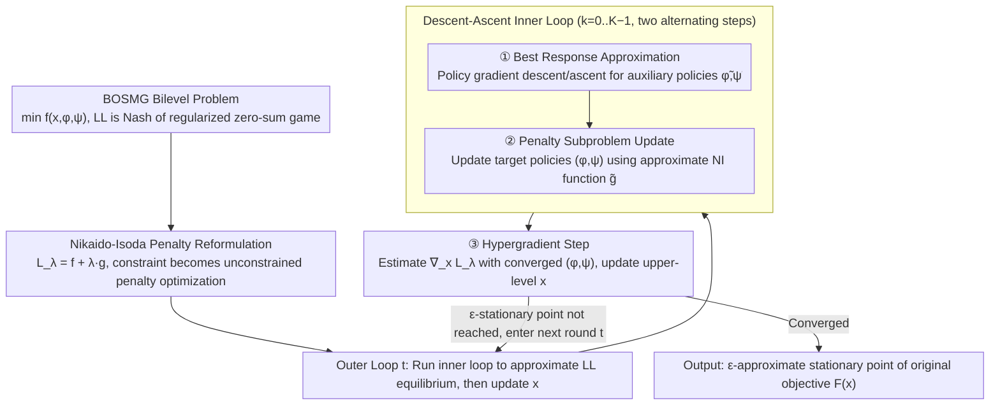

# Bilevel Optimization over Saddle Points of Zero-Sum Markov Games

**Conference**: ICML2026  
**arXiv**: [2605.26654](https://arxiv.org/abs/2605.26654)  
**Code**: None  
**Area**: Reinforcement Learning  
**Keywords**: Bilevel Optimization, Zero-Sum Markov Games, Policy Gradient, Nikaido-Isoda Function, Saddle Point Equilibrium

## TL;DR
The PANDA algorithm is proposed to solve bilevel RL problems where the lower level is a regularized zero-sum Markov game. By employing a penalty reformulation based on the Nikaido-Isoda function and utilizing purely first-order policy gradient methods, it achieves an iteration complexity of $\tilde{O}(\epsilon^{-1})$ and a sample complexity of $\tilde{O}(\epsilon^{-3})$, matching the best-known rates for single-policy lower-level BRL.

## Background & Motivation

**Background**: Bilevel Reinforcement Learning (BRL) is a powerful paradigm for modeling hierarchical decision-making: the upper-level (UL) learner optimizes high-level variables (e.g., incentive parameters, reward design), while the lower-level (LL) solves an RL problem under the influence of these variables. Recently, algorithms such as PARL, HPGD, SoBiRL, and First-Order BRL have been proposed with theoretical convergence guarantees.

**Limitations of Prior Work**: Existing BRL methods almost exclusively assume the lower level is a **single-policy** MDP (with only one agent performing max or min), failing to handle multi-agent adversarial structures. However, in scenarios such as incentive design and RLHF preference learning, the lower level naturally involves a coupled game between two adversarial policies. Directly transferring single-policy BRL methods to min-max game settings fails—for instance, the hypergradient derivations in HPGD/SoBiRL rely on the closed-form optimal policy characteristics of single-policy MDPs, which do not hold under coupled dual-policy optimization.

**Key Challenge**: The strategic coupling of two adversarial policies in zero-sum Markov games makes algorithm design inherently more difficult. Existing approaches for this setting are either heuristic without convergence guarantees (Meta-Gradient), rely on computationally expensive second-order information such as the Hessian inverse (DA), or only converge to stationary points of a penalty surrogate problem rather than the original problem (PBRL).

**Goal**: To design a stochastic first-order method for solving bilevel optimization problems where the lower level is a regularized min-max zero-sum Markov game (MMZSMG), termed BOSMG, while achieving provably efficient iteration and sample complexity.

**Key Insight**: Utilize the Nikaido-Isoda (NI) function to characterize the degree of policy deviation from equilibrium—the NI function is non-negative and zero if and only if the policy pair is a Nash equilibrium. By adding the NI function as a penalty term to the upper-level objective, the bilevel constrained problem is transformed into an unconstrained penalty optimization, thereby avoiding hypergradient computation. Furthermore, the inherent structure of regularized MMZSMG (unique equilibrium and the non-uniform PŁ property of the NI function) is leveraged to ensure convergence to approximate stationary points of the original problem.

**Core Idea**: Employs NI function penalty reformulation combined with descent-ascent policy gradients to bypass hypergradients and second-order information, realizing a purely first-order solution for BOSMG.

## Method

### Overall Architecture
PANDA solves problems of the form: $\min_{x,\phi,\psi} f(x,\phi,\psi)$ s.t. $(\phi,\psi) \in \arg\min_{\phi'}\max_{\psi'} J(x,\phi',\psi')$, where $x$ is the upper-level variable, and $(\phi,\psi)$ parameterize the policies of the min-player and max-player, respectively, with $J$ being the regularized value function. The algorithm first reformulates this bilevel constraint into a penalty form $\min_{x,\phi,\psi} f(x,\phi,\psi) + \lambda \cdot g(x,\phi,\psi)$ using the NI function. Subsequently, in the outer loop, each iteration first runs a descent-ascent inner loop to approximate the lower-level equilibrium, followed by a hypergradient update step for the upper-level $x$ using the converged policies. The entire process utilizes only first-order policy gradient information.

(The diagram illustrates the two primary design components contributing to the algorithmic flow: penalty reformulation and descent-ascent iterations. The non-uniform PŁ property is a theoretical tool for convergence analysis and is not explicitly in the data flow.)

### Key Designs

**1. Nikaido-Isoda Penalty Reformulation: Using a non-negative gap to transform bilevel constraints into first-order solvable single-level penalty optimization**

Traditional bilevel RL requires the chain rule and Hessian inverses for hypergradient computation, which is computationally expensive. Moreover, single-policy BRL hypergradient derivations rely on closed-form optimal policies of single MDPs, which are invalid in coupled min-max games. This work uses the NI function $g(x,\phi,\psi) = \max_{\psi'} J(x,\phi,\psi') - \min_{\phi'} J(x,\phi',\psi)$ to precisely measure policy deviation from the Nash equilibrium. It is non-negative and zero only at equilibrium, naturally fitting the saddle-point structure of min-max games. Incorporating it as a penalty term yields $L_\lambda(x,\phi,\psi) = f(x,\phi,\psi) + \lambda \cdot g(x,\phi,\psi)$. Theoretically, when $\lambda$ is sufficiently large, the gradient bias between the stationary points of $L_\lambda^*(x)$ and the original $F(x)$ is $O(\lambda^{-1})$, bypassing hypergradients and second-order data completely.

**2. Descent-Ascent Three-Step Iteration (Best Response + Penalty Subproblem + Hypergradient Update): Approximating LL equilibrium and updating UL using only first-order information**

The NI function contains two best-response problems (one max, one min) that lack closed-form solutions. The algorithm splits each outer iteration into an inner loop and a hypergradient step. The inner loop runs $K$ steps, alternating between: ① **Best Response Approximation**—performing one policy gradient descent/ascent step on auxiliary variables $\tilde{\phi},\tilde{\psi}$ to approximate the best responses; ② **Penalty Subproblem Update**—constructing an approximate NI function $\tilde{g}(x,\phi,\psi,\tilde{\phi},\tilde{\psi}) = J(x,\phi,\tilde{\psi}) - J(x,\tilde{\phi},\psi)$ as a surrogate for $g$, and updating the target policies $(\phi,\psi)$ via stochastic gradients. After $K$ steps, $(\phi,\psi)$ are sufficiently close to the penalty subproblem optima $(\phi^*_\lambda,\psi^*_\lambda)$. ③ **Hypergradient Step**—the upper-level $x$ is updated via stochastic gradient descent using the estimated hypergradient $\nabla_x \tilde{L}_\lambda$. The entire process uses only first-order policy gradients estimated via Monte Carlo roll-outs. Crucially, the inner loop only requires $K=O(\log\lambda)$ steps, ensuring logarithmic growth in computational overhead.

**3. Non-uniform PŁ Property of NI Function: Providing gradient dominance without strong convexity assumptions**

To prove convergence without assuming strong convexity, a structural tool for the NI function's optimization landscape is required. The authors prove that for any $x$ and $(\phi,\psi)$, the NI function satisfies $\frac{1}{2}\|\nabla_{(\phi,\psi)}g\|^2 \geq \mu(\phi,\psi)\cdot g(x,\phi,\psi)$, where $\mu(\phi,\psi)$ depends on the minimum policy probability and regularization coefficients. This generalizes the non-uniform PŁ results of Mei et al. (2020) for single-agent soft value functions to two-agent zero-sum games. It indicates that under softmax parameterization, the NI function of regularized zero-sum games possesses favorable gradient dominance properties, which is central to the convergence proof and holds independent value for other NI-based game-theoretic analyses.

## Key Experimental Results

### Main Results

| Environment | Method | UL Objective | NE Gap | Note |
|------|------|---------|--------|------|
| Synthetic (Incentive Design) | **PANDA** | **Highest** (≈2.55) | **≈0** | Approaches Oracle upper bound |
| Synthetic | META | ≈2.2 | ≈0 | Heuristic; insufficient UL optimization |
| Synthetic | DA | ≈2.3 | ≈0 | Requires second-order information |
| Synthetic | PBRL | ≈2.35 | ≈0 | Suboptimal UL |
| Sentinel-Intruder 5×5 | **PANDA** | **Lowest UL loss** | — | Effectively avoids restricted zones |
| Sentinel-Intruder 20×20 | **PANDA** | **Lowest UL loss** | — | Superior at larger scales |

### Ablation Study (Influence of Penalty Parameter $\lambda$)

| $\lambda$ | UL Reward | NE Gap | Note |
|-----------|-----------|--------|------|
| 1 | High | **Large** | Weak lower-level equilibrium constraint |
| 4 | High | ≈0 | Good balance between equilibrium and UL |
| 10 | Slightly Lower | ≈0 | Strong penalty slightly sacrifices UL goal |

### Complexity Comparison

| Algorithm | LL Problem | Stochastic/Det. | Iteration Complexity | Sample Complexity | Oracle |
|------|---------|-----------|------------|------------|--------|
| **PANDA** | **Min-Max** | **Stochastic** | $\tilde{O}(\epsilon^{-1})$ | $\tilde{O}(\epsilon^{-3})$ | First-order |
| First-Order BRL | Max | Stochastic | $\tilde{O}(\epsilon^{-1})$ | $\tilde{O}(\epsilon^{-3})$ | First-order |
| SoBiRL | Max | Stochastic | $\tilde{O}(\epsilon^{-1.5})$ | $\tilde{O}(\epsilon^{-3.5})$ | First-order |
| DA | Min-Max | Deterministic | $\tilde{O}(\epsilon^{-1})$ | — | 1st + 2nd order |
| META | Min-Max | Stochastic | N/A | N/A | First-order |

### Key Findings
- PANDA is the **first** first-order method to provide convergence guarantees for BOSMG in a stochastic setting, with iteration and sample complexities matching the best rates for single-policy BRL.
- $\lambda$ controls the trade-off between lower-level equilibrium accuracy and upper-level objective optimization: small $\lambda$ relaxes the equilibrium constraint, while large $\lambda$ leads to over-penalization.
- PANDA remains effective and outperforms baselines in 20×20 grid environments, demonstrating scalability for larger problems.

## Highlights & Insights
- **Combination of NI Function + Penalty Method**: An elegant approach to min-max bilevel problems. The NI function naturally measures saddle-point deviation, and the penalty reformulation integrates it into the objective, avoiding hypergradients. This framework is transferable to other hierarchical scenarios with adversarial lower levels.
- **Generalization of Non-uniform PŁ Property**: A significant theoretical contribution showing that the NI function of regularized zero-sum games under softmax parameterization has a favorable optimization landscape.
- **Logarithmic Inner Loop Steps**: The $O(\log\lambda)$ requirement is a practical design, ensuring that the total computational burden grows slowly.

## Limitations & Future Work
- Currently limited to **regularized** zero-sum Markov games (relying on strong concavity-convexity for equilibrium uniqueness); extension to non-regularized or general-sum games remains open.
- Uses **tabular softmax parameterization**; performance under function approximation (e.g., neural network policies) has not been verified.
- Experimental scales are limited (max 20×20 grid); scalability in real-world large-scale multi-agent scenarios requires further validation.
- The logarithmic factors and constants hidden in the sample complexity may be significant, potentially creating a gap between theoretical rates and practical efficiency.

## Related Work & Insights
- **Bilevel RL**: PARL (Chakraborty et al., ICLR'24), HPGD (Thoma et al., '24), and SoBiRL (Yang et al., '25) handle single-policy lower levels; First-Order BRL (Gaur et al., NeurIPS'25) and SLAC (Zeng et al., '25) are representative penalty methods.
- **Zero-Sum Markov Games**: Cen et al. (JMLR'24) provided linear convergence algorithms for regularized Nash equilibria; Munos et al. ('24) applied zero-sum frameworks to RLHF.
- **Bilevel Optimization Theory**: Kwon et al. ('24) and Chen et al. ('25) established convergence theories for penalty methods in non-convex lower-level bilevel optimization.
- Insight: The NI function penalty approach could be applied to preference alignment in RLHF—where preference models involve adversarial training, a similar framework may be effective.

<!-- RELATED:START -->

## Related Papers

- [\[ICML 2025\] Solving Zero-Sum Convex Markov Games](../../ICML2025/reinforcement_learning/solving_zero-sum_convex_markov_games.md)
- [\[AAAI 2026\] Perturbing Best Responses in Zero-Sum Games](../../AAAI2026/reinforcement_learning/perturbing_best_responses_in_zero-sum_games.md)
- [\[ICML 2026\] Global Policy-Space Response Oracles for Two-Player Zero-Sum Games](global_policy-space_response_oracles_for_two-player_zero-sum_games.md)
- [\[ICML 2026\] FAB: A First-Order AB-based Gradient Algorithm for Distributed Bilevel Optimization over Time-Varying Directed Graphs](fab_a_first-order_ab-based_gradient_algorithm_for_distributed_bilevel_optimizati.md)
- [\[ICLR 2026\] SPIRAL: Self-Play on Zero-Sum Games Incentivizes Reasoning via Multi-Agent Multi-Turn Reinforcement Learning](../../ICLR2026/reinforcement_learning/spiral_self-play_on_zero-sum_games_incentivizes_reasoning_via_multi-agent_multi-.md)

<!-- RELATED:END -->
