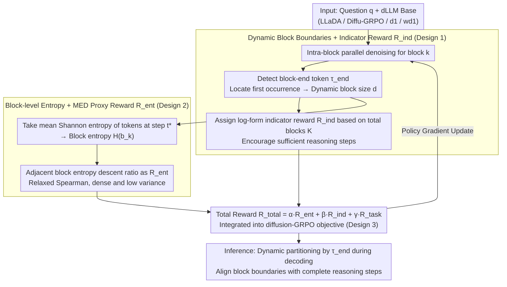

# Break the Block: Dynamic-size Reasoning Blocks for Diffusion Large Language Models via Monotonic Entropy Descent with Reinforcement Learning

**Conference**: ICML 2026  
**arXiv**: [2605.02263](https://arxiv.org/abs/2605.02263)  
**Code**: https://github.com/YanJiangJerry/Block-R1 (Available)  
**Area**: LLM Reasoning / Diffusion Language Models / Reinforcement Learning  
**Keywords**: dLLM, GRPO, Dynamic Block Size, Monotonic Entropy Descent, Inferential Consistency

## TL;DR
Addressing the issue where "fixed block sizes" in the semi-autoregressive generation of Diffusion Large Language Models (dLLM) disrupt inferential logic chains, this paper proposes b1: learning an end-of-block indicator token using RL to generate dynamic-length blocks. A "Block-level Monotonic Entropy Descent (MED) reward" is introduced to drive coherent reasoning. As a plug-and-play reward term, it can be integrated into existing dLLM RL frameworks (Diffu-GRPO/GDPO/d1/wd1), improving the accuracy of wd1 on Countdown from 39.45 to 58.98.

## Background & Motivation

**Background**: Diffusion Large Language Models (dLLMs) such as LLaDA, d1, and wd1 adopt a "semi-autoregressive + intra-block parallel denoising" generation paradigm: the sequence to be generated is partitioned into multiple fixed-size blocks of size $c$, generated sequentially from left to right, with $T$-step parallel denoising within each block. Based on this paradigm, recent RL post-training methods (Diffu-GRPO, GDPO, wd1) have begun to push dLLMs toward mathematical reasoning by emulating GRPO.

**Limitations of Prior Work**: Fixed block sizes lead to two observed problems: (i) the optimal block size varies significantly across different datasets (e.g., Sudoku, Countdown, GSM8K, MATH500), making a "one-size-fits-all" approach suboptimal; (ii) rigid boundaries often split complete operations—for example, splitting "$71-66$" between Block 3 and Block 4 leads to high-entropy (uncertainty) anomalous tokens and subsequent calculation errors.

**Key Challenge**: There is a conflict between the parallel block assumption of dLLMs (intra-block token conditional independence) and the nature of reasoning as a continuous semantic step-by-step logic chain—fixed boundaries almost inevitably cut through the middle of reasoning steps.

**Goal**: To enable dLLMs to learn how to partition blocks at "semantically complete reasoning steps" while ensuring that the overall uncertainty of the reasoning process decreases progressively.

**Key Insight**: The authors empirically discovered a pattern—in LLaDA, d1, and wd1, the "block-level average entropy" of correct reasoning traces monotonically decreases along the generation direction, while incorrect traces exhibit fluctuations or increases. This suggests that "monotonic block entropy descent" serves as a proxy metric for reasoning correctness.

**Core Idea**: Make the block boundary learnable by introducing an end-of-block indicator token. RL is used with a dense "adjacent block entropy descent" reward to teach the model to start new blocks at appropriate positions. This aligns block boundaries with reasoning steps and maintains monotonic entropy descent throughout the inference process.

## Method

### Overall Architecture
b1 is a reward/decoding plugin added on top of existing dLLM GRPO frameworks, consisting of three components: (1) Dynamic block construction—inserting a special token $\tau_{\text{end}}$ into the reasoning generation; every occurrence closes the current block and starts a new one; (2) MED training objective—combining an "adjacent block entropy descent" proxy reward $R_{\text{ent}}$ with an indicator reward $R_{\text{ind}}$ that encourages multi-step reasoning, weighted with the task reward $R_{\text{task}}$ and fed into Diffu-GRPO; (3) Inference alignment—decoding follows the training process strictly, dynamically adjusting the start of the next block upon encountering $\tau_{\text{end}}$.

### Key Designs

**1. Dynamic block boundaries + indicator token reward $R_{\text{ind}}$: Allow the model to decide block lengths so that one block covers exactly one complete reasoning step.**

The primary flaw of fixed block sizes is that rigid boundaries often cut through the middle of reasoning steps. b1 treats "where to switch blocks" as a learnable decision. A block-end token $\tau_{\text{end}}$ (default string `\block`) is added to the vocabulary. During the denoising of the $k$-th block, if $\hat{\mathbf{x}}_{t}[S_{k-1}+j]=\tau_{\text{end}}$ appears, $j$ is treated as the dynamic size $d$ of the current block, and the next block proceeds after $\tau_{\text{end}}$. To prevent the model from generating only 1–2 large blocks, a log-form dense reward is used: $R_{\text{ind}}=1$ if the total blocks $K\geq K_{\text{target}}$, otherwise $R_{\text{ind}}=\log(K+1)/\log(K_{\text{target}}+1)$ (default $K_{\text{target}}=10$). The log form smooths the reward and prevents collapse into very few blocks, turning block positions from manual hyperparameters into RL decision variables.

**2. Block-level entropy + MED proxy reward $R_{\text{ent}}$: Directly drive the monotonic descent of average entropy in adjacent blocks to encourage more confident and coherent reasoning.**

The authors observed that for correct reasoning traces, the "block-level average entropy" decreases monotonically along the generation direction. Therefore, "monotonic block entropy descent" is optimized as a proxy for reasoning correctness. Specifically, at diffusion time $t^{*}$ when a block ends, the Shannon entropy for each token is calculated and averaged to obtain the block entropy $\mathcal{H}(\mathbf{b}_{k}^{d})$. The ideal goal is to maximize the negative Spearman rank correlation $r_{\text{SCC}}$ of the block entropy sequence. However, Spearman is a global rank with high reward variance; the authors relax this to the ratio of descending adjacent pairs $R_{\text{ent}}=\frac{1}{K-1}\sum_{k=2}^{K}\mathbb{I}(\mathcal{H}(\mathbf{b}_{k-1}^{d})>\mathcal{H}(\mathbf{b}_{k}^{d}))$. The appendix proves that maximizing this relaxation shares the same global optimum as maximizing the Spearman coefficient. This decomposes a sparse global ranking signal into $K-1$ independent pairwise comparisons, providing dense, low-variance gradients without losing the optimal solution of strict monotonic descent.

**3. Plug-and-play GRPO total reward: Ensure b1 is not coupled with specific dLLM RL algorithms.**

b1 is designed as a signal-contributing plugin. It aggregates three rewards into a total reward $R_{\text{total}}=\alpha R_{\text{ent}}+\beta R_{\text{ind}}+\gamma R_{\text{task}}$ (default $\alpha=\beta=\gamma=1$), which is then fed into the original base algorithm's diffusion-GRPO objective. The additional complexity is $\mathcal{O}(K\cdot T\cdot L+L)$, which is negligible compared to the $O(L^{2})$ of self-attention. Thus, Diffu-GRPO, GDPO, d1, and wd1 can directly adopt b1, which contributes at the "block level" and is orthogonal to improvements in "better GRPO objectives."

### Loss & Training
The training dataset is identical to d1/wd1: LLaDA-8B-Instruct undergoes RL post-training on GSM8K/MATH/Sudoku/Countdown. Sequence lengths are 256/512. Training utilized 4×AMD Mi300x with a per-GPU batch size of 12. All weights $\alpha,\beta,\gamma$ were fixed to 1.

## Key Experimental Results

### Main Results

| Algo / Dataset | Sudoku-256 | Countdown-256 | GSM8K-256 | MATH500-256 |
|---|---|---|---|---|
| LLaDA-8B-Instruct (base) | 7.67 | 16.80 | 76.19 | 32.00 |
| + Diffu-GRPO | 13.53 | 19.92 | 76.35 | 33.60 |
| + Diffu-GRPO + b1 | **16.97** (+3.44) | **28.91** (+8.99) | **78.39** (+2.04) | **34.60** (+1.00) |
| + d1 | 15.06 | 25.39 | 77.03 | 33.40 |
| + d1 + b1 | 18.48 (+3.42) | 30.47 (+5.08) | 78.24 (+1.21) | 34.40 (+1.00) |
| + wd1 | 23.14 | 39.45 | 78.85 | 34.20 |
| + wd1 + b1 | **27.29** (+4.15) | **58.98** (+19.53) | **80.82** (+1.97) | **37.40** (+3.20) |

The highest single-point improvement: wd1 + b1 improved by +19.53 points on Countdown-256.

### Ablation Study

| Config (Based on wd1) | Countdown | GSM8K | MATH500 |
|---|---|---|---|
| Fixed-size (wd1) | 39.45 | 78.85 | 34.20 |
| b1 w/o MED ($R_{\text{ent}}$) | 44.14 | 79.23 | 35.00 |
| b1 w/o $R_{\text{ind}}$ | 55.86 | 80.06 | 36.60 |
| b1 (Full) | **58.98** | **80.82** | **37.40** |

### Key Findings
- Removing the MED reward caused Countdown performance to drop from 58.98 to 44.14, confirming that "monotonic entropy descent" is the core signal of b1; removing the indicator reward also caused a drop, showing that dynamic blocks themselves contribute significantly.
- Grouping reasoning samples by $r_{\text{SCC}}$ shows that accuracy increases monotonically with $r_{\text{SCC}}$; wd1+b1 raised the $r_{\text{MED}}$ (proportion of positive $r_{\text{SCC}}$) on Countdown from 91.41% to 97.66%, corresponding to an accuracy increase from 39.45 to 58.98—the first quantitative correlation between "entropy descent" and "reasoning correctness."
- Training step time for wd1 increased slightly from 1.31s/step to 1.68s/step, with throughput moving from 28.57 to 27.03 tok/s. This cost is negligible compared to the average accuracy gain from 43.91 to 51.12.
- AdaBlock-dLLM (a training-free method truncating at newlines during inference) did not show improvements in 0-shot replication, proving that "dynamic blocks" must be learned and cannot rely solely on rule-based partitioning.

## Highlights & Insights
- Turning "block size," previously a static hyperparameter, into a learnable policy paired with a theoretically analytical reward ($R_{\text{ent}}$) is a rare dual design in dLLM post-training affecting both decoding and rewards.
- "Monotonic block entropy descent" is a novel observable signal—it essentially migrates the intuition of "token entropy descent leading to higher confidence" in AR models to the block granularity and is universal across tasks without requiring ground truth.
- The plug-and-play design allows for the reuse of existing GRPO framework infrastructure with almost zero code intrusion. This paradigm of contributing signals without being tied to specific algorithms can be extended to coherence optimization in other segmented generation models (e.g., block-diffusion image models).

## Limitations & Future Work
- The current evaluation focuses on math and logic problems; it remains to be verified whether "monotonic entropy descent" holds for more complex open-ended generation (e.g., code, long document summarization).
- The default value of $K_{\text{target}}=10$ is empirical; long reasoning tasks might require an adaptive target block count.
- Block entropy relies on a mean-field assumption (blocks are token-independent); since there are strong dependencies within reasoning steps, future work could introduce structured entropy estimation (e.g., conditional/joint entropy) to improve signal quality.

## Related Work & Insights
- **vs. d1 / wd1**: Shares the same base RL framework, but d1/wd1 still use fixed blocks. b1 stacks MED and indicator rewards on top, pushing wd1 from 39.45 to 58.98 on Countdown, proving that "dynamic block" is a dimension of improvement orthogonal to "better GRPO objectives."
- **vs. AdaBlock-dLLM**: AdaBlock truncates based on high-confidence newlines during inference without training; b1 learns partitioning into the weights via RL and significantly outperforms AdaBlock in 0-shot settings.
- **vs. StableMoE / Dynamic Computing Routing**: The idea of "learning generation boundaries via RL" in b1 can be applied to MoE problems like dynamic top-k, where "decision hyperparameters" become learnable.

## Rating
- Novelty: ⭐⭐⭐⭐⭐ The first to make "block size" a learnable RL variable for dLLMs, providing the novel and provable "monotonic entropy descent" optimization signal.
- Experimental Thoroughness: ⭐⭐⭐⭐ Systematically verified across 4 datasets and 4 base RL algorithms, with ablation, $r_{\text{SCC}}$ correlation analysis, and efficiency comparisons, though open-ended generation is missing.
- Writing Quality: ⭐⭐⭐⭐ Clear storyline (Observation → Hypothesis → Method → Theory → Verification); the visualization of token entropy in Figures 2/3 is highly persuasive.
- Value: ⭐⭐⭐⭐⭐ A plug-and-play, nearly zero-cost addition to the strongest existing dLLM RL algorithms, yielding a +19.5 point gain on Countdown, providing a direct boost to dLLM reasoning research.

<!-- RELATED:START -->

## Related Papers

- [\[ICML 2026\] d2: Improving Reasoning in Diffusion Language Models via Trajectory Likelihood Estimation](d2_improving_reasoning_in_diffusion_language_models_via_trajectory_likelihood_es.md)
- [\[ICML 2026\] Learning Unmasking Policies for Diffusion Language Models](learning_unmasking_policies_for_diffusion_language_models.md)
- [\[ICML 2026\] The Shape of Reasoning: Topological Analysis of Reasoning Traces in Large Language Models](the_shape_of_reasoning_topological_analysis_of_reasoning_traces_in_large_languag.md)
- [\[ACL 2026\] d-TreeRPO: Towards More Reliable Policy Optimization for Diffusion Language Models](../../ACL2026/reinforcement_learning/d-treerpo_towards_more_reliable_policy_optimization_for_diffusion_language_model.md)
- [\[ICML 2026\] Coupled Variational Reinforcement Learning for Language Model General Reasoning](coupled_variational_reinforcement_learning_for_language_model_general_reasoning.md)

<!-- RELATED:END -->
