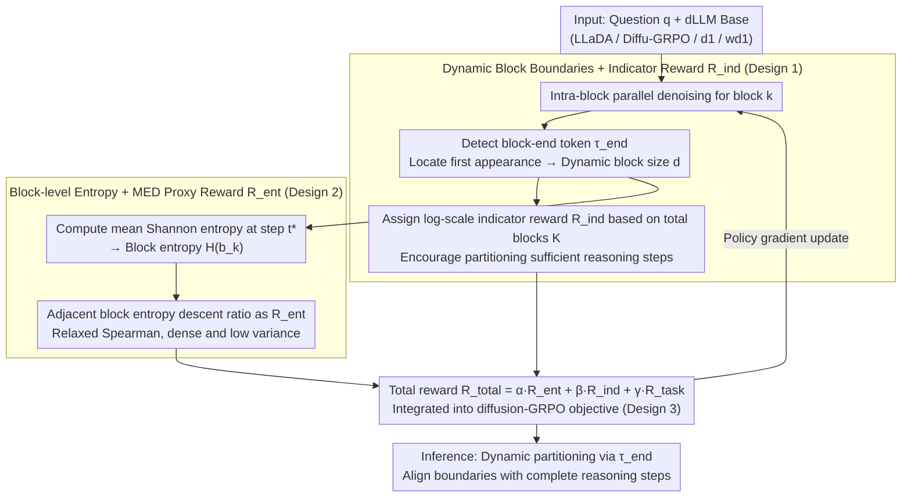

# Break the Block: Dynamic-size Reasoning Blocks for Diffusion Large Language Models via Monotonic Entropy Descent with Reinforcement Learning

**Conference**: ICML 2026  
**arXiv**: [2605.02263](https://arxiv.org/abs/2605.02263)  
**Code**: https://github.com/YanJiangJerry/Block-R1 (Available)  
**Area**: LLM Reasoning / Diffusion Language Models / Reinforcement Learning  
**Keywords**: dLLM, GRPO, dynamic block size, Monotonic Entropy Descent, inference consistency

## TL;DR
Addressing the issue where "fixed block sizes" break the logical chain of thought during semi-autoregressive generation in Diffusion Large Language Models (dLLM), this paper proposes b1. It learns a block-end indicator token via RL to generate dynamic-length blocks and employs a "block-level Monotonic Entropy Descent (MED) reward" to drive coherent reasoning. As a plug-and-play reward term integrated into existing dLLM RL frameworks (Diffu-GRPO/GDPO/d1/wd1), it improves wd1 performance on Countdown from 39.45 to 58.98.

## Background & Motivation

**Background**: Diffusion Large Language Models (dLLM) such as LLaDA, d1, and wd1 adopt a "semi-autoregressive + intra-block parallel denoising" generation paradigm: the sequence to be generated is partitioned into multiple chunks of a fixed size $c$, where generation proceeds autoregressively across blocks and in parallel via $T$ denoising steps within each block. Based on this paradigm, recent RL post-training methods (Diffu-GRPO, GDPO, wd1) have begun to push dLLMs toward mathematical reasoning by imitating GRPO.

**Limitations of Prior Work**: Fixed block sizes lead to two observed problems: (i) the optimal block size varies significantly across different datasets (Sudoku/Countdown/GSM8K/MATH500 each require different sizes), making a "one-size-fits-all" approach clearly suboptimal; (ii) for the same problem, rigid boundaries often split a complete arithmetic operation—the paper provides an example where "$71-66$" is split between Block 3 and Block 4, leading to high-entropy (uncertainty) anomalous tokens and subsequent errors.

**Key Challenge**: There is a conflict between the parallel block assumption of dLLMs (intra-block token conditional independence) and the nature of reasoning as a continuous semantic chain—fixed boundaries almost inevitably cut through the middle of reasoning steps.

**Goal**: To enable the dLLM to autonomously learn to partition blocks at "semantically complete reasoning steps," while ensuring the uncertainty of the overall reasoning process decreases progressively.

**Key Insight**: The authors empirically discovered a regularity in LLaDA/d1/wd1: the "block-level average entropy" of correct reasoning traces exhibits a monotonic descent along the generation direction, while incorrect traces show oscillations or increases. This suggests that "monotonic block entropy descent" serves as a proxy metric for reasoning correctness.

**Core Idea**: The decision of "where to switch blocks" is transformed into a learnable task. An end-of-step indicator token is introduced, and RL is used with a dense reward for "adjacent block entropy descent" to teach the model to start new blocks at appropriate positions. This aligns block boundaries with reasoning steps and maintains monotonic entropy descent throughout the reasoning sequence.

## Method

### Overall Architecture
b1 is a reward/decoding plugin layered on top of the existing dLLM GRPO framework, consisting of three components: (1) Dynamic block construction—inserting a special token $\tau_{\text{end}}$ during reasoning, which terminates the current block and starts a new one upon appearance; (2) MED training objective—combining a "adjacent block entropy descent" proxy reward $R_{\text{ent}}$ with an "encourage multi-step reasoning" indicator reward $R_{\text{ind}}$, weighted with the task reward $R_{\text{task}}$ and fed into Diffu-GRPO; (3) Inference alignment—decoding follows the training process strictly, dynamically adjusting the start of the next block when $\tau_{\text{end}}$ is encountered.

### Key Designs

**1. Dynamic Block Boundaries + Indicator Token Reward $R_{\text{ind}}$: Allowing the model to determine block lengths so that one block perfectly covers a complete reasoning step.**

The primary flaw of fixed block sizes is that rigid boundaries almost inevitably bisect reasoning steps (e.g., splitting "$71-66$" between Block 3 and 4 results in high-entropy anomalies). b1 treats "where to switch blocks" as a learnable decision by adding a block-end token $\tau_{\text{end}}$ (defaulting to the string `\block`) to the vocabulary. During the denoising of block $k$, if $\hat{\mathbf{x}}_{t}[S_{k-1}+j]=\tau_{\text{end}}$ appears, $j$ is taken as the dynamic size $d$ of the current block, and the next block begins after $\tau_{\text{end}}$. To prevent the model from lazily generating only 1–2 large blocks, a log-scale dense reward is applied: if the total number of blocks $K \geq K_{\text{target}}$, $R_{\text{ind}}=1$; otherwise, $R_{\text{ind}}=\log(K+1)/\log(K_{\text{target}}+1)$ (default $K_{\text{target}}=10$). This log-form ensures smooth rewards and avoids collapse while shifting block positions from manual hyperparameters to RL decision variables.

**2. Block-level Entropy + MED Proxy Reward $R_{\text{ent}}$: Directly driving the monotonic descent of average entropy across adjacent blocks to encourage more confident and coherent reasoning.**

The authors empirically observed that for correct reasoning traces, the "block-level average entropy" decreases monotonically along the generation path, whereas incorrect ones oscillate or increase. Thus, "monotonic block entropy descent" is optimized as a proxy for correctness. Specifically, at the diffusion step $t^{*}$ where a block ends, the Shannon entropy of each token is calculated and averaged to obtain the block entropy $\mathcal{H}(\mathbf{b}_{k}^{d})$. The ideal objective is to maximize the negative Spearman rank correlation $r_{\text{SCC}}$ of the block entropy sequence. However, since Spearman uses global ranking, it suffers from high variance. The authors relax this into an adjacent-pair descent ratio $R_{\text{ent}}=\frac{1}{K-1}\sum_{k=2}^{K}\mathbb{I}(\mathcal{H}(\mathbf{b}_{k-1}^{d})>\mathcal{H}(\mathbf{b}_{k}^{d}))$. The appendix proves that maximizing this relaxed term yields the same global optimum as maximizing the Spearman coefficient (i.e., strict monotonic descent), providing dense, low-variance gradients without losing the optimal solution.

**3. Plug-and-play GRPO Total Reward: De-coupling b1 from specific dLLM RL algorithms.**

b1 is designed as a signals-only plugin, allowing it to be layered onto the strongest existing methods. It aggregates three reward terms into a total reward $R_{\text{total}}=\alpha R_{\text{ent}}+\beta R_{\text{ind}}+\gamma R_{\text{task}}$ (defaults: $\alpha=\beta=\gamma=1$, used without tuning), which is then fed into the original base algorithm's diffusion-GRPO objective (the policy ratio is still approximated via $\exp(\phi^{\pi_{\theta}}-\phi^{\pi_{\text{old}}})$). The additional complexity is $\mathcal{O}(K\cdot T\cdot L+L)$, which is negligible compared to the $O(L^{2})$ of self-attention. Consequently, Diffu-GRPO, GDPO, d1, and wd1 can directly incorporate b1, which provides block-level signals orthogonal to improvements in GRPO objectives.

### Loss & Training
The training dataset is identical to d1/wd1: LLaDA-8B-Instruct undergoes RL post-training on GSM8K/MATH/Sudoku/Countdown. Sequence lengths are 256/512, using 4×AMD Mi300x with a batch size of 12 per GPU. All weights $\alpha, \beta, \gamma$ are fixed at 1.

## Key Experimental Results

### Main Results

| Algo / Dataset | Sudoku-256 | Countdown-256 | GSM8K-256 | MATH500-256 |
|---|---|---|---|---|
| LLaDA-8B-Instruct (base) | 7.67 | 16.80 | 76.19 | 32.00 |
| + Diffu-GRPO | 13.53 | 19.92 | 76.35 | 33.60 |
| + Diffu-GRPO + b1 | **16.97** (+3.44) | **28.91** (+8.99) | **78.39** (+2.04) | **34.60** (+1.00) |
| + d1 | 15.06 | 25.39 | 77.03 | 33.40 |
| + d1 + b1 | 18.48 (+3.42) | 30.47 (+5.08) | 78.24 (+1.21) | 34.40 (+1.00) |
| + wd1 | 23.14 | 39.45 | 78.85 | 34.20 |
| + wd1 + b1 | **27.29** (+4.15) | **58.98** (+19.53) | **80.82** (+1.97) | **37.40** (+3.20) |

The most significant improvement: wd1 + b1 achieved a +19.53 point gain on Countdown-256.

### Ablation Study

| Configuration (Based on wd1) | Countdown | GSM8K | MATH500 |
|---|---|---|---|
| Fixed-size (wd1) | 39.45 | 78.85 | 34.20 |
| b1 w/o MED ($R_{\text{ent}}$) | 44.14 | 79.23 | 35.00 |
| b1 w/o $R_{\text{ind}}$ | 55.86 | 80.06 | 36.60 |
| b1 (Full) | **58.98** | **80.82** | **37.40** |

### Key Findings
- Removing the MED reward caused Countdown performance to drop from 58.98 to 44.14, confirming that the "monotonic entropy descent" is the core signal of b1. Removing the indicator reward also caused a decline, indicating that dynamic partitioning itself is a significant contributor.
- Sorting reasoning samples into bins based on $r_{\text{SCC}}$ shows that accuracy increases monotonically with $r_{\text{SCC}}$. wd1+b1 raised the $r_{\text{MED}}$ (proportion of positive $r_{\text{SCC}}$) on Countdown from 91.41% to 97.66%, corresponding to an accuracy increase from 39.45 to 58.98—the first time a quantitative mapping between "monotonic entropy descent" and "reasoning correctness" has been established.
- Training step time for wd1 increased slightly from 1.31s/step to 1.68s/step, and throughput decreased from 28.57 to 27.03 tok/s. This cost is negligible compared to the average accuracy gain from 43.91 to 51.12.
- AdaBlock-dLLM (a training-free method that truncates at newlines during inference) failed to show gains in 0-shot replication, proving that dynamic block partitioning must be learned into the weights rather than relying on rules.

## Highlights & Insights
- Transforming "block size," which has long been viewed as a hyperparameter, into a learnable policy paired with a theoretically analytical reward ($R_{\text{ent}}$ sharing the same optimum as global Spearman) is a rare dual design in dLLM post-training affecting both decoding and rewards.
- "Block entropy monotonic descent" is a novel observable signal—it essentially migrates the intuition of "token entropy descent implies higher confidence" from AR models to block granularity and is task-agnostic as it does not require ground truth.
- Designed as a purely plug-and-play reward plugin, it reuses the entire infrastructure of the base GRPO framework with almost zero code intrusion. This paradigm of "contributing signals without being tied to an algorithm" can be directly transferred to consistency optimization in any segmented generation models, such as block-diffusion image models.

## Limitations & Future Work
- Current evaluations focus on mathematical and logical problems; it remains to be verified if more complex open-ended generation (code, long document summarization) follows the "monotonic entropy descent" hypothesis.
- The default $K_{\text{target}}=10$ is empirical; long reasoning tasks may require an adaptive target for the number of blocks.
- Block entropy relies on the mean-field assumption (independence of tokens within a block). Since internal tokens in a reasoning step have strong dependencies, future work could introduce structured entropy estimation (e.g., conditional/joint entropy) to improve signal quality.

## Related Work & Insights
- **vs d1 / wd1**: Uses the same base RL framework, but d1/wd1 utilize fixed blocks. b1 overlays MED + indicator rewards on them, pushing wd1 from 39.45 to 58.98 (Countdown), proving "dynamic blocks" offer an orthogonal dimension of improvement to "better GRPO objectives."
- **vs AdaBlock-dLLM**: AdaBlock truncates based on high-confidence newlines at inference time without training. b1 learns the partitioning capability into the weights via RL, significantly outperforming AdaBlock in 0-shot settings.
- **vs StableMoE / Dynamic Computation Routing**: The idea of "learning generation boundaries via RL" in b1 could be cross-pollinated to "learnable decision hyperparameters" like dynamic top-k in MoE.

## Rating
- Novelty: ⭐⭐⭐⭐⭐ First to make "block size" a learnable RL variable in dLLM with a novel, theoretically sound optimization signal like "monotonic entropy descent."
- Experimental Thoroughness: ⭐⭐⭐⭐ Systematically verified on 4 datasets and 4 base RL algorithms, providing ablation, $r_{\text{SCC}}$ correlation analysis, and efficiency comparisons; lacks open-ended generation tasks.
- Writing Quality: ⭐⭐⭐⭐ Clear narrative (Observation → Hypothesis → Method → Theory → Verification); the token entropy visualization in Figures 2/3 is highly persuasive.
- Value: ⭐⭐⭐⭐⭐ Plug-and-play, nearly zero-cost addition to the strongest existing dLLM RL algorithms; a +19.5 shift on Countdown directly advances dLLM reasoning research.

<!-- RELATED:START -->

## Related Papers

- [\[ICML 2026\] d2: Improving Reasoning in Diffusion Language Models via Trajectory Likelihood Estimation](d2_improving_reasoning_in_diffusion_language_models_via_trajectory_likelihood_es.md)
- [\[ICML 2026\] The Shape of Reasoning: Topological Analysis of Reasoning Traces in Large Language Models](the_shape_of_reasoning_topological_analysis_of_reasoning_traces_in_large_languag.md)
- [\[ICML 2026\] Learning Unmasking Policies for Diffusion Language Models](learning_unmasking_policies_for_diffusion_language_models.md)
- [\[ICLR 2026\] Revolutionizing Reinforcement Learning Framework for Diffusion Large Language Models](../../ICLR2026/reinforcement_learning/revolutionizing_reinforcement_learning_framework_for_diffusion_large_language_mo.md)
- [\[ICML 2026\] Coupled Variational Reinforcement Learning for Language Model General Reasoning](coupled_variational_reinforcement_learning_for_language_model_general_reasoning.md)

<!-- RELATED:END -->
