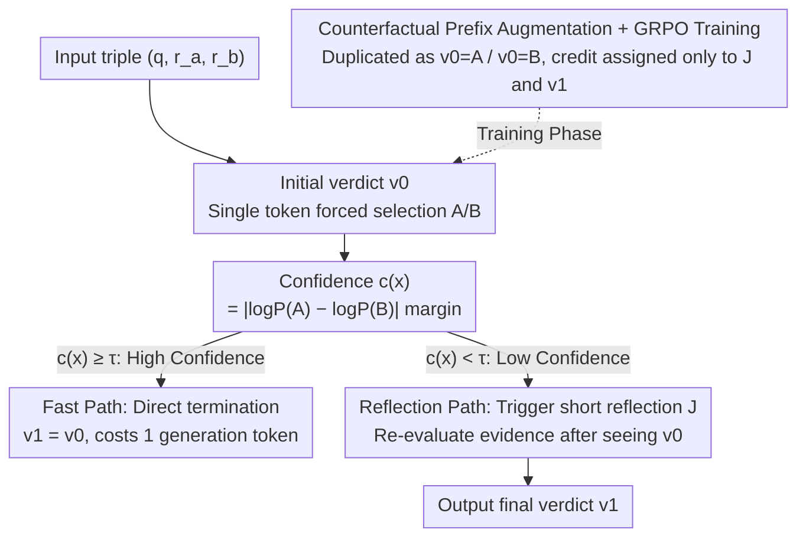

# CAMEL: Confidence-Gated Reflection for Reward Modeling

**Conference**: ICML 2026  
**arXiv**: [2602.20670](https://arxiv.org/abs/2602.20670)  
**Code**: Not yet public  
**Area**: RLHF Alignment / Reward Model / LLM Reasoning  
**Keywords**: Reward Model, Confidence Gating, Reflection Mechanism, GRPO, Counterfactual Prefix Augmentation

## TL;DR
This paper observes that the log-probability margin of the verdict token is highly correlated with judgment accuracy. Based on this, it proposes CAMEL—a method that first provides a rapid preference judgment via a single token and triggers reflection generation only when confidence is low. Using counterfactual prefix augmentation in GRPO training to enhance self-correction capabilities, it achieves an average accuracy of 82.9% across three reward model benchmarks with 14B parameters (surpassing the previous best 70B model by 3.2%).

## Background & Motivation
**Background**: Reward models (RMs) used as LLM alignment signals mainly follow two paradigms. Scalar discriminative models (e.g., Skywork-Reward, ArmoRM) are stable to train and fast during inference but output only a single score and lack interpretability. Generative judges (e.g., J1, RM-R1) generate reasoning before providing a judgment, offering higher accuracy but requiring hundreds to thousands of tokens for every sample.

**Limitations of Prior Work**: The cost of generative RMs is unbearable for industrial deployment—RM-R1-DeepSeek-32B generates approximately 900 tokens on RewardBench and 1100 tokens on RM-Bench on average. However, many samples are "easy" cases with one clearly superior response, requiring no lengthy reasoning. Treating simple and difficult samples identically for reasoning generation is a waste of the computational budget.

**Key Challenge**: There is a clear "efficiency vs. expressivity" trade-off in reward modeling. One wants to handle simple samples instantly like scalar models, while allowing difficult samples to undergo reflection—yet currently, there is no suitable signal to inform the model whether a sample is difficult enough to warrant reflection.

**Goal**: (1) Find a proxy metric for "task difficulty" that can be obtained without additional reasoning; (2) Create an adaptive routing reward model that pays the generation cost only for truly difficult samples; (3) Ensure that reflection leads to genuine error correction rather than simply echoing the original answer.

**Key Insight**: The authors observe that when a prompt requires a model to choose between A and B, the log-probability margin at the verdict token ($c(x) = |\log P(A|x) - \log P(B|x)|$) naturally characterizes the model's certainty. Statistics on Skywork-80K using Qwen3-14B reveal that samples with higher confidence have higher prediction accuracy (monotonically increasing), and incorrect samples are concentrated almost entirely in low-margin regions.

**Core Idea**: Use the single-token margin as a "cost-free difficulty estimator" to construct a two-stage process (fast judgment $\rightarrow$ reflection on low confidence) and employ counterfactual prefix RL training to empower the reflection with real self-correction capabilities.

## Method

### Overall Architecture
CAMEL decomposes reward modeling into two stages. Given $(q, r_a, r_b)$, the model first outputs an initial verdict $v_0 \in \{\texttt{A}, \texttt{B}\}$. The confidence $c(x)$ is calculated from the two candidate probabilities of this verdict token. If $c(x) \geq \tau$ (high confidence), the process terminates directly, and $v_1 = v_0$, costing only 1 generation token. If $c(x) < \tau$, the prompt triggers a short reflection $J$ ("think again..."), followed by the final verdict $v_1$. This structure of "scoring first, then deciding whether to explain" is combined with GRPO and counterfactual prefix augmentation during training.

### Key Designs

**1. Confidence Score: Compressing "Task Difficulty" into a Free Single-Token Margin**

The greatest waste in generative RMs is generating thousands of reasoning tokens for easy cases. CAMEL seeks a signal to distinguish difficulty without extra compute. It utilizes the verdict token itself: when the prompt asks a model to choose between A and B, the log-probability difference between the two candidates naturally characterizes the model's certainty. Define $c(x) = |\log P_\theta(v=\texttt{A}|x) - \log P_\theta(v=\texttt{B}|x)|$, representing the model's "potential difference" regarding preference. The authors plotted $c(x)$ against accuracy on Skywork-80K and found a strongly monotonic curve—higher confidence correlates with higher accuracy, with errors clustered in the low-margin region. This means a difficulty estimator is unnecessary; a threshold $\tau$ allows sliding along the accuracy/cost curve with zero additional overhead.

**2. Confidence-Gated Two-Stage Prompt: Decisions From Language Layer to Token Probability Layer**

A difficulty signal alone is insufficient; it must be able to halt or permit reflection during generation. CAMEL factorizes the traditional "long rationale $\rightarrow$ verdict" structure into $v_0 \to$ optional reflection $J \to v_1$. The prompt forces the model to output a verdict $v_0$ placeholder first. A single forward pass yields the logit to calculate $c(x)$. If $c(x)\ge\tau$, it terminates with $v_1=v_0$, using only 1 token. If $c(x)<\tau$, a short reflection is triggered. This offloads the discrete "to think or not" decision to the token probability level rather than letting the model decide via natural language, which tends to be all-or-nothing.

**3. Counterfactual Prefix Augmentation + GRPO: Forcing Reflection to Actually Correct, Not Repeat**

A two-stage structure risks models learning a "reflection = copy $v_0$" shortcut since $v_0$ is often correct in the training distribution. CAMEL solves this via counterfactual augmentation—duplicating each sample $(x,z)$, forcing $v_0=\texttt{A}$ in one and $v_0=\texttt{B}$ in the other. RL credit is applied only to the reflection $J$ and final $v_1$, treating $v_0$ as non-optimized context. The reward is binary $R=+1/-1$ (whether $v_1$ matches ground truth), optimized via GRPO: $\max_\theta \mathbb{E}[R(v_1, z)] - \beta\, \mathbb{D}_{\mathrm{KL}}(\pi_\theta \| \pi_{\mathrm{ref}})$. By forcing a false starting point, the model must re-evaluate evidence in the reflection to correct itself. Ablating counterfactuals dropped JudgeBench by 5 points (74.2 $\rightarrow$ 69.1), validating this design.

### Loss & Training
Two-stage training: First, SFT is performed on Qwen3-14B using three preference datasets (Skywork-Reward-Preference-80K + Code-Preference-Pairs + Math-Step-DPO-10K) to learn the format. Then, one epoch of GRPO is conducted with counterfactual prefixes, using the KL coefficient $\beta$ to control deviation from the reference policy. Inference uses a default $\tau = 5$.

## Key Experimental Results

### Main Results
On three reward model benchmarks (RewardBench / RM-Bench / JudgeBench), CAMEL is compared against various scalar and generative RMs:

| Model | RewardBench | RM-Bench | JudgeBench | Avg |
|------|-------------|----------|------------|-----|
| INF-ORM-Llama3.1-70B (Prev. SOTA) | 95.1 | 73.8 | 70.2 | 79.7 |
| RM-R1-Qwen-Instruct-32B (Generative) | 89.0 | 73.1 | 64.8 | 75.6 |
| J1-Llama-70B | 93.3 | 82.7 | 60.0 | 78.7 |
| **CAMEL-Fast (14B, 1 token)** | 90.5 | 74.8 | 65.2 | 76.8 |
| **CAMEL-Reflection (14B, always)** | 92.8 | **84.2** | **71.6** | **82.9** |
| **CAMEL (gated, $\tau=5$)** | 92.4 | 81.9 | 69.1 | 81.1 |

CAMEL-Reflection averages 3.2% higher than the previous SOTA. CAMEL-Fast, using only 1 token, matches or exceeds the full generation results of RM-R1-Qwen-Instruct-32B, with 14B parameters rivaling 70B baselines.

### Ablation Study

| Config | RewardBench | RM-Bench | JudgeBench | Avg |
|------|-------------|----------|------------|-----|
| Qwen3-14B (Untuned) | 81.9 | 71.1 | 62.6 | 71.9 |
| Qwen3-14B + Reflection | 83.3 | 73.2 | 65.0 | 73.8 |
| Qwen3-14B-SFT | 90.6 | 72.7 | 64.8 | 76.0 |
| Qwen3-14B-GRPO (No Counterfactual) | 91.2 | 83.5 | 62.9 | 79.2 |
| Qwen3-14B-GRPO + Reflection | 90.0 | 84.0 | 74.2 | 82.7 |
| **CAMEL (Full)** | 92.4 | 81.9 | 69.1 | 81.1 |

### Key Findings
- Reflection gains are most significant on reasoning-intensive benchmarks: moving from always-fast to always-reflect improved RewardBench by +2.3%, RM-Bench by +9.4%, and JudgeBench by +6.4%.
- Counterfactual prefixes are critical: removing them caused a 5-point drop in JudgeBench, indicating that without them, reflection degrades into repeating the initial judgment.
- Pareto Frontier: CAMEL strictly dominates RM-R1 on RewardBench and RM-Bench. While RM-R1-DeepSeek-32B consumes 900–1100 tokens, CAMEL achieves similar or better results with significantly fewer tokens by adjusting $\tau$.
- Post-training confidence distributions shifted left (becoming more conservative), showing the model learned to distinguish certainty.

## Highlights & Insights
- **"Free Difficulty Signal"**: The single-token margin has near-zero overhead yet robustly predicts accuracy. This portable trick can be reused in any binary classification task (QA, safety, tool selection) for routing or uncertainty estimation.
- **Explicitly Externalized "To Think" Decision**: Unlike Chain-of-Thought methods that let the model decide to "think" in natural language, CAMEL makes hard decisions at the token probability level, which is cleaner and more adjustable.
- **Counterfactual Prefix as an RL Secret Weapon**: Many self-correction works struggle with models refusing to change answers because $v_0$ is almost always correct in training. Forcing a wrong start is a universal fix applicable to self-refinement or self-debate.
- Overall, reframing reward modeling as "adaptive two-stage computation" is more practical than choosing strictly between scalar and generative approaches.

## Limitations & Future Work
- The threshold $\tau$ is globally fixed, but confidence distributions across domains (e.g., safety vs. math) vary. A dynamic or binned $\tau$ would be ideal.
- Validation is limited to Qwen3-14B; it is unclear if the scaling law holds for 70B+ models or if margins become too noisy in smaller models.
- Reflection token length is not strictly controlled. If reflections become verbose, the cost savings from gating might be partially offset.
- Future directions: (a) Learning the threshold $\tau$; (b) Multi-stage reflection for finer-grained routing; (c) Embedding this architecture into actor-critic RLHF pipelines.

## Related Work & Insights
- **vs RM-R1 (Generative RM SOTA)**: RM-R1 uses distilled rubrics and RL with verifiable rewards for long rationales; CAMEL shares similar data but adds gating, achieving higher accuracy with fewer tokens and a superior Pareto frontier.
- **vs Generative RM (J1, Critic-RM)**: These emphasize explicit reasoning traces; CAMEL adopts the reflection mechanism but rejects "indiscriminate reasoning."
- **vs Self-Consistency / Self-Refine**: Those rely on multiple samples or refinement cycles; CAMEL uses the margin of a single forward pass to decide refinement, avoiding redundant sampling costs.
- **vs Uncertainty-based Abstention**: Traditional methods use confidence to decide whether to answer; CAMEL uses it to decide whether to "think more," representing a different paradigm of conditional compute.

## Rating
- Novelty: ⭐⭐⭐⭐ The combination of single-token margin for difficulty estimation and counterfactual prefixes is a refreshing framework, though components aren't entirely disruptive in isolation.
- Experimental Thoroughness: ⭐⭐⭐⭐ Covers three major benchmarks, Pareto curves, ablations, and self-correction analysis, though lacks multi-backbone validation.
- Writing Quality: ⭐⭐⭐⭐⭐ The logical chain of motivation-observation-method-experiment is very smooth, with well-integrated formulas and diagrams.
- Value: ⭐⭐⭐⭐⭐ A deployment-friendly 14B model that outperforms 70B baselines is highly valuable for industrial RLHF pipelines.

<!-- RELATED:START -->

## Related Papers

- [\[ICLR 2026\] RM-R1: Reward Modeling as Reasoning](../../ICLR2026/reinforcement_learning/rm-r1_reward_modeling_as_reasoning.md)
- [\[ICML 2026\] One Bias After Another: Mechanistic Reward Shaping and Persistent Biases in Language Reward Models](one_bias_after_another_mechanistic_reward_shaping_and_persistent_biases_in_langu.md)
- [\[CVPR 2026\] MSRL: Scaling Generative Multimodal Reward Modeling via Multi-Stage Reinforcement Learning](../../CVPR2026/reinforcement_learning/msrl_scaling_generative_multimodal_reward_modeling.md)
- [\[ACL 2026\] LoVeC: Reinforcement Learning for Better Verbalized Confidence in Long-Form Generations](../../ACL2026/reinforcement_learning/lovec_reinforcement_learning_for_better_verbalized_confidence_in_long-form_gener.md)
- [\[ICLR 2026\] Stop Unnecessary Reflection: Training LRMs for Efficient Reasoning with Adaptive Reflection and Length Coordinated Penalty](../../ICLR2026/reinforcement_learning/stop_unnecessary_reflection_training_lrms_for_efficient_reasoning_with_adaptive_.md)

<!-- RELATED:END -->
