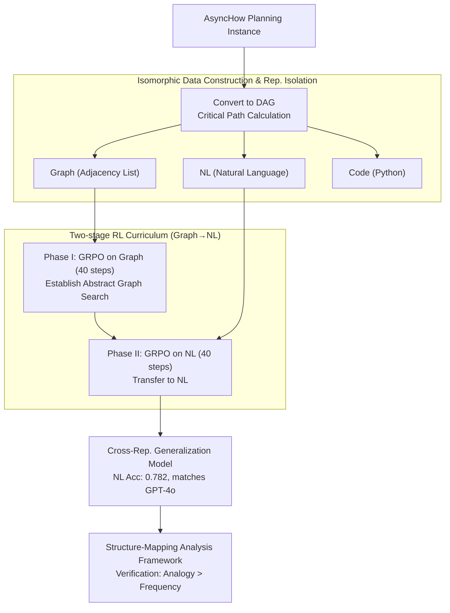

# Can Large Language Models Generalize Procedures Across Representations?

**Conference**: ICML2026  
**arXiv**: [2602.03542](https://arxiv.org/abs/2602.03542)  
**Code**: Available (Dataset and code provided with the paper)  
**Area**: LLM Reasoning  
**Keywords**: Cross-representation generalization, RL curriculum, generative analogy, procedural knowledge transfer, GRPO  

## TL;DR

This paper finds that procedural knowledge learned by LLMs on symbolic representations (code/graphs) cannot reliably transfer to natural language tasks. It proposes a two-stage RL curriculum strategy—"symbolic then natural language"—enabling a 1.5B Qwen model to approach zero-shot GPT-4o performance on asynchronous planning tasks. From a cognitive science perspective, it demonstrates that successful cross-representation generalization can be interpreted as generative analogy.

## Background & Motivation

**Background**: LLMs extensively utilize symbolic data such as code and graphs during pre-training and post-training. It is widely expected that symbolic training enhances the natural language reasoning capabilities of models. Recent works (e.g., code-augmented pre-training, graph reasoning) attempt to augment LLMs through symbolic data, but results remain inconsistent.

**Limitations of Prior Work**: Existing research conflates surface representation factors with deep structural factors, failing to answer a critical question: under what conditions does symbolic training actually benefit natural language tasks? Experiments reveal that models trained solely on code or graphs perform well in their respective formats but suffer significant performance drops, often falling below untrained baselines, when transferred to natural language.

**Key Challenge**: While symbolic and natural language representations share the same underlying algorithms and procedural structures (isomorphism), LLMs appear to learn only surface patterns rather than transferable procedural knowledge. Existing SFT and RL methods (vanilla SFT, distillation, STaR, GRPO) fail to achieve reliable generalization in cross-representation settings.

**Goal**: (1) Isolate procedural generalization from spurious transfer using a strictly isomorphic experimental design; (2) Propose a training strategy to enable cross-representation generalization; (3) Analyze the mechanisms of generalization from a cognitive science perspective.

**Key Insight**: The authors draw on Structure-Mapping Theory from cognitive science, treating cross-representation generalization as a generative analogy problem. If a model can identify shared structures across different representations as humans do, it should achieve zero-shot success on new representations.

**Core Idea**: A two-stage RL curriculum—first training on symbolic representations (Graph) to learn abstract procedures, then continuing on natural language to complete adaptation—significantly enhances cross-representation generalization capabilities.

## Method

### Overall Architecture

The authors construct isomorphic data around an **asynchronous planning** task: given a set of steps with dependencies (e.g., cooking procedures), the model must calculate the minimum time to complete all steps under infinite resources. This task is formalized as a critical path calculation on a DAG. Each planning instance is represented in three isomorphic formats: natural language (NL), graph adjacency lists (Graph), and Python code snippets (Code). The underlying algorithm remains identical; only the surface form varies.

The training process follows a two-stage curriculum: **Phase I (Symbolic Induction)** uses GRPO for 40 steps on Graph data to let the model rapidly acquire abstract graph search procedures; **Phase II (Natural Language Adaptation)** continues GRPO for 40 steps on NL data to transfer the acquired procedural knowledge. The total training budget is identical to 80 steps of pure NL training. Post-training, the authors use the Structure-Mapping Theory framework to provide an ex-post explanation of the results, verifying whether generalization stems from structural analogy or data frequency.

### Key Designs

**1. Isomorphic Data Construction & Representation Isolation: Isolating surface form as the sole variable**

Existing research mixes "surface representation differences" with "deep structural differences," making it impossible to determine if transfer failure is due to "unlearnable procedures" or "surface form interference." The authors address this causal inference problem by converting each NL planning instance from the AsyncHow dataset into a DAG, then representing it in three formats: adjacency list dictionaries (Graph, including START/END sentinels and time-weight dictionaries), Python longest-path search code (Code, with randomized node indices and standardized time units), and raw natural language (NL). All three share the exact same graph structure, answer, and underlying algorithm. This strict control allows "procedural generalization" to be cleanly separated from "spurious transfer."

**2. Two-stage RL Curriculum Learning (Graph → NL): Reshaping NL learning dynamics via symbolic warm-up**

Training solely on symbols fails to transfer to NL, while training solely on NL is inefficient. The authors found that the Graph format has high information density and fast within-representation training. They designed a two-stage curriculum: Phase I uses GRPO ($k=16$ sampling, reward of 1 for correct answer and format compliance) on Graph data for 40 steps to establish an inductive bias for abstract graph search. Phase II continues GRPO on NL data for 40 steps. The NL accuracy improves from 0.698 to 0.782 compared to an equal-budget NL-only baseline. Crucially, the sequence is irreversible—a reversed NL→Graph curriculum yields only 0.431. The reward curve in Phase II resembles symbolic training more than pure NL training, suggesting that symbolic warm-up reshapes the optimization dynamics.

**3. Structure-Mapping Theory Analogy Framework: Quantizing cognitive mechanisms**

To distinguish whether the model relies on "accumulating moderately similar instances" (frequency learning) or "structural mapping of highly similar instances" (analogical reasoning), the authors define an analogy strength $AS(G_b, G_t)=\alpha\cdot sim_u(V_b, V_t)+(1-\alpha)\cdot sim_b(E_b, E_t)$ (where $\alpha=0.4$). Unary similarity uses histogram-Jaccard to measure node time distributions, while binary similarity uses a 3-iteration Weisfeiler-Lehman subtree kernel. Pearson $\rho$ is used to measure the correlation between test accuracy and the "Frequency Hypothesis" vs. the "Analogy Hypothesis." Results show consistent higher correlation for the analogy hypothesis in successful generalization settings (e.g., 0.265 vs 0.245 for NL post-curriculum), providing quantitative support that "successful cross-representation generalization = generative analogy."

## Key Experimental Results

### Main Results: Cross-Representation Generalization (Qwen2.5-1.5B-Instruct, GRPO)

| Training Representation | Test NL | Test Graph | Test Code | Notes |
|----------|---------|-----------|-----------|------|
| NL only (80 steps) | 0.698 | - | - | Pure NL baseline |
| Graph only | High | High | - | Fails to transfer to NL |
| Code only | - | - | High | Fails to transfer to NL |
| **Graph→NL Curriculum (40+40)** | **0.782** | - | - | Outperforms NL-only (same budget) |
| NL→Graph (Reversed) | 0.431 | - | - | Order is critical |
| Graph+NL Mixed Training | 0.382 | - | - | Inferior to curriculum |

### Curriculum vs. Baselines (NL Test Accuracy)

| Model/Method | NL Acc | NL-AAVE Acc | Notes |
|-----------|----------|----------------|------|
| Qwen-1.5B + Graph→NL Curriculum | **0.782** | **0.573** | Ours |
| Qwen-3B + NL only (40 steps) | 0.471 | 0.400 | 2× Parameters |
| Qwen-7B + NL only (40 steps) | 0.698 | 0.573 | 4.7× Parameters |
| GPT-4o-mini (zero-shot) | 0.440 | 0.289 | Commercial model |
| GPT-4o (zero-shot) | 0.782 | 0.724 | Commercial model |

### Ablation Study

| Configuration | NL Acc | Notes |
|------|----------|------|
| Graph(40)→NL(40) GRPO | **0.782** | Full curriculum |
| NL only (80) GRPO | 0.698 | No symbolic warm-up, -8.4% |
| NL→Graph (Reversed) | 0.431 | Sequence reversed, -35.1% |
| Graph+NL Mixed | 0.382 | No phase separation, -40% |
| Code(40)→NL(40) | 0.382 | Code Phase I ineffective |
| Phase II via Distillation SFT | 0.462 | RL superior to SFT |
| Standard SFT Curriculum | 0.249 | Curriculum ineffective for SFT |

### Key Findings

- **Widespread Failure of Cross-Rep. Generalization**: Across three model families, four post-training methods (vanilla SFT, distillation, STaR, GRPO) failed to transfer symbolic training to NL, suggesting LLMs learn surface patterns rather than procedural knowledge by default.
- **Order of Curriculum is Vital**: Graph→NL is significantly better than NL→Graph (0.782 vs 0.431). High training efficiency on Graph data establishes a strong procedural foundation; the reverse destructive curriculum disrupts knowledge.
- **Analogy Hypothesis > Frequency Hypothesis**: In all successful generalization settings, the analogy correlation coefficient $\rho_k$ was consistently higher than the frequency coefficient $\rho_p$, indicating generalization via structural mapping rather than data accumulation.
- **1.5B Model Matches GPT-4o**: A curriculum-trained 1.5B Qwen reached 0.782 accuracy on NL, on par with zero-shot GPT-4o and outperforming a 7B model of the same family, demonstrating efficient parameter utilization.

## Highlights & Insights

- **Isomorphic design is a methodological highlight**: By building NL/Graph/Code versions of the same data, the authors strictly isolated surface form from structure, providing a clean causal inference framework for "form vs. content" research.
- **"Simple-to-complex" curriculum is highly effective in RL**: High information density in Graph format serves as an effective warm-up, establishing a procedural inductive bias that shapes subsequent NL optimization dynamics.
- **Cognitive science alignment**: Aligning LLM generalization with human generative analogy using Structure-Mapping Theory provides quantitative depth beyond empirical "success/failure." The finding that LLMs still require significant training to generalize contrasts with human few-shot analogical abilities.

## Limitations & Future Work

- **Limited Task Diversity**: Experiments focused on asynchronous planning (DAG critical paths). It remains unclear if this applies to more complex procedural reasoning like multi-step games or causal inference.
- **Sensitive to Symbolic Rep. Selection**: Code→NL performed poorly, as did Graph+Code→NL, showing sensitivity to the choice of Phase I representation. Automatically selecting optimal symbols is an open question.
- **NL-AAVE Gap**: NL-AAVE accuracy (0.573) remains significantly lower than standard NL (0.782), indicating work is needed on dialect robustness.
- **Future Directions**: (1) Ladder-style multi-representation curricula (e.g., Graph→Code→NL); (2) Introducing representation diversity during the symbolic phase; (3) Combining curriculum learning with test-time scaling (e.g., best-of-N).

## Related Work & Insights

- **AsyncHow** (Lin et al., 2024a): Provided the NL asynchronous planning dataset and DAG formalization.
- **DeepSeek-R1** (DeepSeek-AI, 2025): The GRPO method and Qwen base model align with the R1 paradigm, proving RL's superiority in procedural learning.
- **Structure-Mapping Theory** (Gentner, 1983): Theoretical foundation for the analysis framework (structural consistency, parallel connectivity, systematicity).
- **SFT memorizes, RL generalizes** (Chu et al., 2025): Consistent with the finding that RL significantly outperforms SFT in cross-representation generalization.

<!-- RELATED:START -->

## Related Papers

- [\[ACL 2026\] Why Does Reinforcement Learning Generalize? A Feature-Level Mechanistic Study of Post-Training in Large Language Models](../../ACL2026/reinforcement_learning/why_does_reinforcement_learning_generalize_a_feature-level_mechanistic_study_of_.md)
- [\[ICML 2026\] The Shape of Reasoning: Topological Analysis of Reasoning Traces in Large Language Models](the_shape_of_reasoning_topological_analysis_of_reasoning_traces_in_large_languag.md)
- [\[ICLR 2026\] Post-training Large Language Models for Diverse High-Quality Responses](../../ICLR2026/reinforcement_learning/post-training_large_language_models_for_diverse_high-quality_responses.md)
- [\[ICML 2026\] Break the Block: Dynamic-size Reasoning Blocks for Diffusion Large Language Models via Monotonic Entropy Descent with Reinforcement Learning](break_the_block_dynamic-size_reasoning_blocks_for_diffusion_large_language_model.md)
- [\[ICML 2026\] Game of Thought: Robust Information Seeking with Large Language Models Using Game Theory](game_of_thought_robust_information_seeking_with_large_language_models_using_game.md)

<!-- RELATED:END -->
