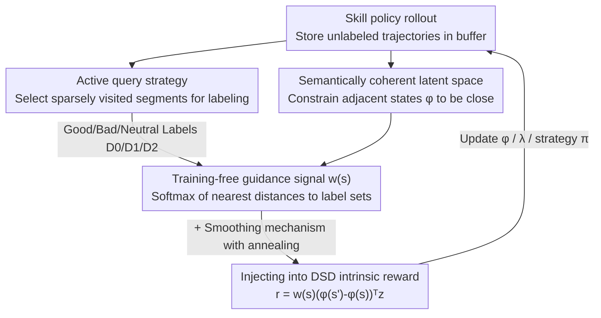

# COLLIE: Guiding Skill Discovery in Semantically Coherent Latent Space

**Conference**: ICML 2026  
**arXiv**: [2606.00950](https://arxiv.org/abs/2606.00950)  
**Code**: https://github.com/iiiiii11/COLLIE  
**Area**: Reinforcement Learning / Skill Discovery  
**Keywords**: Unsupervised Skill Discovery, Guided Skill Discovery, Semantically Coherent Latent Space, Training-free Guidance Signal, Human-in-the-Loop

## TL;DR
This paper proposes **COLLIE**, a Guided Skill Discovery (GSD) framework that constructs a "semantically coherent" skill latent space (where close states share similar human desirability) using large-scale unlabeled data. This allows for the **training-free** propagation of a dense guidance signal $w(s)$ from sparse human "good/bad" labels, directing unsupervised exploration towards safe and task-relevant regions without the need for additional guidance networks.

## Background & Motivation

**Background**: Unsupervised Skill Discovery (USD) aims to learn a set of distinguishable and diverse behaviors that cover the state space without reward functions, intended for reuse in downstream tasks (e.g., as low-level skills in hierarchical policies or for zero-shot skill selection). Typical approaches maximize the mutual information $I(s,z)$ between skills $z$ and states $s$, or utilize **Distance-maximizing Skill Discovery (DSD)**, which constrains the latent space $\phi(s)$ to reflect state distances and maximizes the distance traversed in this space.

**Limitations of Prior Work**: **Uniform exploration** strategies in USD learn many useless or even dangerous skills in complex environments, as vast areas of the state space may be irrelevant or harmful. Guided Skill Discovery (GSD) attempts to focus exploration using human intent, but existing GSD methods suffer from two main issues: (1) Dependence on **pre-defined rules or expert demonstrations**, which are difficult to obtain in complex environments; (2) Requirement for **training additional guidance networks** to encode human intent, where online human feedback is naturally sparse, leading to overfitting and unreliable guidance.

**Key Challenge**: There is a fundamental tension between the requirement for reliability (needing many labels) and the reality of human feedback (limited labelling effort). Existing methods place this burden on a trainable guidance network, which becomes unstable under sparse data.

**Goal**: To construct a reliable guidance signal under **sparse, online, and non-expert** human feedback without introducing any additional trainable guidance models.

**Key Insight**: The authors observe that if the **latent space itself is semantically coherent** (states that are close in the space share similar human desirability), a small number of labels can propagate smoothly through the space, eliminating the need to train a classifier to fit sparse labels. This coherence can be learned "for free" from **large-scale unlabeled data** (where adjacent states in a trajectory typically have similar desirability), effectively compensating for the sparsity of human feedback.

**Core Idea**: Build a semantically coherent latent space using dense unsupervised data $\rightarrow$ Generate a dense guidance signal $w(s)$ in this space via a **training-free** mechanism (based on "nearest distance to label sets + softmax") $\rightarrow$ Inject $w(s)$ as a distance modulation factor into the DSD intrinsic reward to guide exploration toward human-desired regions.

## Method

### Overall Architecture
COLLIE addresses the problem of obtaining reliable guidance from sparse human feedback. Built upon the DSD framework, it integrates four processes within an epoch: **Learning a semantically coherent latent space** (constraining trajectory-adjacent states to be close in latent space) $\rightarrow$ **Training-free propagation of guidance signals** (using "good/bad/neutral" labels to calculate $w(s)$ via softmax of distances) $\rightarrow$ **Active query for labels** (prioritizing human labeling for sparsely visited segments to ensure coverage) $\rightarrow$ **Injecting $w(s)$ into the DSD intrinsic reward** to update the latent space, Lagrange multipliers, and policy. The signal $w(s)$ is updated online with new feedback without training additional networks.

### Key Designs

**1. Semantically Coherent Latent Space: Enabling Sparse Label Propagation**

The premise for training-free label propagation is that the latent space must satisfy a specific property: close states must have similar human desirability. The authors formalize this as **semantic coherence**: for a desirability function $g(s):\mathcal{S}\to\{0,1,2\}$, a latent space is coherent if $\forall\epsilon>0,\exists\delta>0$ such that $\|\phi(s_1)-\phi(s_2)\|_2\le\delta \Rightarrow P[g(s_1)=g(s_2)]\ge 1-\epsilon$. This must be explicitly constructed because **original state spaces are inherently incoherent**; for instance, a robot at the same $(x,y)$ position might be stable (desired) or falling (undesired), differing only by a few joint angles but having opposite desirability. The authors use a **proxy constraint** derived from the observation that adjacent states in a trajectory share similar desirability: $\|\phi(s')-\phi(s)\|_2\le\delta_0,\ \forall(s,s')\in\mathcal{S}_{\text{adj}}$. As proven by Park et al. (2024), this local constraint implies a global Lipschitz condition regarding **temporal distance** $\|\phi(s_1)-\phi(s_2)\|_le\delta_0 d_{\text{temp}}(s_1,s_2)$, allowing desirability to propagate smoothly.

**2. Training-free Guidance Signal $w(s)$: Propagation via Nearest Distance + Softmax**

With a coherent latent space, guidance signals no longer require trained networks. The core idea is that the desirability of any state $s$ can be inferred from its distance to label sets in the latent space. Given a small set of labeled states $\mathcal{D}=\mathcal{D}_0\cup\mathcal{D}_1\cup\mathcal{D}_2$ (bad/neutral/good), the minimum L2 distance to each set is first calculated: $d_\phi(s,\mathcal{D}')=\min_{s_0\in\mathcal{D}'}\|\phi(s_0)-\phi(s)\|$. Then, a weighted sum of desirability levels is computed via softmax of negative distances:

$$w(s)=\text{softmax}\big([-d_\phi(s,\mathcal{D}_i)]_{i=0}^{2}\big)[0,1,2]^\top$$

Intuitively, $w(s)$ is larger near "good" regions and smaller near "bad" regions. The authors provide theoretical backing (Proposition 3.1), proving that when $w(s)$ is viewed as a classifier, its asymptotic error rate is bounded by **twice the Bayes error rate**: $P(\hat g(s)\ne g(s))\le 2P^*(s)-\tfrac{3}{2}[P^*(s)]^2$. Compared to training a network, this avoids overfitting on sparse data and carries minimal computational overhead.

**3. Decoupled Injection of $w(s)$ into DSD Reward: Avoiding Instability**

To influence exploration, the guidance signal must be integrated into the DSD objective. A naive approach would be to use $w(s)$ as a distance modulator in the latent space constraint: $\|\phi(s')-\phi(s)\|_2\le w(s)$. However, this couples the dynamic $w(s)$ directly with the $\phi$ update, causing instability. Following Kim et al. (2024), a **variable substitution** $\phi'(s)=\phi(s)/w(s)$ is used to derive an approximately equivalent but more stable objective: the constraint is restored to $\|\phi(s')-\phi(s)\|_2\le 1$, while $w(s)$ is moved to the objective function as a **scaling factor for the intrinsic reward**: $r(s,z,s')=w(s)(\phi(s')-\phi(s))^\top z$. This **decouples** the guidance from latent space learning, preserving the stability of DSD while injecting human intent.

**4. Active Querying + Signal Smoothing: Ensuring Coverage and Stability**

The accuracy of the training-free signal depends on the label set $\mathcal{D}$ covering the state space. The authors propose an **active query strategy** prioritizing **sparsely visited** states. This is measured using a particle-based state entropy estimate $H_{\text{state}}(s)\approx\log(1+\tfrac{1}{k}\sum_{j=1}^k\|s-s^{(j)}\|)$, where $s^{(j)}$ is the $j$-th nearest neighbor in the labeled set. To avoid training shocks caused by abrupt changes in $w(s)$ when the latent space is immature, a **smoothing mechanism** is used: $w_e(s)=(1-\beta_e)w(s)+\beta_e\cdot 1$, where $\beta_e$ anneals over epochs. This allows a smooth transition from pure unsupervised exploration to guided exploration.

### Loss & Training
The final objective modifies DSD by injecting the scaled intrinsic reward. The latent space $\phi$ maximizes $\mathcal{J}^\phi=\mathbb{E}[w(s)(\phi(s')-\phi(s))^\top z+\lambda\min(\epsilon,1-\|\phi(s')-\phi(s)\|_2^2)]$, the Lagrange multiplier $\lambda$ minimizes the constraint term, and the policy $\pi$ maximizes the cumulative intrinsic reward $r=w(s)(\phi(s')-\phi(s))^\top z$. Feedback is collected every $K$ epochs, with most tasks using 40 labeled segments of length $H=20$.

## Key Experimental Results

### Main Results
Evaluation was conducted on 5 robotic locomotion environments (state-based Ant/HalfCheetah/Safety-Gym, pixel-based Quadruped/Humanoid). COLLIE was compared against USD baselines (DIAYN/LSD/METRA), GSD baselines (online variants of DoDont*/DDG*), and an Oracle (hand-designed $w(s)$). The metric is **safe state coverage** (avoiding dangerous zones while covering the state space).

| Task | DIAYN | METRA | DoDont* | **COLLIE** | Oracle |
|------|-------|-------|---------|-----------|--------|
| Ant North | -4.20 | -1425.80 | 1307.20 | **1333.20** | 1381.40 |
| HalfCheetah Right | 0.00 | -8.40 | 82.80 | **102.20** | 97.80 |
| Quadruped North (Pixel) | -4.20 | -200.80 | 115.20 | **128.40** | 112.60 |
| Humanoid Hole (Pixel) | 3.60 | 21.60 | 75.80 | **80.60** | 75.20 |
| Safety-Gym Hazard | -34.80 | -34.80 | -37.60 | **-16.00** | -20.80 |

In downstream tasks (HalfCheetah hierarchical control with frozen skills), COLLIE learned the strongest skills:

| Method | DIAYN | LSD | METRA | DoDont* | **COLLIE** | Oracle |
|------|-------|-----|-------|---------|-----------|--------|
| Performance | 10.43 | 32.73 | 21.58 | 30.44 | **45.26** | 47.46 |

### Ablation Study

| Configuration | Metric (Ant North Safe Coverage) | Description |
|------|---------|------|
| COLLIE (Full, 40 labels, no noise) | 1333.20 | Full model |
| Noise $R_{\text{error}}=0.5$ | 1184.60 | Robust despite mislabeled boundary samples |
| Noise $R_{\text{error}}=1$ | 1084.20 | Moderate decline as noise increases |
| Label count 20 | 1035.60 | Still aligns with intent with half the labels |
| Label count 10 | 801.40 | Still guides even with extremely sparse data |
| COLLIE-L2 (No coherence, uses original L2) | Worse | Demonstrates necessity of coherent latent space |

### Key Findings
- **Semantic Coherence is the Foundation**: Removing it (COLLIE-L2) significantly degrades performance, confirming that original state spaces require explicit construction for semantic similarity.
- **Effective Under Sparse Feedback**: Only 10-20 labels are needed to align with intent. Unlike trained networks, the training-free signal does not collapse with small datasets.
- **Robustness to Noise**: Performance declines gracefully under mislabeling, proving the nearest-neighbor softmax mechanism is resilient.
- **Baselines Training Guidance Networks Struggle**: DoDont* depends on a stable instructor network which is unreliable with limited feedback, consistently underperforming COLLIE.

## Highlights & Insights
- **Transforming "Guidance Difficulty" into "Latent Coherence"**: The cleverest step is recognizing that if the latent space is semantically coherent, guidance reduces to a simple distance-based propagation problem.
- **Theoretically Backed Training-free Signal**: Proving error bounds for $w(s)$ transforms the "no-training" approach from a heuristic into a guaranteed conclusion.
- **Decoupled Variable Substitution**: The $\phi'=\phi/w$ trick to move dynamic signals from constraints to reward scaling is a valuable engineering insight for maintaining stability.
- **Annealing as an Exploration-Guidance Switch**: The $\beta_e$ factor unifies USD and GSD, allowing early exploration to prevent the agent from being led astray by an immature latent space.

## Limitations & Future Work
- **Dependence on Trajectory Adjacency Proxy**: Semantic coherence is approximated via adjacency; this may fail in environments where desirability jumps sharply between adjacent states (e.g., instantaneous traps).
- **Oracle Teacher Evaluation**: Experiments use rule-based teachers. While noise was tested, real human feedback might involve more complex biases or inconsistencies.
- **Limited to Locomotion**: Evaluations focused on Ant/HalfCheetah/Humanoid; effectiveness in manipulation or long-horizon tasks remains to be verified.
- **Coarse Discrete Labels**: The 3-level feedback is relatively coarse; extending this to continuous preferences or finer intent encoding is an open quest.

## Related Work & Insights
- **vs. USD (DIAYN / LSD / METRA)**: These methods explore uniformly without human intent, often learning useless skills; COLLIE guides exploration toward safe zones, significantly outperforming them in safety.
- **vs. Trained GSD (DoDont / DDG)**: These rely on expert data and trained networks which overfit under sparse feedback; COLLIE is **training-free**, making it more reliable and stable.
- **vs. Preference RL**: COLLIE uses segment labels (good/neutral/bad) rather than pairwise preferences, which better suits absolute desirability semantics like "safe/dangerous zones."
- **vs. Park et al. (2024)**: COLLIE adopts the temporal Lipschitz constraint but extends it from pure unsupervised learning to a medium for semantic coherence and label propagation.

## Rating
- Novelty: ⭐⭐⭐⭐ The transition from "learning guidance" to "distance propagation in coherent space" is a substantial simplification with theoretical support.
- Experimental Thoroughness: ⭐⭐⭐⭐ Comprehensive coverage of pixels, noise, and label sparsity, though limited to locomotion tasks.
- Writing Quality: ⭐⭐⭐⭐ Clear logical chain from motivation to theory to engineering implementation.
- Value: ⭐⭐⭐⭐ High practical value for human-in-the-loop RL and safe exploration under sparse feedback.

<!-- RELATED:START -->

## Related Papers

- [\[ICLR 2026\] SUSD: Structured Unsupervised Skill Discovery through State Factorization](../../ICLR2026/reinforcement_learning/susd_structured_unsupervised_skill_discovery_through_state_factorization.md)
- [\[ICLR 2026\] Self-Improving Skill Learning for Robust Skill-based Meta-Reinforcement Learning](../../ICLR2026/reinforcement_learning/self-improving_skill_learning_for_robust_skill-based_meta-reinforcement_learning.md)
- [\[ICML 2026\] Global Policy-Space Response Oracles for Two-Player Zero-Sum Games](global_policy-space_response_oracles_for_two-player_zero-sum_games.md)
- [\[ICML 2026\] Space-sampled Value Decay: Forgetting Mechanisms for Non-stationary Deep Reinforcement Learning](space-sampled_value_decay_forgetting_mechanisms_for_non-stationary_deep_reinforc.md)
- [\[ACL 2026\] SpiralThinker: Latent Reasoning through an Iterative Process with Text-Latent Interleaving](../../ACL2026/reinforcement_learning/spiralthinker_latent_reasoning_through_an_iterative_process_with_text-latent_int.md)

<!-- RELATED:END -->
