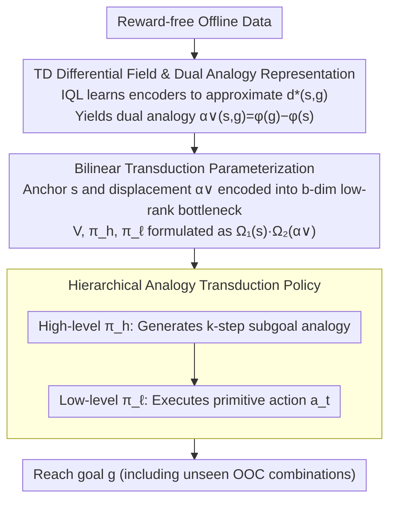

# Compositional Transduction with Latent Analogies for Offline Goal-Conditioned Reinforcement Learning

**Conference**: ICML2026  
**arXiv**: [2605.20609](https://arxiv.org/abs/2605.20609)  
**Code**: https://rllab-snu.github.io/projects/CTA/  
**Area**: Robotics  
**Keywords**: Offline Goal-Conditioned Reinforcement Learning, Compositional Generalization, Analogical Transduction, Temporal Distance Differential Field, Bilinear Transduction  

## TL;DR

This paper proposes CTA (Compositional Transduction with latent Analogies), which decomposes goal-reaching tasks into two independent factors: task-intrinsic analogies and task-extrinsic contexts. By utilizing temporal distance differential fields as analogical representations and combining them with bilinear transduction, the method enables extrapolation to unseen analogy-context combinations. In OGBench manipulation environments, the average performance exceeds the strongest baseline by approximately 42%.

## Background & Motivation

**Background**: Offline goal-conditioned reinforcement learning (offline GCRL) aims to train general goal-reaching agents from reward-free offline datasets. Existing methods primarily achieve compositional generalization through **trajectory stitching**, which connects temporally adjacent segments to synthesize new goal-reaching behaviors.

**Limitations of Prior Work**: Trajectory stitching can only compose behavior segments that are temporally adjacent. It fails to handle another complementary requirement for compositionality: reusing the same task-relevant behavioral transformation across **different task-irrelevant contexts**. For example, an agent might learn to open a drawer while a window is open, but it fails to transfer this behavior when the window is closed because that specific context combination never appeared in the training data.

**Key Challenge**: Offline data is finite and cannot cover all "task × context" combinations. Existing methods lack a mechanism to decouple and recombine **task-intrinsic transformations** (e.g., opening a drawer) from **task-extrinsic contexts** (e.g., window status), leading to generalization failure on unseen combinations.

**Goal**: (1) Define "analogy" and provide a learnable representation; (2) Solve the out-of-distribution extrapolation problem for unseen analogy-context combinations.

**Key Insight**: The authors observe that the quasi-metric space induced by the optimal temporal distance $d^*(s,g)$ is invariant to task-extrinsic contexts. Consequently, the **temporal distance differential field** $\alpha(s,g)(x) = d^*(x,g) - d^*(x,s)$ of a state-goal pair exactly encodes task-intrinsic displacement and is sufficient to support optimal goal-reaching.

**Core Idea**: Use temporal distance differential fields as representations of task-intrinsic analogies. Decouple analogies and contexts into low-rank factors via bilinear transduction to achieve reliable extrapolation to Out-of-Combination (OOC) scenarios.

## Method

### Overall Architecture

CTA consists of two stages: **analogy extraction** and **analogy transduction**. First, a pair of encoders $\phi, \varphi$ are learned to approximate the optimal temporal distance $d^*(s,g) = \phi(s)^\top \varphi(g)$, yielding the **dual analogy** $\alpha^\vee(s,g) = \varphi(g) - \varphi(s)$, which is a finite-dimensional instantiation of the temporal distance differential field. Then, in the analogy transduction stage, the dual analogy serves as a displacement signal. Bilinear transduction is used to parameterize the value function and a hierarchical policy, allowing the agent to extrapolate to unseen analogy-context combinations. During inference, the high-level policy generates $k$-step subgoal analogies, which the low-level policy executes as primitive actions.

### Key Designs

**1. Temporal Distance Differential Field and Dual Analogy: Characterizing Task-Intrinsic Displacement via "Difficulty Differences to Probe States"**

To decouple a task transformation like "opening a drawer" from a context like "window open/closed," an representation that is invariant to context but sufficient for task displacement is required. A single scalar $d^*(s,g)$ is insufficient, as different tasks may map to the same distance. CTA defines the temporal distance differential field $\alpha(s,g)(x)=d^*(x,g)-d^*(x,s)$ for a state-goal pair $(s,g)$. By iterating over all probe states $x$ and comparing the difficulty of "reaching $g$" versus "reaching $s$," it provides a unique "signature" of the task-intrinsic displacement across the state space, eliminating scalar degeneracy. In practice, parameterizing $d^*$ as the inner product $\phi(s)^\top\varphi(g)$ collapses the field into a $d$-dimensional vector $\alpha^\vee(s,g)=\varphi(g)-\varphi(s)$, independent of probe states $x$. Unlike bisimulation-based analogies, this is built on optimal temporal distances and is robust to sub-optimal policy fluctuations in offline data.

**2. Bilinear Transduction Parameterization: Enabling Independent Generalization of Anchors and Displacements via Low-Rank Bottlenecks**

Standard MLPs fitting $V(s, \alpha^\vee)$ couple the "current state" (anchor) and "analogy" (displacement), leading to generalization failure for combinations not seen during training. CTA formulates the value function in bilinear form $V(s,g)=\Omega_1(s)\cdot\Omega_2(\alpha^\vee(s,g))$, where $\Omega_1, \Omega_2$ encode the anchor and displacement into a $b$-dimensional low-rank bottleneck space ($b\ll d$). Policy means are similarly bilinearized, e.g., $\mu_h(s,\alpha^\vee(s,g))=\omega_{h1}(s)\cdot\omega_{h2}(\alpha^\vee(s,g))$. The low-rank constraint forces the network to learn independently on the marginal distributions of anchors and displacements. At inference, tensor products naturally extrapolate to unseen combinations—a principle derived from the OOC generalization theory of Netanyahu et al. (2023), applied here for the first time to GCRL. Ablations show that HIQL+$\alpha^\vee$ performs similarly to HIQL$^\vee$ (39.6 vs 39.3), indicating that the real gain comes from bilinear transduction rather than just the representation.

**3. Hierarchical Analogy Transduction Policy: Decomposing Long-Range Analogies into $k$-step Sub-tasks**

Long-range analogies in offline data are sparse, making direct long-range transduction unreliable and prone to pushing analogy queries outside the OOC range. CTA uses a two-layer hierarchy: the high-level policy $\pi_h$ outputs a $k$-step subgoal analogy $\alpha^\vee(s_t, s_{t+k})$ conditioned on the current state and final goal; the low-level policy $\pi_\ell$ outputs the primitive action $a_t$ conditioned on the current state and subgoal analogy. Decomposing into short-range sub-tasks increases the number of reusable analogies, improving data efficiency and transduction stability, while ensuring the low-level policy queries analogies within an expected OOC range. Both levels are trained using Advantage Weighted Regression (AWR).

### Loss & Training

The analogy extraction stage uses the IQL expectile loss to train $\phi, \varphi$ and the $Q$-function (Eq. 9). The analogy transduction stage uses an action-free IQL loss for the value function $V$ (Eq. 13). Both high-level and low-level policies are trained using Advantage Weighted Regression losses (Eq. 14, 15), with temperature parameters $\beta_h, \beta_\ell$ controlling the behavior cloning weight. Target networks are employed to stabilize training.

## Key Experimental Results

### Main Results

Comparison with 11 baselines across 8 OGBench manipulation environments (8 seeds):

| Environment | GCBC | HIQL | GCIQL | GCIVL$^\vee$ | HIQL$^\vee$ | HIQL+$\alpha^\vee$ | **CTA** |
|------|------|------|-------|--------|-------|---------|---------|
| scene-play | 5 | 38 | 51 | 72 | 87 | 80 | **90** |
| cube-single-play | 6 | 15 | 68 | 89 | 69 | 74 | **86** |
| cube-double-play | 1 | 6 | 40 | 60 | 38 | 30 | **50** |
| cube-triple-play | 1 | 3 | 3 | 2 | 18 | 11 | **17** |
| puzzle-3x3-play | 2 | 12 | 95 | 5 | 79 | 72 | **94** |
| puzzle-4x4-play | 0 | 7 | 26 | 23 | 16 | 50 | **84** |
| puzzle-4x5-play | 0 | 4 | 14 | 5 | 5 | 0 | **17** |
| puzzle-4x6-play | 0 | 3 | 12 | 2 | 2 | 0 | **12** |
| **Average** | 1.9 | 11.0 | 38.6 | 32.2 | 39.3 | 39.6 | **56.3** |

### OOC Extrapolation Case Study

Evaluating direct success rates after intentionally removing specific analogy-context combinations from training data in `scene` and `puzzle-4x4`:

| Environment | HIQL | GCIQL$^\vee$ | HIQL$^\vee$ | HIQL+$\alpha^\vee$ | **CTA** |
|------|------|--------|-------|---------|---------|
| scene | 19±10 (42±12) | 51±10 (63±11) | 45±11 (87±7) | 48±14 (86±6) | **73±9 (94±4)** |
| puzzle-4x4 | 37±11 (69±9) | 44±11 (55±12) | 35±17 (62±13) | 66±11 (95±4) | **80±8 (100±1)** |

> Values inside parentheses represent total success rate (including roundabout paths); values outside are direct success rates.

### Key Findings

- **Maximum Gain in Puzzle Environments**: As state spaces grow exponentially, compositional generalization becomes critical. CTA improves average performance by ~40% across 4 puzzle environments, reaching 2.5x the strongest baseline on 4×4.
- **OOC Extrapolation Drives Performance**: The similarity between HIQL$^\vee$ and HIQL+$\alpha^\vee$ (39.3 vs 39.6) shows that dual analogy representations alone are insufficient; significant gains are achieved through OOC extrapolation via bilinear transduction.
- **Fewer Parameters**: Despite using bilinear parameterization, CTA has ~20% fewer parameters than HIQL+$\alpha^\vee$, ruling out model capacity as the source of improvement.

## Highlights & Insights

- **Temporal Distance Differential Field as Analogy**: This elegantly embeds distance differential embeddings from metric geometry into RL. By comparing relative probe states, it solves scalar degeneracy and naturally achieves context invariance. This approach is transferable to any scenario requiring task semantic invariance across varying environments.
- **OOC Guarantees via Bilinear Transduction**: The method applies Netanyahu et al. (2023)'s OOC generalization theory to GCRL value functions and policies for the first time, using low-rank bottlenecks to achieve factor-level independent generalization.
- **t-SNE Visualization of Analogies**: Learned dual analogies are visually confirmed to cluster by task semantics (e.g., "open drawer" vs "close drawer") and remain invariant to contextual factors like windows or buttons.

## Limitations & Future Work

- **Strong Assumptions (Assumption 4.3)**: Requires that task-intrinsic components for all state-goal pairs within a task block remain consistent across different comparison endpoints, which may not hold in complex real-world environments.
- **Theoretical Gap in Dual Analogies**: The learned $\varphi(g) - \varphi(s)$ is not guaranteed to be minimal or identifiable, leading to approximation errors between the practical implementation and the theoretical invariant differential field.
- **Scope Restrictions**: In environments lacking clear task-context separation (e.g., mazes), CTA's advantages are limited; the design is tailored toward manipulation tasks.
- Future directions include more accurate approximations of the differential field and extending analogical transduction to continuous control and high-dimensional visual observation scenarios.

## Related Work & Insights

- **Offline GCRL**: Methods like HIQL, GCIQL, QRL (Quasimetric Learning), and CRL (Contrastive RL) provide different schemes for temporal distance estimation. CTA builds on these by introducing an analogy layer.
- **Analogy and Representation Learning**: The linear offset analogies of word2vec inspired the differential vector design. Goal-conditioned bisimulation is related but depends on on-policy reward matching, making it unsuitable for offline settings.
- **Dual Goal Representations**: The dual representation $\varphi(g)$ in Park et al. (2026) shares encoder training methods with the dual analogy $\varphi(g) - \varphi(s)$, but lacks transduction capabilities.

<!-- RELATED:START -->

## Related Papers

- [\[ICML 2026\] Latent Representation Alignment for Offline Goal-Conditioned Reinforcement Learning](latent_representation_alignment_for_offline_goal-conditioned_reinforcement_learn.md)
- [\[CVPR 2026\] MangoBench: A Benchmark for Multi-Agent Goal-Conditioned Offline Reinforcement Learning](../../CVPR2026/reinforcement_learning/mangobench_a_benchmark_for_multi-agent_goal-conditioned_offline_reinforcement_le.md)
- [\[ICML 2026\] Offline Reinforcement Learning with Generative Trajectory Policies](offline_reinforcement_learning_with_generative_trajectory_policies.md)
- [\[AAAI 2026\] First-Order Representation Languages for Goal-Conditioned RL](../../AAAI2026/reinforcement_learning/first-order_representation_languages_for_goal-conditioned_rl.md)
- [\[ICML 2026\] Mind Dreamer: Untethering Imagination via Active Causal Intervention on Latent Manifolds](mind_dreamer_untethering_imagination_via_active_causal_intervention_on_latent_ma.md)

<!-- RELATED:END -->
