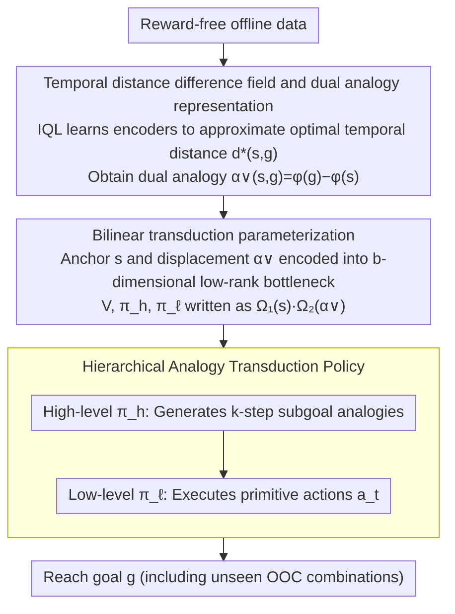

# Compositional Transduction with Latent Analogies for Offline Goal-Conditioned Reinforcement Learning

**Conference**: ICML2026  
**arXiv**: [2605.20609](https://arxiv.org/abs/2605.20609)  
**Code**: https://rllab-snu.github.io/projects/CTA/  
**Area**: Robotics  
**Keywords**: Offline goal-conditioned reinforcement learning, compositional generalization, analogy transduction, temporal distance difference field, bilinear transduction  

## TL;DR

This paper proposes CTA (Compositional Transduction with latent Analogies), which decomposes goal-reaching tasks into two independent factors: "task-intrinsic analogies" and "task-extrinsic contexts." By utilizing temporal distance difference fields as analogy representations and combining them with bilinear transduction, the method achieves extrapolation to unseen analogy-context combinations. Its average performance outperforms the strongest baseline by approximately 42% on OGBench manipulation environments.

## Background & Motivation

**Background**: Offline goal-conditioned reinforcement learning (offline GCRL) aims to train a general goal-reaching agent from reward-free offline data. Existing methods primarily achieve compositional generalization through **trajectory stitching**—connecting temporally adjacent segments to synthesize new goal-reaching behaviors.

**Limitations of Prior Work**: Trajectory stitching only combines behavior segments that are temporally adjacent but fails to address a complementary compositional requirement—reusing the same **task-relevant behavioral transformation across different task-irrelevant contexts**. For example, an agent might learn to open a drawer while a window is open but fails to transfer this behavior when the window is closed because this combination of contexts never co-occurred in the training data.

**Key Challenge**: Offline data is limited and cannot cover all "task $\times$ context" combinations. Existing methods lack a mechanism to decouple **task-intrinsic transformations** (e.g., opening a drawer) from **task-extrinsic contexts** (e.g., window status) and recombine them, leading to generalization failure on unseen combinations.

**Goal**: (1) Define what constitutes an "analogy" and provide a learnable representation; (2) solve the out-of-distribution extrapolation problem for unseen analogy-context combinations.

**Key Insight**: The authors observe that the quasi-metric space induced by the optimal temporal distance $d^*(s,g)$ is invariant to task-extrinsic contexts. Furthermore, the **temporal distance difference field** of a state-goal pair, $\alpha(s,g)(x) = d^*(x,g) - d^*(x,s)$, precisely encodes the task-intrinsic displacement and is sufficient to support optimal goal reaching.

**Core Idea**: Use temporal distance difference fields as task-intrinsic analogy representations and decouple analogies and contexts into low-rank factors via bilinear transduction to achieve reliable out-of-context (OOC) extrapolation.

## Method

### Overall Architecture

CTA is divided into two stages: **analogy extraction** and **analogy transduction**. First, a pair of encoders $\phi, \varphi$ is learned to approximate the optimal temporal distance $d^*(s,g) = \phi(s)^\top \varphi(g)$. From this, the **dual analogy** $\alpha^\vee(s,g) = \varphi(g) - \varphi(s)$ is obtained as a finite-dimensional instantiation of the difference field. In the transduction stage, dual analogies serve as displacement signals to parameterize value functions and hierarchical policies via bilinear transduction, allowing the agent to extrapolate to unseen analogy-context combinations. During inference, the high-level policy generates $k$-step subgoal analogies, and the low-level policy executes primitive actions.

### Key Designs

**1. Temporal distance difference field and dual analogy representation: Characterizing task-intrinsic displacement via "difficulty differences to all probe states"**  
To decouple task transformations like "opening a drawer" from contexts like "window open/closed," an invariant representation is required. A single scalar $d^*(s,g)$ is insufficient, as different tasks may map to the same distance value. CTA defines the temporal distance difference field for a state-goal pair $(s,g)$ as $\alpha(s,g)(x) = d^*(x,g) - d^*(x,s)$. By iterating over all probe states $x$ and comparing the difficulty of reaching $g$ versus $s$, it creates a "signature" of the task-intrinsic displacement across the entire state space. In practice, $d^*$ is parameterized as an inner product $\phi(s)^\top \varphi(g)$, causing the difference field to collapse into a $d$-dimensional vector $\alpha^\vee(s,g) = \varphi(g) - \varphi(s)$, independent of the probe state $x$. Unlike bisimulation-based analogies, this is built on optimal temporal distances and is more robust to suboptimal data in offline scenarios.

**2. Bilinear transduction parameterization: Using low-rank bottlenecks for independent generalization of anchors and displacements to support OOC extrapolation**  
Standard MLPs for $V(s, \alpha^\vee)$ couple the "current state" (anchor) and the "analogy" (displacement), leading to failure on combinations unseen during training. CTA formulates the value function in a bilinear form $V(s,g) = \Omega_1(s) \cdot \Omega_2(\alpha^\vee(s,g))$, where $\Omega_1, \Omega_2$ encode anchors and displacements into a $b$-dimensional low-rank bottleneck space ($b \ll d$). Policy means are similarly bilinearized, such as the high-level policy $\mu_h(s, \alpha^\vee(s,g)) = \omega_{h1}(s) \cdot \omega_{h2}(\alpha^\vee(s,g))$. Low-rank constraints force the network to learn independently on the marginal distributions of anchors and displacements. At inference, tensor products allow natural extrapolation to unseen combinations, following OOC generalization theories previously unapplied to GCRL.

**3. Hierarchical analogy transduction policy: Decomposing long-range analogies into $k$-step short-range subtasks**  
Long-range analogies are sparse in offline data, making direct transduction unreliable. CTA employs a two-layer structure: the high-level policy $\pi_h$ outputs $k$-step subgoal analogies $\alpha^\vee(s_t, s_{t+k})$ conditioned on the current state and the final goal analogy; the low-level policy $\pi_\ell$ outputs primitive actions $a_t$ conditioned on the current state and the subgoal analogy. Breaking tasks into short-range components increases the number of reusable analogies, enhancing data efficiency and transduction stability. Both policies are trained using Advantage Weighted Regression (AWR).

### Loss & Training

The analogy extraction stage uses IQL expectile loss to train $\phi, \varphi$ and $Q$-functions. The analogy transduction stage uses an action-free IQL loss to train the value function $V$. Both high-level and low-level policies are trained using advantage-weighted regression (AWR) losses, with temperature parameters $\beta_h, \beta_\ell$ controlling the weight of behavior cloning. Target networks are utilized to stabilize training.

## Key Experimental Results

### Main Results

Comparison across 8 manipulation environments in OGBench with 11 baselines (8 random seeds):

| Environment | GCBC | HIQL | GCIQL | GCIVL∨ | HIQL∨ | HIQL+α∨ | **CTA** |
|------|------|------|-------|--------|-------|---------|---------|
| scene-play | 5 | 38 | 51 | 72 | 87 | 80 | **90** |
| cube-single-play | 6 | 15 | 68 | 89 | 69 | 74 | **86** |
| cube-double-play | 1 | 6 | 40 | 60 | 38 | 30 | **50** |
| cube-triple-play | 1 | 3 | 3 | 2 | 18 | 11 | **17** |
| puzzle-3x3-play | 2 | 12 | 95 | 5 | 79 | 72 | **94** |
| puzzle-4x4-play | 0 | 7 | 26 | 23 | 16 | 50 | **84** |
| puzzle-4x5-play | 0 | 4 | 14 | 5 | 5 | 0 | **17** |
| puzzle-4x6-play | 0 | 3 | 12 | 2 | 2 | 0 | **12** |
| **Average** | 1.9 | 11.0 | 38.6 | 32.2 | 39.3 | 39.6 | **56.3** |

### OOC Extrapolation Case Study

Evaluating direct success rates after intentionally removing specific analogy-context combinations from training data in `scene` and `puzzle-4x4`:

| Environment | HIQL | GCIQL∨ | HIQL∨ | HIQL+α∨ | **CTA** |
|------|------|--------|-------|---------|---------|
| scene | 19±10 (42±12) | 51±10 (63±11) | 45±11 (87±7) | 48±14 (86±6) | **73±9 (94±4)** |
| puzzle-4x4 | 37±11 (69±9) | 44±11 (55±12) | 35±17 (62±13) | 66±11 (95±4) | **80±8 (100±1)** |

> Values outside parentheses represent direct success rate (trajectories completing the task directly); values inside represent total success rate (including roundabout completions).

### Key Findings

- **Greatest Gains in Puzzle Environments**: As the state space grows exponentially, compositional generalization becomes critical. CTA improves performance by approximately 40% on average across 4 puzzle environments, reaching 2.5x the strongest baseline on the 4x4 variant.
- **OOC Extrapolation is the Source of Gains**: The performance of HIQL∨ and HIQL+α∨ is similar (39.3 vs 39.6), indicating that dual analogy representation alone is insufficient. Significant gains stem from CTA's bilinear transduction enabling OOC extrapolation.
- **Fewer Parameters**: Despite using bilinear parameterization, CTA has approximately 20% fewer parameters than HIQL+α∨, ruling out model capacity as the source of improvement.

## Highlights & Insights

- **Temporal distance difference fields as analogy representations** elegantly embed distance difference embeddings from metric geometry into RL. By relatively comparing all probe states, it eliminates scalar degradation while naturally acquiring context invariance.
- **OOC guarantees of bilinear transduction** apply theoretical OOC generalization frameworks to value function and policy parameterization in offline GCRL for the first time, using low-rank bottlenecks to achieve independent factor-level generalization.
- **t-SNE visualization of analogies** intuitively validates that learned dual analogies cluster by task semantics (e.g., "opening a drawer" vs. "closing a drawer") and remain invariant to contextual factors like window or button states.

## Limitations & Future Work

- **Strong Assumption 4.3**: It requires task-intrinsic components of state-goal pairs within the same task block to be consistent across different comparison endpoints, which may not hold in complex real-world environments.
- **Gap between dual analogies and theory**: The practically learned $\varphi(g) - \varphi(s)$ is not guaranteed to be minimal or identifiable, leading to approximation errors compared to a theoretically invariant difference field.
- **Scope Limitations**: CTA shows limited advantages in environments lacking clear task-context separation (e.g., mazes). The design is biased toward manipulation tasks.
- Future directions include more accurate approximations of distance difference fields and extending analogy transduction to continuous control with high-dimensional visual observations.

## Related Work & Insights

- **Offline GCRL**: Methods like HIQL, GCIQL, QRL, and CRL provide different schemes for temporal distance estimation; CTA introduces an analogy layer on top of these.
- **Analogy and Representation Learning**: Linear offset analogies in word2vec inspired the difference vector design. Goal-conditioned bisimulation is related but depends on on-policy reward matching, making it unsuitable for offline settings.
- **Dual Goal Representations**: The dual representation $\varphi(g)$ in Park et al. (2026) shares encoder training methods with the dual analogy $\varphi(g) - \varphi(s)$, but lacking transduction capabilities.

<!-- RELATED:START -->

## Related Papers

- [\[ICML 2026\] Direction-Conditioned Policies via Compositional Subgoal Scoring for Online Goal-Conditioned Reinforcement Learning](direction-conditioned_policies_via_compositional_subgoal_scoring_for_online_goal.md)
- [\[ICML 2026\] Latent Representation Alignment for Offline Goal-Conditioned Reinforcement Learning](latent_representation_alignment_for_offline_goal-conditioned_reinforcement_learn.md)
- [\[CVPR 2026\] MangoBench: A Benchmark for Multi-Agent Goal-Conditioned Offline Reinforcement Learning](../../CVPR2026/reinforcement_learning/mangobench_a_benchmark_for_multi-agent_goal-conditioned_offline_reinforcement_le.md)
- [\[ICLR 2026\] Occupancy Reward Shaping: Improving Credit Assignment for Offline Goal-Conditioned Reinforcement Learning](../../ICLR2026/reinforcement_learning/occupancy_reward_shaping_improving_credit_assignment_for_offline_goal-conditione.md)
- [\[ICLR 2026\] Multistep Quasimetric Learning for Scalable Goal-Conditioned Reinforcement Learning](../../ICLR2026/reinforcement_learning/scaling_goal-conditioned_reinforcement_learning_with_multistep_quasimetric_dista.md)

<!-- RELATED:END -->
