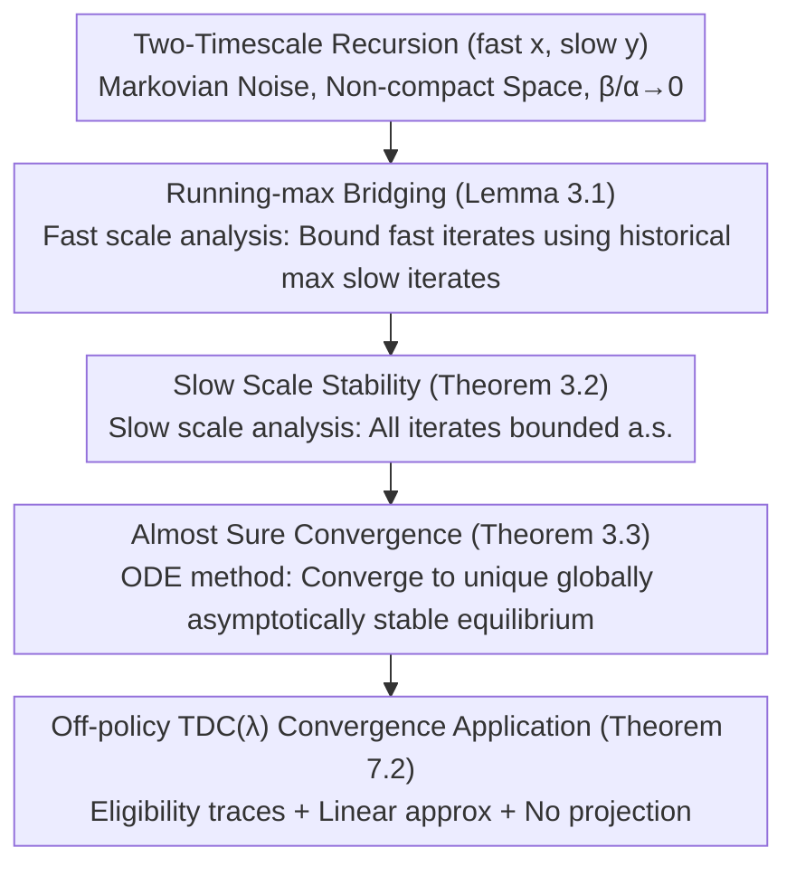

# Convergence of Two-Timescale Markovian Stochastic Approximations with Applications in Reinforcement Learning

**Conference**: ICML 2026  
**arXiv**: [2605.31172](https://arxiv.org/abs/2605.31172)  
**Code**: None  
**Area**: Reinforcement Learning  
**Keywords**: Two-timescale, Stochastic Approximation, ODE method, Markovian noise, TDC

## TL;DR
This paper establishes the stability and almost sure (a.s.) convergence of general two-timescale stochastic approximation (SA) under Markovian noise without relying on any projection operators. Consequently, it provides the first a.s. convergence result for the TDC($\lambda$) algorithm under off-policy linear function approximation.

## Background & Motivation

**Background**: Many algorithms in reinforcement learning (RL), such as actor-critic, TDC, and target networks, fall under the category of two-timescale SA: fast and slow parameter sets are updated with large and small step sizes, respectively. Asymptotically, the fast scale behaves as if it converges under a static slow parameter, forming a stochastic version of "nested loops." Theoretical analysis relies on the ODE method proposed by Borkar (Borkar 1997; Borkar & Meyn 2000), where the core premise is iterate boundedness (stability), allowing the asymptotic behavior of discrete iterates to be characterized by ODE trajectories.

**Limitations of Prior Work**: Classical two-timescale convergence results almost always assume (i) i.i.d. noise and (ii) pre-established stability. However, in RL, noise sequences are Markov chains (joint state-action-eligibility trace), and eligibility traces can be unbounded in off-policy settings, making both i.i.d. and bounded noise assumptions inapplicable. Prior works either resorted to mandatory projection operators (Yu 2017; Panda & Bhatnagar 2025) to artificially guarantee boundedness or assumed decoupled scales and compact noise spaces (Karmakar & Bhatnagar 2021), failing to directly cover TDC($\lambda$) with eligibility traces.

**Key Challenge**: In two-scale coupled dynamics, how can one relate the norm of fast-scale iterates to slow-scale iterates using only the step-size ratio $\beta(n)/\alpha(n)\to 0$ and mild Lipschitz assumptions? Specifically, how can almost sure convergence be proven under the "wide-open" setting of Markovian noise, non-compact noise spaces, no projections, and no pre-assumed stability? This remains a longstanding gap in the literature (see Table 1).

**Goal**: To remove all the aforementioned restrictions within a unified framework, covering real-world algorithms such as TDC($\lambda$) and actor-critic.

**Key Insight**: The authors observe that while Lakshminarayanan & Bhatnagar (2017) used "rescaled iterates + ODE@$\infty$" to prove two-scale stability under i.i.d. noise, and Liu et al. (2025b) achieved similar results for single-scale Markov noise, combining them faces a major hurdle: existing two-scale proofs require a "same-step" control of fast parameters $\|x_n\|$ by slow parameters $\|y_n\|$. This synchronous bound naturally fails during the rescaling process.

**Core Idea**: Relax the requirement to "controlling the current fast parameter $x_n$ with the maximum slow parameter seen so far $y_n^{\max}$"—introducing $\|x_n\|\le K(1+\|y_n^{\max}\|)$ as a new bridging inequality (Lemma 3.1). This "running max" formulation aligns perfectly with Lakshminarayanan's "monotone scaling factor," allowing the seamless integration of the two theoretical toolsets.

## Method

This is a theoretical SA paper rather than an algorithmic one. The "Method" refers to a proof system centered around Lemma 3.1, eventually applied to the RL algorithm TDC($\lambda$).

### Overall Architecture

The object of study is a general two-timescale recursion (fast scale $x\in\mathbb{R}^{d_1}$, slow scale $y\in\mathbb{R}^{d_2}$):

$$
x_{n+1}=x_n+\alpha(n)\,H(x_n,y_n,W_{n+1}),\quad y_{n+1}=y_n+\beta(n)\,G(x_n,y_n,W_{n+1}),
$$

where the noise $\{W_n\}$ is a Markov chain on space $\mathcal{W}$ (allowing non-compact, uncountable spaces), and step sizes satisfy $\lim_n \beta(n)/\alpha(n)=0$. The proof roadmap is: ① Prove Lemma 3.1 at the fast scale (running-max bridging bound), ② Prove Theorem 3.2 at the slow scale (overall stability), ③ Prove Theorem 3.3 (almost sure convergence), ④ Verify that TDC($\lambda$) satisfies all assumptions to obtain Theorem 7.2.

### Key Designs

**1. Running-max Bridging (Lemma 3.1): Using "Historical Maximum Slow Parameter" to Bound Fast Parameters**

The entire proof hinged on the aforementioned key challenge—how to relate the norm of the fast iterate $\|x_n\|$ to the slow iterate in coupled dynamics. Prior works (Kushner & Yin 2003, Mokkadem & Pelletier 2006, Dalal et al. 2018, Yaji & Bhatnagar 2020, Zeng et al. 2024) attempted to control $\|x_n\|$ using the synchronous $\|y_n\|$. Once the noise is no longer i.i.d., this synchronous bound fails during rescaling. Ours breaks this deadlock by relaxing it to $\|x_n\|\le K(1+\|y_n^{\max}\|)$ (a.s.), where $y_n^{\max}$ is the slowest iterate with the largest norm so far. The proof involves partitioning the time axis $[0,\infty)$ into intervals $[T_n,T_{n+1})$ of length approximately $T$ based on fast step sizes, normalizing $z=(x,y)$ by a monotone scaling factor $r_n\doteq\max\{1,r_{n-1},\|\bar z(T_n)\|\}$ to get $\tilde z_n(t)$, and using Arzelà–Ascoli to converge to a limit trajectory satisfying ODE@$\infty$ ($\dot x=h_\infty(x,y),\ \dot y=0$). Lemma 4.7 ensures that if $\|\bar x(T_n)\|>C_1(1+\|\bar y(T_n)\|)$, then $r_{n+1}=r_n$, leading to $\|\bar z(T_n)\|\le C_1C_2(\max_{m\le n}\|\bar y(T_m)\|+1)$. Finally, Lemma 4.9 extends the bound to all $n$. The "running max" is essential as it is the weakest condition that simultaneously accommodates Lakshminarayanan's monotone scaling and Liu's Markovian noise averaging techniques.

**2. Slow-Scale Stability Proof (Theorem 3.2): Reducing Overall Boundedness to Contradiction**

With the bridging bound, the second step is to prove $\sup_n\|z_n\|<\infty$ (a.s.). Directly applying the single-scale argument from Liu et al. (2025b) fails because the fast scale has larger step sizes and grows faster, outpacing single-scale rescaling. The authors' solution is to perform rescaling on the slow scale but change the scaling factor to $r_n\doteq\max\{1,\|z_{m(T_n)}^{\max}\|\}$, ensuring it is at least of the same order as historical maximums. This forces the rescaling rates of both scales to synchronize—a prerequisite for Kushner & Yin's Markovian noise averaging estimates. Lemma 5.3 then proves that even at slow-scale time resolution, the fast iterate approximately tracks $\lambda_\infty(\tilde y_n(t))$, formalizing the heuristic that "the fast scale is effectively converged." Combined with the zero-attractor property of ODE@$\infty$, assuming $\sup_n r_n=\infty$ contradicts the limit ODE's convergence to 0, thus $r_n$ must be bounded, and stability holds.

**3. Application to Off-policy TDC($\lambda$) Convergence (Theorem 7.2): Mapping the No-Projection Framework to Real Algorithms**

The first two steps provide an abstract SA theory; the third step fills a literature gap: providing almost sure convergence for TDC with off-policy data, linear function approximation, eligibility traces, and no projections. The algorithm is:

$$e_t=\lambda\gamma\rho_{t-1}e_{t-1}+\phi_t,\quad \delta_t=R_{t+1}+\gamma\phi_{t+1}^\top\theta_t-\phi_t^\top\theta_t,$$
$$\nu_{t+1}=\nu_t+\alpha_t(\rho_t\delta_t e_t-\phi_t\phi_t^\top\nu_t),\quad \theta_{t+1}=\theta_t+\beta_t\big(\rho_t\delta_t e_t-\rho_t(1-\lambda)\gamma\phi_{t+1}e_t^\top\nu_t\big).$$

By treating $\nu_t$ as the fast scale and $\theta_t$ as the slow scale, and extending the state to $(S_t,A_t,e_t)$, the unboundedness of the eligibility trace $e_t$ (due to cumulative importance sampling ratios $\rho_t$ in off-policy settings) necessitates a non-compact noise space $\mathcal{W}$. This is precisely where previous frameworks required projections. The authors simply verify that assumptions B.1–B.7 in Appendix B (Markov chain ergodicity, step-size conditions, homogeneous limits of $H/G$, Lipschitz continuity, and averaging conditions) are naturally satisfied by TDC($\lambda$). Theorem 3.3 then directly yields convergence. This step demonstrates the practical power of Lemma 3.1: while Yu (2017) and Panda & Bhatnagar (2025) required extra projections to force boundedness, this work turns "theory without projection" into verifiable conditions, characterizing algorithms exactly as they are implemented.

### Loss & Training
As a theoretical paper, there is no training. Key assumptions include: step sizes $\sum\alpha=\sum\beta=\infty, \sum\alpha^2,\sum\beta^2<\infty, \lim\beta/\alpha=0$; existence of Lipschitz homogeneous limits $h_\infty,g_\infty$ for $H,G$; the corresponding ODE having unique globally asymptotically stable equilibria $\lambda_\infty(y), 0$; and Kushner & Yin-style long-term averaging regularity conditions (B.7).

## Key Experimental Results

### Main Results (Theoretical Comparison)

| Work | Scales | Noise | Projection Req. | Noise Space | Covers TDC($\lambda$) |
|------|--------------|------|-----------|----------|----------------------|
| Borkar (2009) | Two | i.i.d. | No | Compact | No |
| Lakshminarayanan & Bhatnagar (2017) | Two | i.i.d. | No | Compact | No |
| Karmakar & Bhatnagar (2021) | Two (Decoupled) | Markov | No | Compact | No |
| Liu et al. (2025b) | Single | Markov | No | Non-compact | — |
| Panda & Bhatnagar (2025) | Two | Markov | **Yes** | Non-compact | No |
| **Ours** | Two (Coupled) | Markov | No | Non-compact | **Yes** |

### Key Theorems Summary

| Result | Type | Key Statement |
|------|------|----------|
| Lemma 3.1 | Bridging Bound | $\|x_n\|\le K(1+\|y_n^{\max}\|)$ a.s. |
| Theorem 3.2 | Stability | $\sup_n\|z_n\|<\infty$ a.s. |
| Theorem 3.3 | Convergence | $\|z_n-(\lambda(y^*),y^*)\|\to 0$ a.s. |
| Theorem 7.2 | RL Application | Off-policy TDC($\lambda$) with linear approx. converges a.s. |

### Key Findings
- Replacing "synchronous control" with "historical maximum slow iterate control" is the minimal condition to combine Lakshminarayanan & Bhatnagar (2017) and Liu et al. (2025b); without it, the tools are incompatible.
- The paper points out that the argument for a.s. convergence of two-scale Markovian SA in Chandak et al. (2025) is questionable: they infer "expected boundedness $\Rightarrow$ almost sure boundedness," but a counterexample where $x_n=\sqrt n$ with probability $1/n$ (and 0 otherwise) disproves this (Second Borel–Cantelli). This demonstrates that ours not only fills a gap but also corrects errors.
- Provable results for the "deadly triad" (off-policy + eligibility traces + linear approx) are still rare; ours provides the first completely projection-free solution, paving the way for complete actor-critic analysis.

## Highlights & Insights
- The "running max bridge" is a simple yet sharp technique: rather than requiring $\|x_n\|$ to be suppressed by isochronous $\|y_n\|$, it allows suppression by the historical peak of $\|y\|$. This is highly consistent with the naturally monotone scaling factors in rescaling methods. Applying this to other two-scale algorithms like actor-critic or target networks only requires re-verifying the homogeneous limits of $H$ and $G$.
- The entire paper pushes the ODE@$\infty$ framework to the boundaries of "non-compact Markovian noise + no projection," providing clear technical interfaces for Lemma 4.7 (growth suppression) and Lemma 5.3 (fast-scale tracking equilibrium), which can be reused in other proofs transitioning from discrete iterations to limit ODEs.
- The literature comparison (Table 1) and the precise refutation of Chandak et al. (2025) remind researchers that under Markovian noise, there is an essential chasm between "boundedness in expectation" and "almost sure boundedness."

## Limitations & Future Work
- Only asymptotic a.s. convergence is provided without finite-time rates; existing two-scale $L^2$ rates (Doan 2021a/b/2022; Chandak et al. 2025) have not yet been unified with these a.s. path results.
- Current theory requires the ODE to have a unique globally asymptotically stable equilibrium—in actor-critic, the policy ODE might have multiple fixed points (e.g., local optima), requiring the conclusions to be weakened to "convergence to an invariant set."
- The discrete Markov chain assumption excludes continuous state-space RL, requiring a generalization of Markov noise from general state spaces (Borkar 2009, Chapter 6 framework).
- Regarding formalization, Zhang (2025) has verified single-scale Markovian SA in Lean; machine-verifying this two-scale framework is a valuable next step.

## Related Work & Insights
- **vs Lakshminarayanan & Bhatnagar (2017)**: Both use two-scale stability + ODE@$\infty$, but they assume i.i.d. noise and rely on synchronous bounds; ours relaxes this to historical maximum bounds, allowing Markovian and non-compact noise.
- **vs Karmakar & Bhatnagar (2021)**: They assume decoupled parameters and compact noise spaces without projection; ours allows coupling and non-compact Markovian noise, covering truly coupled algorithms like TDC.
- **vs Panda & Bhatnagar (2025)**: Both address non-compact Markovian noise, but Panda uses projections to force boundedness; ours replaces projections with Lemma 3.1, maintaining consistency between theory and practice.
- **vs Chandak et al. (2025)**: Chandak provides $L^2$ rates with an a.s. convergence claim, but the key step (expectation $\Rightarrow$ a.s.) has counterexamples; ours provides a more rigorous a.s. path argument and explicitly notes the error.

<!-- RELATED:START -->

## Related Papers

- [\[ICML 2026\] Stochastic Minimum-Cost Reach-Avoid Reinforcement Learning](stochastic_minimum-cost_reach-avoid_reinforcement_learning.md)
- [\[ICML 2026\] Revisiting Regularized Policy Optimization for Stable and Efficient Reinforcement Learning in Two-Player Games](revisiting_regularized_policy_optimization_for_stable_and_efficient_reinforcemen.md)
- [\[ICML 2026\] Global Policy-Space Response Oracles for Two-Player Zero-Sum Games](global_policy-space_response_oracles_for_two-player_zero-sum_games.md)
- [\[ICML 2026\] Convergence of Steepest Descent and Adam under Non-Uniform Smoothness](convergence_of_steepest_descent_and_adam_under_non-uniform_smoothness.md)
- [\[ICLR 2026\] The Markovian Thinker: Architecture-Agnostic Linear Scaling of Reasoning](../../ICLR2026/reinforcement_learning/the_markovian_thinker_architecture-agnostic_linear_scaling_of_reasoning.md)

<!-- RELATED:END -->
