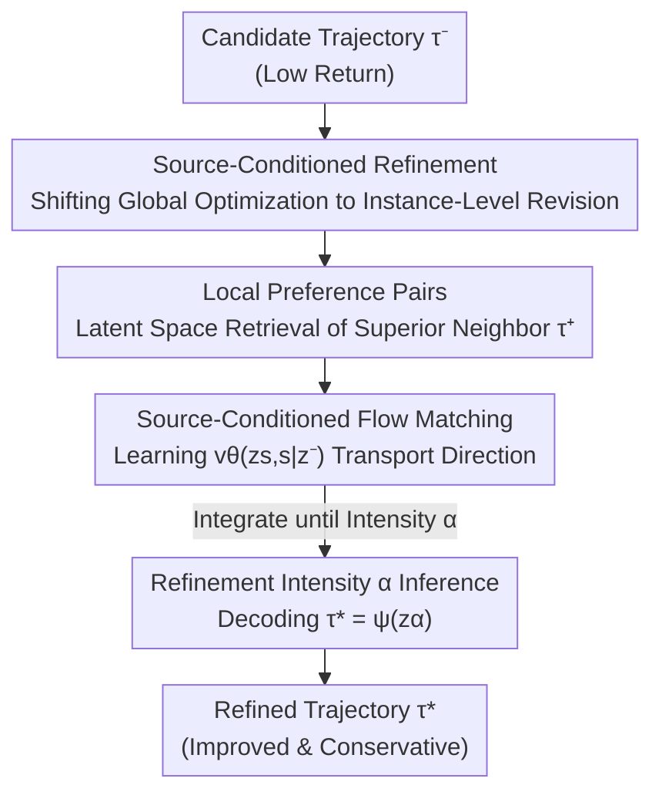

# Counterfactual Transport Flows for Offline Conservative Trajectory Refinement

**Conference**: ICML2026  
**arXiv**: [2606.09115](https://arxiv.org/abs/2606.09115)  
**Code**: To be confirmed  
**Area**: Reinforcement Learning / Offline RL  
**Keywords**: Offline Reinforcement Learning, Trajectory Refinement, Conditional Flow Matching, Counterfactual, Conservatism

## TL;DR
Given a "low-return" candidate trajectory, this paper avoids re-generating actions from scratch. Instead, it retrieves "better" neighbors in the latent trajectory space as weak supervision, learns an "instance-specific" refinement direction using source-conditioned flow matching, and controls the degree of modification via a refinement intensity parameter $\alpha$, enabling a continuous trade-off between "preserving original behavior" and "improving returns."

## Background & Motivation

**Background**: Offline reinforcement learning (offline RL) improves policies using only historical log data. Current approaches mainly fall into two categories: those using value function penalties to constrain policies within the data distribution (CQL, IQL, TD3+BC), and those using diffusion/flow models to directly generate new behaviors (Diffuser, Diffusion-QL). Another line of work utilizes "counterfactual data augmentation" to expand offline data, but these are largely confined to the **single-step transition** level.

**Limitations of Prior Work**: These methods either learn a global policy or a global trajectory distribution, but **none explicitly answer "how this specific low-return trajectory could be modified locally to be better."** Standard RL compresses policies into reactive "state → action" mappings, which are fast but lack interpretability regarding "which specific step's modification led to success."

**Key Challenge**: Global optimization seeks "overall superiority," but evaluating arbitrary new trajectories in an offline setting requires either environment interaction or a reliable dynamics model, both of which are unavailable. Simply replacing a source trajectory with a "better neighbor trajectory" results in excessive deviation from the original behavior (lack of conservatism), leading to unrecognizable modifications. A **trade-off exists between the magnitude of improvement and conservatism**.

**Goal**: Reformulate offline improvement as **source-conditioned trajectory refinement**: given a low-return trajectory $\tau^-$, locally revise it within the data support to a higher-return neighbor $\tau^*$, while maintaining control over the "amount of modification."

**Key Insight**: The authors draw from critiques of world models—purposeful agents should support "hypothetical reasoning about actionable possibilities" rather than being purely reactive. Thus, instead of learning global directions, the model learns local refinement flows **conditioned on the source trajectory itself**. This is fundamentally different from "reward-conditioned generation" (conditioned on a desired return level); the latter generates a high-return trajectory "from thin air," while the former provides "exclusive modification suggestions for your specific trajectory."

**Core Idea**: Use conditional flow matching to learn a vector field "pointing from the source trajectory to its locally superior neighbor," transforming offline improvement into a **controllable, conservative transport** in the latent trajectory space.

## Method

### Overall Architecture
The method employs a pipeline of "encoding → pairing → flow learning → controllable decoding." During training: a trajectory encoder $\phi$ compresses the entire trajectory into a latent vector $z=\phi(\tau)$. For each source trajectory $\tau^-$, a top-$k$ nearest neighbor search is performed in the latent space to select targets $\tau^+$ that are "sufficiently close yet yield higher returns," forming weak preference pairs. Linear interpolation is performed between the latent vectors of these pairs, and flow matching is used to learn a vector field $v_\theta(z_s,s\mid z^-)$ **conditioned on the source $z^-$**. During inference: given a candidate trajectory $\tau^-$, it is encoded, integrated from $z^-$ along the vector field, stopped at refinement intensity $\alpha$ to obtain $\tilde z=z_\alpha$, and finally decoded back into a trajectory $\tau^*$ by the decoder $\psi$. Larger $\alpha$ values indicate more aggressive modifications, while $\alpha=0$ recovers the original trajectory.

### Key Designs

**1. Source-Conditioned Refinement Formulation: Replacing "Global Optimization" with "Local Revision"**

The direct motivation is the aforementioned key challenge—global policy optimization cannot evaluate arbitrary new trajectories offline and fails to show how a single trajectory should be modified. The authors formulate the objective as an ideal "minimum-edit" counterfactual optimization:

$$\tau^*=\arg\min_{\tau'\in\mathcal{T}_{\text{feas}}} d_\tau(\tau',\tau^-)\quad\text{s.t.}\quad R(\tau')\ge R(\tau^-)+\delta$$

That is, selecting the trajectory nearest to the original among all those that remain "behaviorally credible" (within the offline data distribution) and improve the return by at least $\delta$. $R(\tau)$ represents "world feedback" (measurable scalars like return, safety, or success rate), and $d_\tau$ is the trajectory-level deviation. This objective is intractable offline, so it is amortized into a local refinement operator $\tau^*=T_\theta(\tau^-)$ for a single forward pass. The fundamental difference from prior methods is that the condition is the **source trajectory itself** rather than a "desired return value," thus providing instance-specific modification directions.

**2. Local Preference Pairs: Mining Weakly Supervised Counterfactual Targets from Offline Data**

Since $\mathcal{T}_{\text{feas}}$ in the ideal objective cannot be enumerated, this design approximates it using neighbors **actually existing** in the data. For a source trajectory $\tau^-$, a latent space local neighborhood is defined:

$$\mathcal{N}(\tau^-)=\{\tau\in\mathcal{D}: d_\tau(\tau,\tau^-)\le\epsilon\}$$

where $\epsilon$ controls "locality." The nearest target within the neighborhood satisfying the improvement margin is selected: $\tau^+=\arg\min_{\tau\in\mathcal{N}(\tau^-)} d_\tau(\tau,\tau^-)$ s.t. $R(\tau)\ge R(\tau^-)+\delta$, forming the preference pair $(\tau^-,\tau^+)$. These pairs are not true counterfactual optima but **weak supervision**—their validity relies on the assumption that return differences within a neighborhood primarily stem from trajectory-level decision differences rather than unobserved factors. The authors clarify that "counterfactual" here refers to "how things could have been better under the same conditions" in the sense of trajectory refinement, rooted in observational data rather than structural causal models. Constraining candidates to "actually seen neighbors" is the key to ensuring conservatism and avoiding extrapolation.

**3. Source-Conditioned Flow Matching: Learning "Instance Directions" over "Global Drift"**

Once preference pairs are obtained, why not directly train a one-step predictor $z^-\to z^+$? Such a predictor only provides an endpoint, obscuring the intermediate refinement structure and preventing control over modification intensity. This design utilizes continuous transport: for each preference pair, latent vectors are linearly interpolated as $z_s=(1-s)z^-+s z^+,\ s\sim\mathcal{U}(0,1)$, with target velocity $u_s=z^+-z^-$. The vector field is then **conditioned on the source $z^-$** and trained with the flow matching objective:

$$\mathcal{L}_{\text{FM}}=\mathbb{E}_{z^-,z^+,s}\big[\|v_\theta(z_s,s\mid z^-)-(z^+-z^-)\|_2^2\big]$$

The "conditioning on $z^-$" step is critical: it anchors the transport to the "trajectory currently being refined," ensuring the model learns "how to locally revise this specific source" rather than a global average direction "pointing toward high-reward regions." The learned vector field represents the instance-conditioned refinement direction induced by preference pairs, which is neither a reward gradient nor a global optimization target.

**4. Refinement Intensity $\alpha$: A Knob for Continuous Trade-off during Inference**

At inference, only one candidate $\tau^-$ is needed (which could come from a base policy, planner, heuristic controller, sequence model, or even human decision). It is encoded as $z^-$ and integrated starting from $z_0=z^-$ along $\frac{dz_s}{ds}=v_\theta(z_s,s\mid z^-)$, **stopping at $\alpha\in[0,1]$** to obtain $\tilde z=z_\alpha$, which is decoded as $\tau^*=\psi(\tilde z)$. $\alpha=0$ restores the original trajectory, while larger $\alpha$ values move further along the improvement direction. This knob shifts the "amount of modification" from a training-time hardcoding to an inference-time adjustment, allowing users to tune conservatism on the fly—a capability direct neighbor replacement cannot provide (as replacement is discrete and non-gradual). Furthermore, the vector field explicitly traces the path "from source to improved neighbor," naturally providing trajectory-level interpretability by offering counterfactual explanations of how a low-return behavior could have been revised.

### Loss & Training
Training optimizes only the flow matching loss $\mathcal{L}_{\text{FM}}$ (Eq. 2); the trajectory autoencoder $\phi,\psi$ provides the latent space. Only world feedback $R$ is used throughout, **requiring no human preference labels or separately trained reward models**. Main experiments use $k=3$ (number of neighbors, empirically providing the best trade-off between refinement quality and conservatism) and an inference intensity of $\alpha=1.0$.

## Key Experimental Results

### Main Results
Evaluated on AntMaze and MuJoCo (HalfCheetah) trajectories from D4RL, focusing **solely on trajectory refinement quality and flow conservatism without closed-loop policy deployment**. Feedback $\Delta$ measures "return improvement" using an independently trained return predictor on held-out trajectories. Action/Latent Dev measures the deviation before and after refinement (lower is more conservative).

| Method | AntMaze Feedback Δ↑ | AntMaze Action Dev↓ | AntMaze Latent Dev↓ | MuJoCo Feedback Δ↑ | MuJoCo Action Dev↓ | MuJoCo Latent Dev↓ |
|------|------|------|------|------|------|------|
| Nearest improved Neighbor | +62.50 | 1.83 | 38.70 | +1050.30 | 2.14 | 42.50 |
| Random improved Trajectory | +117.50 | 2.18 | 62.50 | +1820.40 | 2.56 | 68.20 |
| Non-local Flow Matching | −11.48 | 1.89 | 57.30 | −210.70 | 1.92 | 52.10 |
| **Ours ($k=3$)** | **+69.44** | **1.41** | **27.00** | **+1180.20** | **1.58** | **31.40** |

Key takeaway: The direct replacement baseline (Random improved) achieves higher "raw return improvement" (AntMaze +117.50) but suffers from the highest deviation (Action 2.18 / Latent 62.50), indicating that "replacement with superior neighbors" is not conservative. Ours achieves the **lowest Action and Latent Deviation** across both domains while maintaining substantial positive return improvements, yielding the best "improvement-deviation" trade-off.

### Ablation Study

| Configuration | Function | Observation |
|------|------|------|
| Ours ($k=3$) | Local + Source-conditioned + Continuous | Positive improvement, lowest deviation, best trade-off |
| Random improved Trajectory | No "nearest neighbor target selection" | Large improvement but spikes in deviation; non-conservative |
| Non-local Flow Matching | No locality constraint in target construction | Returns actually decrease (AntMaze −11.48), deviation remains high |

### Key Findings
- **Locality is the prerequisite for stable refinement directions**: Non-local Flow Matching, despite also being source-conditioned, results in negative returns (−11.48 / −210.70) when locality constraints are removed, suggesting that globally averaged transport dynamics fail to learn stable directions.
- **Conservatism stems from "neighbor targets + source conditioning" rather than the flow model itself**: Random superior targets high deviation even within a flow framework, proving that "selecting the nearest superior neighbor" contributes most to conservatism.
- $k=3$ is optimal for the quality-conservatism trade-off (Appendix Table 2); larger $\alpha$ leads to stronger modifications (Appendix Table 3), allowing for demand-based tuning.

## Highlights & Insights
- **Reframing "Improvement" as "Transport"**: It doesn't generate or replace; it "transports" the trajectory slightly along the learned vector field. The $\alpha$ knob makes conservatism continuously tunable—a concept transferable to any sequence decision scenario requiring "small revisions to existing candidates" (e.g., treatment plans, combinatorial configurations, recommendation sequences).
- **Zero Reward Model, Zero Human Annotation**: Supervision is derived entirely from weak preference pairs constructed from historical world feedback, avoiding reward model errors and annotation costs. This is particularly useful in domains like healthcare or finance where feedback is naturally measurable.
- **Natural Interpretability**: The vector field maps the explicit path from source to improved neighbor, providing counterfactual "how to change" explanations that most offline RL methods lack.

## Limitations & Future Work
- **Non-Closed-Loop Evaluation**: Feedback $\Delta$ is measured via a return predictor on held-out trajectories without environment interaction to verify if the refined trajectories are executable or yield improvements under real dynamics—predictor errors might mask extrapolation risks.
- **Strong Weak-Supervision Assumption**: Relies on return differences in neighborhoods being caused by decisions rather than unobserved factors; this assumption may fail in high-stochasticity environments.
- **Latent Space Dependency**: Retrieval, pairing, and transport occur entirely in the autoencoder's latent space; if the encoder is poorly trained, both the neighborhood and directions become unreliable.
- **Future Directions**: Replacing the return predictor with an ensemble for uncertainty estimation, down-weighting high-variance neighborhoods, or introducing closed-loop rollouts for secondary validation.

## Related Work & Insights
- **vs. Constraint-based Offline RL (CQL / IQL / TD3+BC)**: These learn global policies with penalties on out-of-distribution actions; Ours learns local refinement directions for single trajectories, offering interpretability and controllable modification intensity.
- **vs. Generative Offline RL (Diffuser / Diffusion-QL)**: These generate full trajectory distributions from noise; Ours performs conservative transport conditioned on a source trajectory, focusing on "small revisions" rather than "generation from scratch."
- **vs. Counterfactual Data Augmentation (CoDA, etc.)**: These create counterfactual samples at the transition level; Ours performs counterfactual refinement at the **entire trajectory** level.
- **vs. Reward-conditioned Generation (Decision Transformer)**: These are conditioned on "desired return levels"; Ours is conditioned on the "source trajectory itself," providing instance-specific guidance rather than "generic high-reward" behaviors.

## Rating
- Novelty: ⭐⭐⭐⭐⭐ Formulating offline improvement as "source-conditioned trajectory transport + controllable intensity" is a unique and interpretable perspective.
- Experimental Thoroughness: ⭐⭐⭐ Limited to two domains (AntMaze/MuJoCo) and lacks closed-loop evaluation; small scale.
- Writing Quality: ⭐⭐⭐⭐ Clear motivation and formulas; the trade-off argumentation is sound.
- Value: ⭐⭐⭐⭐ The "refining existing candidates" paradigm has significant practical potential in scenarios with measurable feedback like healthcare, finance, or recommendations.

<!-- RELATED:START -->

## Related Papers

- [\[ICML 2026\] Offline Reinforcement Learning with Generative Trajectory Policies](offline_reinforcement_learning_with_generative_trajectory_policies.md)
- [\[ICLR 2026\] Trajectory Generation with Conservative Value Guidance for Offline Reinforcement Learning](../../ICLR2026/reinforcement_learning/trajectory_generation_with_conservative_value_guidance_for_offline_reinforcement.md)
- [\[ICML 2026\] Beyond the Proxy: Trajectory-Distilled Guidance for Offline GFlowNet Training](beyond_the_proxy_trajectory-distilled_guidance_for_offline_gflownet_training.md)
- [\[ICML 2026\] Video-Based Optimal Transport for Feedback-Efficient Offline Preference-Based Reinforcement Learning](video-based_optimal_transport_for_feedback-efficient_offline_preference-based_re.md)
- [\[ICLR 2026\] Peng's Q($\lambda$) for Conservative Value Estimation in Offline Reinforcement Learning](../../ICLR2026/reinforcement_learning/pengs_qlambda_for_conservative_value_estimation_in_offline_reinforcement_learnin.md)

<!-- RELATED:END -->
