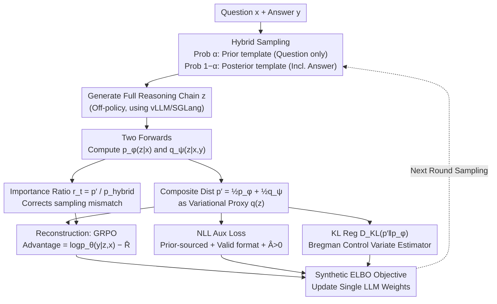

# Coupled Variational Reinforcement Learning for Language Model General Reasoning

**Conference**: ICML 2026  
**arXiv**: [2512.12576](https://arxiv.org/abs/2512.12576)  
**Code**: https://github.com/wenxueru/CoVRL  
**Area**: LLM Reasoning / Reinforcement Learning / Variational Inference / Verifier-free RL  
**Keywords**: Variational RL, Prior/Posterior Coupling, Hybrid Sampling, GRPO, Verifier-free Reward  

## TL;DR
CoVRL reformulates verifier-free RL, which uses answer probabilities as rewards, as a variational inference problem. It constructs a composite distribution—"prior (question only) + posterior (question with answer)"—and optimizes both simultaneously via hybrid sampling and importance weighting. This approach improves Qwen2.5-7B by an average of 12.4% across 9 general and mathematical reasoning benchmarks compared to the base model, outperforming the strongest verifier-free baseline by an additional 2.3%.

## Background & Motivation

**Background**: Training paradigms represented by RLVR (RL with Verifiable Reward) + GRPO have enabled LLMs to make significant progress in tasks with rule-based verifiers, such as mathematics and code. However, these methods cannot be directly applied to domains lacking reliable formal verifiers, such as chemical reactions, open-ended QA, and general reasoning.

**Limitations of Prior Work**: To bypass verifiers, verifier-free methods (VeriFree, JLB, LaTRO, RLPR) use the "log-probability of the LLM generating the reference answer" as a reward. They treat the reasoning chain $z$ as a latent variable and optimize the marginal likelihood $p(y|x)=\int p(y|z,x)p(z|x)\,dz$. **The problem is**: these methods only sample reasoning chains from the **prior $p_\phi(z|x)$ (conditioned only on the question)**. This leads to two chronic issues: (1) low sampling efficiency on difficult problems where the model cannot initially generate reasonable reasoning chains; (2) "uncoupled" reasoning where the logic is correct but the final answer format differs from the ground-truth, resulting in low scores.

**Key Challenge**: If a VAE-style posterior $q_\psi(z|x,y)$ (generating reasoning chains while observing the answer) is used during training, efficiency and answer alignment are high. However, the answer is unavailable during inference, leading to a **training-inference distribution mismatch**. Furthermore, the reverse KL divergence $D_{\mathrm{KL}}(q_\psi\|p_\phi)$ **only forces the posterior to avoid low-probability regions of the prior, without guaranteeing coverage of the prior's high-probability regions**, which can cause inference to collapse into unknown regions.

**Goal**: To find a sampling distribution that is both efficient and transferable without introducing external verifiers, ensuring that training reasoning chains are guided by answers without deviating from the true distribution encountered during inference.

**Key Insight**: Instead of choosing between the prior and the posterior, it is better to **construct a composite distribution $p'(z|x,y)=\tfrac12 p_\phi(z|x)+\tfrac12 q_\psi(z|x,y)$** that equally weights both at the token level, and subsequently optimize the corresponding ELBO. This allows both the "answer guidance" of the posterior and the "inference consistency" of the prior to be injected into the gradients simultaneously.

**Core Idea**: Use the "prior/posterior mixed composite distribution" as a variational proxy $q(z)$, coupled with offline hybrid sampling (randomly switching between two prompt templates with probability $\alpha$) and importance weighting. This seamlessly integrates variational inference and RL within a single LLM.

## Method

### Overall Architecture
CoVRL treats the reasoning chain $z$ as a latent variable connecting the question $x$ and the answer $y$, reformulated as $\log p(y|x)\ge \mathbb{E}_{q(z)}[\log p_\theta(y|z,x)]-D_{\mathrm{KL}}(q(z)\|p_\phi(z|x))$ (ELBO). While previous work sets $q=p_\phi$ (the prior itself), CoVRL sets $q=p'$ (the composite distribution), using GRPO to optimize the reconstruction term and a Schulman-style KL estimator for the regularization term. The three distributions $p_\phi(z|x)$, $q_\psi(z|x,y)$, and $p_\theta(y|z,x)$ share the same LLM weights, differentiated only by prompt templates (the prior template contains only the question, while the posterior template includes the answer in the assistant prompt), forming a "single-model, multi-role" variational RL loop.

### Key Designs

**1. Composite Distribution $p'(z|x,y)$ as Variational Proxy: Binding answer guidance and inference consistency into one ELBO**

Verifier-free methods typically sample reasoning chains only from the prior $p_\phi(z|x)$; they fail on hard problems and suffer from reasoning-answer misalignment. Conversely, training purely on a VAE-style posterior $q_\psi(z|x,y)$ causes a training-inference mismatch because the answer is missing at inference time, and reverse KL does not guarantee coverage of the prior's space. CoVRL avoids this trade-off by constructing a token-level equal-weighted mixture $p'(z_t|z_{<t},x,y)=\tfrac12 p_\phi(z_t|z_{<t},x)+\tfrac12 q_\psi(z_t|z_{<t},x,y)$ as the proxy $q(z)$ in the ELBO. The gradient of the reconstruction term $\mathbb{E}_{p'}[\log p_\theta(y|z,x)]$ flows back to both the prior and posterior, while the KL term $D_{\mathrm{KL}}(p'\|p_\phi)$ pulls the entire composite distribution toward the prior. High-quality posterior trajectories "nourish" the prior, while the prior's coverage constraints the posterior, aligning the VAE's $q$ and the RL's $\pi$ in the same coordinate system.

**2. Off-policy Hybrid Sampling + Importance Weighting: Mathematically closing distribution mismatch via prompt switching**

Sampling directly from $p'$ would require token-level mixing, which is computationally expensive and incompatible with vLLM/SGLang. CoVRL instead employs hybrid sampling: generating full trajectories using a prior template with probability $\alpha$ and a posterior template with $1-\alpha$. This results in $p_{\text{hybrid}}(z|x,y)=\alpha p_\phi+(1-\alpha)q_\psi$. For each trajectory, two forward passes calculate $p_\phi(z|x)$ and $q_\psi(z|x,y)$ to derive $p'$ and $p_{\text{hybrid}}$. The token ratio in the GRPO loss, $r_t=p'_{\text{new}}(z_t|\cdot)/p_{\text{hybrid}}(z_t|\cdot)$, eliminates the mismatch between the actual sampling distribution and the target composite distribution. The advantage $\hat A=\log p_{\theta_{\text{old}}}(y|z,x)-\bar R$ uses the model's own log-probability of the answer as the reward. This allows for biased estimation of the mixture distribution through simple prompt switching while reusing existing frameworks for batch inference. An auxiliary NLL loss on "positive advantage trajectories from the prior" further stabilizes training.

**3. Bregman Control Variate KL Estimator: Ensuring KL is unbiased, non-negative, and stable**

Standard $\log\tfrac{p'}{p_\phi}$ estimators exhibit extremely high variance and can become negative under hybrid sampling, causing training instabilities. CoVRL extends Schulman's low-variance KL estimator into two components based on the sample source: $D_{\mathrm{KL}}^{\text{prior}}=\tfrac{p'}{p_\phi}\log\tfrac{p'}{p_\phi}-\tfrac{p'}{p_\phi}+1$ for prior samples, and $D_{\mathrm{KL}}^{\text{posterior}}=\tfrac{p'}{q_\psi}\log\tfrac{p'}{p_\phi}+\tfrac{p'}{q_\psi}-1$ for posterior samples. Both utilize a Bregman correction term $\left(\tfrac{p'}{p_{\text{hybrid}}}-1\right)$; since $\mathbb{E}_{p_{\text{hybrid}}}[\cdot]=0$, the estimator is unbiased and remains non-negative, preventing gradient explosions. This, combined with soft-clipping of importance ratios and skipping KL for max-length samples, provides the necessary stability for CoVRL.

### Loss & Training
The reconstruction term uses GRPO for policy gradients (with PPO-style clipping, $\epsilon=0.3$), while the KL term is added as an independent loss (more stable than including it in the reward). Qwen2.5-7B-Base is fine-tuned directly without SFT; batch size is 192 queries with 8 rollouts each. Training utilizes a cosine LR schedule with 64 warmup steps, a peak LR of 1e-6, temperature 1.0, and `max_tokens=2048`. For Qwen3-base, `<think>` tokens are replaced with `<thinking>` to match model preferences.

## Key Experimental Results

### Main Results
CoVRL was compared against all verifier-free RL baselines on 9 general and mathematical reasoning benchmarks. All methods were trained on Qwen2.5-7B-Base using GRPO with identical hyperparameters:

| Method | GPQA | MMLU-Pro | TheoremQA | AIME'24 | MATH-500 | Minerva | SAT-Math | Overall |
|---|---|---|---|---|---|---|---|---|
| Base Model | 26.1 | 36.7 | 25.2 | 2.7 | 44.7 | 18.6 | 76.5 | 37.8 |
| VeriFree | 28.9 | 44.1 | 33.4 | 5.0 | 59.5 | 24.0 | 93.3 | 47.1 |
| JLB | 31.6 | 42.7 | 31.9 | 4.8 | 57.6 | 23.6 | 93.7 | 46.5 |
| LaTRO | 31.0 | 42.7 | 32.8 | 4.0 | 59.3 | 24.4 | 90.1 | 44.7 |
| RAVR | 30.2 | 44.5 | 34.8 | 6.3 | 61.2 | 23.3 | 94.1 | 47.8 |
| RLPR | 31.3 | 44.9 | 33.5 | 6.5 | 61.2 | 24.7 | 93.8 | 47.9 |
| **CoVRL (Ours)** | **30.4** | **46.5** | **36.3** | **7.5** | **66.3** | **25.5** | **97.1** | **50.2** |

CoVRL shows an average improvement of 12.4% over the base model and 2.3% over the strongest baseline (RLPR), with particularly significant gains on benchmarks requiring long-chain reasoning like SAT-Math, MATH-500, and TheoremQA.

### Ablation Study

| Experiment | Setup | Key Observation | Explanation |
|---|---|---|---|
| Model Scale | Qwen2.5-7B → 14B | Overall: +12.4% → +14.0% | Gains scale with model size. |
| Model Family | Qwen3-8B / Qwen3-14B | +8.6% / +5.4% resp. | Consistent gains across different base families. |
| Training Data | Non-Math Only | Math benchmarks still +21.6% (MATH-500) | Non-math reasoning transfers to math tasks. |
| Training Data | Math Only | Non-math still +6.0% (MMLU-Pro) | Math training improves general reasoning. |
| Mix Ratio $\alpha$ | 0.1 / 0.5 / 0.9 | $\alpha=0.5$ is optimal | Balanced sampling validates two-way coupling. |

### Key Findings
- **The posterior consistently yields higher reward curves than the prior** (Figure 4a), proving that generating reasoning chains after seeing the answer is a more efficient source of exploration. The simultaneous rise in prior rewards demonstrates successful transfer to the inference distribution.
- **Response length grows monotonically with training**, as CoVRL encourages the spontaneous generation of detailed CoTs, a behavior difficult to achieve through simple SFT.
- **Cross-domain transferability**: Training only on non-mathematical data boosted MATH-500 to 66.3%, strongly suggesting that CoVRL learns general reasoning patterns rather than domain-specific templates.
- At $\alpha=0.9$ (near pure prior), the model fails to earn rewards and minimizes KL by shortening chains; at $\alpha=0.1$ (near pure posterior), longer chains are generated, but distribution mismatch degrades performance compared to $\alpha=0.5$.

## Highlights & Insights
- **First formal token-level integration of verifier-free RL and variational inference**: Unlike previous works that treat chains as independent samples or use two-model IWAE+EM pipelines, CoVRL binds prior and posterior into one model and one ELBO via two prompt templates.
- **Portable engineering solution**: The hybrid sampling + importance ratio approach is highly portable, requiring no modifications to vLLM and providing a general recipe for any RL scenario involving training-inference distribution mismatch.
- **Log-probability as endogenous reward**: Reusing $\log p_\theta(y|z,x)$ as both the reward and objective eliminates the need for independent reward models and their associated deployment costs or reward hacking risks.
- **Geometric intuition of consistency**: The composite distribution $p'$ places $p_\phi$ in the denominator, and KL regularization pulls $p'$ toward $p_\phi$. This acts like a "spring" anchoring the posterior to the prior's high-probability regions, leveraging the posterior's strength without drifting away from the true inference distribution.

## Limitations & Future Work
- **Double forward passes per trajectory** (one for prior, one for posterior) approximately doubles the training compute cost compared to pure-prior methods. The cost-effectiveness at larger scales was not explicitly compared via FLOPs.
- Rewards derived from the model's own log-probabilities **may still suffer from reward hacking or self-reinforcement of systematic biases**; this risk is acknowledged but not quantified.
- The mixing ratio $\alpha$ is a fixed global hyperparameter. The optimality of $\alpha=0.5$ is an empirical observation without a theoretical or adaptive selection scheme.
- Experiments were limited to 14B models and 4K context. **Performance in long-context reasoning, multi-step tool use, or agentic scenarios remains unverified**.

## Related Work & Insights
- **vs VeriFree / RLPR / JLB**: These prior-only methods suffer from low exploration efficiency and misalignment; CoVRL gains guidance from the posterior.
- **vs LaTRO**: While LaTRO first treated reasoning as a latent variable, CoVRL extends this by introducing dual-distribution coupling via composite distributions.
- **vs RAVR**: RAVR pioneered posterior sampling but lacked a coupling mechanism with the prior; CoVRL explicitly closes the mismatch gap.
- **vs Zhou et al. (2025b)**: Their IWAE+EM scheme uses two independent models; CoVRL's single-model RL approach is significantly lighter to deploy.
- **vs Classical VAE**: CoVRL essentially replaces the variational $q_\phi$ with a "prior/posterior mixture," providing a general formula for replacing explicit reparameterization with RL in discrete text generation.

## Rating
- Novelty: ⭐⭐⭐⭐⭐ A clean integration of variational inference and verifier-free RL via composite distributions and importance weighting.
- Experimental Thoroughness: ⭐⭐⭐⭐ Strong evidence across 9 benchmarks and 4 models; however, lacks direct comparisons with RLVR or detailed KL estimator baselines.
- Writing Quality: ⭐⭐⭐⭐⭐ Rigid derivations, well-connected motivation-method-experiment, and highly clear conceptual diagrams.
- Value: ⭐⭐⭐⭐ Provides a high-sample-efficiency training paradigm for reasoning tasks without verifiers, portable to RLHF and agentic workflows.

<!-- RELATED:START -->

## Related Papers

- [\[ICLR 2026\] Buffer Matters: Unleashing the Power of Off-Policy Reinforcement Learning in Large Language Model Reasoning](../../ICLR2026/reinforcement_learning/buffer_matters_unleashing_the_power_of_off-policy_reinforcement_learning_in_larg.md)
- [\[ICML 2026\] Break the Block: Dynamic-size Reasoning Blocks for Diffusion Large Language Models via Monotonic Entropy Descent with Reinforcement Learning](break_the_block_dynamic-size_reasoning_blocks_for_diffusion_large_language_model.md)
- [\[ICML 2026\] d2: Improving Reasoning in Diffusion Language Models via Trajectory Likelihood Estimation](d2_improving_reasoning_in_diffusion_language_models_via_trajectory_likelihood_es.md)
- [\[AAAI 2026\] Vision-Language Reasoning for Geolocalization: A Reinforcement Learning Approach](../../AAAI2026/reinforcement_learning/vision-language_reasoning_for_geolocalization_a_reinforcement_learning_approach.md)
- [\[ICML 2026\] The Shape of Reasoning: Topological Analysis of Reasoning Traces in Large Language Models](the_shape_of_reasoning_topological_analysis_of_reasoning_traces_in_large_languag.md)

<!-- RELATED:END -->
## Related Papers

- [\[ICML 2026\] Break the Block: Dynamic-size Reasoning Blocks for Diffusion Large Language Models via Monotonic Entropy Descent with Reinforcement Learning](break_the_block_dynamic-size_reasoning_blocks_for_diffusion_large_language_model.md)
- [\[ICML 2026\] d2: Improving Reasoning in Diffusion Language Models via Trajectory Likelihood Estimation](d2_improving_reasoning_in_diffusion_language_models_via_trajectory_likelihood_es.md)
- [\[AAAI 2026\] Vision-Language Reasoning for Geolocalization: A Reinforcement Learning Approach](../../AAAI2026/reinforcement_learning/vision-language_reasoning_for_geolocalization_a_reinforcement_learning_approach.md)
- [\[ICML 2026\] The Surprising Difficulty of Search in Model-Based Reinforcement Learning](the_surprising_difficulty_of_search_in_model-based_reinforcement_learning.md)
- [\[ICML 2026\] InftyThink+: Effective and Efficient Infinite-Horizon Reasoning via Reinforcement Learning](inftythink_effective_and_efficient_infinite-horizon_reasoning_via_reinforcement_.md)

<!-- RELATED:END -->
