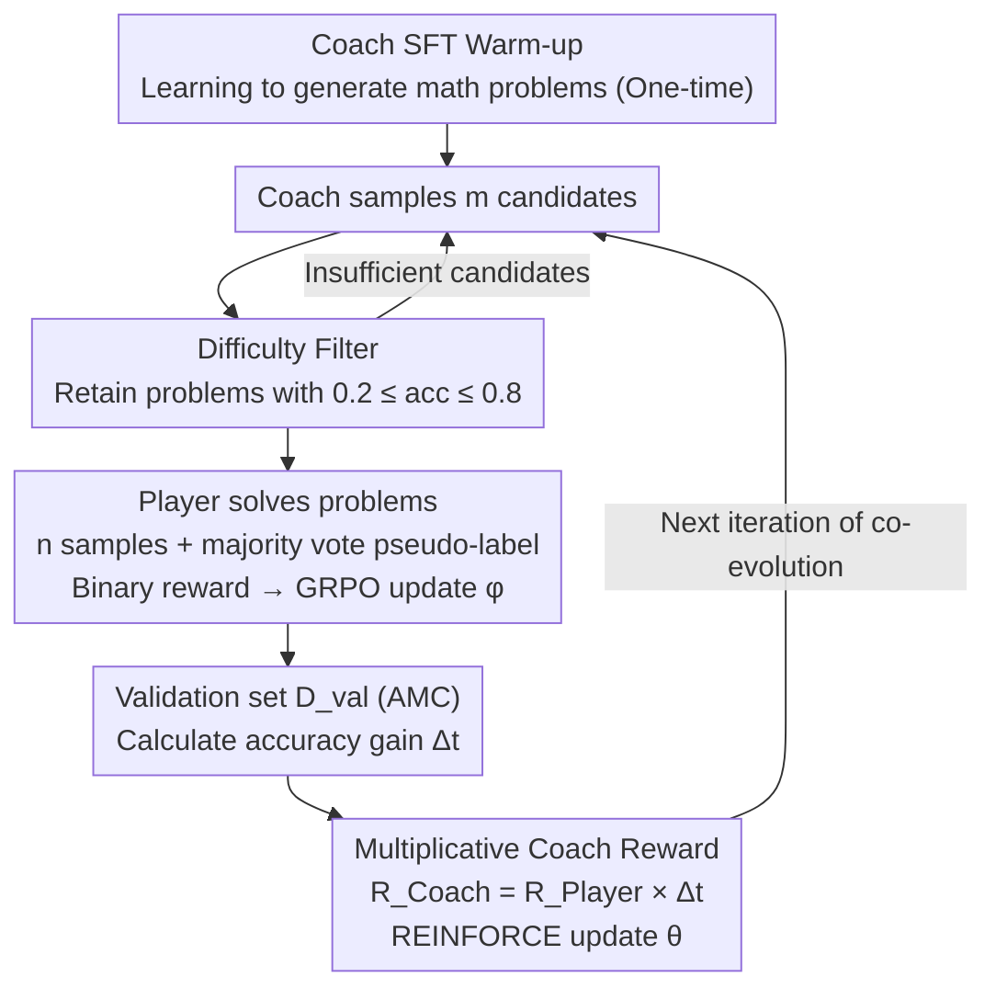

# CPMöbius: Iterative Coach–Player Reasoning for Data-Free Reinforcement Learning

**Conference**: ICML 2026  
**arXiv**: [2602.02979](https://arxiv.org/abs/2602.02979)  
**Code**: https://github.com/thunlp/CPMobius  
**Area**: LLM Reasoning / Reinforcement Learning / Self-play  
**Keywords**: Data-Free RL, Coach-Player, Curriculum Generation, GRPO, Multi-agent Collaboration

## TL;DR
The adversarial nature of self-play is replaced with "collaboration": a Coach generates problems, a Player solves them, and the Coach receives a reward based on "Player improvement $\times$ Player success rate." Without any external training data, Qwen2.5-Math-7B-Instruct achieves an average score increase of +4.9 and an OOD gain of +5.4 across six math benchmarks, outperforming existing unsupervised methods like RENT and R-Zero.

## Background & Motivation
**Background**: Enhancing LLM reasoning typically relies on SFT + RLVR (Reinforcement Learning with Verifiable Rewards) through repeated fine-tuning on high-quality human-annotated datasets. Models like OpenAI o1 and DeepSeek-R1 depend on massive math and code datasets. Self-play offers a new direction by generating training signals within the model itself to achieve "data-free" training. Representative works like R-Zero and AbsoluteZero mostly adopt adversarial settings where one party generates difficult problems to challenge the other.

**Limitations of Prior Work**: (1) Adversarial self-play is highly unstable, as the proposer tends to generate meaningless or unlearnable problems (collapse) to "defeat" the Player; R-Zero fails to train effectively on OpenMath-Nemotron. (2) Pure entropy minimization methods (RENT) use the model's own confidence as a reward, which lacks external progress signals and yields limited improvements (only +3.4 on Qwen2.5-Math-7B). (3) Most self-play works lack explicit curriculum signals, leading to random difficulty drifting.

**Key Challenge**: Self-play aims to be "open, adaptive, and always within the zone of proximal development," but adversarial mechanisms inherently create tension where "Coach gain = Player failure," leading to degradation. Conversely, purely unsupervised methods lack progress metrics and are easily deceived by their own internal confidence.

**Goal**: To find a self-play paradigm that does not rely on external data but produces stable, learnable, and monotonically increasing curricula to continuously improve Player reasoning.

**Key Insight**: Inspired by the human coach-player relationship (where a coach's reward comes from the player's growth rather than defeating them), the authors design the proposer and solver to be collaborative rather than adversarial. The Coach's reward is directly tied to the Player's "improvement margin." Generating problems that simply "stump" the Player yields no reward, mechanically eliminating collapse.

**Core Idea**: A "multiplicative reward" $R^{\text{Coach}}_i = R^{\text{Player}}_i \cdot \Delta_t$ is used so that the Coach simultaneously pursues "problems solved by the Player + overall Player capability growth," shifting self-play from zero-sum to positive-sum.

## Method

### Overall Architecture
CPMöbius allows two independent policies, $\pi_\theta^{\text{C}}$ (Coach) and $\pi_\phi^{\text{P}}$ (Player), to co-evolve in an iterative loop. After a one-time **Coach SFT Warm-up**, the main loop begins: (1) The Coach samples $m$ candidate problems, which pass through a **Difficulty Filter** that retains only problems with a Player success rate in $[0.2, 0.8]$; if insufficient, it resamples immediately. (2) For each retained problem, the Player samples $n$ solutions, determines pseudo-labels $y_i^*$ via majority voting, calculates binary rewards and GRPO advantages for each solution, and updates $\phi$. (3) The accuracy difference $\Delta_t$ on a fixed small validation set $\mathcal{D}_{\text{val}}$ (AMC) is calculated as the "learning progress" signal. (4) The Coach is updated via REINFORCE using the **multiplicative reward** $R^{\text{Coach}}_i = R^{\text{Player}}_i \cdot \Delta_t$, and the cycle returns to step (1). After the initial warm-up, the entire loop never touches external problem sets.

### Key Designs

**1. Multiplicative Coach Reward: Preventing collapse by avoiding "too hard" and "too easy" problems**

The fatal flaw of adversarial self-play is that the proposer's gain is the solver's failure—to defeat the Player, the Coach generates increasingly esoteric and eventually meaningless or unlearnable problems (collapse). CPMöbius redefines the Coach reward as a product $R^{\text{Coach}}_i = R^{\text{Player}}_i \cdot \Delta_t$. The first factor $R^{\text{Player}}_i = \frac{1}{n}\sum_j r_{i,j}$ represents the Player's success rate on that problem, while the second factor $\Delta_t = \text{Acc}_{\text{val}}(\pi_{\phi_{t+1}}^{\text{P}}) - \text{Acc}_{\text{val}}(\pi_{\phi_t}^{\text{P}})$ is the actual accuracy improvement on the validation set. This operates as an "AND" logic—if the problem is too hard (unsolvable), $R^{\text{Player}}=0$; if the problem yields no progress, $\Delta_t \le 0$. If either factor is zero or negative, the reward collapses to zero or becomes a penalty. Thus, the Coach is forced to produce problems that are solvable yet push the Player's overall capability forward, shifting the mechanism from zero-sum competition to positive-sum collaboration. Furthermore, the external signal $\Delta_t$ provides a more reliable estimate of progress than RENT's internal confidence.

**2. Difficulty Filter: Anchoring training samples in the Player's Zone of Proximal Development**

In GRPO, batches with rewards that are all 0 or all 1 result in zero advantages and vanishing gradients. Therefore, "known problems" and "impossible problems" are uninformative for training. The difficulty filter performs a cheap rollout before submitting problems: for each candidate $x_i$, the Player runs $n$ times to calculate majority voting accuracy $acc_i = \frac{1}{n}\sum_j \mathbb{I}[y_{i,j} = y_i^*]$. Only problems within the $[0.2, 0.8]$ range are kept; outliers are discarded and resampled until $m$ valid problems are collected. This ensures every batch falls into the "active attempt and partial success" zone, guaranteeing non-empty training signals for GRPO and blocking extreme Coach-generated problems. This aligns with the human intuition of curriculum learning—staying slightly above current ability.

**3. Coach SFT Warm-up: Teaching "how to teach" before co-evolution**

Using a base model directly as a Coach results in ambiguous or unsolvable problems, which causes the $\Delta_t$ signal to explode with noise and destabilizes the loop. CPMöbius conducts a lightweight SFT on the Coach using 4K PRIME Eurus-2-RL-Data entries before co-evolution. This trains the basic "teaching" skill of generating well-formatted, diagnostic math problems without exposing the model to validation or test sets. The paper strictly defines "data-free" as the co-evolution phase—the warm-up injects the *skill* of problem generation rather than *mathematical knowledge*. Ablation studies show that removing the warm-up (w/o Coach Warm-up) drops performance from 28.8 to 23.7 (−5.1), the largest impact among all modules, proving it is essential for a stable start.

### Loss & Training
The Player uses GRPO: for each problem's $n$ solutions, the advantage $A_{i,j} = (r_{i,j} - \text{mean})/\text{std}$ is calculated, and updates are performed within a trust region. The Coach uses REINFORCE: $\nabla_\theta J = \frac{1}{m}\sum_i R^{\text{Coach}}_i \nabla_\theta \log \pi_\theta^{\text{C}}(x_i)$. The validation set is fixed to AMC (moderate difficulty, neither saturated nor sparse). Experiments also verify robustness using Minerva and OlympiadBench. All training is implemented in the `verl` framework using 4–8 A800-80GB GPUs, with batch size 16 and rollout size 16.

## Key Experimental Results

### Main Results
Evaluated on four bases (Qwen2.5-Math-1.5B / OpenMath-Nemotron-1.5B / OctoThinker-3B-Hybrid-Zero / Qwen2.5-Math-7B-Instruct) across six benchmarks (AMC + AIME 2024/2025 + Minerva + MATH + Olympiad).

| Base / Method | Avg | OOD Avg | Minerva | MATH | Olympiad |
|---------------|-----|---------|---------|------|----------|
| Qwen2.5-Math-1.5B base | 23.3 | 19.8 | 16.3 | 56.2 | 23.4 |
| + R-Zero (Iter 3) | 27.1 | 24.7 | 19.3 | 62.4 | 26.8 |
| + RENT | 27.1 | 24.7 | 19.0 | 62.2 | 27.1 |
| **+ CPMöbius** | **28.8** | **26.8** | **28.0** | **63.1** | 26.9 |
| Qwen2.5-Math-7B-Instruct base | 35.8 | 33.0 | 34.6 | 78.0 | 37.4 |
| + RENT | 39.2 | 37.6 | 38.8 | 83.8 | 38.8 |
| **+ CPMöbius** | **40.7** | **38.4** | **44.9** | **84.2** | 38.3 |

The most significant improvement is seen in Minerva: Qwen-1.5B improves 16.3→28.0 (+71.8%) and Qwen-7B improves 34.6→44.9 (+29.8%), demonstrating that capabilities trained on AMC generalize well to OOD math domains. R-Zero completely failed on OpenMath-Nemotron-1.5B (marked "–" in the table), while CPMöbius still pushed it from 59.5 to 62.1.

### Ablation Study

| Configuration | Avg | OOD Avg | Key Finding |
|------|-----|---------|----------|
| Full CPMöbius | 28.8 | 26.8 | Full framework |
| w/o Coach Update | 25.3 | 23.1 | Degenerates to a static curriculum, -3.5 |
| w/o Coach Warm-up | 23.7 | 21.2 | Poor problem quality from base model, -5.1 |
| w/o Instruction Filter | 24.9 | 22.5 | High gradient noise for GRPO without filtering, -3.9 |

### Key Findings
- All three ablation modules are indispensable, with Coach Warm-up having the largest impact (–5.1). Difficulty filtering (–3.9) and Coach Update (–3.5) follow, indicating each part of the collaboration mechanism contributes significantly.
- Training dynamics: Player response consistency decreases monotonically (as the Coach generates harder problems), while problem length increases and Player response length decreases—showing simultaneous improvements in curriculum difficulty and solution efficiency.
- Shifting the validation set from AMC to Minerva or OlympiadBench still yields improvements, proving the collaboration is not simply "AMC data leakage."
- CPMöbius provides a +4.9 gain on the already RL-optimized Qwen-7B-Instruct and +2.6 on OpenMath-Nemotron (SFT with 5.5M samples), showing it can break through the ceiling of existing training paradigms.

## Highlights & Insights
- **Multiplicative Reward = Mathematical elimination of collapse**: This is the cleanest design in the paper—binding local signals (solvability) with global signals (progress) through a scalar product. This approach can be directly transferred to code or any reasoning task where "process capability is verifiable."
- **AMC as a high-ROI signal source for $\Delta_t$**: A difficulty band that is neither saturated nor sparse provides the Coach with "high-signal, low-variance" feedback. Selecting a benchmark as a reward proxy is a notable strategy.
- **Honest "Data-free" definition**: The paper explicitly separates warm-up from the "data-free" claim. This terminological restraint is rare in self-play research and serves as a reminder to check for "initialization data leakage."
- **No reward model**: Relying entirely on verifiable rewards (correctness) + validation accuracy gain avoids reward hacking common in RLHF, although it limits the scope to tasks with programmable verifiers.

## Limitations & Future Work
- The method depends on "verifiable answers," verified currently only for math. Extending to code, theorem proving, or long-form writing requires re-designing verifiers.
- The AMC validation set has only ~40 problems, making the $\Delta_t$ signal coarse and noisy, which causes noticeable training curve fluctuations. Using ensembles of validation sets or EWMA smoothing could be explored.
- The Coach and Player share the same origin (same base). The potential for heterogeneous architectures (e.g., a larger model as a Coach) has not been explored.
- Training cost: Training two models (Coach + Player) on 4–8 A800 GPUs is resource-intensive. The paper does not directly address whether this is more efficient than SFT on high-quality data of equivalent computational cost.

## Related Work & Insights
- **vs R-Zero (Adversarial self-play)**: R-Zero collapses on OpenMath-Nemotron by trying to outsmart the solver. CPMöbius improves across all four bases, showing collaboration is more robust than competition when dealing with unlearnable content.
- **vs RENT (Entropy minimization)**: RENT uses self-confidence as a reward (+3.4 on Qwen-7B), whereas CPMöbius (+4.9) shows that external progress signals are more reliable than internal confidence.
- **vs SFT on curated data**: CPMöbius outperforms base + RENT/R-Zero without external problem sets, offering a "zero-data RL" solution for labs with high GPU capacity but limited human-annotated data.
- **vs RLHF**: While both use RL to optimize policies, CPMöbius requires neither a reward model nor human preference data, providing a self-play template for verifiable tasks.

## Rating
- Novelty: ⭐⭐⭐⭐ Collaborative self-play + multiplicative rewards is a clean, original design, though difficulty filters and progress metrics have precedents. The integration is elegant.
- Experimental Thoroughness: ⭐⭐⭐⭐ 4 bases × 6 benchmarks + 3 ablations + validation robustness + training visualization. However, a direct comparison of compute cost vs. SFT is missing.
- Writing Quality: ⭐⭐⭐⭐ Clear explanation of the 4-step loop and architecture in Figure 2. Formulas and ablations correspond well. Honest "data-free" boundaries.
- Value: ⭐⭐⭐⭐ Provides a practical "zero-data curriculum generation" solution for math reasoning RL. The concept is transferable to any verifiable task and the open-source code lowers the barrier to reproduction.

<!-- RELATED:START -->

## Related Papers

- [\[ICML 2026\] How Reasoning Evolves from Post-Training Data: An Empirical Study Using Chess](how_reasoning_evolves_from_post-training_data_an_empirical_study_using_chess.md)
- [\[ICML 2026\] Single-Rollout Hidden-State Dynamics for Training-Free RLVR Data Selection](single-rollout_hidden-state_dynamics_for_training-free_rlvr_data_selection.md)
- [\[ICML 2026\] Revisiting Regularized Policy Optimization for Stable and Efficient Reinforcement Learning in Two-Player Games](revisiting_regularized_policy_optimization_for_stable_and_efficient_reinforcemen.md)
- [\[ICML 2026\] D$^2$Evo: Dual Difficulty-Aware Self-Evolution for Data-Efficient Reinforcement Learning](d2evo_dual_difficulty-aware_self-evolution_for_data-efficient_reinforcement_lear.md)
- [\[CVPR 2026\] See It, Say It, Sorted: An Iterative Training-Free Framework for Visually-Grounded Multimodal Reasoning in LVLMs](../../CVPR2026/reinforcement_learning/see_it_say_it_sorted_an_iterative_training-free_framework_for_visually-grounded_.md)

<!-- RELATED:END -->
