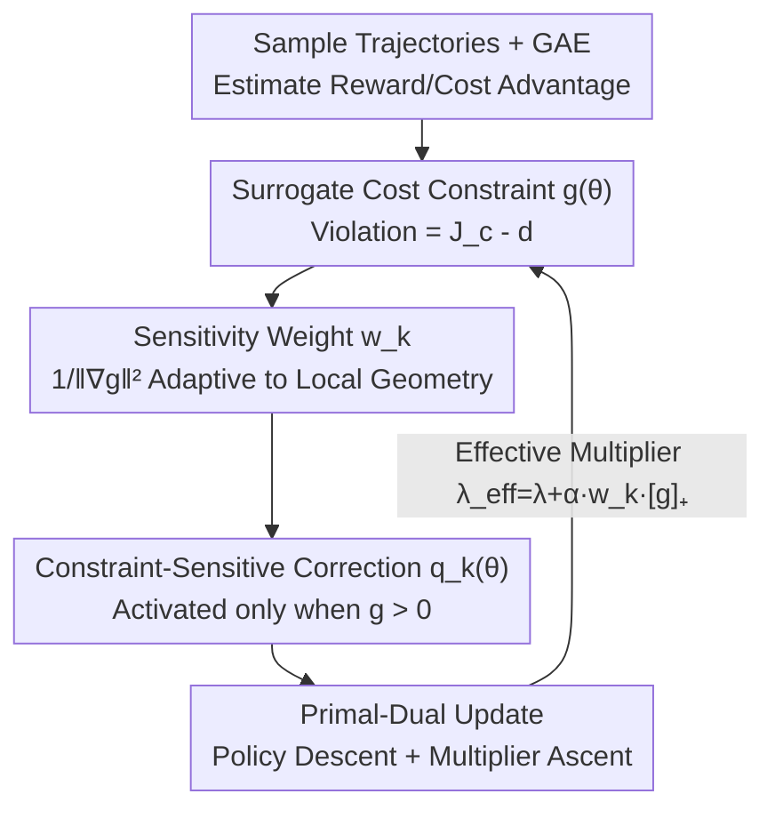

# CSPO: Constraint-Sensitive Policy Optimization for Safe Reinforcement Learning

**Conference**: ICML2026  
**arXiv**: [2606.14415](https://arxiv.org/abs/2606.14415)  
**Code**: https://github.com/serval-uni-lu/CSPO  
**Area**: Safe Reinforcement Learning / Constraint Policy Optimization  
**Keywords**: Safe RL, CMDP, Primal-Dual, Constraint-Sensitive, Lagrangian Multipliers

## TL;DR
Addressing the "dual-lag → delayed constraint correction → oscillation near boundaries" issue in primal-dual methods for Safe RL, CSPO incorporates the "shortest signed distance to the safety boundary" as a constraint-sensitive correction term into the policy update. It adaptively adjusts the correction intensity based on the constraint gradient norm, enabling faster and more stable returns to the feasible region without altering the KKT solution of the original problem.

## Background & Motivation
**Background**: Safe RL is typically modeled as a Constrained Markov Decision Process (CMDP)—maximizing rewards while maintaining cumulative costs below a threshold. Three main routes exist: second-order trust region methods (CPO/PCPO/C-TRPO, theoretically strong but expensive due to Fisher matrix inversion), first-order primal-dual Lagrangian methods (PPO-Lag, etc., jointly updating policy and multipliers, offering good scalability), and penalty methods (incorporating cost penalties into the reward).

**Limitations of Prior Work**: ① Penalty methods require fine-tuning (often large) penalty factors; otherwise, they are either overly conservative or suffer from persistent violations. ② Primal-dual methods suffer from notorious **dual-lag**—unsafe when the multiplier is small and overly conservative when large, leading to oscillating learning dynamics. ③ Crucially, all existing methods **ignore the local sensitivity of constraint functions**: flat regions require stronger corrections to return to the feasible region, while steep regions require cautious small steps to avoid overshooting. Existing methods punish violations uniformly, causing overshooting, oscillation, and inefficiency near steep boundaries.

**Key Challenge**: The Lagrangian multiplier is a **global, slow-moving** scalar. it cannot keep pace with the rapid changes in local constraint geometry (steep vs. flat) as the policy traverses the parameter space—a slow global knob cannot simultaneously manage steep and flat regions.

**Goal**: While retaining the simplicity of first-order primal-dual methods, explicitly utilize **local first-order information** of constraints to make correction intensity adaptive to local constraint sensitivity, achieving faster and smoother returns to the feasible region without damaging the feasible set or the optimal solution of the original problem.

**Core Idea**: Encode the "shortest signed distance to the safety boundary" as a differentiable correction term, **activated only upon violation and scaled by the constraint gradient norm**, effectively adding a "constraint-sensitive effective increment" to the multiplier to compensate for dual-lag.

## Method

### Overall Architecture
CSPO is an "additive term" modification of the standard PPO-style primal-dual Safe RL. In each episodic iteration: sample trajectories → estimate reward/cost advantages using GAE → construct surrogate cost constraints $g(\theta)$ → add a constraint-sensitive correction term $q_k(\theta)$ to the primal objective → perform gradient descent on the policy and projected gradient ascent on the multiplier. The pipeline is nearly identical to PPO-Lag, with the only addition being the correction term derived from the "shortest distance formula" and its sensitivity weight $w_k$.

### Key Designs

**1. Shortest Signed Distance: Calculating "how far to return to the boundary" as a constraint-sensitive correction**

The pain point is that uniform punishment does not distinguish between steep and flat regions. Starting from first-order geometry, the authors seek the "minimum parameter update to return to the safety boundary" when a violation occurs. Using a first-order expansion $g(\theta_{k+1})\approx g(\theta_k)+\nabla g(\theta_k)^\top\Delta\theta$, solving the minimum norm projection problem $\min_{\Delta\theta}\tfrac12\|\Delta\theta\|^2$ s.t. $g(\theta_k)+\nabla g(\theta_k)^\top\Delta\theta=0$ yields:

$$\Delta\theta^\star=-\frac{g(\theta_k)}{\走\|\nabla g(\theta_k)\|^2}\nabla g(\theta_k),\qquad \|\Delta\theta^\star\|=\frac{g(\theta_k)}{\|\nabla g(\theta_k)\|}$$

This $\|\Delta\theta^\star\|$ is the **shortest signed distance** from the current parameters to the feasible set. The key insight lies in the denominator: the correction magnitude is **inversely proportional to the constraint gradient norm** $\|\nabla g\|$. If the gradient is large (steep boundary), take small steps to prevent overshooting; if the gradient is small (flat region), take large steps to return quickly. To avoid being too aggressive under stochastic gradients, the authors modify this to "proportionally reduce violation" $g(\theta_{k+1})\le\sigma g(\theta_k)$, introducing a reduction factor $\alpha=1-\sigma\in[0,1]$, scaling the update magnitude to $\alpha\,g/\|\nabla g\|$.

**2. Constraint-Sensitive Objective: Turning geometric correction steps into a differentiable objective that is zero at feasible points**

Hard-coding the one-step update into training is neither elegant nor differentiable. The authors encode this geometry into a smooth differentiable objective:

$$q_k(\theta)=\frac{\alpha}{2}\,w_k\,[g(\theta)]_+^2,\qquad w_k=\frac{1}{\|\nabla_\theta g(\theta_k)\|^2+\epsilon}$$

where $[x]_+=\max(x,0)$ ensures the correction is **only activated when violating $g(\theta)>0$**, and $w_k$ is the constraint-sensitive weight (small in steep regions, large in flat regions), with $\epsilon$ as a numerical stability term. This design has two advantages: first, the gradient of $q_k$ at $\theta_k$ **exactly reproduces** the update given by the shortest distance formula (11), turning a "geometrical recovery step" into an objective solvable by first-order optimizers like Adam; second, it is consistently zero at feasible points, thereby **not altering the original constrained problem**.

**3. Effective Multiplier and KKT Equivalence: Using constraint-sensitive increments to compensate for dual-lag without moving the optimal solution**

Incorporating $q_k$ into the Lagrangian $\mathcal{L}_k(\theta,\lambda)=-L_R(\theta)+q_k(\theta)+\lambda g(\theta)$ and calculating the policy gradient yields:

$$\nabla_\theta\mathcal{L}_k=-\nabla_\theta L_R+\big(\underbrace{\lambda+\alpha w_k[g(\theta)]_+}_{\lambda_{\mathrm{eff}}}\big)\nabla_\theta g$$

This implies CSPO is equivalent to updating with an **effective multiplier** $\lambda_{\mathrm{eff}}=\lambda+\alpha w_k[g]_+$. Upon violation, $\lambda_{\mathrm{eff}}$ is immediately boosted by the constraint-sensitive increment to strengthen correction, while the slow-moving $\lambda$ remains responsible for long-term constraint satisfaction—addressing "dual-lag" directly. Furthermore, the authors prove via a proposition that since the correction term is zero at feasible points, the augmented problem (13) of CSPO **shares the same set of KKT solutions and the same feasible set** as the original constrained problem (6). Thus, it provides "free" acceleration rather than changing the optimization target. In terms of convergence, under smoothness and boundedness assumptions, the iterations approach an $\varepsilon$-stationary point (non-convex-concave minimax) at a rate of $O(L^3G^2\lambda_{\max}^2/\varepsilon^6)$. CSPO also naturally extends to multiple constraints: each constraint $g_i$ is assigned its own $q_k^{(i)}$ and $w_k^{(i)}$, allowing each to correct independently based on local sensitivity.

### Loss & Training
The practical implementation uses the PPO clipped surrogate: $\hat L_R$ is clipped with $\min$, $\hat L_C$ is clipped with $\max$, and the surrogate constraint is $\hat g(\theta)=J_c-d+\tfrac{1}{1-\gamma}\hat L_C$. The final objective is:

$$\mathcal{L}_{\mathrm{CSPO}}(\theta)=-\hat L_R(\theta)+\frac{\alpha}{2}w[\hat g(\theta)]_+^2+\lambda\hat g(\theta)$$

The weight $w$ is computed at the beginning of each policy update step using current parameters and is then **detached as a constant** (with clipping and EMA smoothing for stability). Multipliers are updated via projection $\lambda_{k+1}=[\lambda_k+\eta_\lambda(J_c-d)]_+$. The computational overhead is negligible—requiring only one extra constraint gradient evaluation (to compute $w_k$) compared to the first-order Lagrangian baseline. Theoretically, it provides an inner-loop $O(1/T)$ stability rate and a local descent proposition: "when $g(\theta_t)>\delta/(\alpha w\|\nabla g\|^2)$, a single-step CSPO update guarantees a decrease in constraint violation."

## Key Experimental Results

### Main Results
Evaluated on 9 continuous control safety tasks (5 locomotion + 4 navigation) from Safety Gymnasium, compared against 11 safe RL baselines (PPO-Lag, CPPO-PID, FOCOPS, CUP, P3O, IPO, EPO, APPO, CPO, PCPO, C-TRPO), with 5 seeds reporting IQM + bootstrap 95% CI. Constraint thresholds are in parentheses; the best reward among methods satisfying constraints is bolde.

| Environment (Threshold) | Metric | CSPO | Representative Baseline | Note |
|------|------|------|-----------|------|
| Ant (C=25) | Reward | **3231.6** ±84.8 | PPO-Lag 3134 / CPPO-PID 3190 | CSPO cost 24.5 (Safe) with highest reward |
| Ant (C=25) | Cost | 24.5 ±0.3 | Most baselines ≥25 or overly conservative | Close to boundary but within limits |
| Humanoid (C=25) | Reward | **6496.9** ±74.3 | PPO-Lag 6415 / CPPO-PID 6417 | Leading reward; cost 18.0 far below threshold |
| Humanoid (C=25) | Cost | 18.0 ±3.1 | APPO 25.3 | More stable constraint satisfaction |

Overall Conclusion: CSPO achieves competitive or superior constrained rewards while satisfying cost constraints, with **gains being particularly significant in navigation tasks**.

### Safety Recovery Metrics
The authors introduced three metrics specifically characterizing "safety recovery dynamics":

| Metric | Definition | What it measures |
|------|------|----------|
| Time-To-Safety (TTS) | Time required to recover from violation to feasibility | Recovery **speed** |
| Reward Preservation (RP) | Proportion of reward retained during recovery | Reward **drop** during recovery |
| Violation Frequency (VF) | Frequency of constraint violations throughout training | Overall **safety** |

Experiments show CSPO reaches the feasible region faster (TTS), preserves rewards better (RP), and has fewer violations (VF), resulting in faster and more stable safety convergence.

### Key Findings
- **Constraint sensitivity is the main driver**: The $\alpha w_k[g]_+$ term in the effective multiplier allows correction intensity to adapt to local geometry, effectively suppressing overshooting and oscillation at steep boundaries.
- **Navigation sees the most benefit**: Boundaries of unsafe regions in navigation tasks are often steeper or more irregular, magnifying the advantages of constraint-sensitive scaling.
- **$\alpha$ controls correction aggressiveness**: The local descent proposition indicates that larger $\alpha$ triggers feasibility-oriented updates for smaller violations, while smaller $\alpha$ allows for broader reward-constraint trade-offs before initiating correction.

## Highlights & Insights
- **Derivation flow from "Shortest Distance → Differentiable Objective → Effective Multiplier" is seamless**: Starting from a clean geometric projection problem and resulting in a "constraint-sensitive multiplier increment," the theoretical motivation and implementation are highly concise, offering a reusable derivation paradigm.
- **Acceleration with near-zero overhead**: Requiring only one extra constraint gradient evaluation and detaching $w_k$ as a constant, it achieves stability gains comparable to or better than second-order methods without the cost of Fisher inversion.
- **KKT equivalence is a key selling point**: The correction term is consistently zero at feasible points → it does not change the optimal solution of the original problem. It acts as "a help only during violation and invisibility during feasibility," which is much cleaner than penalty methods that permanently alter the objective.
- **Transferable recovery metrics**: TTS/RP/VF quantify "safety recovery," which was previously only observable through curve intuition, providing a general evaluation supplement for safe RL.

## Limitations & Future Work
- **Dependency on local validity of first-order expansion**: The shortest distance formula is built on a first-order expansion of $g$, which holds only within small steps or trust regions. In cases of high constraint nonlinearity or large step sizes, sensitivity weight estimation may be distorted.
- **$w_k$ requires engineering stabilization**: The original text specifies clipping and EMA smoothing for $w_k$, suggesting gradient norms may fluctuate significantly during training; robustness partially relies on these tricks.
- **Loose convergence bound**: The $O(\varepsilon^{-6})$ rate is a common but weak bound in non-convex-concave minimax optimization; actual fast convergence relies primarily on empirical performance.
- **Benchmark limitations**: Validated only on Safety Gymnasium simulations; lacks testing on real robots or high-stochasticity environments. While a multi-constraint extension is provided, main experiments focus on single constraints.

## Related Work & Insights
- **vs PPO-Lag / Classical Lagrangian**: They use a single slow-moving global multiplier; this work adds a **constraint-sensitive effective multiplier increment** to compensate for dual-lag, treating oscillation at the source.
- **vs CPO / PCPO / C-TRPO (Second-order Trust Region)**: They rely on Fisher inversion for strong guarantees but are expensive; this work uses only first-order information + one extra gradient evaluation to achieve comparable/superior constrained rewards.
- **vs P3O / IPO / EPO (Penalty Methods)**: Penalty methods require fine-tuning penalty factors and permanently change the objective; the correction term in this work is zero at feasible points, maintaining KKT equivalence and avoiding over-conservatism/persistent violations without extra tunable hyperparameters.

## Rating
- Novelty: ⭐⭐⭐⭐ Clear perspective and elegant derivation introducing local geometric sensitivity to primal-dual methods.
- Experimental Thoroughness: ⭐⭐⭐⭐ Solid evaluation with 9 tasks, 11 baselines, 5 seeds, and three new recovery metrics.
- Writing Quality: ⭐⭐⭐⭐ Logical flow from geometric motivation to objective to equivalence proof.
- Value: ⭐⭐⭐⭐ Plug-and-play with near-zero overhead, attractive for practical safe RL deployment.

<!-- RELATED:START -->

## Related Papers

- [\[ICML 2026\] Safe Reinforcement Learning with Preference-Based Constraint Inference](safe_reinforcement_learning_with_preference-based_constraint_inference.md)
- [\[ICML 2025\] Extreme Value Policy Optimization for Safe Reinforcement Learning](../../ICML2025/reinforcement_learning/extreme_value_policy_optimization_for_safe_reinforcement_learning.md)
- [\[ICML 2026\] Safe In-Context Reinforcement Learning](safe_in-context_reinforcement_learning.md)
- [\[ICML 2026\] Learning to Route Languages for Multilingual Policy Optimization](learning_to_route_languages_for_multilingual_policy_optimization.md)
- [\[NeurIPS 2025\] Online Optimization for Offline Safe Reinforcement Learning](../../NeurIPS2025/reinforcement_learning/online_optimization_for_offline_safe_reinforcement_learning.md)

<!-- RELATED:END -->
