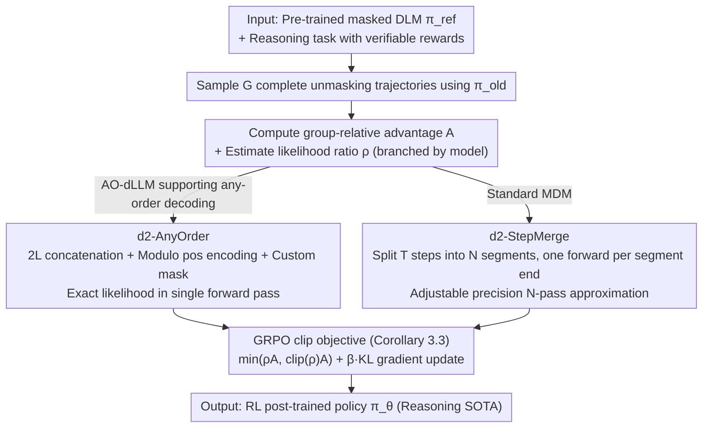

# d2: Improving Reasoning in Diffusion Language Models via Trajectory Likelihood Estimation

**Conference**: ICML 2026  
**arXiv**: [2509.21474](https://arxiv.org/abs/2509.21474)  
**Code**: https://guanghanwang.com/d2  
**Area**: LLM Reasoning / Diffusion Language Models / Reinforcement Learning  
**Keywords**: Masked Diffusion Language Models, GRPO, Trajectory Likelihood Estimation, any-order decoding, post-training

## TL;DR
This paper proposes the d2 reinforcement learning framework for masked diffusion language models (masked DLM). The core contribution is the introduction of two "trajectory likelihood estimators" (d2-AnyOrder provides precise single-forward estimates for models supporting any-order decoding, and d2-StepMerge provides adjustable-precision approximations for standard MDMs) to correctly implement GRPO. LLaDA-8B-Instruct achieves 91.9% / 56.6% / 85.0% / 41.6% on Sudoku/Countdown/GSM8K/MATH500, respectively, comprehensively outperforming diffusion RL baselines such as d1 and wd1.

## Background & Motivation
**Background**: Diffusion Language Models (DLMs, such as LLaDA, Dream, and Eso-LM) have emerged as strong competitors to autoregressive LLMs due to their controllable generation and parallel decoding. To equip DLMs with "reasoning" capabilities similar to R1/o1, the mainstream approach involves applying policy gradient methods like GRPO for post-training.

**Limitations of Prior Work**: The GRPO objective function involves an importance ratio $\rho_l = \pi_\theta(x_l|x_{<l},q) / \pi_{\text{old}}(x_l|x_{<l},q)$, which can be computed in a single forward pass for autoregressive LLMs. However, the exact likelihood of a DLM is mathematically intractable for $T$ diffusion steps. "Naive" decomposition according to $T$ steps requires $T$ forward passes, which is computationally prohibitive. Existing works like diffu-GRPO (d1) use sparse approximations with $N=1$, leading to severe distortion in likelihood estimation.

**Key Challenge**: The success of diffusion RL essentially depends on the fidelity of the trajectory likelihood estimation. Fidelity and computational budget are in direct conflict—precision is slow, while approximation is biased.

**Goal**: Solve this in two steps: (1) Rigorously derive the diffusion version of the GRPO objective function to explicitly expose the "likelihood estimation" component; (2) Design efficient likelihood estimators tailored for different DLM architectures.

**Key Insight**: The authors identify "trajectory likelihood" as the true bottleneck. They observe that a class of "any-order autoregressive DLMs" structurally allows packing the likelihood of an entire trajectory into a single transformer forward pass. For standard MDMs that do not support this property, they adopt the idea of block composite likelihood to merge diffusion steps in segments.

**Core Idea**: Replace "naive $T$ forward passes" or "single-step sparse approximation" with "trajectory likelihood estimators customized for specific model categories" to correctly implement policy gradients via GRPO on masked DLMs.

## Method

### Overall Architecture
The input consists of a pre-trained masked DLM $\pi_{\text{ref}}$ (e.g., LLaDA-8B-Instruct or Eso-LM) and a reasoning task with a verifiable reward $r(x, q)$ (e.g., Sudoku checker / GSM8K answer matching). The framework follows three steps: (1) Sample $G$ complete unmasking trajectories $x_{0:T}^{1:L}$ using the old policy $\pi_{\text{old}}$ with a group size $G$; (2) Calculate the group-relative advantage $A^{(i)}$ and estimate the likelihood ratios of $\pi_\theta / \pi_{\text{old}} / \pi_{\text{ref}}$ on the trajectories using d2-AnyOrder or d2-StepMerge; (3) Perform gradient updates according to the GRPO objective derived in Corollary 3.3. The final output is the RL-post-trained policy $\pi_\theta$ achieving SOTA on reasoning tasks.

The text first formalizes the policy gradient on DLMs as Theorem 3.1: At $\theta = \theta_{\text{old}}$, $\nabla_\theta J(\theta) = \nabla_\theta \mathbb{E}_{x_{0:T}^{1:L} \sim \pi_{\text{old}}}[r(x_0^{1:L}, q) \sum_{t=0}^{T-1} \sum_{l=1}^{L} \mathbf{1}_{t,l} \cdot \rho_t^l]$, where $\mathbf{1}_{t,l} = \mathbf{1}\{x_{t+1}^l = m, x_t^l \neq m\}$ indicates "decoding the token at position $l$ at step $t$", and $\rho_t^l = \pi_\theta(x_t^l | x_{t+1}^{1:L}, q) / \pi_{\text{old}}(x_t^l | x_{t+1}^{1:L}, q)$ is the importance ratio amortized over diffusion steps. Adding advantage, clipping, and KL constraints yields the GRPO objective (Corollary 3.3). The remaining engineering problem is how to efficiently estimate these $\rho_t^l$.

### Key Designs

**1. d2-AnyOrder: Packing entire trajectory likelihood into one forward pass for exact estimation**

For DLMs that naturally support any-order decoding (AO-dLLM, such as Eso-LM, AO-finetuned Qwen3-1.7B, or any-order causal LLaDA), the trajectory likelihood can be written as $\pi(x_{0:T}^{1:L}) = \prod_{l=1}^L \pi(x_0^{\sigma(l)} | x_0^{\sigma(<l)})$. The challenge is calculating these $L$ conditional probabilities without $L$ forward passes. d2-AnyOrder constructs a concatenated sequence of length $2L$, $x_0^{1:L} \oplus m^{L+1:2L}$, where a token and its corresponding mask share the same position encoding $\text{pos}_l = l \bmod L$. A custom attention mask is applied: a clean token $x_0^{\sigma(l)}$ attends only to $x_0^{\sigma(\leq l)}$, while a mask token $m_{L+\sigma(l)}$ attends to $x_0^{\sigma(<l)} \cup \{m_{L+\sigma(l)}\}$. Thus, a single forward pass outputs all $L$ conditional probabilities $\pi^{AO}(x_0^l | x_0^{1:L} \oplus m^{L+1:2L})$. Substituting $\rho_{n,l}^{AO} = \pi_\theta^{AO}(\cdot) / \pi_{\text{old}}^{AO}(\cdot)$ into the GRPO clip objective (Eq. 8) yields an exact, unbiased gradient, provided the sampling satisfies "Independent Masks + Order Causality." Standard MDMs like LLaDA fail these properties (producing an average per-token log-likelihood of -3.051 vs. the true -0.128, with a KL of 2.334), requiring AO fine-tuning before using this estimator.

**2. d2-StepMerge: Adjustable-precision segmented approximation with $N\ll T$ forward passes**

Standard MDMs (e.g., original LLaDA-8B-Instruct) cannot use AnyOrder and cannot afford $T$ forward passes. StepMerge borrows from block composite likelihood, dividing the $T$-step trajectory into $N$ equal segments. The forward pass output at the endpoint of each segment serves as a proxy for the likelihood of all tokens within that segment: $\pi(x_{0:T}^{1:L}) \approx \prod_{n=0}^{N-1} \prod_{l=1}^{L} \mathbf{1}_{n,l} \cdot \pi(x_{nT/N}^l | x_{(n+1)T/N}^{1:L})$. Here, $N$ serves as a compute-bias knob: $N=1$ degrades to diffu-GRPO (cheapest and most distorted), while $N=T$ is exact. Theorem 4.1 provides an upper bound $D_N \leq L \cdot \log(T/N + 1) + L \cdot \epsilon_{\text{block}}$, showing error decays logarithmically with $N$. Experiments show $N=16$ matches $N=32/64$ on Sudoku while saving FLOPs, explaining why d1 ($N=1$) failed to learn.

### Loss & Training
Both estimators correspond to a clipped GRPO loss (Eq. 8 / Eq. 9), following the PPO-style trust region formulation: $\min(\rho A, \text{clip}(\rho, 1-\epsilon, 1+\epsilon) A) + \beta D_{KL}(\pi_\theta \| \pi_{\text{ref}})$, normalized by sequence length $1/L$. Group size $G=6$, daily batch contains 16 problems, decoding 2 tokens per step. Rewards are verifiable (numerical correctness, Sudoku checker, Countdown checker); no reliance on SFT or external chain-of-thought data.

## Key Experimental Results

### Main Results

Applying d2 to LLaDA-8B-Instruct and comparing with existing diffusion RL frameworks (without SFT) across four reasoning benchmarks:

| Dataset | Metric | d2 (Ours) | wd1 | d1 | LLaDA | Gain (vs Prev. SOTA) |
|--------|------|-----------|------|-----|--------|----|
| Sudoku | Acc | **91.9%** | 25.2% | 22.1% | 11.8% | **+66.7pp** |
| Countdown | Acc | **56.6%** | 51.2% | 42.2% | 19.9% | +5.4pp |
| GSM8K | Acc | **85.0%** | 82.3% | 82.1% | 75.7% | +2.7pp |
| MATH500 | Acc | **41.6%** | 39.0% | 40.2% | 35.4% | +1.4pp |

The +66.7pp on Sudoku represents a qualitative leap, indicating that d1/wd1 failed to learn strict symbolic logic, whereas accurate trajectory likelihood estimation corrects the policy gradient direction.

### Ablation Study

| Configuration | Sudoku Acc | Description |
|------|---------|------|
| d2-StepMerge, $N=1$ | ≈ d1 (22.1%) | Equivalent to diffu-GRPO; highly distorted likelihood |
| d2-StepMerge, $N=4$ | Fails to converge | Estimate remains biased; high RL signal noise |
| d2-StepMerge, $N=16$ | 91.9% | **Sweet spot**: Performance matches $N=32, 64$ with fewer FLOPs |
| d2-StepMerge, $N=32$ | ≈ 91.9% | Performance saturated; FLOPs increase |
| d2-AnyOrder vs d2-StepMerge ($N=8$, Eso-LM) | -0.7 vs -1.5 @ $1.25\times10^{17}$ FLOPs | Exact estimation significantly outperforms approximation |
| d2-AnyOrder on LLaDA-8B (no AO train) | log-probs -3.051 vs GT -0.128 | KL=2.334; **AO estimator requires matching training paradigm** |

### Key Findings
- **Likelihood estimation precision is the lifeline of diffusion RL**: d1 ($N=1$) only achieves 22.1% on Sudoku, while d2-StepMerge ($N=16$) reaches 91.9%. The difference lies solely in the precision of the likelihood estimate.
- **AO estimators require "Sampling + Training" synergy**: Applying d2-AnyOrder directly to the original LLaDA result in a KL of 2.334. Models must be adapted to independent masking and order causality via AO fine-tuning first.
- **The value of $N$ reaches a plateau**: The logarithmic upper bound in Theorem 4.1 is consistent with observations—returns diminish after $N=16$, providing a clear engineering heuristic for hyperparameter selection.

## Highlights & Insights
- **Parallel likelihood via position modulo and custom masks**: d2-AnyOrder elegantly packs $L$ conditional probabilities into one pass using a $2L$ token-mask sequence and $\text{pos} = l \bmod L$. This trick allows transformers to perform "AR step unification" without structural changes.
- **Redefining diffu-GRPO as a $N=1$ special case**: Remark 3.4 demotes previous work to a degraded case of the proposed framework, creating a clear comparison and a "unified framework" narrative.
- **Theorem 4.1 Logarithmic Error Bound**: The bound $D_N \leq L \log(T/N + 1) + L \epsilon_{\text{block}}$ explains the logarithmic decay of compute-bias, justifying the selection of $N=16$ as a theoretical saturation point rather than purely empirical tuning.

## Limitations & Future Work
- **AO estimator dependency**: d2-AnyOrder cannot be used plug-and-play with any MDM; it requires prior AO fine-tuning (Eso-LM or AO-causal LLaDA recipe). For standard pre-trained models, only d2-StepMerge is applicable.
- **Sparse verifiable rewards**: The experiments rely on binary correctness/rule-based rewards. The stability of d2 under reward models (e.g., RLHF) or dense rewards remains unexplored.
- **Wall-clock time vs. FLOPs**: While StepMerge controls FLOPs, its reliance on sequential passes may result in higher wall-clock latencies than the fully parallel d2-AnyOrder in production.
- **Future Directions**: Adaptive $N$ during training; extending AO estimators to bidirectional decoding models; migrating estimators to non-GRPO post-training workflows like DPO or SimPO.

## Related Work & Insights
- **vs d1 (diffu-GRPO, Zhao et al. 2025)**: They used $N=1$ sparse likelihood. This paper proves d1 is a degraded case of d2-StepMerge and significantly improves Sudoku performance by increasing $N$ to 16.
- **vs wd1 (Tang et al. 2026)**: wd1 rewrites the objective as weighted likelihood to avoid policy ratios. This paper maintains the PPO-style ratio + clip but achieves success through accurate estimation, proving the clip framework is viable if ratios are correct.
- **vs DDPO (Black et al. 2024)**: DDPO is for continuous diffusion. This paper replaces the latent-marginal approach with discrete factorization specific to MDMs, which is more effective for text logic.
- **Insight**: The key to RL for diffusion models is not which AR RL algorithm to borrow, but how to estimate likelihood correctly. This lesson likely applies to video and image diffusion RL as well.

## Rating
- Novelty: ⭐⭐⭐⭐⭐ Reframing diffusion RL as a "trajectory likelihood estimation problem" with two non-trivial algorithmic innovations.
- Experimental Thoroughness: ⭐⭐⭐⭐ Covers 4 benchmarks, 3 architectures, and toxicity steering, though lacks wall-clock and dense reward evaluations.
- Writing Quality: ⭐⭐⭐⭐⭐ Excellent flow from Theorem 3.1 to two estimators; mature narrative framing.
- Value: ⭐⭐⭐⭐⭐ Transforming LLaDA-8B on Sudoku from 11.8% to 91.9% sets a new SOTA and methodological baseline for diffusion RL.

<!-- RELATED:START -->

## Related Papers

- [\[ICML 2026\] Learning Unmasking Policies for Diffusion Language Models](learning_unmasking_policies_for_diffusion_language_models.md)
- [\[ICML 2026\] Break the Block: Dynamic-size Reasoning Blocks for Diffusion Large Language Models via Monotonic Entropy Descent with Reinforcement Learning](break_the_block_dynamic-size_reasoning_blocks_for_diffusion_large_language_model.md)
- [\[NeurIPS 2025\] Reinforcing the Diffusion Chain of Lateral Thought with Diffusion Language Models](../../NeurIPS2025/reinforcement_learning/reinforcing_the_diffusion_chain_of_lateral_thought_with_diffusion_language_model.md)
- [\[ICML 2026\] The Shape of Reasoning: Topological Analysis of Reasoning Traces in Large Language Models](the_shape_of_reasoning_topological_analysis_of_reasoning_traces_in_large_languag.md)
- [\[ACL 2026\] d-TreeRPO: Towards More Reliable Policy Optimization for Diffusion Language Models](../../ACL2026/reinforcement_learning/d-treerpo_towards_more_reliable_policy_optimization_for_diffusion_language_model.md)

<!-- RELATED:END -->
