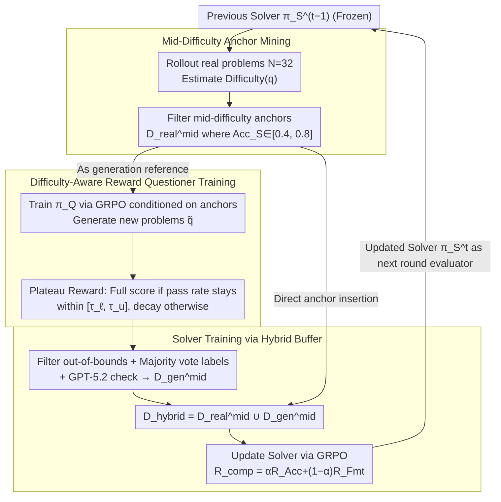

# D$^2$Evo: Dual Difficulty-Aware Self-Evolution for Data-Efficient Reinforcement Learning

**Conference**: ICML 2026  
**arXiv**: [2605.17037](https://arxiv.org/abs/2605.17037)  
**Code**: No public link available  
**Area**: LLM Reasoning / Reinforcement Learning / Self-Evolution Training  
**Keywords**: GRPO, difficulty-aware, self-evolution, question generation, data-efficient RL  

## TL;DR
In each RL iteration, D$^2$Evo estimates difficulty using the current Solver, selects medium-difficulty real samples as anchors, and trains a Questioner to synthesize new problems of equivalent difficulty around these anchors. Consequently, it outperforms the GRPO baseline (trained on 19K real samples) in both mathematics and general reasoning using < 2K real math problems.

## Background & Motivation

**Background**: Group-level RL, represented by GRPO, has become the mainstream paradigm for enhancing LLM reasoning capabilities post-training. This approach involves sampling a set of responses for each problem and performing policy gradient updates using relative advantage.

**Limitations of Prior Work**: GRPO is extremely sensitive to the difficulty distribution of training samples—if a problem is too easy, all responses in a group are correct; if too hard, they are all incorrect. When intra-group variance drops to zero, the advantage signal collapses, resulting in zero gradients and wasted training steps. However, in existing math datasets (e.g., Math12K, OpenRs-7K), samples falling into the medium-difficulty range are scarce. Furthermore, after one training epoch, many previously medium-difficulty problems are mastered by the model and become "easy," while hard problems remain unsolvable. Thus, **effective signal samples diminish as training progresses**.

**Key Challenge**: The authors categorize these issues as "Effective Data Scarcity" and "Dynamic Difficulty Shifts." The root cause lies in the static difficulty of training data versus the dynamic ability of the Solver, where the mismatch causes gains to exhaust rapidly across multiple iterations. Existing self-synthesis solutions are either anchorless (e.g., R-Zero, Absolute-Zero), leading to entropy collapse and off-distribution generation, or use anchors without difficulty control (e.g., SPICE), resulting in new problems clustering at extreme difficulty poles, which still wastes gradients.

**Goal**: To enable the Questioner to generate new problems at each iteration that are "just difficult enough" for the current Solver, allowing both to co-evolve and drive each other forward.

**Key Insight**: Based on findings by Bae et al.—under binary rewards, the lower bound of KL divergence and the per-problem pass rate $p$ satisfy $D_{\mathrm{KL}}(\pi_{\mathrm{init}}\|\pi^{*})\ge p(1-p)/(2\beta^{2})$, which is maximized at $p=0.5$—the "medium difficulty" zone is theoretically the optimal learning signal region, not just an empirical intuition. Given the empirical observation that the proportion of medium-difficulty samples drops sharply after one GRPO epoch, **a cyclic structure of "re-mining anchors + generating equivalent-difficulty new problems" based on the current Solver is naturally derived**.

**Core Idea**: Utilizing "dual difficulty awareness"—where the Questioner aligns with target difficulty bands using difficulty rewards and the Solver continues training with a hybrid buffer (real anchors + synthetic problems of equivalent difficulty)—to allow problems and solvers to co-evolve across multiple iterations, maximizing the utility of limited real data.

## Method

### Overall Architecture
D$^2$Evo is a multi-round iterative self-evolution RL loop, with four steps in each round $t$:

1. **Difficulty Estimation**: Use the Solver from the previous round $\pi_S^{t-1}$ (frozen) to perform $N=32$ rollouts for each candidate real problem. Estimate $\text{Difficulty}(q)=(1-\text{correct}/N)\times 100$ and select a medium-difficulty subset $\mathcal{D}^{mid}_{real}$ based on thresholds $[\textit{low}=0.4,\textit{high}=0.8]$ to serve as anchors.
2. **Questioner Training**: Conditioned on anchors $(q_{\text{anc}}, y_{\text{anc}}, s)$, train $\pi_Q$ using GRPO with difficulty-aware rewards to generate new problems $\tilde q$, ensuring their pass rates under the current Solver fall within the target band $[\tau_\ell, \tau_u]$.
3. **Hybrid Buffer Construction**: Filter out synthetic problems with out-of-bounds difficulty, generate pseudo-labels using majority voting followed by GPT-5.2 verification to obtain $\mathcal{D}^{mid}_{gen}$, and combine them with anchors to form $\mathcal{D}_{hybrid}=\mathcal{D}^{mid}_{real}\cup\mathcal{D}^{mid}_{gen}$.
4. **Solver Training**: Update the Solver using GRPO on $\mathcal{D}_{hybrid}$ with the reward $R_{\mathrm{comp}}=\alpha R_{\mathrm{Acc}}+(1-\alpha) R_{\mathrm{Fmt}}$.

The updated Solver then acts as the difficulty evaluator and starting point for the next round, forming a closed loop. This cycle aligns data generation, filtering, and model updates within the same difficulty coordinate system, preventing difficulty drift between rounds.

### Key Designs

**1. Mid-difficulty anchor mining based on the current Solver: Re-calibrating "which real problems are at the learning frontier" in each round.**
Training on static datasets with pre-labeled difficulty fails rapidly as the model strengthens—originally medium problems are mastered and become easy, while hard problems remain intractable, causing the volume of effective signals to shrink. D$^2$Evo performs $N=32$ rollouts using the current frozen Solver $\pi_S^{t-1}$ on candidate real data before each iteration, estimates difficulty via $\text{Difficulty}(q)=(1-\text{correct}/N)\times 100$, and filters a subset where $\text{Acc}_S(q)\in[\textit{low}=0.4,\textit{high}=0.8]$ to serve as anchors. This pool shifts: as the Solver strengthens, previously "medium" problems are promoted and removed, while some hard problems are demoted into the anchor pool. Unlike R-Zero/Absolute-Zero, which generate problems aimlessly without anchors, this mechanism anchors the generation to the real problem distribution where advantage signals are richest.

**2. Difficulty-aware reward with a plateau-shaped target band: Forcing the Questioner to issue problems that are "just right" for the Solver, rather than as hard/easy as possible.**
Whenever the Solver updates, the pass rate of problems shifts, rendering fixed difficulty labels useless. Unconstrained generation (R-Zero) leads to entropy collapse, while uncontrolled difficulty (Absolute-Zero) scatters generated problems at extremes, wasting gradients. D$^2$Evo provides the Questioner with a plateau-shaped reward: for a generated problem $\tilde q$, $N_v$ Solver rollouts yield a pass rate $x=\text{Acc}_S(\tilde q)$. If $x$ falls within $[\tau_\ell,\tau_u]$, $r_{\text{diff}}(x)=1$; otherwise, it decays as $(x/\tau_\ell)^a$ if $x<\tau_\ell$ or $((1-x)/(1-\tau_u))^a$ if $x>\tau_u$ (where $a\ge 1$ controls sharpness). Combined with a format constraint, this defines $R_{\mathrm{comp}}$. The reward shape focuses training signals on difficulty intervals worth the compute, preventing the Questioner from drifting to extremes due to diversity rewards.

**3. Mixed buffer of real anchors + equivalent-difficulty synthetic problems: Stable supervision from real problems and continuous signal refresh from synthetic ones.**
Purely synthetic problems suffer from pseudo-label noise, while purely real problems are scarce. Thus, the Solver trains on a hybrid buffer. Synthetic problems first undergo majority voting by the Solver to generate pseudo-labels $\tilde y$, requiring the pass rate to remain in $[\tau_\ell,\tau_u]$, followed by consistency checking with GPT-5.2 to reduce noise. These are then combined with real anchors meeting the same $\text{Acc}_S(q)\in[\tau_\ell,\tau_u]$ criterion to form $\mathcal{D}_{hybrid}$ for GRPO. Real anchors provide grounded, on-distribution supervision, while synthetic problems provide a steady stream of new signals at the specific difficulty level. These complement each other within a unified difficulty coordinate system, which is key to preventing difficulty drift across rounds.

> ⚠️ The original paper refers to "GPT-5.2" for secondary verification; this model name is used as per the source text.

### Loss & Training
Both Solver and Questioner use GRPO (per the Eq. 2 form) and share LLM weights, distinguished only by prompts. The Questioner's reward is the aforementioned $R_{\mathrm{comp}}$, while the Solver's reward is $\alpha R_{\mathrm{Acc}}+(1-\alpha)R_{\mathrm{Fmt}}$ (requiring `<think>...</think>` and `\boxed{}` structures). Difficulty thresholds are $\textit{low}=0.4, \textit{high}=0.8$, rollout count $N=32$, and each model undergoes 3 rounds of self-evolution iteration.

## Key Experimental Results

### Main Results
Evaluations across 7 math reasoning benchmarks (AMC, Minerva, MATH-500, GSM8K, Olympiad-Bench, AIME-2024, AIME-2025) compare Base, Full Data (19K real data GRPO), R-Zero, AZR, and SPICE across three backbones:

| Model / Method | #Real Data | Math Avg. (7-benchmark) | Gain vs Base |
|---|---|---|---|
| Qwen3-4B-Base | – | 43.87 | – |
| + Full Data (GRPO) | 19K | 49.28 | +5.41 |
| + R-Zero (Iter 3) | – | 46.91 | +3.04 |
| + AZR | – | 46.36 | +2.49 |
| + SPICE | 20K | 50.59 | +6.72 |
| **D$^2$Evo (Iter 3)** | **0.1K** | **51.35** | **+7.48** |
| Qwen3-8B-Base | – | 47.24 | – |
| + Full Data | 19K | 52.70 | +5.46 |
| + SPICE | 20K | 54.34 | +7.10 |
| **D$^2$Evo (Iter 3)** | **0.4K** | **55.32** | **+8.08** |
| Llama-3.1-8B-Inst | – | 29.35 | – |
| + Full Data | 19K | 31.10 | +1.75 |
| **D$^2$Evo (Iter 3)** | **0.4K** | **33.09** | **+3.74** |

Despite training only on math data, D$^2$Evo also improves general reasoning (Avg. of SuperGPQA, MMLU-Pro, BBEH) across Qwen3-4B/8B and Llama-3.1-8B by 4.20%, 2.59%, and 3.19% respectively, exceeding the Full Data baseline on all backbones.

### Ablation Study

| Configuration | Math Avg. | General Avg. | Description |
|---|---|---|---|
| D$^2$Evo (full, Qwen3-4B) | 51.35 | 32.16 | Full Method |
| w/o Questioner | 47.94 | 30.75 | No self-synthesis; Solver trains on real anchors only |
| w/o share weight | 49.99 | 31.62 | Independent weights for Questioner and Solver |
| w/o synthesis data | 48.71 | 31.65 | Solver trains only on anchors |
| w/ random anchor data | 49.22 | 31.93 | Anchors sampled randomly without difficulty filtering |

### Key Findings
- Removing the Questioner leads to the largest drop (3.4 points in math), suggesting that "self-synthesizing medium-difficulty problems" is the primary driver of performance ceilings. Random anchors cause a 2.1-point drop, highlighting the importance of difficulty calibration.
- Shared weights slightly outperform independent weights (51.35 vs 49.99). The authors suggest that "learning to generate questions" sharpens the model's understanding of problem structures, aiding solution—co-evolution provides positive feedback.
- Performance increased steadily across three iterations: gains of 2.89% (4B) and 2.82% (8B) from Iter 1 to Iter 3. In contrast, R-Zero fluctuated or declined on the 8B model, underscoring the necessity of difficulty-aware anchors for multi-round stability.

## Highlights & Insights
- **Utilizing "GRPO advantage signal maximization" as the anchor selection criterion**: By deriving the $p\approx0.5$ medium-difficulty zone from $p(1-p)$ and using dynamic rollouts instead of static labels, D$^2$Evo turns "medium difficulty" into a target that slides with model capability—upgrading curriculum learning from "fixed sequence teaching" to "adaptive curriculum based on current student status."
- **Co-evolution through shared Questioner/Solver weights**: Forcing the same LLM to both solve problems and generate them at specified difficulties under GRPO allows for mutual supervision. Question generation serves as an implicit auxiliary task regularization for reasoning.
- **Extreme sample efficiency**: With only a few hundred combined anchors and synthetic problems per round (total real samples $\le$ 2K), the method surpasses 19K Full Data benchmarks. This framework is ideal for scenarios with expensive annotations or limited private data, such as medical, legal, or scientific reasoning.

## Limitations & Future Work
- Difficulty estimation depends on $N=32$ rollouts per round and GPT-5.2 verification. **Estimating difficulty itself incurs significant computational overhead**. The authors did not provide a total FLOPs comparison vs. standard training, leaving its cost-effectiveness at 70B+ scales unverified.
- Experiments are restricted to math and general reasoning; **coding, agents, and multi-step tool-use** tasks with longer horizons were not covered. It is uncertain if pseudo-labeling via majority voting generalizes to open-ended generation without convergence.
- Self-evolution frameworks naturally risk "feedback loops amplifying bias"—the Questioner might generate the same type of medium problem repeatedly, narrowing the distribution. There is horizontal evidence (BBEH/MMLU-Pro), but direct quantitative analysis of synthetic diversity is missing.
- Thresholds $[\textit{low}, \textit{high}]=[0.4, 0.8]$ and the target band $[\tau_\ell, \tau_u]$ are fixed hyperparameters without an automated adaptation scheme; different tasks might require re-tuning.

## Related Work & Insights
- **vs R-Zero (Huang et al., 2025)**: R-Zero lets the Challenger generate problems without anchors, leading to entropy collapse and homogenous content. D$^2$Evo keeps generation grounded through real anchors and difficulty feedback.
- **vs Absolute-Zero (Zhao et al., 2025)**: AZR lacks difficulty control, resulting in bimodal distributions at extremes. D$^2$Evo's plateau reward compresses generation into the "optimal learning zone."
- **vs SPICE (Liu et al., 2025a)**: SPICE uses 20K document-level corpora for generation but lacks difficulty awareness in the Solver/Questioner. D$^2$Evo's outperformance with < 2K data suggests "difficulty awareness" is more critical than "data volume."
- **vs Curriculum Learning**: Traditional curriculum learning follows a static easy-to-hard schedule that becomes obsolete as the model improves; D$^2$Evo's anchor pool is regenerated each round, acting as an "adaptive online curriculum" robust to long training horizons.

## Rating
- Novelty: ⭐⭐⭐⭐ The combination of "anchors + plateau difficulty reward + shared weight co-evolution" is a first in self-evolving RL, with a clear theoretical motivation (GRPO advantage signals).
- Experimental Thoroughness: ⭐⭐⭐⭐ Solid coverage across three backbones, 10 benchmarks, and multiple iterations/ablations. Lacks a direct compute vs. Full Data comparison.
- Writing Quality: ⭐⭐⭐⭐ Highly organized with a clear logic chain from motivation to method and results. Equations and diagrams are well-placed.
- Value: ⭐⭐⭐⭐ Provides a practical solution for "data scarcity" and "GRPO training instability," with strong potential for any verifiable-reward RL domain.

<!-- RELATED:START -->

## Related Papers

- [\[ICML 2026\] The Surprising Difficulty of Search in Model-Based Reinforcement Learning](the_surprising_difficulty_of_search_in_model-based_reinforcement_learning.md)
- [\[ACL 2026\] Easy Samples Are All You Need: Self-Evolving LLMs via Data-Efficient Reinforcement Learning](../../ACL2026/reinforcement_learning/easy_samples_are_all_you_need_self-evolving_llms_via_data-efficient_reinforcemen.md)
- [\[ICLR 2026\] R-Zero: Self-Evolving Reasoning LLM from Zero Data](../../ICLR2026/reinforcement_learning/r-zero_self-evolving_reasoning_llm_from_zero_data.md)
- [\[AAAI 2026\] STELAR-Vision: Self-Topology-Aware Efficient Learning for Aligned Reasoning in Vision](../../AAAI2026/reinforcement_learning/stelar-vision_self-topology-aware_efficient_learning_for_aligned_reasoning_in_vi.md)
- [\[ICLR 2026\] DuPO: Enabling Reliable Self-Verification via Dual Preference Optimization](../../ICLR2026/reinforcement_learning/dupo_enabling_reliable_self-verification_via_dual_preference_optimization.md)

<!-- RELATED:END -->
