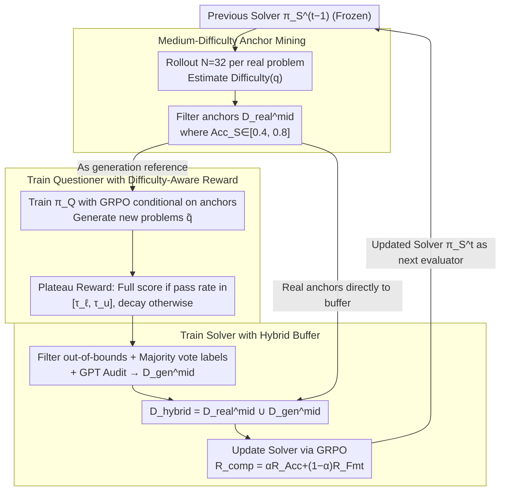

# D$^2$Evo: Dual Difficulty-Aware Self-Evolution for Data-Efficient Reinforcement Learning

**Conference**: ICML 2026  
**arXiv**: [2605.17037](https://arxiv.org/abs/2605.17037)  
**Code**: No public link yet  
**Area**: LLM Reasoning / Reinforcement Learning / Self-Evolutionary Training  
**Keywords**: GRPO, Difficulty-Aware, Self-Evolution, Question Generation, Data-Efficient RL  

## TL;DR
D$^2$Evo estimates difficulty using the current Solver in each RL iteration, selects medium-difficulty real samples as anchors, and trains a Questioner to synthesize new questions of equivalent difficulty around these anchors. It outperforms the GRPO baseline trained on 19K real data in both mathematics and general reasoning using $< 2K$ real math problems.

## Background & Motivation

**Background**: Group-level RL, represented by GRPO, has become the mainstream paradigm for enhancing LLM reasoning after training. It involves sampling a set of responses for each problem and using relative advantage for policy gradient updates.

**Limitations of Prior Work**: GRPO is extremely sensitive to the difficulty distribution of training samples—if problems are too easy, all responses in a set are correct; if too difficult, they are all incorrect. Once the intra-group variance zeros out, the advantage signal collapses, the gradient becomes zero, and the training step is wasted. However, only a small portion of samples in existing math datasets (e.g., Math12K, OpenRs-7K) fall into the medium-difficulty range. Worse, after one epoch, most medium problems are learned and become "easy," while hard problems remain unsolved, causing **effective signal samples to decrease during training**.

**Key Challenge**: The authors term these two issues "Effective Data Scarcity" and "Dynamic Difficulty Shifts." The root cause lies in the static difficulty of training data versus the dynamic capability of the Solver. This mismatch quickly exhausts the gains from multiple iterations. Existing self-synthesis solutions either lack anchors (R-Zero, Absolute-Zero), leading to entropy collapse and out-of-distribution generation, or have anchors but lack difficulty control (SPICE), resulting in new problems clustering at the extremes of easy/difficult, still wasting gradients.

**Goal**: To enable the Questioner to generate new problems around anchors that are "just the right difficulty" for the current Solver in each round, allowing both to co-evolve and pull each other forward.

**Key Insight**: Based on the conclusion by Bae et al.—under binary rewards, the lower bound of KL divergence and the pass rate $p$ for each problem satisfy $D_{\mathrm{KL}}(\pi_{\mathrm{init}}\|\pi^{*})\ge p(1-p)/(2\beta^{2})$, which peaks at $p=0.5$—the authors prove that "medium difficulty" is the theoretical optimal learning signal zone rather than just empirical intuition. Combined with the observation that medium-range samples drop sharply after one GRPO epoch, the authors naturally derive a **"re-mining anchors + generating new problems of equal difficulty based on the current Solver each round"** loop structure.

**Core Idea**: Use "dual difficulty awareness"—the Questioner aligns with the target difficulty band using a difficulty reward, and the Solver continuously trains using a hybrid buffer (real anchors + synthetic problems of the same difficulty)—enabling the problems and the solver to co-evolve through multiple iterations, squeezing maximum value from limited real data.

## Method

### Overall Architecture
D$^2$Evo is a multi-round iterative self-evolutionary RL loop. Each round $t$ consists of four steps:

1.  **Difficulty Estimation**: Perform $N=32$ rollouts per candidate real problem using the Solver from the previous round $\pi_S^{t-1}$ (frozen). Estimate difficulty as $\text{Difficulty}(q)=(1-\text{correct}/N)\times 100$. Select the medium-difficulty subset $\mathcal{D}^{mid}_{real}$ based on thresholds $[\textit{low}=0.4, \textit{high}=0.8]$ as anchors.
2.  **Questioner Training**: Conditional on anchors $(q_{\text{anc}}, y_{\text{anc}}, s)$, train $\pi_Q$ using GRPO + difficulty-aware reward to generate new problems $\tilde q$, ensuring the pass rate under the current Solver falls within the target band $[\tau_\ell, \tau_u]$.
3.  **Hybrid Buffer Construction**: Filter out generated problems with out-of-bounds difficulty, generate pseudo-labels via majority voting + GPT secondary audit to obtain $\mathcal{D}^{mid}_{gen}$. Combine with anchors to form $\mathcal{D}_{hybrid}=\mathcal{D}^{mid}_{real}\cup\mathcal{D}^{mid}_{gen}$.
4.  **Solver Training**: Update the Solver on $\mathcal{D}_{hybrid}$ using GRPO with reward $R_{\mathrm{comp}}=\alpha R_{\mathrm{Acc}}+(1-\alpha) R_{\mathrm{Fmt}}$.

The updated Solver serves as the difficulty evaluator and starting point for the next round. This loop integrates "data generation/filtering/model updating" into a single difficulty coordinate system, avoiding multi-round difficulty shift.

### Key Designs

**1. Mining medium-difficulty anchors based on the current Solver: Re-calibrating "which real problems are at the learning frontier" each round**

Training on static datasets with pre-labeled difficulty fails as the model strengthens—originally medium problems are learned and become easy, while hard problems remain unsolvable. D$^2$Evo performs $N=32$ rollouts on candidate real data before each iteration to estimate difficulty $\text{Difficulty}(q)=(1-\text{correct}/N)\times 100$, selecting a subset where $\text{Acc}_S(q)\in[\textit{low}=0.4, \textit{high}=0.8]$ as anchors. This pool shifts: as the Solver strengthens, previously "medium" items are promoted to "easy" and removed, while some hard items are downgraded into the anchor pool. Compared to R-Zero or AZR, which generate problems aimlessly without anchors, the anchor mechanism re-pins generation to the distribution of real problems where advantage signals are richest.

**2. Difficulty-aware reward with a plateau-shaped target band: Making the Questioner produce problems that are "just right for the Solver to learn," rather than as hard or as easy as possible**

As the Solver updates, the pass rate for problems shifts significantly; rewards based on fixed difficulty labels immediately fail. R-Zero's unconstrained generation leads to entropy collapse, and AZR's lack of difficulty control scatters generated problems to extremes, wasting gradients. D$^2$Evo uses a plateau reward: $N_v$ rollouts of the Solver on $\tilde q$ yield pass rate $x=\text{Acc}_S(\tilde q)$. If $x$ falls in the target band $[\tau_\ell, \tau_u]$, $r_{\text{diff}}(x)=1$; otherwise, it decays as $(x/\tau_\ell)^a$ for $x<\tau_\ell$ and $((1-x)/(1-\tau_u))^a$ for $x>\tau_u$ ($a\ge 1$ controls sharpness). Combined with format constraints, this gives $R_{\mathrm{comp}}$. The shape concentrates training signals in difficulty intervals worth the compute, preventing the Questioner from drifting to extremes due to diversity rewards.

**3. Hybrid buffer of real anchors + synthetic problems of equivalent difficulty: Using real problems for stable supervision and synthetic problems for continuous signal refreshing**

Purely synthetic problems suffer from pseudo-label noise, and purely real problems are scarce. The Solver trains on a combined buffer. Synthetic problems undergo Solver majority voting for pseudo-labels $\tilde y$, are required to stay within $[\tau_\ell, \tau_u]$, and receive secondary consistency checks via GPT-5.2 for denoising. They are then merged with real anchors satisfying $\text{Acc}_S(q)\in[\tau_\ell, \tau_u]$ to form $\mathcal{D}_{hybrid}$. Real anchors provide stable, grounded supervision, while synthetic problems provide a continuous stream of new signals at the same difficulty. This shared difficulty coordinate system is key to preventing multi-round difficulty shift.

> ⚠️ The original paper refers to using "GPT-5.2" for secondary verification; this model name is used strictly as per the source text.

### Loss & Training
Both sides use GRPO (Eq. 2 form), sharing LLM weights and distinguishing roles (Questioner/Solver) via prompts. Questioner reward is $R_{\mathrm{comp}}$, and Solver reward is $\alpha R_{\mathrm{Acc}}+(1-\alpha)R_{\mathrm{Fmt}}$ (requiring `<think>...</think>` and `\boxed{}` structures). Thresholds: $\textit{low}=0.4, \textit{high}=0.8$, rollout count $N=32$, with 3 self-evolutionary iterations per model.

## Key Experimental Results

### Main Results
Evaluation across 7 math benchmarks (AMC, Minerva, MATH-500, GSM8K, Olympiad-Bench, AIME-2024, AIME-2025) comparing Base, Full Data (19K real data GRPO), R-Zero, AZR, and SPICE across three backbones:

| Model / Method | #Real Data | Math Avg. (7 tasks) | Gain over Base |
|---|---|---|---|
| Qwen3-4B-Base | – | 43.87 | – |
| + Full Data (GRPO) | 19K | 49.28 | +5.41 |
| + R-Zero (Iter 3) | – | 46.91 | +3.04 |
| + AZR | – | 46.36 | +2.49 |
| + SPICE | 20K | 50.59 | +6.72 |
| **D$^2$Evo (Iter 3)** | **0.1K** | **51.35** | **+7.48** |
| Qwen3-8B-Base | – | 47.24 | – |
| + Full Data | 19K | 52.70 | +5.46 |
| + SPICE | 20K | 54.34 | +7.10 |
| **D$^2$Evo (Iter 3)** | **0.4K** | **55.32** | **+8.08** |
| Llama-3.1-8B-Inst | – | 29.35 | – |
| + Full Data | 19K | 31.10 | +1.75 |
| **D$^2$Evo (Iter 3)** | **0.4K** | **33.09** | **+3.74** |

Despite training only on math data, general reasoning (Avg. of SuperGPQA, MMLU-Pro, BBEH) for D$^2$Evo also improved over Base by 4.20%, 2.59%, and 3.19% for Qwen3-4B / 8B / Llama-3.1-8B, respectively, all exceeding the Full Data baseline.

### Ablation Study

| Configuration | Math Avg. | General Avg. | Description |
|---|---|---|---|
| D$^2$Evo (full, Qwen3-4B) | 51.35 | 32.16 | Full method |
| w/o Questioner | 47.94 | 30.75 | No synthetic problems, Solver trained only on real anchors |
| w/o share weight | 49.99 | 31.62 | Questioner and Solver do not share weights |
| w/o synthesis data | 48.71 | 31.65 | Solver trained only on anchors |
| w/ random anchor data | 49.22 | 31.93 | Anchors not filtered by difficulty; sampled randomly |

### Key Findings
- Removing the Questioner results in the largest drop (3.4 points in math), indicating "self-synthesized medium-difficulty problems" drive the performance ceiling. Random anchors drop by 2.1 points, identifying the difficulty-based anchor selection as another key mechanism.
- Shared weights slightly outperform independent weights (51.35 vs 49.99). The authors explain that learning to generate questions sharpens the model's understanding of problem structure, thus assisting in solving—co-evolution carries positive feedback.
- Performance increased through all three iterations: +2.89% (Qwen3-4B) and +2.82% (8B) from Iter 1 to Iter 3. In contrast, R-Zero fluctuated or declined on 8B, highlighting the necessity of difficulty-aware anchors for multi-round stability.

## Highlights & Insights
- **Maximizing GRPO advantage signals as an anchor selection criterion**: Derived from $p(1-p)\approx 0.5$ for medium difficulty, using dynamic rollouts instead of static labels ensures "medium difficulty" is a sliding target following the model's current capability. This upgrades curriculum learning from "fixed sequence teaching" to "adaptive curriculum selection."
- **Co-evolution with shared Questioner and Solver weights**: Training one LLM to both solve and generate questions at specific difficulties under GRPO allows the generation task to act as an implicit auxiliary task for better problem structure representation.
- **Extreme sample efficiency**: Using only a few hundred real samples per round ($\le 2K$ total) to outperform 19K Full Data models. This mechanism is ideal for scenarios where labeling is expensive or private data is scarce (e.g., medical, legal, scientific reasoning).

## Limitations & Future Work
- **Significant compute overhead for difficulty estimation**: Difficulty estimation requires $N=32$ rollouts per round plus GPT-5.2 auditing; whether this remains cost-effective for 70B+ models is yet to be verified.
- **Task coverage limited to math and general reasoning**: Does not cover **code, agents, or multi-step tool use**; the majority-voting pseudo-label mechanism may not translate to open-ended generation without convergence.
- **Natural risk of distribution narrowing in self-evolution**: The Questioner may generate homogeneous medium-difficulty problems, narrowing the distribution. Direct quantitative diversity analysis of generated problems is still missing.
- **Thresholds and target bands are preset**: $[\textit{low}, \textit{high}]=[0.4, 0.8]$ and $[\tau_\ell, \tau_u]$ are fixed hyperparameters; an adaptive scheme for different tasks is not provided.

## Related Work & Insights
- **vs R-Zero (Huang et al., 2025)**: R-Zero lets the Challenger generate problems entirely without anchors, leading to entropy collapse; D$^2$Evo keeps generation grounded via real medium-difficulty anchors and Solver feedback.
- **vs Absolute-Zero (Zhao et al., 2025)**: AZR lacks difficulty control, scattering generated problems to extremes; D$^2$Evo's plateau reward concentrates generation on the "just right" difficulty zone.
- **vs SPICE (Liu et al., 2025a)**: SPICE uses massive document-level corpora (20K) but lacks difficulty awareness; D$^2$Evo's outperformance with $<2K$ data highlights that difficulty awareness is more critical than raw data scale.
- **vs Curriculum Learning**: Traditional curriculum learning follows a fixed schedule; D$^2$Evo's anchor pool is regenerated each round, acting as an "adaptive online curriculum" robust to long training horizons.

## Rating
- Novelty: ⭐⭐⭐⭐ The combination of anchors, plateau difficulty reward, and shared-weight co-evolution is a first for self-evolving RL, with a clear theoretical motivation (maximizing GRPO signals).
- Experimental Thoroughness: ⭐⭐⭐⭐ Solid coverage with three backbones, 10 benchmarks, multi-round curves, and five ablation groups, though direct compute comparisons with Full Data are missing.
- Writing Quality: ⭐⭐⭐⭐ Logical flow from motivation to method and experiment is very clear.
- Value: ⭐⭐⭐⭐ Provides a practical solution for "data scarcity" and "unstable GRPO training," with strong potential for migration to any verifiable-reward RL scenarios.

<!-- RELATED:START -->

## Related Papers

- [\[ICML 2026\] The Surprising Difficulty of Search in Model-Based Reinforcement Learning](the_surprising_difficulty_of_search_in_model-based_reinforcement_learning.md)
- [\[ACL 2026\] Easy Samples Are All You Need: Self-Evolving LLMs via Data-Efficient Reinforcement Learning](../../ACL2026/reinforcement_learning/easy_samples_are_all_you_need_self-evolving_llms_via_data-efficient_reinforcemen.md)
- [\[AAAI 2026\] STELAR-Vision: Self-Topology-Aware Efficient Learning for Aligned Reasoning in Vision](../../AAAI2026/reinforcement_learning/stelar-vision_self-topology-aware_efficient_learning_for_aligned_reasoning_in_vi.md)
- [\[ICML 2026\] InftyThink+: Effective and Efficient Infinite-Horizon Reasoning via Reinforcement Learning](inftythink_effective_and_efficient_infinite-horizon_reasoning_via_reinforcement_.md)
- [\[ICML 2026\] CPMöbius: Iterative Coach–Player Reasoning for Data-Free Reinforcement Learning](cpmobius_iterative_coach-player_reasoning_for_data-free_reinforcement_learning.md)

<!-- RELATED:END -->
