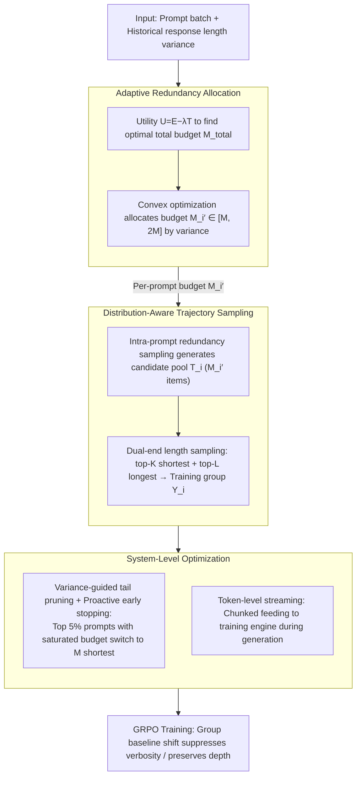

# DARTS: Distribution-Aware Active Rollout Trajectory Shaping for Accelerating LLM Reinforcement Learning

**Conference**: ICML 2026  
**arXiv**: [2605.30859](https://arxiv.org/abs/2605.30859)  
**Code**: Paper abstract notes "Source code available at: URL" (placeholder, to be confirmed after open source)  
**Area**: Reinforcement Learning / LLM Reasoning Training / System Optimization  
**Keywords**: GRPO, rollout acceleration, long-tail distribution, active shaping, dual-end sampling, adaptive redundancy allocation  

## TL;DR
DARTS redefines the long-tail bottleneck of LLM RL training rollouts from "scheduling circumvention" to "active distribution shaping." Through intra-prompt redundancy sampling + dual-end length sampling + variance-driven redundancy budget allocation, it explicitly shortens and tightens the rollout length distribution. Compared to VeRL, it achieves up to a 1.77× speedup on Qwen series 3B–32B models without sacrificing downstream accuracy.

## Background & Motivation

**Background**: Currently, "inference-time scaling" via RL algorithms such as GRPO / DAPO has become standard for LLMs. Each prompt is sampled by the policy $\pi_\theta$ for $M$ responses $\{o_i^j\}_{j=1}^M$ to calculate the group-normalized advantage $A(o_i^j) = (r_i^j - \mu(\mathcal{Y}_i))/\sigma(\mathcal{Y}_i)$, followed by gradient backpropagation. The pipeline is divided into rollout and training phases, with rollout accounting for over 70% of the total training time, forming the primary bottleneck. The root of this slowness is the extreme long-tail of rollout trajectory lengths—a few ultra-long trajectories triggered by specific prompts can be 5–10 times longer than the median and over 20 times longer than short responses. In synchronous on-policy systems, "the longest response stalls the entire batch," causing severe GPU idling.

**Limitations of Prior Work**: Existing mitigation strategies—such as Tail Batching in RollPacker and Partial Rollout in Kimi/Moonshot—are essentially "prompt-level tail scheduling." They over-sample $N' > N$ prompts and wait for $N$ prompts to complete, deferring or truncating remaining long-tail prompts. These methods only adjust "scheduling timing" without addressing the distribution itself; furthermore, they identify inter-prompt long-tails (variance between different prompts) while ignoring the significant long-tails within the same prompt. Although asynchronous routes can fully overlap rollout and training, they break on-policy semantics, leading to training instability and accuracy degradation.

**Key Challenge**: Scheduling routes cannot eliminate the fundamental waste—the long-tail trajectories themselves are already generated, and the token computation cost has already been paid. The authors observe an overlooked fact: rollout lengths within a single prompt also exhibit a severe long-tail (max/mean > 10×), and a large portion of these long-tails are "invalid verbosity"—repetitive filler or error loops that do not contribute to accuracy.

**Goal**: To upgrade from "managing tail latency" to "eliminating tail distribution," specifically decomposed into: (1) concentrating the model's rollout length distribution toward the short end without losing accuracy; (2) preserving necessary long-chain reasoning; (3) making the distribution shaping mechanism prompt-aware and adaptive; (4) flattening the additional sampling overhead of distribution shaping through system optimization.

**Key Insight**: The authors decompose long-tail trajectories into two patterns based on "length–reward correlation": Pattern I (redundant invalid tails, $\mathbb{E}[l|r>0] \le \mathbb{E}[l|r<0]$, where correct responses are shorter) and Pattern II (necessary deep tails, $\mathbb{E}[l|r>0] > \mathbb{E}[l|r<0]$, where correct responses require long chains). Ideal distribution shaping should suppress the former and preserve the latter.

**Core Idea**: Use a unified "dual-end length sampling + adaptive redundancy budget" mechanism to automatically achieve both "suppressing verbosity (Pattern I)" and "preserving depth (Pattern II)" through shifts in the GRPO group baseline, without explicit classification.

## Method

### Overall Architecture
DARTS acts as a rollout phase plug-in on top of VeRL, consisting of three components: (1) Distribution-Aware Trajectory Sampling—performs intra-prompt redundancy sampling for each prompt $q_i$ to obtain a candidate pool $\mathcal{T}_i$ (size $M_i' \ge M$), then selects a training set $\mathcal{Y}_i$ via dual-end length sampling; (2) Adaptive Redundancy Allocation—uses historical length variance $\tilde\sigma_L^2(q_i)$ as a proxy for long-tail severity to distribute the total redundancy budget $M_{\mathrm{total}}$ among prompts; (3) System-Level Optimization—variance-guided tail pruning + proactive early stopping + token-level streaming. The process does not modify the reward function or introduce extra hyperparameters (except for three stable system parameters $M_{\mathrm{up}}, M_{\mathrm{low}}, \lambda$). The three components are interlinked at runtime: first, the adaptive allocation sets a redundancy budget $M_i'$ for each prompt based on variance; this is fed into the distribution-aware sampler to generate candidates and perform dual-end selection; finally, system-level optimization prunes the approximately 5% extreme long-tail prompts and streams tokens into GRPO training.

### Key Designs

**1. Distribution-Aware Trajectory Sampling: Suppressing verbosity and preserving depth with one sampling rule**

Long-tails contain two opposite trajectory types—Pattern I "redundant invalid tails" (shorter responses are correct) and Pattern II "necessary deep tails" (correct responses require long reasoning). DARTS lets the GRPO group baseline handle this distinction: after generating $M_i' \ge M$ candidates $\mathcal{T}_i$ via intra-prompt redundancy sampling, it performs dual-end length sampling—selecting the top-$K$ shortest and top-$L$ longest (where $K+L=M$ and $K\gg L$, with $L=1$ in main experiments) while excluding invalid trajectories hitting the system length limit. Propositions 1 and 2 justify this: for Pattern I prompts, $\mathcal{Y}_{\text{short}}$ captures high-reward short samples, causing the group mean $\mu(\mathcal{Y}_i^{\text{dual}})\approx\bar r_{\text{short}}$ to be high, thus suppressing the advantage $r(o_i^{\text{long}})-\mu$ of redundant samples. For Pattern II prompts, $\mathcal{Y}_{\text{short}}$ contains mostly incorrect short answers, lowering $\mu$ and amplifying the positive advantage of necessary long chains. This rule exploits gradient shifts without extra components, ensuring the training set contains both "short and correct" templates and "long and correct" exploration paths.

**2. Variance-Based Adaptive Redundancy Allocation: Allocating budget by long-tail severity**

Redundancy sampling is costly; allocating it uniformly is wasteful as low-uncertainty prompts with tight distributions yield similar results regardless of sample size. DARTS finds that response length variance $\sigma_L^2(q_i)$ correlates strongly with long-tail severity and model uncertainty, using its moving average $\tilde\sigma_L^2(q_i)$ as a zero-cost proxy. The budget is determined in two steps: first, define utility $U(\bar M)=E(\bar M)-\lambda T(\bar M)$, where effectiveness $E$ uses dataset-level $\tilde\sigma_L^2$ and overhead $T$ is estimated via a cost model $T_{\text{rollout}}=\sum_{m}(l_{[m]}-l_{[m-1]})\cdot\mathrm{PTL}(d_{\mathrm{TP}}, M'-m+1)$. The optimal total budget $M_{\mathrm{total}}$ is found where $\partial U/\partial\bar M=0$. Second, solve the convex optimization $\min\sum_i \mathrm{Norm}(\tilde\sigma_L(q_i))/M_i'$ s.t. $\sum_i M_i'=M_{\mathrm{total}}$ and $M_{\mathrm{low}}\le M_i'\le M_{\mathrm{up}}$ (default $M_{\mathrm{low}}=M, M_{\mathrm{up}}=2M$). This reflects diminishing marginal utility: adding a candidate to a high-variance prompt is more valuable than to a low-variance one.

**3. Variance-Guided Tail Pruning + Token-Level Streaming: Handling extreme prompts and breaking sample-level granularity**

Dual-end sampling can be a negative optimization for the roughly 5% most expensive extreme prompts, as one must wait for the single longest trajectory to finish. DARTS identifies these prompts where the budget is saturated at $M_{\mathrm{up}}$ using variance signals and automatically switches to shortest-only sampling (taking the $M$ shortest). The insight is that for such prompts, the distribution is shifted so far right that the "shortest" is already long enough for deep reasoning. Once switched to shortest-only, proactive early stopping terminates remaining decoding after the $M$ short trajectories are collected. Additionally, token-level streaming addresses bottlenecks in large-scale data parallelism where sample-level overlap fails; it sends chunks of tokens to the training engine as they are generated, allowing the forward pass of the prefix to begin while the suffix is still being decoded.

### Loss & Training
The training objective is unchanged. The underlying RL algorithm uses GRPO (group size $M=8$) + DAPO optimization (clip-higher, token-level loss, overlong reward shaping). All prompt-level scheduling and distribution shaping occur in the rollout phase and are transparent to the training phase. Rewards are task-specific (e.g., verifiers for math). $\lambda$ controls allocation aggressiveness, with $M_{\mathrm{up}}=2M$ and a default dual-end ratio $L:K = 1:7$.

## Key Experimental Results

Experiments were conducted on 8 nodes (each with 8×H20 96GB + NVLink + 1.6Tbps IB) using Qwen2.5-3B/7B-Math/14B/32B and Qwen3-30B-A3B (MoE) on DAPO-MATH and MATH-lighteval datasets. Benchmark baselines included VeRL and Tail Batching.

### Main Results: End-to-End Throughput Speedup (vs VeRL)

| Model | VeRL | Tail Batching | DARTS | Gain (vs VeRL) | Gain (vs Tail Batching) |
|------|------|----------------|-------|-----------|-------------------|
| Qwen2.5-3B | 1.00× | 1.07× | 1.29× | 1.29× | 1.21× |
| Qwen2.5-Math-7B | 1.00× | ~1.3× | 1.45× | 1.45× | ~1.12× |
| Qwen2.5-14B | 1.00× | ~1.4× | 1.63× | 1.63× | ~1.16× |
| Qwen2.5-32B / Qwen3-30B-A3B | 1.00× | 1.62× (max) | 1.77× (max) | 1.77× | 1.43× |
| BBH Zero-shot (Qwen2.5-32B) | 78.1 | — | 84.7 | +6.6 | — |
| BBH Zero-shot (Qwen2.5-Math-7B) | 56.6 | — | 58.8 | +2.2 | — |

### Ablation Study: Component Contribution (Qwen2.5-14B, 32×H20)

| Configuration | Speedup | Description |
|------|---------|------|
| VeRL baseline | 1.00× | Standard GRPO + Synchronous on-policy |
| + Token-Level Streaming | 1.09× | Granularity optimization |
| + Distribution-Aware Sampling | 1.40× | Dual-end sampling (uniform budget) |
| + Adaptive Allocation (Ours) | 1.63× | Adds variance-adaptive allocation |

### Key Findings
- Most gains come from the sampling layer (1.40×), with adaptive allocation adding 0.23× and token streaming contributing 1.09×—confirming that the bottleneck is the distribution itself, not pipeline granularity.
- Acceleration is higher on larger models (1.29× on 3B → 1.77× on 32B) as they produce deeper reasoning chains and more prominent long-tails.
- Downstream accuracy remains on par with VeRL across 5 math benchmarks, while BBH Zero-shot scores improved by up to 6.6 points, proving that distribution shaping enhances generalization rather than harming reasoning.
- Control experiments with simple length penalties showed a 2–7% drop in accuracy, proving that shaping via group baseline shifts is superior to modifying rewards.

## Highlights & Insights
- Using the GRPO group baseline to automatically distinguish Pattern I/II is highly efficient. Dual-end sampling leverages $\mu(\mathcal{Y}_i)$ as a "distribution-aware" lever without extra components, a concept applicable to any group-relative advantage algorithm (DAPO, ReMax, RLOO).
- Using system metrics (length variance $\sigma_L^2$) as a bridge to algorithmic metrics (uncertainty and long-tails) is pragmatic, utilizing "free statistics" from rollout without extra models.
- The distinction between intra-prompt and inter-prompt long-tails is a major conceptual contribution. While prior work focused on prompt difficulty, DARTS addresses the 10× variance within a single prompt.

## Limitations & Future Work
- DARTS relies heavily on the GRPO group baseline mechanism, and its core theory (Propositions 1/2) may not hold for single-sample estimation algorithms like PPO.
- "Confounding effect": In prompts containing both Pattern I and II tails, dual-end sampling might prioritize length over reward signals, potentially neglecting high-quality mid-to-long chains.
- The $M_{\mathrm{up}}=2M$ cap limits shaping for extremely complex prompts; increasing this might trigger more tail pruning, causing regression to one-sided sampling.
- Gains diminish on smaller models and non-math domains where long-tails are less severe.

## Related Work & Insights
- **vs RollPacker / Tail Batching**: These focus on scheduling; DARTS directly reshapes the distribution and introduces an intra-prompt perspective, yielding 1.1–1.4× higher gains.
- **vs Partial Rollout (Kimi/Moonshot)**: Partial Rollout introduces slight off-policy noise; DARTS maintains strict on-policy semantics.
- **vs Length Penalty**: Direct penalties harm accuracy; DARTS performs "soft" shaping via baseline shifts, preserving reasoning depth.
- **Insight**: Viewing rollout as a "shapable distribution" rather than a "passive cost" can be extended to other sampling-heavy RL tasks, such as video generation or robotic episode distributions.

<!-- RELATED:START -->

## Related Papers

- [\[ICML 2026\] EchoRL: Reinforcement Learning via Rollout Echoing](echorl_reinforcement_learning_via_rollout_echoing.md)
- [\[ICLR 2026\] Accelerating Diffusion Planners in Offline RL via Reward-Aware Consistency Trajectory Distillation](../../ICLR2026/reinforcement_learning/accelerating_diffusion_planners_in_offline_rl_via_reward-aware_consistency_traje.md)
- [\[ICML 2026\] Hista and Numca: Estimate State Value Effectively for LLM Reinforcement Learning](hista_and_numca_estimate_state_value_effectively_for_llm_reinforcement_learning.md)
- [\[ICML 2026\] Trajectory-Level Data Augmentation for Offline Reinforcement Learning](trajectory-level_data_augmentation_for_offline_reinforcement_learning.md)
- [\[ICML 2026\] D$^2$Evo: Dual Difficulty-Aware Self-Evolution for Data-Efficient Reinforcement Learning](d2evo_dual_difficulty-aware_self-evolution_for_data-efficient_reinforcement_lear.md)

<!-- RELATED:END -->
