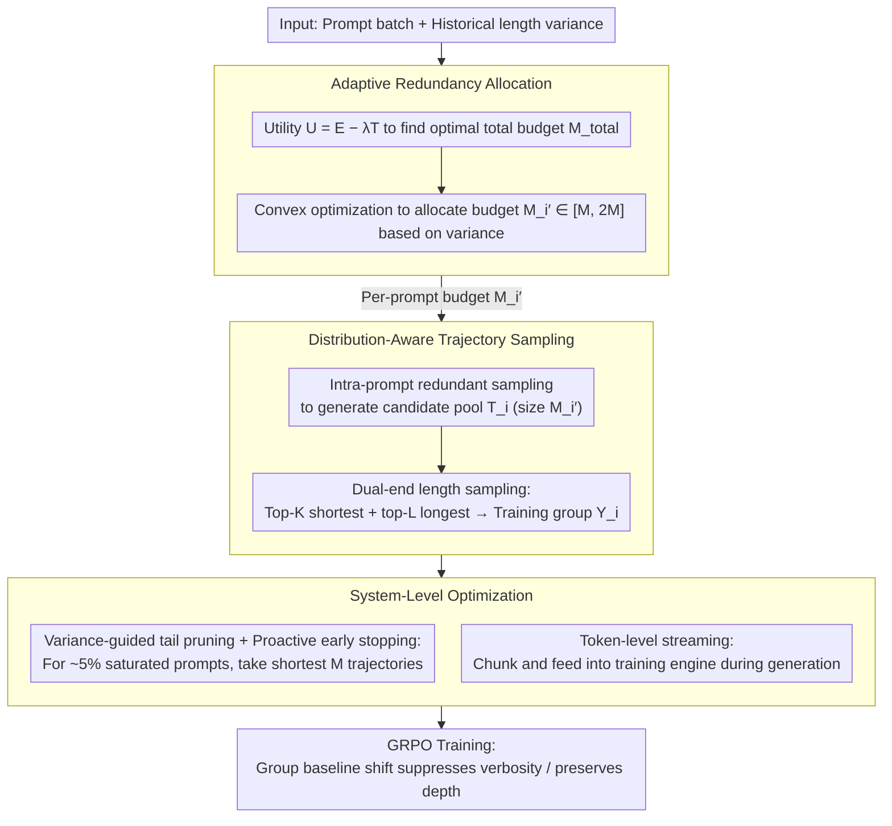

# DARTS: Distribution-Aware Active Rollout Trajectory Shaping for Accelerating LLM Reinforcement Learning

**Conference**: ICML 2026  
**arXiv**: [2605.30859](https://arxiv.org/abs/2605.30859)  
**Code**: The paper abstract notes "Source code available at: URL" (Placeholder to be confirmed after open sourcing)  
**Area**: Reinforcement Learning / LLM Inference Training / System Optimization  
**Keywords**: GRPO, rollout acceleration, long-tail distribution, active shaping, dual-end sampling, adaptive redundancy allocation  

## TL;DR
DARTS redefines the long-tail bottleneck in LLM RL rollout from "scheduling avoidance" to "active distribution shaping." By employing intra-prompt redundant sampling, dual-end length sampling, and variance-driven redundancy budget allocation, it explicitly compresses and tightens the model's rollout length distribution. It achieves up to 1.77x speedup compared to VeRL on Qwen series 3B–32B models without loss of downstream accuracy.

## Background & Motivation

**Background**: Currently, scaling "inference time" via RL algorithms like GRPO / DAPO has become standard for LLMs. Each prompt $q_i$ is sampled for $M$ responses $\{o_i^j\}_{j=1}^M$ by policy $\pi_\theta$ to calculate group-normalized advantage $A(o_i^j) = (r_i^j - \mu(\mathcal{Y}_i))/\sigma(\mathcal{Y}_i)$, followed by gradient backpropagation. The pipeline is split into rollout and training phases, where the rollout phase accounts for over 70% of total training time, acting as the primary bottleneck. The root cause of slowness is the extreme long-tail distribution of rollout trajectory lengths—a few prompts trigger ultra-long trajectories that can be 5–10x longer than the median and over 20x longer than short responses. In synchronous on-policy systems, the "single longest response stalls the entire batch," causing severe GPU idling.

**Limitations of Prior Work**: Existing mitigation strategies—such as Tail Batching in RollPacker and Partial Rollout in Kimi/Moonshot—are essentially "prompt-level tail scheduling." They over-sample $N' > N$ prompts and wait for $N$ prompts to finish, deferring or truncating long-tail prompts for later rounds. These methods only adjust "scheduling timing" without touching the distribution itself; they also focus on inter-prompt long tails (variance between different prompts) while ignoring significant intra-prompt long tails (variance within the same prompt). Alternative asynchronous routes can fully overlap rollout and training but break on-policy semantics, leading to training instability and performance degradation.

**Key Challenge**: Scheduling routes cannot eliminate the fundamental waste—the long-tail trajectories are still generated, and token computation costs are already paid. The authors observe an overlooked fact: rollout lengths for a single prompt also exhibit a severe long tail (max/mean > 10x), and a large portion of these tails consists of "invalid verbosity"—redundant chatter or error loops that do not contribute to accuracy.

**Goal**: Upgrade from "handling tail latency" to "eliminating the long-tail distribution," specifically: (1) concentrate the model’s rollout length distribution toward the short end without sacrificing accuracy; (2) simultaneously preserve necessary long-chain reasoning; (3) make the distribution shaping mechanism prompt-aware and adaptive; (4) utilize system optimizations to amortize the additional sampling overhead brought by distribution shaping.

**Key Insight**: The authors decompose long-tail trajectories into two modes based on "length-reward correlation"—Pattern I (Invalid Verbosity, $\mathbb{E}[l|r>0] \le \mathbb{E}[l|r<0]$, where correct responses are shorter) and Pattern II (Necessary Depth, $\mathbb{E}[l|r>0] > \mathbb{E}[l|r<0]$, where correct responses require long chains). Ideal distribution shaping should suppress the former while retaining the latter.

**Core Idea**: Use a unified "dual-end length sampling + adaptive redundancy budget" mechanism to automatically achieve "verbosity suppression (Pattern I)" and "depth preservation (Pattern II)" via offsets in the GRPO group baseline, without requiring explicit classification.

## Method

### Overall Architecture
DARTS is implemented as a rollout-phase plugin for VeRL, consisting of three main components: (1) Distribution-Aware Trajectory Sampling—performs intra-prompt redundant sampling for each prompt $q_i$ to obtain a candidate pool $\mathcal{T}_i$ (size $M_i' \ge M$), followed by dual-end length sampling to select the training set $\mathcal{Y}_i$; (2) Adaptive Redundancy Allocation—uses historical length variance $\tilde\sigma_L^2(q_i)$ as a proxy for long-tail severity to distribute the total redundancy budget $M_{\mathrm{total}}$ across prompts; (3) System-Level Optimization—variance-guided tail pruning + proactive early stopping + token-level streaming. The process does not modify the reward function and introduces no extra hyperparameters (except for three stable system parameters $M_{\mathrm{up}}, M_{\mathrm{low}}, \lambda$). The three components are interlinked: variance informs adaptive allocation for each prompt's budget $M_i'$, which feeds into distribution-aware sampling for generation and dual-end selection, and finally, system-level optimization prunes ~5% of extreme long-tail prompts and streams tokens into GRPO training.

### Key Designs

**1. Distribution-Aware Trajectory Sampling: Using one sampling rule to suppress verbosity and preserve depth without explicit classification**

Long-tail trajectories contain two opposing types—Pattern I is "invalid verbosity" (correct responses are shorter, while chatter and error loops extend the length), and Pattern II is "necessary depth" (correct responses naturally require long-chain reasoning). Ideal shaping should suppress the former and keep the latter, but explicit classification per prompt would introduce a new classifier and learning problem. DARTS cleverly uses the GRPO group baseline to automate this distinction: first, redundant intra-prompt sampling generates $M_i' \ge M$ candidates $\mathcal{T}_i$, followed by dual-end length sampling—selecting the top-$K$ shortest and top-$L$ longest (where $K+L=M$ and $K\gg L$, with $L=1$ in main experiments), excluding invalid trajectories hitting maximum length. Propositions 1/2 explain why this is self-consistent: for Pattern I prompts, $\mathcal{Y}_{\text{short}}$ mostly captures high-reward short samples, making the group mean $\mu(\mathcal{Y}_i^{\text{dual}})\approx\bar r_{\text{short}}$ high. Thus, the advantage $r(o_i^{\text{long}})-\mu$ of verbose positive examples is suppressed, discouraging verbosity. For Pattern II prompts, $\mathcal{Y}_{\text{short}}$ mostly contains incorrect short answers, leading to a low $\mu$, which amplifies the positive advantage of necessary long chains, encouraging depth. One rule leverages the shift of $\mu$ to move gradients in two opposite directions with zero extra engineering components. The dual-end combination ensures the training group contains both "short and correct" benchmarks and "long and correct" exploration paths, avoiding single-end bias.

**2. Variance-Based Adaptive Redundancy Allocation: Distributing the redundancy budget based on long-tail severity**

Redundant sampling is costly; uniform allocation to every prompt is wasteful as low-uncertainty prompts with short, tight distributions yield similar trajectories regardless of sample size. DARTS finds that response length variance $\sigma_L^2(q_i)$ is strongly correlated with "long-tail severity + model uncertainty." It uses the moving average $\tilde\sigma_L^2(q_i)$ as a proxy with near-zero online cost. The budget is determined in two steps: first, define utility $U(\bar M)=E(\bar M)-\lambda T(\bar M)$, where effectiveness $E$ uses dataset-level $\tilde\sigma_L^2$ and overhead $T$ is estimated via a cost model $T_{\text{rollout}}=\sum_{m}(l_{[m]}-l_{[m-1]})\cdot\mathrm{PTL}(d_{\mathrm{TP}}, M'-m+1)$ based on per-token latency. The optimal total budget $M_{\mathrm{total}}$ is found where $\partial U/\partial\bar M=0$. Second, solve a convex optimization $\min\sum_i \mathrm{Norm}(\tilde\sigma_L(q_i))/M_i'$ s.t. $\sum_i M_i'=M_{\mathrm{total}}$ and $M_{\mathrm{low}}\le M_i'\le M_{\mathrm{up}}$ (default $M_{\mathrm{low}}=M, M_{\mathrm{up}}=2M$). Since the second derivative is positive, a greedy approach is optimal. This reflects diminishing marginal utility: adding a candidate to a high-variance prompt is more valuable than to a low-variance one. Soft boundaries are also important—$M_{\mathrm{up}}=2M$ prevents a single prompt from consuming all redundancy, while $M_{\mathrm{low}}=M$ ensures the base GRPO training is maintained. Notably, using a "system metric" (length variance) as a bridge to "algorithmic metrics" (long-tail + uncertainty) eliminates the need for extra uncertainty estimation models.

**3. Variance-Guided Tail Pruning + Token-Level Streaming: Providing a safety net for 5% extreme prompts and breaking sample-level granularity**

Dual-end sampling can be a counter-optimization for the ~5% most expensive extreme prompts—one must wait for the longest trajectory to finish to obtain the top-$L$ longest. DARTS uses variance signals to identify these "saturated" prompts (at $M_{\mathrm{up}}$) and automatically switches from dual-end to shortest-only (taking the shortest $M$ trajectories). The insight is that for such prompts, the distribution has shifted right significantly; the "shortest" is already long and deep enough to sustain training. Switching to shortest-only enables proactive early stopping: once $M$ short trajectories are collected, unfinished long-tail decoding is terminated, cutting the most expensive tail token computations. Another optimization addresses the bottleneck in large-scale data parallelism where "only a few trajectories run per card, failing sample-level overlap." Token-level streaming changes "sending to training only after a trajectory is complete" to "sending chunks after accumulating a certain number of tokens." This allows the training engine to start the forward pass of a long trajectory's prefix while its suffix is still being generated, further compressing idle time.

### Loss & Training
The training objective is unchanged. The underlying RL algorithm is GRPO (group size $M=8$) + DAPO optimization (clip-higher, token-level loss, overlong reward shaping). All prompt-level scheduling and distribution shaping occur during the rollout phase and are transparent to training. Rewards strictly follow the original tasks (e.g., verifiers for math). $\lambda$ controls the aggressiveness of redundancy allocation (high $\lambda$ is conservative, low $\lambda$ is aggressive). $M_{\mathrm{up}}=2M$, and the dual-end default ratio is $L:K = 1:7$.

## Key Experimental Results

Experiments were primarily conducted on 8 nodes (8×H20 96GB per node + NVLink + 1.6Tbps IB) using Qwen2.5-3B/7B-Math/14B/32B and Qwen3-30B-A3B (MoE). Datasets include DAPO-MATH (7B–32B) and MATH-lighteval (3B). Baseline comparisons include VeRL (SOTA open-source RL framework) and Tail Batching (representative prompt-level scheduling like RollPacker).

### Main Results: End-to-End Throughput Speedup (vs VeRL)

| Model | VeRL | Tail Batching | DARTS | Gain vs VeRL | Gain vs Tail Batching |
|------|------|----------------|-------|-----------|-------------------|
| Qwen2.5-3B | 1.00× | 1.07× | 1.29× | 1.29× | 1.21× |
| Qwen2.5-Math-7B | 1.00× | ~1.3× | 1.45× | 1.45× | ~1.12× |
| Qwen2.5-14B | 1.00× | ~1.4× | 1.63× | 1.63× | ~1.16× |
| Qwen2.5-32B / Qwen3-30B-A3B | 1.00× | 1.62× (max) | 1.77× (max) | 1.77× | 1.43× |
| BBH Zero-shot (Qwen2.5-32B) | 78.1 | — | 84.7 | +6.6 | — |
| BBH Zero-shot (Qwen2.5-Math-7B) | 56.6 | — | 58.8 | +2.2 | — |

### Ablation Study: Component Contribution Breakdown (Qwen2.5-14B, 32×H20)

| Configuration | Speedup | Description |
|------|---------|------|
| VeRL baseline | 1.00× | Standard GRPO + Synchronous on-policy |
| + Token-Level Streaming | 1.09× | Individual contribution ~9%, granularity optimization |
| + Distribution-Aware Sampling | 1.40× | Dual-end sampling (uniform budget), primary source of gain |
| + Adaptive Allocation (DARTS) | 1.63× | Variance-adaptive allocation adds +0.23× |

### Key Findings
- Speedup primarily stems from the sampling layer (1.40x). Adaptive allocation adds 0.23x, while token streaming contributes 1.09x—confirming that the bottleneck resides in the "distribution itself" rather than pipeline granularity.
- Acceleration scales with model size (1.29x for 3B → 1.77x for 32B). Larger models exhibit deeper reasoning chains and more prominent long tails, providing more optimization room.
- Training convergence curves and average scores on 5 math benchmarks (MATH500, GSM8K, AIME2024, AIME2025, Olympiad) are on par with VeRL. BBH zero-shot scores improved by up to 6.6 points (78.1 to 84.7 for Qwen2.5-32B), proving that distribution shaping improves generalization without harming reasoning.
- Sensitivity of dual-end ratio: $L:K = 1:7$ yields 1.45x speedup (7B). $2:6$ drops slightly to 1.43x, and $4:4$ falls to 1.25x—larger proportions of long tails weaken shaping, but $1:7$ is stable.
- Control experiments with simple length penalties show a 2–7% drop in accuracy. This proves that shaping via "group baseline shifts" (DARTS) rather than "reward modification" is crucial—correct long chains still receive strong positive gradients.
- Cross-domain experiments: Multi-modality (Qwen2.5-VL-3B / Geo3K) shows 1.20x speedup, while code generation (Phi-3-mini-3B / Eurus-2-RL-Data) shows 1.15x. Gains are smaller on small models with less significant long tails but the method remains transferable.

## Highlights & Insights
- "Automatic differentiation of Pattern I/II using GRPO group baseline" is the most clever design—dual-end sampling leverages gradients in opposite directions (suppressing verbosity vs expanding depth) solely via the shift in $\mu(\mathcal{Y}_i)$. This "algorithmic leverage" requires zero extra engineering and can be applied to any group-relative advantage algorithm (DAPO, ReMax, RLOO).
- Using "system metrics (length variance $\sigma_L^2$)" as a bridge for "algorithmic metrics (long-tail severity + uncertainty)" is practical—it avoids extra uncertainty models, repurposing free statistics for system-algorithm co-design.
- Introducing PTL profiling into the RL framework for cost-aware allocation is rare but necessary. Most RL acceleration works ignore the non-linear latency of generation relative to batch size, leading to suboptimal uniform budget allocation in large-scale scenarios.
- The distinction between intra-prompt and inter-prompt long tails is the most significant conceptual contribution—previous scheduling works assumed tails came from "varying prompt difficulty." DARTS identifies a 10x difference within the same prompt and optimizes from the model's intrinsic rollout behavior.

## Limitations & Future Work
- DARTS depends heavily on the GRPO group baseline mechanism—the core theory (Propositions 1/2) does not hold for single-sample estimation algorithms like PPO (where advantages aren't normalized via group means). No adaptation for PPO was provided.
- Confounding effects: For prompts containing both invalid verbosity and necessary depth, dual-end sampling might prune some long chains while keeping others based on length rather than reward signal, potentially "killing" high-quality mid-to-long chains.
- $M_{\mathrm{up}}=2M$ limit: For extremely complex prompts (e.g., Olympiad proofs), a $2M$ candidate pool might not cover the correct long chain. Increasing $M_{\mathrm{up}}$ triggers tail pruning, which degenerates into single-end sampling, potentially harming reasoning depth long-term.
- Diminishing returns on small models and non-math domains (1.29x on 3B vs 1.77x on 32B). The method's effectiveness is sensitive to "long-tail severity"; it offers little gain for tasks with naturally compact rollouts (short QA, classification).
- Stability over long training durations: While validated for ~500 steps, it is unclear if distribution shaping will trap models in a "short-chain comfort zone," losing exploration capability over tens of thousands of steps.

## Related Work & Insights
- **vs RollPacker / Tail Batching**: Both use inter-prompt over-sampling, but Tail Batching only schedules (deferring tails), whereas DARTS directly modifies the distribution and introduces an intra-prompt perspective.
- **vs Partial Rollout (Kimi/Moonshot)**: Partial Rollout truncates tails and resumes them in the next step (off-policy); DARTS maintains on-policy semantics while compressing the distribution.
- **vs Asynchronous RL (AReaL, AsyncFlow)**: Asynchronous routes hide tail latency but sacrifice on-policy semantics; DARTS preserves synchronous semantics while eliminating the tail from the distribution layer.
- **vs Length Penalty**: Simple length penalties drop accuracy by 2–7%, whereas DARTS uses "soft" shaping via group baseline shifts, preserving precision.
- **Insight**: Treating rollout as a "shapable distribution" rather than "passive overhead" can be extended to all sampling-based RL—episode length distributions in video/robotics RL or tool call step distributions in agentic RL could benefit from similar "sampling redundancy + group baseline shift" active shaping.

<!-- RELATED:START -->

## Related Papers

- [\[ICML 2026\] EchoRL: Reinforcement Learning via Rollout Echoing](echorl_reinforcement_learning_via_rollout_echoing.md)
- [\[ICML 2026\] Trajectory-Level Data Augmentation for Offline Reinforcement Learning](trajectory-level_data_augmentation_for_offline_reinforcement_learning.md)
- [\[ICLR 2026\] QuRL: Efficient Reinforcement Learning with Quantized Rollout](../../ICLR2026/reinforcement_learning/qurl_efficient_reinforcement_learning_with_quantized_rollout.md)
- [\[ICML 2026\] Safety Generalization Under Distribution Shift in Safe Reinforcement Learning: A Diabetes Testbed](safety_generalization_under_distribution_shift_in_safe_reinforcement_learning_a_.md)
- [\[ICML 2026\] Hista and Numca: Estimate State Value Effectively for LLM Reinforcement Learning](hista_and_numca_estimate_state_value_effectively_for_llm_reinforcement_learning.md)

<!-- RELATED:END -->
