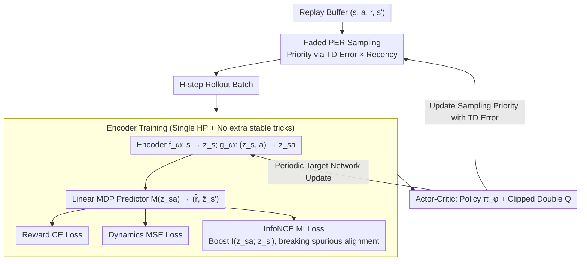

# DR.Q: Debiased Model-based Representations for Sample-efficient Continuous Control

**Conference**: ICML 2026  
**arXiv**: [2605.11711](https://arxiv.org/abs/2605.11711)  
**Code**: <https://github.com/dmksjfl/DR.Q>  
**Area**: Reinforcement Learning / off-policy actor-critic / Representation Learning  
**Keywords**: Model-based representation, mutual information, InfoNCE, faded PER, primacy bias

## TL;DR
DR.Q builds upon the MR.Q framework ("model-based representation + actor-critic") by introducing two key components: explicitly maximizing the mutual information between $z_{sa}$ and the next-state representation $z_{s'}$ via InfoNCE, and mitigating early-experience overfitting with "faded prioritized replay" that fuses "PER × forget." It outperforms strong baselines like SimBaV2, MR.Q, and TDMPC2 across 73 continuous control tasks using a single set of hyperparameters.

## Background & Motivation

**Background**: To improve sample efficiency, the community currently follows two primary paths: (a) model-free methods focusing on value-overestimation mitigation, replay reuse, or architectural improvements; (b) learning world models for planning (TDMPC2) or data augmentation (MBPO). Recently, "model-based representation" has emerged as a third path: using model-based objectives to train state/state-action encoders to embed latent dynamics into representations, which are then fed into standard actor-critic frameworks (e.g., TD7, MR.Q).

**Limitations of Prior Work**: Methods like MR.Q use $\min \mathbb E[(z_{sa}-z_{s'})^2]$ for latent space consistency, but **minimizing Euclidean distance does not necessarily increase mutual information** (Theorem 4.1)—it may simply align redundant dimensions while ignoring critical ones. Combined with uniform sampling or standard PER, these methods are prone to primacy bias, causing representations to overfit early experience.

**Key Challenge**: The objectives for representation learning ("geometric proximity vs. informational alignment") and sampling strategies ("importance via TD error vs. recency via time") have evolved independently. Both introduce biases that ultimately degrade actor-critic performance.

**Goal**: (1) Upgrade "latent dynamics consistency" from purely geometric to "geometric + mutual information" with theoretical justification; (2) Fuse "importance" and "recency" prioritization signals into a single sampling probability formula; (3) Cover 73 tasks under a single set of hyperparameters.

**Key Insight**: The implicit assumption in MR.Q (Small MSE $\implies$ Large Mutual Information) is refuted by Theorem 4.1. Simultaneously, the forget mechanism from Wang/Kang and Schaul's PER are unified within a single formula.

**Core Idea**: Explicitly replace the implicit mutual information assumption in MR.Q with InfoNCE. Use faded PER $P(i)\propto |\delta(i)|^\alpha (1-\epsilon)^i$ to simultaneously suppress both "old" and "unimportant" negative signals.

## Method

### Overall Architecture
The framework follows the two-stage approach of MR.Q: (a) training an encoder $f_\omega:s\to z_s$, $g_\omega:(z_s,a)\to z_{sa}$, and a linear MDP predictor $M(z_{sa})\to (\hat r,\hat z_{s'})$; (b) training a deterministic policy $\pi_\phi$ and clipped double Q $Q_{\theta_{1,2}}$ on $z_s$ and $z_{sa}$. The encoder is optimized on $H$-length rollouts using a reward CE loss, dynamics MSE, and InfoNCE. Sampling is performed via faded PER. DR.Q differs from MR.Q in only two aspects—switching to faded PER and adding an InfoNCE term to the encoder loss—while keeping the rest of the encoder/predictor/actor-critic backbone and training configurations identical.

### Key Designs

**1. InfoNCE Mutual Information Loss (Equation 8): Upgrading "Geometric Proximity" to "Informational Alignment"**

MR.Q implicitly assumes that "small MSE $\implies$ large mutual information," but Theorem 4.1 provides a counterexample—minimizing $\|z_{sa}-z_{s'}\|^2$ can align redundant dimensions while neglecting critical ones. DR.Q addresses this by explicitly maximizing the mutual information between $z_{sa}$ and $\tilde z_{s'}$ (from the target network). Using $N$ samples in a batch as mutual negative samples, the contrastive loss via cosine similarity is:

$$\mathcal L_I=-\frac1N\sum_i\log\frac{\exp(\cos(\hat z_{s'_i},\tilde z_{s'_i})/\tau)}{\sum_k\exp(\cos(\hat z_{s'_i},\tilde z_{s'_k})/\tau)},$$

which is equivalent to the lower bound $I(\hat Z_{s'};\tilde Z_{s'})\ge \log N - \mathcal L_I$. Lemma 4.2 further shows that increasing $I$ decreases the conditional entropy $H(Z_{s'}|Z_{sa})$, leading to more deterministic latent dynamics and a tighter value-error bound. This term is effective because it eliminates "spurious alignment" in MR.Q representations, forcing the encoder to allocate capacity to task-relevant signals rather than redundancy.

**2. Faded Prioritized Experience Replay (Equation 4): Balancing "Importance" and "Recency"**

Uniform sampling causes representations to overfit early experience (primacy bias). Pure PER can lock the policy onto early high-TD-error transitions, while pure forget mechanisms may lose low-frequency but informative old samples. DR.Q multiplies "TD-error importance" and "temporal recency" into a single sampling probability:

$$P(i)=\frac{|\delta(i)|^\alpha (1-\epsilon)^i}{\sum_j |\delta(j)|^\alpha (1-\epsilon)^j},$$

where $i=0$ represents the latest transition. This is implemented using LAP-enhanced PER, with a truncation $\epsilon_\mathrm{low}$ for the forget weights to prevent valuable old experience from being zeroed out. Theorem 4.3 guarantees that for the same TD-error, older samples have a strictly lower probability of being sampled, and the total number of samples is bounded by a constant.

**3. Unified Configuration for Encoder and Actor-Critic: 73 Tasks with One Set of Hyperparameters**

Combining the three encoder losses and actor-critic training, the encoder optimizes $\mathcal L^\mathrm{DR.Q}_\mathrm{enc}=\sum_{t=1}^H \lambda_r \mathcal L_\mathrm{reward} + \lambda_d \mathcal L_\mathrm{dynamics} + \lambda_m \mathcal L_I$ on rollouts of length $H$. The critic uses Huber loss with a multi-step return ($H_Q$) and clipped double Q. The actor employs Gaussian noise and clipping for exploration. Notably, the authors omit common stability tricks like normalization, parameter resets, or hidden regularization to demonstrate that "good representation + good sampling" is sufficient for robustness across all 73 tasks.

### Loss & Training
- Reward loss: Two-hot encoding + symexp interval + CE.
- Dynamics loss: $\mathcal L_\mathrm{dynamics}=\mathbb E[(\hat z_{s'}-\mathrm{SG}(\tilde z_{s'}))^2]$, with stop-gradient to prevent target encoder drift.
- InfoNCE: Equation 8 as above, with temperature $\tau$.
- Total loss: Weighted sum of the three terms; $\lambda_r,\lambda_d,\lambda_m$ are uniform across all tasks.
- Replay Ratio (UTD) = 1, which is more efficient than high-UTD methods like SimBaV2 or FoG.

## Key Experimental Results

### Main Results (73 Tasks, 10 Seeds, Single Hyperparameter; summarized from Figure 1)

| Benchmark | Task Count | Key Comparison | Gain |
|---|---|---|---|
| MuJoCo | — | DR.Q vs MR.Q / SimBaV2 / TDMPC2 | Match or Exceed |
| DMC-Hard (7 dog/humanoid) | 7 | DR.Q vs SimBaV2 | +15.5% |
| DMC-Visual | — | DR.Q vs MR.Q | +26.8% |
| HumanoidBench (w/ hand) | 14 | DR.Q vs FoG | +58.9% |
| All 73 Tasks | 73 | DR.Q vs MR.Q | Consistent Lead |

DR.Q is the first algorithm to achieve an average return exceeding 700 on the dog-run task within 1M environment steps.

### Ablation Study (Figure 4, 4 representative tasks, 10 seeds)

| Configuration | Observation | Explanation |
|---|---|---|
| Full DR.Q | Optimal sample efficiency and asymptotic performance | Synergy of InfoNCE + faded PER |
| w/o InfoNCE ($\lambda_m=0$) | Significant drop on HumanoidBench tasks | Mutual information constraints are vital for redundant state spaces |
| DR.Q (only forget) | Curve collapses after removing PER | Without TD-error priority, important samples are buried |
| DR.Q (only LAP) | Curve collapses after removing forget | Early experiences overfit, causing primacy bias |
| Without InfoNCE | Performs at least as well as MR.Q | DR.Q degrades gracefully to MR.Q |

### Key Findings
- The gain from InfoNCE is particularly significant in **high-dimensional redundant states** (e.g., HumanoidBench with a dexterous hand), as it forces the representation to encode task-relevant signals.
- PER and forgetting must be **combined**: removing either results in worse performance than the full version, proving that "Importance × Recency" are complementary axes.
- Achieving high performance across 73 tasks with a single set of hyperparameters is rare in RL, demonstrating DR.Q's robustness and challenging the culture of task-specific tuning.

## Highlights & Insights
- **Theoretical-Experimental-Engineering Loop**: Theorem 4.1 identifies the flaw in MR.Q's assumption, Lemma 4.2 provides the chain from mutual information to value error bounds, and InfoNCE provides the implementation.
- Faded PER uses a minimalist formula to reflect two priors, bolstered by Theorem 4.3's strict properties regarding old sample sampling probabilities.
- Deliberately avoiding common tricks (no normalization, no reset) while still winning suggests that "less is more" holds true when representations are learned effectively.

## Limitations & Future Work
- Underperforms on Hopper-v4—the cost of a unified hyperparameter; simple dynamics tasks may be penalized by a complex representation learner.
- Fails on visual-humanoid-run within the 1M step budget; representations struggle to learn from pixels in such a small window.
- Not yet validated on discrete actions (Atari) or non-Markovian (POMDP) tasks; hard exploration tasks were not tested.
- InfoNCE introduces a dependency on batch size and negative sample quality, which was not ablated.

## Related Work & Insights
- **vs MR.Q (Fujimoto et al. 2025)**: Shares the backbone, but MR.Q only minimizes MSE and uses uniform/PER sampling, whereas DR.Q adds InfoNCE and faded PER.
- **vs TDMPC2 (Hansen et al. 2024)**: TDMPC2 performs planning in latent space; DR.Q focuses on actor-critic learning, being more lightweight without sacrificing performance.
- **vs SimBaV2 (Lee et al. 2025)**: SimBaV2 relies on architecture and high UTD; DR.Q matches/exceeds it with UTD=1 and better representations, demonstrating "information density > computation density."
- **vs FoG (Kang et al. 2025)**: FoG applies a forget mechanism in isolation; DR.Q fuses it with PER, proved more stable theoretically and empirically.

## Rating
- Novelty: ⭐⭐⭐⭐ While the components themselves aren't entirely new, refuting previous assumptions via Theorem 4.1 and systematically fusing PER and forgetting is a significant contribution.
- Experimental Thoroughness: ⭐⭐⭐⭐⭐ 73 tasks × 10 seeds × single hyperparameter across HumanoidBench, DMC, and MuJoCo is exceptionally rigorous.
- Writing Quality: ⭐⭐⭐⭐ Strong connection between theory and experiments; Figure 1/3/4 are very intuitive.
- Value: ⭐⭐⭐⭐ Provides a clear upgrade for the "model-based representation" lineage; the open-source code and single hyperparameter make it highly practical for the RL community.

<!-- RELATED:START -->

## Related Papers

- [\[ICLR 2026\] WIMLE: Uncertainty-Aware World Models with IMLE for Sample-Efficient Continuous Control](../../ICLR2026/reinforcement_learning/wimle_uncertainty-aware_world_models_with_imle_for_sample-efficient_continuous_c.md)
- [\[ICLR 2026\] Sample-efficient and Scalable Exploration in Continuous-Time RL](../../ICLR2026/reinforcement_learning/sample-efficient_and_scalable_exploration_in_continuous-time_rl.md)
- [\[ICML 2026\] Dr. Tulu: Reinforcement Learning with Evolving Rubrics for Deep Research](dr_tulu_reinforcement_learning_with_evolving_rubrics_for_deep_research.md)
- [\[ICML 2026\] Laplacian Representations for Decision-Time Planning](laplacian_representations_for_decision-time_planning.md)
- [\[ICML 2026\] From Reward-Free Representations to Preferences: Rethinking Offline Preference-Based Reinforcement Learning](from_reward-free_representations_to_preferences_rethinking_offline_preference-ba.md)

<!-- RELATED:END -->
