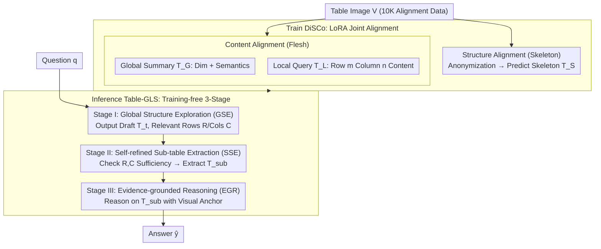

# Decoupling Skeleton and Flesh: Efficient Multimodal Table Reasoning with Disentangled Alignment and Structure-aware Guidance

**Conference**: ICML 2026 Spotlight  
**arXiv**: [2602.03491](https://arxiv.org/abs/2602.03491)  
**Code**: https://github.com/AAAndy-Zhu/TableVLM  
**Area**: Multimodal VLM / Table Reasoning / Representation Disentanglement / Training-free Inference  
**Keywords**: LVLM, Table image understanding, Structure-content decoupling, Global-to-local reasoning, Sub-table evidence  

## TL;DR
This paper proposes a dual-component suite for multimodal table reasoning: during training, DiSCo decouples "skeleton" and "flesh" alignment targets via structure anonymization, allowing LVLMs to learn layouts with only 10K table images; during inference, Table-GLS compresses full-image QA into the minimal verifiable sub-table through a "global structure exploration $\to$ self-refined sub-table extraction $\to$ evidence-grounded reasoning" pipeline. This approach requires no specialized SFT for reasoning or external tools, outperforming SFT/RL baselines that rely on 82K-97K annotations across 21 benchmarks.

## Background & Motivation

**Background**: Adapting LVLMs for table reasoning currently follows two main paths: first, large-scale SFT or GRPO reinforcement learning (Table-LLaVA, Table-R1, TURBO) to inject hundreds of thousands of table images with HTML/Markdown/LaTeX strings into the model; second, utilizing external tools (ReFocus) for multi-hop reasoning via visual editors and code control.

**Limitations of Prior Work**: The SFT route requires expensive table reasoning annotations and often triggers catastrophic forgetting of general reasoning capabilities; the external tool route increases inference latency and system complexity without fundamentally enhancing the model's intrinsic structural understanding. Both paths couple **structure (row-column layout, header hierarchy)** and **content (cell semantics)** within the same linearized sequence, forcing the model to learn entangled signals, which leads to poor cross-layout generalization and low sample efficiency.

**Key Challenge**: Serialized representations like HTML/Markdown naturally mix structure tokens (`<tr>`, `|`, header tags) and content tokens into a single long sequence. When models are tasked with learning both simultaneously, structural signals are drowned out by massive content tokens. Conversely, content understanding depends on a structural skeleton that has yet to be mastered, creating a "chicken-and-egg" barrier.

**Goal**: (1) Enable LVLMs to learn generalizable table structural representations using minimal alignment data; (2) robustly answer questions regarding dense layouts during inference without additional training or tool invocation.

**Key Insight**: The authors observe that LVLMs possess strong intrinsic text-semantic reasoning; what is missing is the independent dimension of "table structure." By decoupling structure and content learning—using anonymized "skeleton" tables for structure and global/local coordinates as anchors for content—the model can "graft" its existing semantic abilities onto the structural skeleton. Inference follows the same decoupling logic: locate the row-column skeleton first, then extract sub-tables for evidence reasoning.

**Core Idea**: The "skeleton-flesh" decoupling is applied consistently across training (DiSCo dual-path alignment) and inference (Table-GLS three-stage chain), treating table capability as a "plug-and-play" module rather than an end-to-end forced injection.

## Method

### Overall Architecture
During training, DiSCo uses 10K table images to simultaneously construct **structure alignment samples** $(I_S,V)\to T_S$ (anonymized HTML/Markdown/LaTeX where cell contents are replaced by a placeholder $t_p$) and **content alignment samples**—global semi-structured summaries $T_G$ (e.g., "$M$ rows, $N$ columns, column $m$ describes X") and local cell semantics $T_L$ (e.g., "Row $m$ Column $n$: [content]"). These three objectives are jointly fine-tuned via LoRA. During inference, Table-GLS decomposes single-step QA into three stages: Global Structure Exploration (GSE) providing relevant row/column indices $R,C$ and a reasoning draft $T_t$; Self-refined Sub-table Extraction (SSE) checking $R,C$ for sufficiency and extracting the minimal sub-table $T_{sub}$; and Evidence-grounded Reasoning (EGR) outputting $\hat{y}$ based on $T_{sub}$ (using the original image as a visual anchor). The pipeline requires no reasoning-specific labels, with structural capability provided by DiSCo and reasoning stems from the base LVLM itself.

### Key Designs

**1. DiSCo Structure Alignment (Skeleton): Isolating Layout through Cell Anonymization**

In HTML/Markdown, structural tokens are far outnumbered by content tokens, causing them to be submerged during training. DiSCo's solution is straightforward: anonymize the standard sequence $T$ into $T_S=\texttt{Anonymize}(T,t_p)$, replacing all cell contents with a uniform placeholder $t_p$. The training objective $\mathcal{L}_{\text{struct}}=-\mathbb{E}\log P_\theta(T_S\mid I_S,V)$ forces the model to rely solely on visual layout cues (grid lines, header positions) to predict the skeleton. By zeroing out content signals, structural capability is independently supervised, leading to better generalization on unseen merged cells and nested headers—exhibited by significant gains in OOD TSD/TCE.

**2. DiSCo Content Alignment (Flesh): Grafting Semantics onto Structural Coordinates**

Once the skeleton is learned, the model treats "Row $m$ Column $n$" as a coordinate system rather than a free-form text stream. Content alignment is divided into two layers: Global, where the model outputs semi-structured summaries $T_G$ ($\mathcal{L}_{\text{content\_global}}$); and Local, where the model outputs "Row $m$ Column $n$: [content]" given specific coordinates ($\mathcal{L}_{\text{content\_local}}$). Unlike traditional HTML alignment that binds semantics to a fixed sequence position, DiSCo treats "querying Row $m$ Column $n$" as a native operation, which perfectly serves as the interface for the subsequent Table-GLS stage.

**3. Table-GLS Global-to-Local Three-stage Inference: Plan, Extract, then Reason**

Table-GLS replaces single-step QA with an interpretable "find evidence vs. use evidence" chain. Stage I (Global Structure Exploration) uses prompt $I_{GSE}$ to output a reasoning draft $T_t$ and row/column indices $R,C$, forcing a "where-to-look" decision. Stage II (Self-refined Sub-table Extraction) uses $I_{SSE}$ for the model to self-check the sufficiency of $R,C$ and extract the minimal sub-table $T_{sub}$, preventing error propagation. Stage III (Evidence-grounded Reasoning) generates the final answer $\hat{y}=\text{LVLM}(I_{EGR},T_{sub},V,q)$. This explicit split reduces spurious correlations and creates an auditable trace for OOD errors; SSE is particularly critical—ablation shows AIT-QA drops from 76.71 to 73.39 without it.

### Loss & Training
The total DiSCo loss is $\mathcal{L}_{\text{DiSCo}}=\mathcal{L}_{\text{struct}}+\mathcal{L}_{\text{content\_global}}+\mathcal{L}_{\text{content\_local}}$. All LVLMs (Gemma3, LLaVA, Qwen3-VL) are fine-tuned via LoRA to preserve general reasoning. Table-GLS is entirely training-free, utilizing vLLM to run zero-shot three-stage prompts. DiSCo (representation) and Table-GLS (reasoning process) are orthogonal and complementary.

## Key Experimental Results

### Main Results
Evaluation across 21 table understanding and reasoning benchmarks using only 10K table images for alignment (vs. 82K-97K for baselines), tested in a zero-shot setting:

| Task Cluster | Configuration | Key Metric | Ours (Qwen3-VL-8B) | Textual (10K) | Textual-All (97K) |
| :--- | :--- | :--- | :--- | :--- | :--- |
| Table Understanding (Seen) | Avg (TSD/TCE/etc) | Accuracy | **DiSCo 42.9-93.5** | 41.0-89.6 | 37.7-89.8 |
| OOD Table Understanding | OOD TSD/TCE/etc | Accuracy | **DiSCo 65.5-88.4** | 44.8-82.0 | 50.1-86.1 |
| Table Reasoning (8 tasks) | Full (DiSCo+GLS) | Avg | **> GPT-4o-mini & Table-LLaVA** | – | – |

On Qwen3-VL-32B, DiSCo improves OOD TCL from 65.91 to 74.10. For smaller models like Gemma3n-E4B, OOD TCL improves from 9.00 to 14.32, whereas traditional textual alignment only reaches 10.20, proving that decoupling is vital for preventing OOD collapse in small models.

### Ablation Study
(Qwen3-VL-8B, Full = DiSCo + Table-GLS):

| Configuration | HiTab | AIT-QA(O) | InfoTabs | PubHealthTab(O) |
| :--- | :--- | :--- | :--- | :--- |
| **Full** | 27.35 | **76.71** | **72.67** | **77.14** |
| − GSE | 24.30 | 62.82 | 72.09 | 74.92 |
| − SSE | **31.41** | 73.39 | 70.20 | 73.94 |
| Only Table-GLS | 29.76 | 55.58 | 73.59 | 72.76 |

### Key Findings
- **Structural decoupling is key for OOD**: DiSCo's improvements are significantly higher in OOD tasks than in-domain ones; textual alignment often degrades OOD performance (e.g., TCL), suggesting it overfits to specific training layout patterns.
- **GSE is an OOD lifesaver**: Removing Global Structure Exploration drops AIT-QA performance from 76.71 to 62.82 (nearly 14 points).
- **DiSCo and Table-GLS must pair**: Table-GLS alone (without DiSCo) achieves only 55.58 on AIT-QA, confirming that representation alignment and reasoning path decoupling are mutually necessary.
- **Small data, high impact**: Using only 10K images outperforms baselines using 82K-97K annotations, setting a new bar for sample efficiency.

## Highlights & Insights
- **"Skeleton/Flesh" as an elegant inductive bias**: Separating "what is the layout" from "what is inside" prevents alignment tokens from interfering. This approach is transferable to domains like code (AST vs. identifier semantics) or UI (layout vs. copy).
- **Symmetric decoupling**: DiSCo decouples at the training level while Table-GLS decouples at the inference level, creating a closed loop where learned representations are effectively utilized.
- **Plan-before-extract Reflection**: Forcing the model to explicitly evaluate if evidence is sufficient in the SSE stage is a low-cost yet high-gain engineering trick suitable for general LVLM agent frameworks.

## Limitations & Future Work
- Evaluation focuses on static images; joint reasoning for tables embedded within long documents or scientific PDFs remains unexplored.
- DiSCo requires HTML/Markdown/LaTeX ground truth for training to construct anonymized samples, which is difficult for low-quality OCR or pure scans.
- Table-GLS increases inference latency (~2-3x) due to the three-stage process; an early-exit classifier for simple queries could be beneficial.
- No iterative mechanism for "re-searching" if Stage II fails to correct a significantly flawed Stage I prediction.

## Related Work & Insights
- **Comparison with Table-LLaVA/TabPedia**: These rely on massive SFT (82K-97K) for serialized learning; DiSCo matches in-domain and dominates OOD with 10K images.
- **Comparison with Table-R1/TURBO**: While those use GRPO/RL for reasoning trajectories, they require heavy inference signaling; Table-GLS is training-free and avoids model drift.
- **Comparison with ReFocus**: ReFocus uses code for visual editing; Table-GLS internalizes this into a sub-table extraction prompt, reducing tool-dependency.
- **Comparison with CoT/RoT**: Ablations show generic CoT/RoT are inferior to Table-GLS for tables, as the latter structures the reasoning chain to fit the data's inherent grid nature.

## Rating
- Novelty: ⭐⭐⭐⭐ Clear philosophy of training-inference dual decoupling.
- Experimental Thoroughness: ⭐⭐⭐⭐⭐ 21 benchmarks across 4 backbones with comprehensive OOD perspectives.
- Writing Quality: ⭐⭐⭐⭐ Concepts are well-defined, though table density is high.
- Value: ⭐⭐⭐⭐⭐ Significantly reduces the sample requirement for table reasoning, offering a deployment-friendly inference template.

<!-- RELATED:START -->

## Related Papers

- [\[ICLR 2026\] Metis-SPECS: Decoupling Multimodal Learning via Self-distilled Preference-based Cold Start](../../ICLR2026/reinforcement_learning/metis-specs_decoupling_multimodal_learning_via_self-distilled_preference-based_c.md)
- [\[ICLR 2026\] FAPO: Flawed-Aware Policy Optimization for Efficient and Reliable Reasoning](../../ICLR2026/reinforcement_learning/fapo_flawed-aware_policy_optimization_for_efficient_and_reliable_reasoning.md)
- [\[ICLR 2026\] REA-RL: Reflection-Aware Online Reinforcement Learning for Efficient Reasoning](../../ICLR2026/reinforcement_learning/rea-rl_reflection-aware_online_reinforcement_learning_for_efficient_reasoning.md)
- [\[ICLR 2026\] Reasoning Boosts Opinion Alignment in LLMs](../../ICLR2026/reinforcement_learning/reasoning_boosts_opinion_alignment_in_llms.md)
- [\[AAAI 2026\] STELAR-Vision: Self-Topology-Aware Efficient Learning for Aligned Reasoning in Vision](../../AAAI2026/reinforcement_learning/stelar-vision_self-topology-aware_efficient_learning_for_aligned_reasoning_in_vi.md)

<!-- RELATED:END -->
