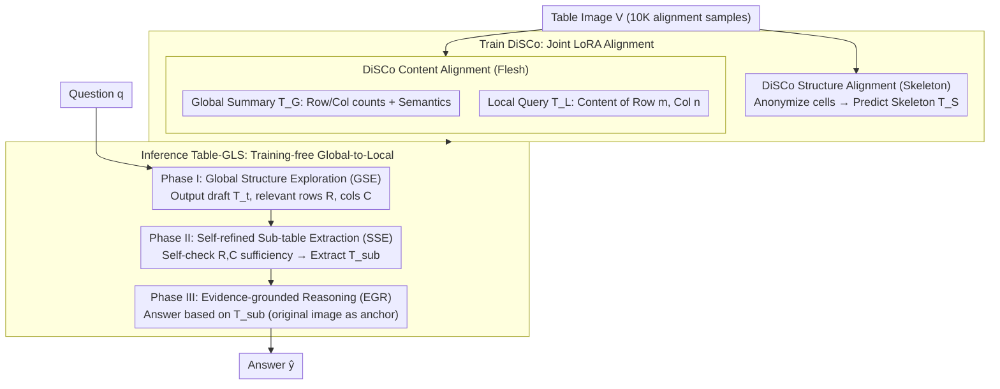

# Decoupling Skeleton and Flesh: Efficient Multimodal Table Reasoning with Disentangled Alignment and Structure-aware Guidance

**Conference**: ICML 2026 Spotlight  
**arXiv**: [2602.03491](https://arxiv.org/abs/2602.03491)  
**Code**: https://github.com/AAAndy-Zhu/TableVLM  
**Area**: Multimodal VLM / Table Reasoning / Representation Decoupling / Training-free Reasoning  
**Keywords**: LVLM, Table Image Understanding, Structure-content Decoupling, Global-to-local Reasoning, Sub-table Evidence  

## TL;DR
This paper introduces a two-part solution for multimodal table reasoning: DiSCo for the training phase, which decouples "skeleton" and "flesh" alignment targets through structure anonymization to let LVLMs learn layouts using only 10K table images; and Table-GLS for the inference phase, which compresses whole-image QA into the smallest verifiable sub-table via a three-step "Global Structure Exploration → Self-refined Sub-table Extraction → Evidence-grounded Reasoning" process. This pipeline requires no SFT on reasoning data or external tools, outperforming SFT/RL baselines that rely on 82K-97K annotations across 21 benchmarks.

## Background & Motivation

**Background**: Adapting LVLMs for table reasoning currently follows two primary paths: large-scale SFT or GRPO reinforcement learning (e.g., Table-LLaVA, Table-R1, TURBO), which feeds hundreds of thousands of table images and their HTML/Markdown/LaTeX strings into the model; or utilizing external tools (e.g., ReFocus) that perform multi-hop reasoning via visual editors and code control.

**Limitations of Prior Work**: The SFT route requires expensive table reasoning annotations and can trigger catastrophic forgetting of general reasoning capabilities. The external tool route significantly increases inference latency and system complexity without fundamentally enhancing the model's inherent structural understanding. Both approaches couple the table's **structure (row-column layout, header hierarchy)** and **content (cell semantics)** into the same linearized sequence, forcing the model to memorize entangled signals. This results in poor cross-layout generalization and low sample efficiency.

**Key Challenge**: Serialized representations like HTML/Markdown naturally interleave structure tokens (e.g., `<tr>`, `|`, header tags) with content tokens (cell semantics) in a single long sequence. When the model tries to learn both simultaneously, structure signals are often drowned out by the massive volume of content tokens. Conversely, content understanding depends on a structural skeleton that has not yet been mastered, creating a "chicken-and-egg" obstacle.

**Goal**: (1) Enable LVLMs to learn generalizable table structure representations with minimal alignment data; (2) robustly answer questions about tables with dense layouts without any additional training or tool calls during inference.

**Key Insight**: The authors observe that LVLMs possess strong intrinsic text-semantic reasoning capabilities but lack the independent dimension of "table structure." If structure learning and content learning can be decoupled—using anonymized "skeleton" tables for structure and anchoring content to global/local coordinates—the model can "graft" its existing semantic abilities onto the structural skeleton. Inference should mirror this decoupling: first locate rows and columns on the skeleton, then extract a small sub-table for evidence-based reasoning.

**Core Idea**: A "Skeleton-Flesh" decoupling strategy is applied throughout both training (DiSCo dual-path alignment) and inference (Table-GLS three-stage chain), treating table capabilities as a "plug-in" module rather than something forced through end-to-end learning.

## Method

### Overall Architecture
In the training phase, DiSCo utilizes 10K table images and constructs both **structure alignment samples** $(I_S, V) \to T_S$ (anonymized HTML/Markdown/LaTeX where cell content is replaced by placeholders $t_p$) and **content alignment samples**—including semi-structured global summaries $T_G$ (e.g., "$M$ rows and $N$ columns, Col $m$ describes X") and local cell semantics $T_L$ (e.g., "Row $m$ Column $n$: [content]"). These three objectives are jointly fine-tuned via LoRA. In the inference phase, Table-GLS decomposes single-step QA into three stages: first, the LVLM explores the whole image to provide relevant row/column indices $R, C$ and a reasoning draft $T_t$; next, it self-checks the sufficiency of $R, C$ and extracts the minimal interpretable sub-table $T_{sub}$; finally, it performs evidence-grounded reasoning on $T_{sub}$ (retaining the original image as a visual anchor) to output $\hat{y}$. The entire pipeline requires no reasoning-specific annotations or external tools; structural capability is derived from DiSCo, while reasoning relies on the base LVLM itself.

### Key Designs

**1. DiSCo Structure Alignment (Skeleton): Isolating Layout from Content**

HTML/Markdown mixes structure tokens and content tokens. Since content tokens vastly outnumber structure tokens, the latter are often ignored during training. DiSCo addresses this by anonymizing a regular serialized table $T$ into $T_S = \texttt{Anonymize}(T, t_p)$, replacing all cell content with a uniform placeholder $t_p$. The training objective $\mathcal{L}_{\text{struct}} = -\mathbb{E} \log P_\theta(T_S \mid I_S, V)$ forces the model to rely solely on visual layout cues (grid lines, header positions) in the image to predict the skeleton. With content signals removed, the model is forced to learn layout independently, improving generalization to unseen merged cells and nested headers—this yielded the most significant gains in OOD TSD/TCE.

**2. DiSCo Content Alignment (Flesh): Grafting Semantics onto Structural Coordinates**

Once the skeleton is mastered, the model treats "Row $m$ Column $n$" as a coordinate system rather than content as a free text stream. Content alignment is split into two layers. The global layer outputs a semi-structured summary $T_G$ (row/column counts and meanings), with loss $\mathcal{L}_{\text{content\_global}} = -\mathbb{E} \log P_\theta(T_G \mid I_G, V)$. The local layer, given row $m$ and column $n$, requires the model to output "Row $m$ Column $n$: [content]", with loss $\mathcal{L}_{\text{content\_local}} = -\mathbb{E} \log P_\theta(T_L \mid I_L, V, m, n)$. Unlike traditional HTML alignment where semantics and positions are stuck in a sequence, DiSCo forces content to be attached to structural coordinates, reusing the LVLM's strong semantic capabilities while making "lookup" a native operation—exactly what is needed for Table-GLS sub-table extraction.

**3. Table-GLS Global-to-Local Three-stage Reasoning: Positioning → Extraction → Reasoning**

Directly answering based on a full table image often leads the model to take shortcuts via global pattern matching. Table-GLS splits QA into an interpretable chain of "finding evidence vs. using evidence." Stage I (Global Structure Exploration) uses a prompt $I_{GSE}$ to make the model output a reasoning draft $T_t$ and relevant indices $R, C$, forcing a "where-to-look" decision. Stage II (Self-refined Sub-table Extraction) uses $I_{SSE}$ for the model to self-check if $R, C$ are sufficient and necessary, correcting them if needed before extracting $T_{sub}$. This "plan-before-extract" step prevents errors from the global stage from propagating. Stage III (Evidence-grounded Reasoning) generates the final answer $\hat{y} = \text{LVLM}(I_{EGR}, T_{sub}, V, q)$. This explicit separation reduces spurious correlations and leaves an interpretable trace; ablation shows that removing SSE drops AIT-QA performance from 76.71 to 73.39.

### Loss & Training
The total DiSCo loss is $\mathcal{L}_{\text{DiSCo}} = \mathcal{L}_{\text{struct}} + \mathcal{L}_{\text{content\_global}} + \mathcal{L}_{\text{content\_local}}$. Various LVLMs (Gemma3-12B, Gemma3n-E4B, LLaVA-v1.6-7B, Qwen3-VL-8B/4B/32B) are fine-tuned using LoRA to preserve original reasoning abilities. Table-GLS is entirely training-free, utilizing vLLM for zero-shot three-stage prompting. The two components are orthogonal by design: DiSCo strengthens representation while Table-GLS enhances the reasoning process; their combination (Full) outperforms either alone in all tasks.

## Key Experimental Results

### Main Results
Evaluated across 21 table understanding and reasoning benchmarks using only a 10K alignment budget (vs. 82K-97K for baselines), all in zero-shot settings:

| Task Cluster | Configuration | Key Metric | Ours (Qwen3-VL-8B) | Textual (10K) | Textual-All (97K) |
| :--- | :--- | :--- | :--- | :--- | :--- |
| Table Understanding (TSD/TCE/TCL/RCE/MCD) | Avg (Seen structures) | accuracy | **DiSCo 42.9-93.5** | 41.0-89.6 | 37.7-89.8 |
| OOD Table Understanding (Unseen layouts) | OOD TSD/TCE/TCL/RCE | accuracy | **DiSCo 65.5-88.4** | 44.8-82.0 | 50.1-86.1 |
| Table Reasoning (8 tasks: HiTab/AIT-QA/etc.) | Full = DiSCo + Table-GLS | avg | **Significantly > GPT-4o-mini & Table-LLaVA-13B** | – | – |

On Qwen3-VL-32B, DiSCo boosted OOD TCL from 65.91 to 74.10 and OOD RCE Column from 84.16 to 88.40. For the smaller Gemma3n-E4B, OOD TCL improved from 9.00 to 14.32 (textual alignment only reached 10.20), indicating that skeleton-flesh decoupling is particularly effective at preventing OOD collapse in smaller models.

### Ablation Study
Qwen3-VL-8B on four representative reasoning tasks (Full = DiSCo + Table-GLS):

| Configuration | HiTab | AIT-QA (O) | InfoTabs | PubHealthTab (O) |
| :--- | :--- | :--- | :--- | :--- |
| **Full** | 27.35 | **76.71** | **72.67** | **77.14** |
| − GSE (w/o Global Exploration) | 24.30 | 62.82 | 72.09 | 74.92 |
| − SSE (w/o Self-refinement) | **31.41** | 73.39 | 70.20 | 73.94 |
| only Table-GLS (no DiSCo) | 29.76 | 55.58 | 73.59 | 72.76 |
| CoT | 28.17 | 56.75 | 67.98 | 57.52 |
| DiSCo + CoT | 26.40 | 73.78 | 71.00 | 68.33 |
| RoT (row-of-thought) | 33.88 | 55.58 | 61.26 | 58.29 |
| DiSCo + RoT | 26.27 | 69.08 | 66.98 | 72.14 |

### Key Findings
- **Structural decoupling is key for OOD**: DiSCo's gains are much larger in OOD tasks than in-domain. Textual alignment actually degrades performance in tasks like OOD TCL, suggesting that coupled learning overfits to specific training layouts.
- **GSE is a lifesaver for OOD**: Removing Global Structure Exploration drops OOD AIT-QA from 76.71 to 62.82 (~14 points), while in-domain HiTab actually rises to 31.41, indicating that GSE sacrifices some in-domain speed/performance for robust generalization.
- **Synergy between DiSCo and Table-GLS**: Table-GLS alone (without DiSCo) only reaches 55.58 on AIT-QA; DiSCo + CoT/RoT also fails to match the "Full" model, proving that representation decoupling and reasoning path decoupling are complementary.
- **Small labels, big impact**: Achieving better results with 10K images than Textual-All (97K) and Table-LLaVA (82K SFT) demonstrates that structure-content decoupling significantly improves sample efficiency.

## Highlights & Insights
- **"Skeleton/Flesh" as an elegant inductive bias**: Explicitly separating "what the layout is" from "what is inside" prevents alignment tokens from overriding each other. This mindset can be transferred to other domains like code (AST structure vs. identifier semantics) or UI (layout vs. copy).
- **Symmetry in training-inference decoupling**: DiSCo decouples representation during training, while Table-GLS decouples "finding" vs. "using" evidence during inference. This ensures that what is learned is actually utilized, preventing models from reverting to single-step patterns under simple prompts.
- **Plan-before-extract self-reflection**: Making the model explicitly answer "Are these rows/columns sufficient?" is a low-cost yet powerful engineering trick that serves as a useful template for LVLM agent frameworks.

## Limitations & Future Work
- Evaluation primarily focuses on static table images; joint reasoning on tables embedded in long documents (e.g., full scientific PDFs) with surrounding text remains uncovered.
- DiSCo requires HTML/Markdown/LaTeX ground truth to construct anonymized structure samples, which is not directly applicable to raw scans or tables with low-quality OCR.
- Table-GLS calls the LVLM three times per question, increasing inference latency by roughly 2-3x; a "fast-exit" classifier for simple queries could be beneficial.
- Lack of a recursive "re-search" mechanism—SSE only runs once. If the initial $R, C$ selection is far off, the room for correction is limited.

## Related Work & Insights
- **vs. Table-LLaVA / TabPedia / SynTab**: These rely on large-scale SFT (82K-97K) to learn serialized HTML/Markdown where structure and content are coupled. DiSCo uses 10K images and outperforms them in OOD without reasoning-specific tuning.
- **vs. Table-R1 / TURBO / R3V**: These use GRPO/RL for reasoning trajectories, requiring specific reward signals. Table-GLS reaches high performance training-free via structured prompting, avoiding capability drift.
- **vs. ReFocus (External Tools)**: ReFocus uses code for multi-hop visual editing; Table-GLS folds "multi-hop" into self-reflective extraction within the model, lowering deployment barriers.
- **vs. General CoT/RoT**: DiSCo + Table-GLS outperforms common CoT/RoT strategies, proving that task-specific structural chains (Global → Local → Evidence) are superior for highly structured table inputs.

## Rating
- Novelty: ⭐⭐⭐⭐ The philosophy of training-inference dual decoupling is clear; structure anonymization for alignment is a simple yet effective innovation.
- Experimental Thoroughness: ⭐⭐⭐⭐⭐ 21 benchmarks, 4 backbones (4B-32B), in-domain/OOD perspectives, and complete ablation; shared code and data.
- Writing Quality: ⭐⭐⭐⭐ The framework and stage equations are clear, and the "Skeleton/Flesh" theme is well-maintained; however, Table 1 is very dense.
- Value: ⭐⭐⭐⭐⭐ Improves sample efficiency to 10K and offers a training-free reasoning template compatible with any LVLM, making it highly industrial-friendly.

<!-- RELATED:START -->

## Related Papers

- [\[ICLR 2026\] FAPO: Flawed-Aware Policy Optimization for Efficient and Reliable Reasoning](../../ICLR2026/reinforcement_learning/fapo_flawed-aware_policy_optimization_for_efficient_and_reliable_reasoning.md)
- [\[ICLR 2026\] Metis-SPECS: Decoupling Multimodal Learning via Self-distilled Preference-based Cold Start](../../ICLR2026/reinforcement_learning/metis-specs_decoupling_multimodal_learning_via_self-distilled_preference-based_c.md)
- [\[ICLR 2026\] REA-RL: Reflection-Aware Online Reinforcement Learning for Efficient Reasoning](../../ICLR2026/reinforcement_learning/rea-rl_reflection-aware_online_reinforcement_learning_for_efficient_reasoning.md)
- [\[ICLR 2026\] Reasoning Boosts Opinion Alignment in LLMs](../../ICLR2026/reinforcement_learning/reasoning_boosts_opinion_alignment_in_llms.md)
- [\[AAAI 2026\] STELAR-Vision: Self-Topology-Aware Efficient Learning for Aligned Reasoning in Vision](../../AAAI2026/reinforcement_learning/stelar-vision_self-topology-aware_efficient_learning_for_aligned_reasoning_in_vi.md)

<!-- RELATED:END -->
