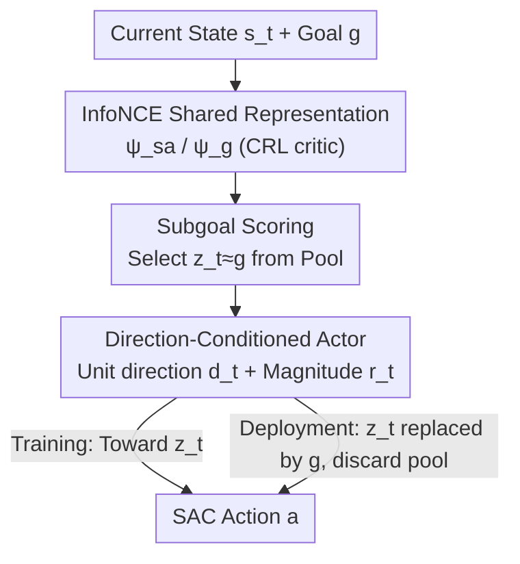

# Direction-Conditioned Policies via Compositional Subgoal Scoring for Online Goal-Conditioned Reinforcement Learning

**Conference**: ICML2026  
**arXiv**: [2606.16515](https://arxiv.org/abs/2606.16515)  
**Code**: Implemented based on JaxGCRL (Bortkiewicz et al., 2024)  
**Area**: Reinforcement Learning / Goal-Conditioned RL  
**Keywords**: Goal-Conditioned Reinforcement Learning, Contrastive Reinforcement Learning, Direction-Conditioned, Subgoal Scoring, HJB

## TL;DR
This paper proposes DCP (Direction-Conditioned Policies), which replaces the standard practice of the actor taking raw goal coordinates with a learned unit direction plus magnitude in representation space. By utilizing a scoring rule to select subgoals from historically visited states, the direction is stabilized during early training. DCP outperforms Contrastive RL (CRL) on most metrics across nine navigation and manipulation environments.

## Background & Motivation

**Background**: The mainstream approach in online Goal-Conditioned Reinforcement Learning (GCRL) is to concatenate the goal $g$ directly into the actor's input. Contrastive RL (CRL, Eysenbach et al. 2022) builds on this by using InfoNCE to learn a representation $\psi$, where $\langle\psi(s,a),\psi(g)\rangle$ estimates the "log-reachability" of $g$ from $(s,a)$, essentially training $\psi$ as a "quasimetric" encoding the environment topology. However, even with this representation, the actor still receives the **raw goal coordinates**.

**Limitations of Prior Work**: When the goal $g$ is far from the current data distribution, raw coordinates are geometrically "uninformative"—early in training, $\psi_g(g)$ for a distant $g$ is not calibrated by InfoNCE. Any direction calculated from it is unstable, and $\langle\psi_g(g),\psi_{sa}(s,a)\rangle$ remains near-random. This "sparse reward + distant goal" setup is precisely the most challenging part of robotic manipulation tasks.

**Key Challenge**: Drawing from Hamilton–Jacobi–Bellman (HJB) theory, the authors point out a neglected fact: under control-affine dynamics, the optimal goal-conditioned action depends on $g$ **only through the gradient of the goal-reachability distance** $\nabla_s d^*(s,g)$. In other words, what the actor truly needs is the "direction toward the goal," not the goal coordinates themselves. Yet, existing methods continue to feed coordinates.

**Goal**: To switch the actor's conditional input from "goal coordinates" to a "unit direction in representation space" and solve the subsequent sub-problem: how to handle the instability of calculating directions via an uncalibrated $\psi_g(g)$ in early training.

**Key Insight**: Use subgoals $z_t$ that have been visited historically and are aligned with the goal in the $\psi$ space to proxy the direction during training. At deployment, $z_t$ is swapped back to $g$. Since $z_t$ is a genuinely visited state, its encoding has already been trained via InfoNCE, resulting in a stable direction. Because $z_t$ is selected as "most similar to $g$ under $\psi_g$," the direction toward $z_t \approx$ the direction toward $g$, thus aligning training and deployment inputs.

**Core Idea**: Replace "raw goal coordinates" with a "unit direction in $\psi$-space" as the actor's condition, using subgoal scoring to stabilize this direction during early training while cleanly decoupling at deployment.

## Method

### Overall Architecture

DCP modifies only one component on top of the CRL training stack (InfoNCE critic + SAC actor): **the conditional object fed to the actor**. The workflow is as follows: first, learn a shared representation $\psi$ using InfoNCE (state-action encoder $\psi_{sa}$ and goal encoder $\psi_g$). During rollouts, maintain a pool $\mathcal{P}$ of recently visited states and select a subgoal $z_t$ based on inner product scoring. Then, calculate the **unit direction** $\mathbf{d}_t$ and magnitude $r_t$ from the current state $s_t$ to $z_t$. The actor takes $[s_t,\mathbf{d}_t,r_t]$ to generate actions. Subgoal scoring and direction conditioning share the $(\mathbf{d}_t,r_t)$ interface and are trained jointly, but are **cleanly decoupled at deployment**: the pool and scoring are removed, and the direction is calculated directly using $g$ instead of $z_t$. Consequently, DCP regresses to a standard goal-conditioned policy without additional deployment overhead.

### Key Designs

**1. Direction-Conditioned Actor: Replacing "Goal Coordinates" with Unit Directions in $\psi$-space**

This is the core of the paper, directly addressing the lack of geometric information in raw coordinates. DCP no longer feeds the coordinates of $g$ (or $z_t$) to the actor but instead computes the unit direction and magnitude toward the selected state:

$$\mathbf{d}_t=\frac{\psi_g(z_t)-\psi_g(s_t)}{\lVert\psi_g(z_t)-\psi_g(s_t)\rVert},\qquad r_t=\lVert\psi_g(z_t)-\psi_g(s_t)\rVert$$

Where $\mathbf{d}_t\in\mathbb{S}^{d-1}$ is the unit vector pointing from $s_t$ to $z_t$ in $\psi$-space, and $r_t$ encodes the scale of this conditional input. The actor takes $[s_t,\mathbf{d}_t,r_t]$. The theoretical basis is **direction sufficiency** under HJB (Theorem 1): given control-affine dynamics $f(s,a)=f_0(s)+G(s)a$ and quadratic costs, the optimal action has a closed-form $a^*(s,g)=-R(s)^{-1}G(s)^\top\nabla_s d^*(s,g)$, where the unit direction $\widehat{\nabla_s d^*}$ determines the action orientation and the magnitude determines the scale. The pair $(\mathbf{d}_t,r_t)$ serves as this minimal sufficient statistic, substituting the true distance $d^*$ with the learned $d_\psi(s,g):=\lVert\psi(g)-\psi(s)\rVert$. Compared to feeding coordinates, feeding directions naturally inherits noise invariance of dual goal representations and aligns with HILP online—whereas HILP requires offline symmetric metric supervision, DCP recovers direction conditioning online using CRL's **asymmetric** InfoNCE quasimetric while expressing asymmetric reachability geometry.

**2. Subgoal Scoring: Stabilizing Early Directions with Visited States**

The simplest approach is $\mathbf{d}_t=\widehat{\psi_g(g)-\psi_g(s_t)}$, but early training lacks calibration for $\psi_g(g)$ regarding distant goals, causing direction jitter. Feeding an incorrect direction is worse than feeding raw coordinates. DCP bypasses this via a scoring rule—selecting $z_t$ from the pool:

$$z_t=\arg\max_{z\in\mathcal{P}}\;\langle\psi_g(z),\psi_g(g)\rangle$$

The inner product selects visited states whose $\psi_g$ encodings are most aligned with $\psi_g(g)$, meaning InfoNCE has already placed them in the same $\psi$-region as the goal. Consequently, when calculating the direction, both endpoints $\psi_g(z_t)$ and $\psi_g(s_t)$ **are encodings trained via contrastive goals**, rather than one trained and one uncalibrated ($\psi_g(g)$). In implementation, 32 candidates are sampled from a 512-state pool every 25 env-steps. Once InfoNCE calibrates $\psi$, $z_t$ can be swapped for $g$ at deployment using the same construction—this "training-time scaffolding, deployment-time removal" is key.

**3. Planning Invariances at the Interface: Ensuring Alignment Between Training and Deployment**

The clean decoupling of direction conditioning and subgoal scoring relies on "Planning Invariance at the Interface" (Theorem 2). It states that when the learned $d_\psi$ consistently approximates $d^*$ within $\delta$, the scoring rule returns an $\varepsilon$-on-path $z$, and the gradient has a lower bound $m$, the difference between the unit directions toward $z$ (training) and $g$ (deployment) is bounded:

$$\bigl\lVert\mathbf{d}_t^{(z)}-\mathbf{d}_t^{(g)}\bigr\rVert\le\frac{8\sqrt{2L\delta}}{m}+\frac{2\sqrt{2L\varepsilon}}{m}$$

Thus, the conditional input remains consistent between training and deployment, with errors limited to representation error $O(\sqrt\delta)$ and geodesic relaxation $O(\sqrt\varepsilon)$. In other words, planning invariance is **naturally inherited** from the approximation properties of the representation, requiring no explicit hierarchical structure. The authors honestly note that this is conditional: inner product scoring does not guarantee the on-path assumption for any arbitrary learned representation.

**4. Failure Mode Characterization: When Direction Conditioning Fails (Uncontrollable Goal Subspace)**

Theorem 3 provides precise conditions for when direction conditioning fails. Defining the controllable subspace $\mathcal{C}(s):=\mathrm{im}(G(s))$, only the component of the gradient $\nabla_s^\mathcal{C}d^*$ within this subspace enters action selection. When this controllable component is small ($\lVert\nabla_s^\mathcal{C}d^*\rVert\le\rho\lVert\nabla_s d^*\rVert$, $\rho\ll1$), the direction signal $\mathbf{d}_t$ becomes uninformative. This theory accurately predicts the only failure case in the experiments: AntSoccer. The goal is the ball's position, but the visited pool in early training rarely contains states where the ball has moved. InfoNCE receives no signal to distinguish "ball displacement" from "ant displacement," so $\nabla_s d_\psi(s,g_{\text{ball}})$—while technically in the controllable subspace—hardly points in a direction that actually reduces the distance to the ball.

### Loss & Training

DCP shares the SAC + InfoNCE stack with CRL, leaving the critic, replay, optimizer, and schedule unchanged. The critic uses backward InfoNCE with negative L2 energy. The actor loss is $\mathrm{mean}\lVert\psi_{sa}(s,a)-\psi_z\rVert+\alpha\log\pi(a\mid s,\mathbf{d}_t,r_t)$ (with stop-grad on encoder and SAC entropy term). The only modification is the conditional object passed to the actor and the positive sample goal induced by the selected waypoint, making it orthogonal to and stackable with works like Scaled CRL or E-CRL that improve representations.

## Key Experimental Results

### Main Results

Evaluated across nine environments (navigation + manipulation) with five seeds each, compared via controlled interface contrast against CRL with the same architecture, hyperparameters, and budget. Two metrics: time near goal (average time steps in goal region, primary metric) and success ≥1 (percentage of episodes entering the goal region at least once).

| Environment | Task Type | Time Near Goal | Success ≥1 |
|------|----------|----------------|------------|
| AntMaze Big | Navigation | DCP↑ | DCP↑ |
| AntMaze Hardest | Navigation | DCP↑ | DCP↑ |
| Ant U-Maze | Navigation | CRL↓ | DCP↑ |
| Humanoid U-Maze | Navigation | DCP↑ | DCP↑ |
| AntPush | Nav + Manip | DCP↑ | ≈ |
| PusherEasy/Hard/Hard-Far | Manipulation | DCP↑ | DCP↑ |
| AntSoccer | Manipulation | CRL↓ | CRL↓ |

DCP outperforms CRL on most final metrics across the nine environments. Gains are most significant in manipulation and tasks with obstacle interaction (Pusher series, AntPush) and high-dimensional navigation (268-dimensional Humanoid U-Maze, where DCP is the only method with sustained non-zero progress). The sole failure is AntSoccer, consistent with the "uncontrollable goal subspace" predicted by Theorem 3.

### Ablation Study

| Configuration | Key Findings | Description |
|------|---------|------|
| SSGC (Uses raw subgoal $z_t$ coordinates as condition) | Functional at training, drops at deployment | Isolates contribution of "direction abstraction": addresses train-test coordinate distribution mismatch. |
| CRL (Uses raw goal $g$ as condition) | Baseline | Same architecture/hyperparams, differing only in conditional object. |
| PusherHard-Far (Goals restricted to far arc) | DCP remains leading | Validates robustness to goal geometry. |
| Zero-shot Perturbation Deployment | DCP gain more stable | Random actions for 10 steps every 100; DCP benefits more from recomputing $\mathbf{d}_t$ every step. |

The zero-shot perturbation deployment (Table 2, 3 seeds) is illustrative: on AntPush, DCP's cumulative reachability improved by $+22.9$ while CRL dropped by $-7.3$ (a $+30.2$ difference); on PusherEasy, DCP saw $+20.8$ vs CRL's $0.0$. The authors attribute this to DCP recomputing direction from the current state at every step; offsets from perturbations trigger a "fresh corrective input," whereas CRL's static goal coordinates lack this channel.

### Key Findings
- **Direction abstraction is the primary driver of gains**: SSGC (using subgoals but raw coordinates) lags behind CRL in several manipulation tasks, showing that subgoal scoring alone is insufficient. Mapping both training and testing to the same $\psi$-space direction is crucial, as it eliminates coordinate-based train-eval mismatch.
- **Difficulty correlates with DCP utility**: Gains increase with task difficulty, most visible in manipulation, obstacle interaction, and high-dimensional bodies. SSGC can match performance in simple low-dimensional mazes.
- **Failures are theoretically predictable**: The collapse in AntSoccer is not accidental but occurs because the goal is defined on the ball, which the early pool fails to explore. The learned gradient falls into the low-information controllable subspace, exactly hitting the Theorem 3 failure regime.

## Highlights & Insights
- Maps classical control theory (HJB direction sufficiency: optimal action depends on the goal only via value gradient) onto online CRL's InfoNCE quasimetric, providing a clean theoretical justification for "feeding directions over coordinates." The three theorems (sufficiency, planning invariance, failure characterization) form a complete loop.
- The use of visited subgoals to compute directions during training while swapping back to the true goal at deployment is a clever engineering-theory hybrid: it avoids uncalibrated $\psi_g(g)$ early on while ensuring train-test consistency via $z_t$ alignment in $\psi$-space, all with zero extra deployment cost (unlike landmark graphs or planners requiring test-time search).
- The method is "flat"—a single direction-conditioned actor + one scoring rule sharing a single $\psi$. It achieves long-horizon gains similar to hierarchical methods without requiring an explicit two-level strategy. This "interface-level improvement" is transferable to any goal-conditioned method using contrastive or metric representations.

## Limitations & Future Work
- Planning Invariance (Theorem 2) relies on the on-path assumption, but inner product scoring **does not guarantee** this for arbitrary learned representations, as noted by the authors. Theoretical guarantees might fail under certain representations.
- AntSoccer highlights a fundamental limitation: when a goal is defined on an entity difficult to explore early on (like a ball that must be pushed), InfoNCE gradients will be distorted, leading to a breakdown of direction conditioning. Such scenarios require additional exploration mechanisms.
- Experiments focus on "controlled interface comparison within a strong backbone (CRL)," rather than a comprehensive benchmark across all GCRL families or direct comparison with offline GCRL (e.g., HIQL). The universality of gains needs validation by stacking onto other backbones like Scaled CRL or E-CRL.

## Related Work & Insights
- **vs CRL (Eysenbach et al. 2022)**: CRL learns $\psi$ but the actor still consumes raw coordinates; DCP uses the same critic/replay/optimizer/budget but changes the actor's conditional interface, making it an "interface improvement" orthogonal to representation improvements.
- **vs HILP (Park et al. 2024b)**: HILP also conditions on metric directions but requires offline symmetric Hilbert metric supervision; DCP recovers direction conditioning online using CRL's asymmetric InfoNCE, capable of expressing asymmetric reachability.
- **vs L3P / landmark planning (Zhang et al. 2020)**: L3P maintains a landmark graph and runs graph search at deployment; DCP treats subgoals as training scaffolding only, with no graph, planner, or waypoint pool needed at test time.
- **vs QRL / Eik-QRL (Wang et al. 2023; Giammarino & Qureshi 2025)**: These works learn explicit quasimetrics for **value learning**; DCP is, to the authors' knowledge, the first online method to **consume the learned consistent quasimetric gradient for actor conditioning**.

## Rating
- Novelty: ⭐⭐⭐⭐⭐ Linking HJB direction sufficiency to online InfoNCE and being the first to use it for actor conditioning is a clean theory-algorithm integration.
- Experimental Thoroughness: ⭐⭐⭐⭐ Controlled comparisons across nine environments with five seeds and zero-shot perturbations, though limited to a single CRL backbone.
- Writing Quality: ⭐⭐⭐⭐⭐ Three theorems form a closed loop; failure cases are theoretically predicted and assumptions are clearly stated.
- Value: ⭐⭐⭐⭐ Use of "interface-level improvement" is transferable to any metric/contrastive GCRL with zero deployment overhead.

<!-- RELATED:START -->

## Related Papers

- [\[ICML 2026\] Compositional Transduction with Latent Analogies for Offline Goal-Conditioned Reinforcement Learning](compositional_transduction_with_latent_analogies_for_offline_goal-conditioned_re.md)
- [\[ICML 2026\] Latent Representation Alignment for Offline Goal-Conditioned Reinforcement Learning](latent_representation_alignment_for_offline_goal-conditioned_reinforcement_learn.md)
- [\[CVPR 2026\] MangoBench: A Benchmark for Multi-Agent Goal-Conditioned Offline Reinforcement Learning](../../CVPR2026/reinforcement_learning/mangobench_a_benchmark_for_multi-agent_goal-conditioned_offline_reinforcement_le.md)
- [\[AAAI 2026\] First-Order Representation Languages for Goal-Conditioned RL](../../AAAI2026/reinforcement_learning/first-order_representation_languages_for_goal-conditioned_rl.md)
- [\[ICLR 2026\] InFOM: Intention-Conditioned Flow Occupancy Models](../../ICLR2026/reinforcement_learning/infom_intention_flow_occupancy.md)

<!-- RELATED:END -->
