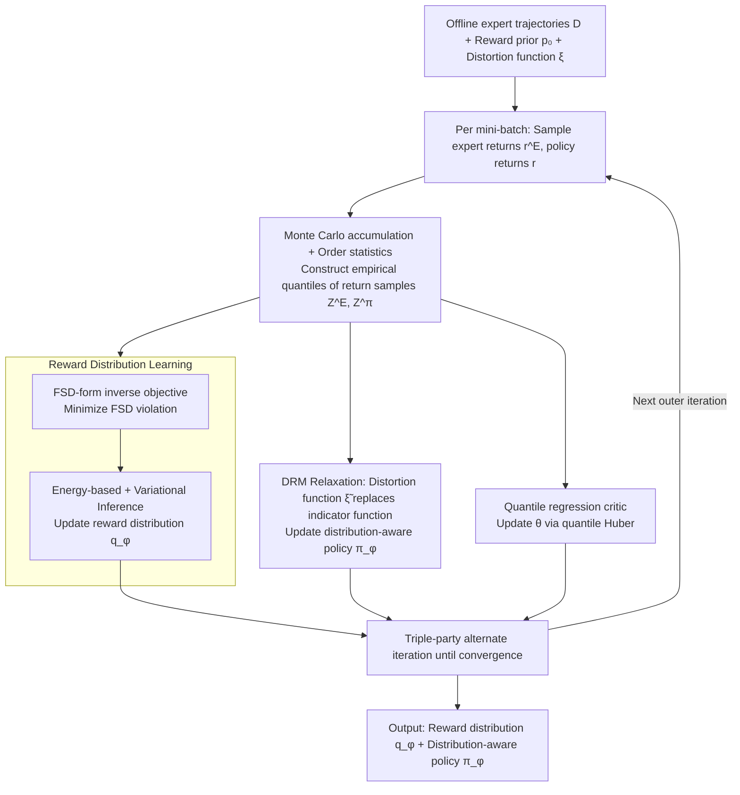

# Distributional Inverse Reinforcement Learning

**Conference**: ICML 2026 Oral  
**arXiv**: [2510.03013](https://arxiv.org/abs/2510.03013)  
**Code**: Not released  
**Area**: Reinforcement Learning / Inverse Reinforcement Learning / Distributional RL / Risk-sensitive Imitation  
**Keywords**: Offline IRL, Reward Distribution, First-order Stochastic Dominance, Distortion Risk Measures, Neural Behavioral Modeling  

## TL;DR
This paper proposes DistIRL: it models rewards as conditional distributions in offline Inverse Reinforcement Learning, upgrades the "expert is superior to learner" constraint from expectation to First-order Stochastic Dominance (FSD), and uses Distortion Risk Measures (DRM) to relax the intractable 0/1 indicator function of FSD into an optimizable risk-weighted objective. This represents the first systematic framework to simultaneously learn full reward distributions and distribution-aware policies from offline demonstrations.

## Background & Motivation

**Background**: Classical offline IRL follows the MaxEntIRL/IQ-Learn/ML-IRL paradigm, treating rewards as deterministic functions $r(s,a)\in\mathbb{R}$ and recovering parameters by matching occupancy measures or expected returns. Bayesian IRL introduces posteriors over reward parameters, yet the likelihood remains driven by expectation-based terms like soft-$Q$.

**Limitations of Prior Work**: Rewards in many real-world scenarios are inherently random variables—in robot contact-rich tasks, the return for the same $(s,a)$ exhibits high variance; in neuroscience, dopamine signals show significant trial-to-trial skewness under identical behaviors. Matching only the expectation treats two reward distributions with the same mean but different variance/skewness/tails as equivalent, making higher-order structures "invisible" to the IRL objective.

**Key Challenge**: Distribution matching (e.g., Wasserstein distance) can measure the similarity between two distributions but does not imply the "expert is better than learner" ordinal relationship essential for IRL. Conversely, looking only at the ordinal relationship of expectations discards higher-order moments. Thus, an objective is needed that preserves the "expert dominance" semantics while propagating to the full distribution.

**Goal**: (1) Recover the **reward distribution** $q_\phi(r\mid s,a)$ in an offline setting without environment interaction; (2) learn **distribution-aware/risk-sensitive** policies based on this distribution; (3) provide convergence rate proofs rather than purely empirical results.

**Key Insight**: The authors observe that FSD exactly upgrades "$X$ is better than $Y$" from the mean level to the CDF level—$F_X(z)\le F_Y(z),\forall z$ not only implies $\mathbb{E}[X]\ge\mathbb{E}[Y]$ but also holds for any monotonic utility function. FSD is therefore naturally suited as a distributional version of the "expert is better than learner" constraint.

**Core Idea**: Replace the expectation difference in MaxEntIRL with the FSD violation $\int [F_{Z^E}(z)-F_{Z^\pi}(z)]_+\,dz$, using an energy-based model with variational inference to learn the reward distribution. For the policy side, the unobservable FSD indicator function $\mathcal{I}(v)$ is relaxed into a computable distortion function $\tilde\xi(v)$, leading to a risk-sensitive policy objective in the form of a DRM.

## Method

### Overall Architecture
The input consists of offline expert trajectories $\mathcal{D}=\{(s_t^E,a_t^E)\}$, a reward prior $p_0(r)$, and a chosen distortion function $\xi$ (defaulting to CVaR$_{0.05}$ in experiments). The output is the variational reward distribution $q_\phi(r\mid s,a)$ and the distribution-aware policy $\pi_\varphi(a\mid s)$, alongside a quantile regression critic $\theta$ to estimate return quantiles. In each outer iteration, the three components are updated alternately: starting from mini-batch states, reward samples $r_t^E$ and $r_t$ are sampled for expert and policy actions respectively, return samples $Z^E,Z^\pi$ are constructed via Monte Carlo accumulation, $\phi$ is updated by the FSD violation, $\varphi$ is updated by the DRM objective, and the critic $\theta$ is updated via the quantile Huber loss.

### Key Designs

**1. FSD-form Inverse Objective: Upgrading "expert better" from expectation to full distribution**

Classical IRL constraints "expert optimality" only at the expectation level, treating two distributions with identical means but different variance/skewness as equivalent. This work uses First-order Stochastic Dominance (FSD) to express this constraint: define the violation $\mathcal{L}_{\text{FSD}}=\int [F_{Z^E}(z)-F_{Z^\pi}(z)]_+\,dz$, then transform it into the quantile space via change of variables as $\int_0^1 [F_{Z^\pi}^{-1}(v)-F_{Z^E}^{-1}(v)]_+\,dv$. Empirical quantiles are approximated via Monte Carlo and order statistics $F_{Z^\pi}^{-1}(k/N)\approx z_{(k)}$, requiring no explicit CDF. FSD is chosen over symmetric distances like Wasserstein because symmetric distances only measure "similarity" and discard the "dominance" order. FSD provides a differentiable violation while automatically implying mean dominance (Corollary 4.3), representing the minimal change to generalize MaxEntIRL to the distributional level.

**2. Energy-based + Variational Inference for Reward Distribution: A Bayesian interface for FSD**

The FSD violation is an energy function without an explicit probabilistic model, making it difficult to learn a "conditional distribution of rewards" directly. This work interprets it as a log-likelihood $p(\mathcal{D}\mid r)\propto\exp(-\mathcal{L}_{\text{FSD}}(\pi,r))$ to construct an energy-based model. By introducing a variational posterior $q_\phi$ and maximizing the ELBO, they obtain $\mathcal{L}_r(\phi)=\mathbb{E}_{q_\phi}[\mathcal{L}_{\text{FSD}}]+\mathrm{KL}(q_\phi\Vert p_0)$. $q_\phi$ is instantiated based on the scenario: Azzalini skew-normal for neuroscience (to capture asymmetric tails) and quantile functions for robotics, both supporting efficient sampling, closed-form KL, and differentiable gradients. This step upgrades reward point estimates to full posteriors and maps the convex regularizer $\psi(r)$ in MaxEntIRL to the KL term.

**3. DRM Relaxation: Converting unobservable indicators into optimizable risk objectives**

Applying FSD to the policy side is hindered by the indicator function $\mathcal{I}(v)=\mathbb{1}\{F_{Z^\pi}^{-1}(v)\ge F_{Z^E}^{-1}(v)\}$, which is unobservable. This work replaces $\mathcal{I}(v)$ with a non-decreasing distortion function $\tilde\xi(v)\ge 0$, simplifying the policy objective to $\mathcal{L}_\pi(\varphi)=\int_0^1 F_{Z^\pi}^{-1}(v)\,d\tilde\xi(v)+\mathcal{H}(\pi_\varphi)$, which is a Distortion Risk Measure (DRM) plus maximum entropy. This relaxation is principled: Proposition 4.6 proves that "DRM dominance for all $\xi$" is equivalent to FSD dominance, ensuring the optimal solution under relaxation remains consistent with the original FSD goal. Furthermore, $\tilde\xi$ serves two roles: an engineering solution for the indicator function and a knob to control policy risk preference (e.g., CVaR$_{0.05}$ emphasizes the lower tail), while automatically embedding policy learning into established quantile regression critic pipelines.

### Loss & Training
The framework employs alternating optimization: the reward network is updated via $\phi_{k+1}\leftarrow\phi_k-\eta^\phi\nabla\mathcal{L}_r(\phi_k)$ (Eq. 3), the critic performs off-policy evaluation via the quantile Huber loss $\mathcal{L}_{QR}$, and the policy is updated via $\varphi_{k+1}\leftarrow\varphi_k+\eta^\varphi\nabla\mathcal{L}_\pi(\varphi_k)$ with a KKT-style KL constraint $\min_\pi \mathrm{KL}(\pi\,\Vert\,\tfrac{1}{Z}\exp\{M_\xi(Z^\pi)\})$. Theoretically, with step size $\eta_k=\eta_0 k^{-1/2}$, the algorithm achieves an iteration complexity of $\mathcal{O}(\varepsilon^{-2})$ (Theorem 5.6). The entire process is purely offline, requiring no environment model or online rollouts.

## Key Experimental Results

### Main Results
Evaluated on risk-sensitive D4RL with rewards featuring rare catastrophic penalties (HalfCheetah triggers $-70$ at high speed; Walker2D/Hopper trigger $-30/-50$ at large pitch angles). 10 expert trajectories were collected using risk-averse DSAC for offline IRL, averaged over 5 random seeds:

| Method | HalfCheetah | Hopper | Walker2d |
|------|-------------|--------|----------|
| DistIRL (Gauss) | **3469±59** | **886±1** | **1526±148** |
| DistIRL-qrt (Quantile) | 3294±172 | 747±79 | 1211±182 |
| BC | 2828±281 | 346±1 | 1321±26 |
| ValueDICE | 1259±78 | 260±10 | 798±311 |
| Offline ML-IRL | 826±231 | 192±56 | 240±50 |
| Expert | 3540±44 | 892±3 | 1478±200 |

DistIRL achieves near-expert performance across all three risk-sensitive tasks, significantly Outperforming BC and expectation-based methods like ValueDICE/ML-IRL; the latter degrade seriously due to risk-neutral reward assumptions or misaligned pre-trained transition models. On risk-neutral D4RL (Table 2), DistIRL remains SOTA on Hopper/Walker2d and is second only to ML-IRL (which uses extra non-expert data) on HalfCheetah, demonstrating the framework's versatility.

### Ablation Study
HalfCheetah + Right-skewed normal reward + Risk-averse expert, scaled normalized scores:

| Configuration | Score | Notes |
|------|------|------|
| **DistIRL (Dis-QR-FSD)** | **1.00±0.02** | Distributional reward + Quantile critic + FSD loss (Full) |
| Dis-TD-FSD | 0.67±0.31 | TD critic instead of QR, significantly higher variance |
| Dis-TD-Mean (≈BIRL) | 0.33±0.01 | Dist. reward but mean matching only, performance halved |
| Dis-QR-Mean | 0.22±0.02 | Dist. reward + Mean matching, performance drop |
| Det-TD-Mean (≈ValueDICE) | 0.22±0.00 | No distributional signals |
| Det-QR-Mean (≈RIZE) | 0.00±0.01 | Worst performance |

### Key Findings
- The FSD loss is the core of the performance leap: moving from Dis-QR-Mean to Dis-QR-FSD increases the score from 0.22 to 1.00, which is far more effective than just "adding a quantile critic" or "changing rewards to distributions" alone.
- BIRL is equivalent to Dis-TD-Mean with a score of 0.33—validating the motivation that having reward distribution assumptions without distribution-aware objectives fails to recover true variance.
- In mouse spontaneous behavior experiments (§6.2), S-DistIRL (skew-normal reward) achieves the highest Pearson correlation (~0.3) with dopamine signals and estimated reward means, alongside the lowest W-1 distance. This indicates that skewed distribution families are crucial for asymmetric tails in neural data. In a 5×5 gridworld, the model recovers both the means of two high-reward states and the variance $\sigma^2=1$ in the top-right corner, while BIRL only recovers means and hallucinates false high values in the bottom-left.

## Highlights & Insights
- **Upgrading IRL "expert dominance" from mean to FSD**: This is equivalent to defining superiority based on the entire CDF rather than a single point. This generalization, coupled with differentiable quantile space approximations, adds negligible engineering complexity while solving long-standing issues regarding reward higher-order moments and risk-insensitive policies.
- **Dual Role of DRM Relaxation**: The distortion function $\tilde\xi$ is both an engineering trick to make the FSD indicator tractable and a knob for controlling policy risk preferences (CVaR/Wang/POW...). Proposition 4.6 ensures theoretical closure by showing that the intersection over all $\tilde\xi$ recovers FSD.
- **Transferable Design**: The energy-based variational framework for reward learning is decoupled from specific distribution families. The paper provides instances for skew-normal and quantile functions; the same approach could use diffusion priors or Normalizing Flows for OOD robust reward modeling. This has clear extension potential for RLHF preference modeling and LLM fine-tuning via RL.

## Limitations & Future Work
- The algorithm remains part of the MaxEntIRL family; reward identifiability holds only under the chosen prior, variational family, and FSD inductive bias. The paper does not claim to recover the unique ground-truth reward.
- The distortion function $\xi$ is currently manually selected (default CVaR$_{0.05}$). If the expert's true risk preference deviates significantly from the chosen DRM, performance may degrade; future work should learn $\xi$ from demonstrations.
- Current experiments model the reward distribution independently for each $(s,a)$, without capturing correlations between states, which might be too strong an assumption for contact-rich robotics or multi-step games.

## Related Work & Insights
- **vs MaxEntIRL / IQ-Learn / Offline ML-IRL**: These define expert constraints at the expectation level; this work pushes constraints to the CDF level to perceive higher-order moments and removes dependence on pre-trained transition models.
- **vs Bayesian IRL (BIRL)**: BIRL learns posteriors over deterministic reward parameters, where the likelihood is driven by soft-$Q$. DistIRL learns the conditional distribution of the rewards themselves, with a likelihood defined by the FSD energy function, enabling the distinction of rewards with identical means but different variance/skewness.
- **vs Distributional RL (C51/QR-DQN/IQN)**: That line models return distributions in forward RL with known rewards. DistIRL solves for unknown reward distributions and explicitly links policy risk preferences to the distortion function.
- **vs Risk-aware Imitation (Singh 2018, Lacotte 2019, Cheng 2023)**: These works focus on risk-sensitive policies but keep rewards as point estimates. DistIRL learns both reward distributions and risk-sensitive policies, with proven $\mathcal{O}(\varepsilon^{-2})$ convergence.

## Rating
- Novelty: ⭐⭐⭐⭐⭐ Introducing FSD + DRM to IRL is the first framework to systematically learn reward distributions in an offline setting, with theoretical and engineering consistency.
- Experimental Thoroughness: ⭐⭐⭐⭐ Coverage of gridworld, real neuroscience data, and risk-sensitive/neutral D4RL is strong, though it compares against only 5 baselines with a single default DRM value. The unreleased code slightly impacts reproducibility.
- Writing Quality: ⭐⭐⭐⭐ The derivation chain from energy-based models to variational inference and then to FSD/DRM is clear. The handling of Proposition 4.6 to map the relaxation back to the original problem is elegant.
- Value: ⭐⭐⭐⭐⭐ Provides a practical and provable tool for scientific and robotic scenarios where rewards are inherently stochastic. The FSD/DRM paradigm is transferable to RLHF, animal behavior modeling, and safe robotic imitation.

<!-- RELATED:START -->

## Related Papers

- [\[NeurIPS 2025\] Convergence Theorems for Entropy-Regularized and Distributional Reinforcement Learning](../../NeurIPS2025/reinforcement_learning/convergence_theorems_for_entropy-regularized_and_distributional_reinforcement_le.md)
- [\[NeurIPS 2025\] Inverse Optimization Latent Variable Models for Learning Costs Applied to Route Problems](../../NeurIPS2025/reinforcement_learning/inverse_optimization_latent_variable_models_for_learning_costs_applied_to_route_.md)
- [\[ICML 2025\] Decoding Rewards in Competitive Games: Inverse Game Theory with Entropy Regularization](../../ICML2025/reinforcement_learning/decoding_rewards_in_competitive_games_inverse_game_theory_with_entropy_regulariz.md)
- [\[ICML 2026\] Safe In-Context Reinforcement Learning](safe_in-context_reinforcement_learning.md)
- [\[ICML 2026\] EchoRL: Reinforcement Learning via Rollout Echoing](echorl_reinforcement_learning_via_rollout_echoing.md)

<!-- RELATED:END -->
