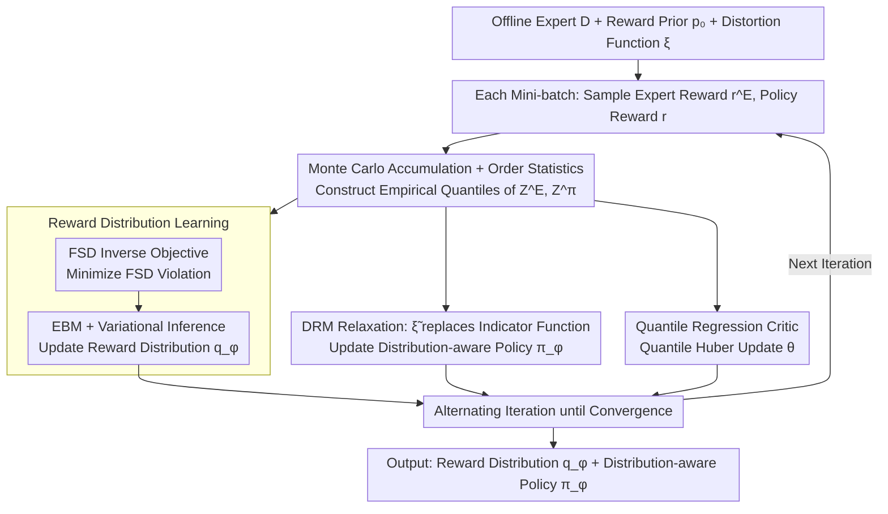

# Distributional Inverse Reinforcement Learning

**Conference**: ICML 2026 Oral  
**arXiv**: [2510.03013](https://arxiv.org/abs/2510.03013)  
**Code**: Not released  
**Area**: Reinforcement Learning / Inverse Reinforcement Learning / Distributional RL / Risk-sensitive Imitation  
**Keywords**: Offline IRL, Reward Distribution, First-order Stochastic Dominance (FSD), Distortion Risk Measures (DRM), Neural Behavioral Modeling  

## TL;DR
This paper proposes DistIRL: it models rewards as conditional distributions in offline Inverse Reinforcement Learning and upgrades the "expert is superior to the learner" constraint from expectation to First-order Stochastic Dominance (FSD). By relaxing the intractable 0/1 indicator function of FSD into an optimizable risk-weighted objective using Distortion Risk Measures (DRM), the framework systematically learns both complete reward distributions and distribution-aware policies from offline demonstrations for the first time.

## Background & Motivation

**Background**: Classical offline IRL follows the MaxEntIRL/IQ-Learn/ML-IRL paradigm, treating the reward as a deterministic function $r(s,a)\in\mathbb{R}$ and recovering parameters by matching occupancy measures or expected returns. Bayesian IRL introduces a posterior over reward parameters, but the likelihood remains driven by expectation-based terms like soft-$Q$.

**Limitations of Prior Work**: Rewards in many real-world scenarios are inherently stochastic variables. In robotic contact-rich tasks, the return for the same $(s,a)$ can have high variance; in neuroscience, dopamine signals exhibit significant trial-to-trial skewed jitter under identical behaviors. Matching only the expectation treats two reward distributions with the same mean but different variance/skewness/tails as equivalent, making high-order structures "invisible" to the IRL objective.

**Key Challenge**: Distribution matching (e.g., Wasserstein distance) can measure the similarity between two distributions but does not imply the "expert is better than the learner" ordinal relationship required for IRL. Conversely, looking only at the ordinal relationship of expectations discards high-order moments. Thus, an objective is needed that preserves "expert dominance" semantics while propagating to the full distribution.

**Goal**: (1) Recover the **reward distribution** $q_\phi(r\mid s,a)$ offline without environment interaction; (2) Learn **distribution-aware/risk-sensitive** policies based on this; (3) Provide convergence rate proofs rather than just empirical results.

**Key Insight**: The authors observe that FSD (First-order Stochastic Dominance) exactly upgrades "$X$ is better than $Y$" from the mean level to the CDF level—$F_X(z)\le F_Y(z),\forall z$ not only implies $\mathbb{E}[X]\ge\mathbb{E}[Y]$ but also holds for any monotonic utility function. FSD is therefore naturally suited as a distributional version of the "expert is better than learner" constraint.

**Core Idea**: Replace the expectation difference in MaxEntIRL with the FSD violation amount $\int [F_{Z^E}(z)-F_{Z^\pi}(z)]_+\,dz$, and use an Energy-Based Model (EBM) with variational inference to learn the reward distribution. On the policy side, the unobservable FSD indicator function $\mathcal{I}(v)$ is relaxed into a computable distortion function $\tilde\xi(v)$, recovering a risk-sensitive policy objective in the form of DRM.

## Method

### Overall Architecture
The input consists of offline expert trajectories $\mathcal{D}=\{(s_t^E,a_t^E)\}$, a reward prior $p_0(r)$, and a selected distortion function $\xi$ (defaulting to CVaR$_{0.05}$ in experiments). The output is a variational reward distribution $q_\phi(r\mid s,a)$ and a distribution-aware policy $\pi_\varphi(a\mid s)$, plus a quantile regression critic $\theta$ to estimate return quantiles. The three components of the pipeline are updated alternately in each outer iteration: starting from a mini-batch of states, return samples $Z^E, Z^\pi$ are constructed via Monte Carlo accumulation of expert and policy action rewards ($r_t^E, r_t$), $\phi$ is updated using the FSD violation, $\varphi$ is updated using the DRM objective, and the critic $\theta$ is updated using quantile Huber loss.

### Key Designs

**1. FSD-form Inverse Objective: Upgrading "Expert Dominance" from Expectation to Full Distribution**

Classical IRL constrains "expert superiority" only at the expectation level, meaning reward distributions with the same mean but different variance/skewness are judged equivalent. This paper uses First-order Stochastic Dominance (FSD) to express this constraint: define the violation $\mathcal{L}_{\text{FSD}}=\int [F_{Z^E}(z)-F_{Z^\pi}(z)]_+\,dz$, and rewrite it into the quantile space via change of variables as $\int_0^1 [F_{Z^\pi}^{-1}(v)-F_{Z^E}^{-1}(v)]_+\,dv$. Empirical quantiles are approximated using Monte Carlo + order statistics $z_{(k)}\approx F_{Z^\pi}^{-1}(k/N)$, avoiding an explicit CDF. FSD is chosen over symmetric distances like Wasserstein because symmetric distances only measure "similarity" and lose the "dominance" order. FSD provides a differentiable violation and automatically implies mean dominance (Corollary 4.3), representing the minimal modification to generalize MaxEntIRL to the distributional level.

**2. EBM + Variational Inference for Reward Learning: A Bayesian Interface for FSD**

The FSD violation itself is just an energy function without an explicit probabilistic model, preventing direct learning of a "conditional reward distribution." This paper interprets it as a log-likelihood $p(\mathcal{D}\mid r)\propto\exp(-\mathcal{L}_{\text{FSD}}(\pi,r))$ to construct an EBM. By introducing a variational posterior $q_\phi$ and maximizing the ELBO, the reward loss becomes $\mathcal{L}_r(\phi)=\mathbb{E}_{q_\phi}[\mathcal{L}_{\text{FSD}}]+\mathrm{KL}(q_\phi\Vert p_0)$. $q_\phi$ is instantiated based on the scenario: Azzalini skew-normal for neuroscience (capturing asymmetric tails) or quantile functions for robotics, both supporting efficient sampling, closed-form KL, and differentiable gradients. This step upgrades reward point estimates to full posteriors and naturally aligns the convex regularizer $\psi(r)$ in MaxEntIRL with the KL term.

**3. DRM Relaxation: Turning Unobservable Indicators into Optimizable Risk Objectives**

Applying FSD to the policy side is hindered by the indicator function $\mathcal{I}(v)=\mathbb{1}\{F_{Z^\pi}^{-1}(v)\ge F_{Z^E}^{-1}(v)\}$, which is unobservable and non-differentiable. This paper replaces $\mathcal{I}(v)$ with a non-decreasing distortion function $\tilde\xi(v)\ge 0$, leading to a policy objective $\mathcal{L}_\pi(\varphi)=\int_0^1 F_{Z^\pi}^{-1}(v)\,d\tilde\xi(v)+\mathcal{H}(\pi_\varphi)$, which is a Distortion Risk Measure (DRM) expectation plus maximum entropy. This relaxation is principled: Proposition 4.6 proves that "DRM dominance for all $\xi$" is equivalent to FSD dominance, so the optimal solution of the relaxation converges to the original FSD goal. Furthermore, $\tilde\xi$ serves two purposes—an engineering trick for solvability and a "knob" for policy risk preference (e.g., CVaR$_{0.05}$ emphasizes the lower tail).

### Loss & Training
The outer loop uses alternating optimization: the reward network is updated via $\phi_{k+1}\leftarrow\phi_k-\eta^\phi\nabla\mathcal{L}_r(\phi_k)$ (Eq. 3), the critic performs off-policy evaluation with quantile Huber loss $\mathcal{L}_{QR}$, and the policy is updated via $\varphi_{k+1}\leftarrow\varphi_k+\eta^\varphi\nabla\mathcal{L}_\pi(\varphi_k)$ with a KKT-form KL constraint $\min_\pi \mathrm{KL}(\pi\,\Vert\,\tfrac{1}{Z}\exp\{M_\xi(Z^\pi)\})$. Theoretically, with step size $\eta_k=\eta_0 k^{-1/2}$, the algorithm achieves an iteration complexity of $\mathcal{O}(\varepsilon^{-2})$ (Theorem 5.6). The entire process is purely offline, requiring no environment model or online rollouts.

## Key Experimental Results

### Main Results
On risk-sensitive D4RL with rare catastrophic penalties (HalfCheetah high speed triggers $-70$ penalty; Walker2D/Hopper high pitch triggers $-30/-50$), expert trajectories were collected using risk-averse DSAC. Subsets of 10 trajectories were used for offline IRL, averaged over 5 seeds:

| Method | HalfCheetah | Hopper | Walker2d |
|------|-------------|--------|----------|
| **DistIRL (Gauss)** | **3469±59** | **886±1** | **1526±148** |
| DistIRL-qrt (Quantile) | 3294±172 | 747±79 | 1211±182 |
| BC | 2828±281 | 346±1 | 1321±26 |
| ValueDICE | 1259±78 | 260±10 | 798±311 |
| Offline ML-IRL | 826±231 | 192±56 | 240±50 |
| Expert | 3540±44 | 892±3 | 1478±200 |

DistIRL reached near-expert performance on all three risk-sensitive tasks, significantly outperforming BC and expectation-matching baselines like ValueDICE/ML-IRL, which suffer from risk-neutral assumptions or misaligned transition models. On risk-neutral D4RL (Table 2), DistIRL remained SOTA on Hopper/Walker2D, showing the framework is not limited to distributional rewards.

### Ablation Study
HalfCheetah + Right-skewed Gaussian reward + risk-averse expert, normalized scores:

| Configuration | Score | Description |
|------|------|------|
| **DistIRL (Dis-QR-FSD)** | **1.00±0.02** | Dist. Reward + Quantile Critic + FSD Loss (Full Model) |
| Dis-TD-FSD | 0.67±0.31 | TD Critic instead of QR; variance increases significantly |
| Dis-TD-Mean (≈BIRL) | 0.33±0.01 | Dist. Reward but Mean matching; performance halved |
| Dis-QR-Mean | 0.22±0.02 | Dist. Reward + Mean matching; drastic drop |
| Det-TD-Mean (≈ValueDICE) | 0.22±0.00 | No distributional signals |
| Det-QR-Mean (≈RIZE) | 0.00±0.01 | Worst performance |

### Key Findings
- **FSD loss is the core of performance leaps**: Moving from Dis-QR-Mean to Dis-QR-FSD improves results from 0.22 to 1.00, which is far more effective than just adding a quantile critic or distributional reward alone.
- **BIRL is equivalent to Dis-TD-Mean (score 0.33)**: This validates the motivation that assuming a reward distribution without a distribution-aware objective fails to recover true variance.
- **In spontaneous mouse behavior experiments (§6.2)**: S-DistIRL (skew-normal reward) achieved the highest Pearson correlation (~0.3) with dopamine signals and estimated reward means while having the lowest W-1 distance, indicating that skewed distribution families are essential for asymmetric tails in neural data.

## Highlights & Insights
- **Upgrading IRL "Expert Dominance" to FSD**: This defines superiority using the entire CDF rather than a single point. This generalization, coupled with differentiable quantile space approximations, solves both reward moment invisibility and policy risk-insensitivity with minimal added complexity.
- **Dual Role of DRM Relaxation**: The distortion function $\tilde\xi$ serves as an engineering tool for solvability and a knob for risk preference (CVaR/Wang/POW, etc.), while Proposition 4.6 ensures theoretical closure.
- **Transferable Design**: The EBM + VI reward learning backbone is decoupled from the specific distribution family. The framework can be extended with diffusion priors or Normalizing Flows for OOD robust reward modeling, with natural applications in RLHF and RL fine-tuning for LLMs.

## Limitations & Future Work
- The algorithm is still part of the MaxEntIRL family; reward identifiability holds only under the chosen prior, variational family, and FSD inductive bias.
- The distortion function $\xi$ is currently manually selected (default CVaR$_{0.05}$); performance may degrade if the expert's true risk preference deviates significantly from the chosen DRM. Learning $\xi$ from demonstrations is a future path.
- In current experiments, the reward network models each $(s,a)$ independently, without accounting for correlations in reward distributions across states, which may be a strong assumption in multi-step games.

## Related Work & Insights
- **vs MaxEntIRL / IQ-Learn / Offline ML-IRL**: These define constraints at the expectation level; DistIRL pushes constraints to the CDF level to perceive high-order moments without relying on pre-trained transition models.
- **vs Bayesian IRL (BIRL)**: BIRL learns the posterior of deterministic reward parameters; DistIRL learns the conditional distribution of rewards themselves, with the likelihood defined by the FSD energy function.
- **vs Distributional RL (C51/QR-DQN/IQN)**: DistRL models return distributions for a known reward; DistIRL solves for unknown reward distributions and links policy risk preference to distortion functions.
- **vs Risk-aware Imitation (Singh 2018, Lacotte 2019, Cheng 2023)**: These works focus on risk-sensitive policies but keep reward as a point estimate. DistIRL learns both while proving $\mathcal{O}(\varepsilon^{-2})$ convergence.

## Rating
- Novelty: ⭐⭐⭐⭐⭐ Introducing FSD + DRM is the first systematic framework for offline reward distribution learning.
- Experimental Thoroughness: ⭐⭐⭐⭐ Coverage of Gridworld, neural data, and D4RL is strong, though limited to 5 baselines and a single default DRM value.
- Writing Quality: ⭐⭐⭐⭐ The derivation chain from EBM to FSD/DRM is clear, and the handling of Proposition 4.6 is elegant.
- Value: ⭐⭐⭐⭐⭐ Provides a practical and provable tool for stochastic reward scenarios in science and robotics.

<!-- RELATED:START -->

## Related Papers

- [\[NeurIPS 2025\] Convergence Theorems for Entropy-Regularized and Distributional Reinforcement Learning](../../NeurIPS2025/reinforcement_learning/convergence_theorems_for_entropy-regularized_and_distributional_reinforcement_le.md)
- [\[ICML 2026\] DRIVE: Distributional and Retrieval-Augmented Bidding with Value Evaluation](drive_distributional_and_retrieval-augmented_bidding_with_value_evaluation.md)
- [\[NeurIPS 2025\] Inverse Optimization Latent Variable Models for Learning Costs Applied to Route Problems](../../NeurIPS2025/reinforcement_learning/inverse_optimization_latent_variable_models_for_learning_costs_applied_to_route_.md)
- [\[ICML 2025\] Decoding Rewards in Competitive Games: Inverse Game Theory with Entropy Regularization](../../ICML2025/reinforcement_learning/decoding_rewards_in_competitive_games_inverse_game_theory_with_entropy_regulariz.md)
- [\[ICML 2026\] Safe In-Context Reinforcement Learning](safe_in-context_reinforcement_learning.md)

<!-- RELATED:END -->
