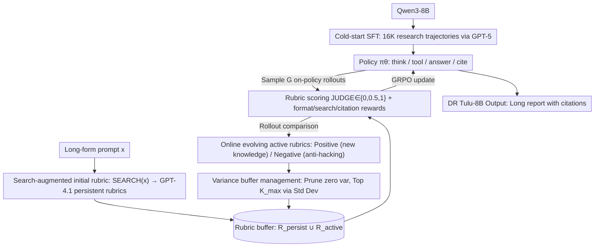

# Dr. Tulu: Reinforcement Learning with Evolving Rubrics for Deep Research

**Conference**: ICML 2026  
**arXiv**: [2511.19399](https://arxiv.org/abs/2511.19399)  
**Code**: Available  
**Area**: Reinforcement Learning / LLM Agent / Deep Research  
**Keywords**: Evolving rubrics, deep research agent, long-form response, verifiable citations, RLVR extension

## TL;DR
Dr. Tulu proposes RLER (Reinforcement Learning with Evolving Rubrics), allowing evaluation rubrics to co-evolve with the policy during training. This extends RLVR from short-form QA to long-form deep research tasks with citations. Ultimately, DR Tulu-8B, trained from Qwen3-8B, outperforms Tongyi DR-30B by an average of 15.6 points across four long-form deep research benchmarks and reaches competitive performance with OpenAI Deep Research at a 1000x lower cost.

## Background & Motivation

**Background**: The deep research (DR) agent track is currently dominated by either training-free prompt engineering (e.g., WebThinker) or RLVR training on short-answer search QA (e.g., HotpotQA, PopQA; such as Search-R1, ASearcher, WebExplorer). The latter relies on a simple fact: short answers can be directly rewarded with 0/1 scores via exact match or F1, providing high verifiability.

**Limitations of Prior Work**: In reality, users asking deep research questions (e.g., "Summarize clinical evidence for treatment of a specific genetic mutation") expect long reports with citations rather than a single sentence. These tasks possess three characteristics that cause RLVR to fail: (1) Evaluation criteria are under-specified—there is no standard template for what constitutes a good answer; (2) Evaluation requires external up-to-date knowledge, making model parameters alone unreliable; (3) Long-form responses require multi-criteria joint scoring across dimensions like coverage, citation quality, and articulation. Existing open-source agents trained with RLVR score extremely low on long-form benchmarks (Search-R1 scores only 22.2 on SQAv2).

**Key Challenge**: Long-form DR tasks **require a reward signal that is dense, discriminative, and covers the latest knowledge**. However, **static human-written rubrics** are too rigid (lacking coverage and prone to reward hacking), and **pure LM-generated rubrics** are limited by the model's own parametric knowledge, often missing specific evidence.

**Goal**: Design a mechanism to dynamically construct, maintain, and prune evaluation rubrics within the RL training loop. These rubrics should incorporate the latest facts retrieved externally and refine themselves based on the comparative differences of the policy's current rollouts.

**Key Insight**: The authors treat the rubric as a tool for "information asymmetry"—giving the rubric generator **privileged information compared to the policy** (external retrieval results + comparisons of multiple on-policy responses). This creates a generation–verification gap, ensuring the rubric is always more "knowledgeable" about the task than the policy itself.

**Core Idea**: Allow rubrics to evolve alongside the policy in the RL loop. In each step, new rollouts generate positive/negative rubrics, which are maintained in a fixed-size buffer ranked by reward variance, pruning items with zero discriminative power.

## Method

### Overall Architecture

DR Tulu adopts a two-stage SFT-then-RL training process:
1. **Cold-start SFT**: Uses GPT-5 to generate 16K research trajectories with tool calls (including search, browse, cite, and answer actions). After filtering, supervised fine-tuning is performed to teach Qwen3-8B basic search-writing-citation formats.
2. **RLER Main Training**: Online RL using a GRPO variant on 9K long-form prompts. Rewards are derived from a dynamically maintained rubric buffer + three auxiliary rewards (format, search, and citation).

The model's action space is $\{\text{think}, \text{tool}, \text{answer}, \text{cite}\}$, with three tools: `google search`, `web browse`, and `paper search`. Each prompt $x$ corresponds to a rubric buffer $R_x = R_x^{\text{persist}} \cup R_x^{\text{active}}$, where the persist part is constructed once using "retrieval + LM generation" before training, and the active part is dynamically updated during training. The system runs on the self-developed `dr-agent-lib`, supporting asynchronous tool calls, global caching, token-level loss, tool output masking, and sample packing.

### Key Designs

**1. Search-augmented initial rubric + persistent buffer: Establishing a scoring baseline with real external evidence.**

Judging long-form DR requires the latest external knowledge. If a rubric generator constructs criteria without retrieval, it easily misses key factual points. Thus, before training, `SEARCH(x)` is called for each prompt $x$ to retrieve relevant documents. These documents, along with $x$, are fed to the rubric generator $G_{\text{rubric}}$ (GPT-4.1) to produce a set of persistent rubrics $R_x^{\text{persist}} = \{R_1, \dots, R_{K_s}\}$. These are kept throughout the RL process as "ground truth constraints." During scoring, the rubric score for a single response $y$ is $S(x, y) = \sum_k w_{x,k}\,\text{JUDGE}(r_{x,k}, y) / \sum_{k: w_{x,k} > 0} w_{x,k}$, where the JUDGE LM provides scores in $\{0, 0.5, 1\}$. The core intent is to create a generation–verification gap—allowing the rubric generator "privileged information" (retrieved documents and multi-rollout comparisons) that the policy lacks.

**2. Online evolving active rubric + positive/negative rubrics: Evolving reward standards with the policy and explicitly countering hacking.**

Static rubrics are off-policy; they treat all responses equally, failing to distinguish between what the policy already does well and where it fails. In each RLER training step, $G$ on-policy rollouts $\{y_i\}_{i=1}^G$ are sampled for each prompt. These, alongside the current $R_x$, are fed to $G_{\text{rubric}}$ to generate two types of new rubrics: positive rubrics capture new knowledge or superior patterns explored by certain rollouts; negative rubrics summarize bad habits shared across rollouts (e.g., "verbatim copying of snippets to spoof high citation precision"). This ensures the scoring standard is naturally on-policy and continuously refined. Negative rubrics serve as an automatic anti-hacking mechanism—if the model finds a loophole, the rubric develops a corresponding penalty item in the next step.

**3. Variance-based rubric buffer management: Automatically determining retention via discriminative power.**

A small rubric set leads to coarse scoring, while a set too large increases judge costs and dilutes signals with noise. After each GRPO rollout, all $\{y_i\}$ are scored using the active rubrics. Rubrics with zero reward variance (where rollouts all pass or all fail) are deleted as they provide no gradient. The remaining rubrics are ranked by standard deviation, and only the top $K_{\max}$ items are kept. Variance serves as a natural proxy for discriminability: a high variance indicates the rubric captures differences between rollouts, generating effective gradients for policy improvement. This mechanism delegates rubric selection to empirical signals, while auxiliary rewards for format, search, and citation provide baseline constraints.

### Loss & Training

RL utilizes a GRPO variant where the reward is a weighted sum of the rubric score and three auxiliary rewards. Training incorporates token-level loss, 1-step asynchronous training, tool output masking, sample packing, and asynchronous tool calls (dispatching requests immediately within a rollout without waiting for batches) to increase RL throughput for long-horizon multi-tool tasks. SFT took 136 GPU hours on 8 H100s for 5 epochs; RL used 16 H100s for approximately 27,000 GPU hours. The Judge uses GPT-4.1-mini, and the rubric generator uses GPT-4.1.

## Key Experimental Results

### Main Results

Average scores across four long-form deep research benchmarks (SQAv2 / HealthBench / ResearchQA / DRB):

| Category | Model | SQAv2 | HealthBench | ResearchQA | DRB | Avg |
|---|---|---|---|---|---|---|
| Closed | OpenAI Deep Research | 79.6 | 53.8 | 79.2 | 46.9 | **64.9** |
| Closed | Gemini 3 Pro + Search | 69.8 | 38.0 | 74.3 | 46.3 | 57.0 |
| Closed | Perplexity Deep Research | 67.3 | – | 75.3 | 42.3 | – |
| Open SOTA | Tongyi DR-30B | 46.5 | 46.2 | 66.7 | 40.6 | 50.0 |
| Open | WebThinker-32B-DPO | 32.9 | 11.1 | 48.6 | 23.3 | 28.9 |
| Open | Search-R1-7B | 22.2 | -0.1 | 27.9 | 9.5 | 14.9 |
| Naive RAG | Qwen3-8B | 40.4 | 16.5 | 56.1 | 33.3 | 36.5 |
| Ours | DR Tulu-8B (SFT) | 72.3 | 38.1 | 68.5 | 39.0 | 53.9 |
| Ours | **DR Tulu-8B (RL)** | **88.3** | 52.8 | 75.7 | 45.4 | **65.6** |

DR Tulu-8B achieves the top score on SQAv2 (88.3). Its overall average (65.6) is 15.6 points higher than Tongyi DR-30B and slightly higher (+0.7) than OpenAI DR. In terms of cost, while OpenAI DR costs ~$1.80 per query, DR Tulu-8B costs only $0.0018 (tools + inference), making it 1000x cheaper.

### Ablation Study

| Configuration | Avg over 4 benchmarks | Description |
|---|---|---|
| Qwen3-8B + Search (No Training) | 31.9 | Starting point |
| DR Tulu-8B (SFT only) | 53.9 | SFT cold-start |
| DR Tulu-8B (SFT + RLER) | 65.6 | +11.7 Gain from RL phase |

The improvement brought specifically by RLER across benchmarks ranges from 6.4 to 16.0 points, proving evolving rubrics are critical. While SFT alone outperforms most open-source baselines, RLER is necessary to close the gap with proprietary systems.

### Key Findings

- **Adaptive Tool Selection**: DR Tulu-8B learned task-relevant tool preferences—using paper search 90% of the time for SQAv2 (academic) and using web search/browse 55% of the time for DRB (general domain) without hard-coding.
- **Small Models Outperforming Large Models**: The 8B DR Tulu outperforms the 30B Tongyi DR and 32B WebThinker, indicating that the RL training paradigm (evolving rubrics) provides gains for long-form DR that exceed simple parameter scaling.
- **Citation Quality as the Open-Source Gap**: Most open-source DR agents fail to output citations, resulting in near-zero scores on SQAv2 citation metrics. DR Tulu-8B provides snippet-level citations, which is the primary reason it outperforms OpenAI DR on SQAv2.
- **Generalization to Genetic Tasks**: On a self-built GeneticDiseasesQA dataset (47 questions, 24 pathogenic variants), DR Tulu-8B performed similarly to GPT-5 + Search and OpenAI DR in Evidence Support, Quality, and Synthesis, suggesting RLER learns general research patterns rather than dataset biases.

## Highlights & Insights

- **Methodological Value of Generation–Verification Gap**: The authors explicitly identify "the rubric generator seeing more information than the policy" as the core reason RLER works. This formalizes the empirical observation that AI feedback is superior to self-reflection and can be generalized to any RL reward design.
- **Elegant Duality of Positive/Negative Rubrics**: Treating reward hacking as an observable signal—where a shared bad behavior across rollouts triggers a negative penalty—creates an automated adversarial reward correction without requiring manual patches.
- **Variance Ranking for Rubric Selection**: This simple, implementable, and interpretable trick is more effective than complex correlation modeling seen in other rubric selection literature.
- **Infrastructure Open-sourcing**: `dr-agent-lib` provides the necessary engineering for long-horizon agent RL (asynchronous tool calls, caching, rate limiting, tool output masking), a significant contribution to the DR agent community.

## Limitations & Future Work

- RLER relies heavily on a **powerful, independent rubric generator** (GPT-4.1) and **judge LM** (GPT-4.1-mini), following a paradigm of distilling small open agents from large closed ones; a purely open-source loop is not yet achieved.
- High compute cost: Running 27K H100 hours plus extensive API calls for rubric generation and judging makes the reproduction threshold much higher than standard RLVR work.
- Hyperparameters such as buffer size $K_{\max}$, variance ranking granularity, and the positive/negative rubric ratio were not exhaustively swept across domains.
- The training prompt set (~9K) is still partially OOD relative to evaluation sets; however, generalization to long-tail professional fields was only tested on a small dataset (47 tasks), limiting statistical significance.

## Related Work & Insights

- **vs Search-R1 / ASearcher / WebExplorer**: These are RLVR for short-answer QA using exact match rewards. DR Tulu shifts to long reports, using evolving rubrics to solve reward issues where no ground truth exists.
- **vs WebThinker / Ai2 ScholarQA (fixed pipeline)**: Fixed pipelines perform well on specific tasks (e.g., SQAv2) but fail to generalize to non-academic tasks and tend to over-generate in short-answer scenarios; DR Tulu is a learned policy that adapts between long and short contexts.
- **vs RaR (Rubrics-as-Rewards)**: RaR uses static or one-time generated rubrics, whereas RLER co-evolves rubrics with the policy and injects privileged knowledge via retrieval.
- **vs OpenAI DR / Perplexity DR**: These closed systems are non-transparent and 1000x more expensive; DR Tulu-8B provides a fully reproducible deep research baseline achieving similar performance.

## Rating

- Novelty: ⭐⭐⭐⭐ "Rubric co-evolution + privileged retrieval + variance buffer" is a systematic first for long-form RLVR, though individual components exist in prior literature.
- Experimental Thoroughness: ⭐⭐⭐⭐⭐ Covers four long-form benchmarks, short-answer analysis, tool preference analysis, and a clinical dataset, comparing against closed, open, and fixed-pipeline categories.
- Writing Quality: ⭐⭐⭐⭐ Formulas and algorithm descriptions are clear; the motivation for the generation-verification gap is well-articulated.
- Value: ⭐⭐⭐⭐⭐ Extends RLVR to long-form DR with citations, providing a reference implementation with open-source models, data, and infrastructure.

<!-- RELATED:START -->

## Related Papers

- [\[ICML 2026\] DR.Q: Debiased Model-based Representations for Sample-efficient Continuous Control](debiased_model-based_representations_for_sample-efficient_continuous_control.md)
- [\[ICML 2026\] Metis: Learning to Jailbreak LLMs via Self-Evolving Metacognitive Policy Optimization](metis_learning_to_jailbreak_llms_via_self-evolving_metacognitive_policy_optimiza.md)
- [\[ICML 2026\] ORLoopBench: Solver-in-the-Loop Benchmarks for Self-Correction and Behavioral Rationality in Operations Research](orloopbench_solver-in-the-loop_benchmarks_for_self-correction_and_behavioral_rat.md)
- [\[ICML 2026\] SPHERE: Mitigating the Loss of Spectral Plasticity in Mixture-of-Experts for Deep Reinforcement Learning](sphere_mitigating_the_loss_of_spectral_plasticity_in_mixture-of-experts_for_deep.md)
- [\[NeurIPS 2025\] ReSearch: Learning to Reason with Search for LLMs via Reinforcement Learning](../../NeurIPS2025/reinforcement_learning/research_learning_to_reason_with_search_for_llms_via_reinforcement_learning.md)

<!-- RELATED:END -->
