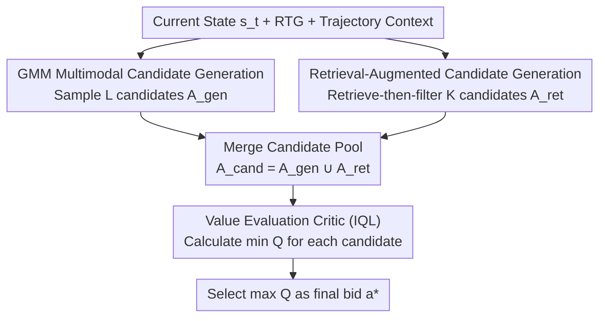

# DRIVE: Distributional and Retrieval-Augmented Bidding with Value Evaluation

**Conference**: ICML 2026  
**arXiv**: [2606.14192](https://arxiv.org/abs/2606.14192)  
**Code**: Not disclosed  
**Area**: Reinforcement Learning / Offline RL / Auto-bidding  
**Keywords**: Auto-bidding, Offline Reinforcement Learning, Decision Transformer, Retrieval-Augmented, Value Evaluation

## TL;DR
Addressing the issues of Decision Transformer (DT) methods in real-time bidding, specifically the "Average Action trap" (collapsing effective strategies into a mediocre action) and "erratic bidding in sparse long-tail traffic," DRIVE decouples **candidate action generation** from **final decision-making**. It employs a Gaussian Mixture Model (GMM) head to generate multimodal candidates, retrieves candidates from high-quality historical decisions, and uses an IQL value critic to score all candidates to select the optimal bid. DRIVE improves the average score on AuctionNet from 378.4 (strongest baseline) to 386.6 and can be integrated as a plug-and-play module into various DT-based methods.

## Background & Motivation
**Background**: Auto-bidding is the core of real-time advertising systems, aiming to optimize long-term returns under budget and Cost-Per-Action (CPA) constraints. Since online exploration (trial and error with real money) poses high risks, offline reinforcement learning (offline RL, such as CQL) – which learns strategies solely from historical logs – has become essential. Furthermore, as bidding is inherently a sequential decision-making process (current spending directly constrains future bidding capacity), Transformer-based sequence modeling (Decision Transformer, DT) has been extensively adapted for bidding due to its long-range dependency modeling.

**Limitations of Prior Work**: Direct application of DT architectures to real-world bidding scenarios faces two prominent problems (Figure 1 in the paper). The first is the **"Average Action trap"**: several effective bidding strategies often coexist for similar market states (e.g., aggressive high bids or conservative low bids). However, DT models actions using unimodal/deterministic regression (MSE objective), which **collapses these diverse modes into an average action** that is neither aggressive enough to secure exposure nor conservative enough to control costs. The second is that **pure parameterization leads to failure in sparse long-tail traffic**: DT relies entirely on network parameters to store strategies without an explicit mechanism to retain high-quality historical decisions, resulting in unreliable actions in low-density long-tail regions even when good decisions exist in the dataset.

**Key Challenge**: Unimodal regression and point-estimation decoding directly conflict with the fact that optimal bidding behavior is inherently multimodal and that long-tail regions require anchoring to historical experience. Coupling generation and decision-making within a deterministic policy causes multimodality to be averaged out and leaves sparse regions without support.

**Goal**: (1) Enable the policy to express multiple bidding modes without collapse; (2) Provide explicit non-parametric support for decisions in sparse/long-tail regions; (3) Robustly select the most reliable candidate from multiple options.

**Core Idea**: **Decouple candidate generation from decision-making**. First, a GMM head is used to sample a set of multimodal candidates. Simultaneously, a set of high-quality candidates is retrieved from historical similar states. These two sets are merged and passed to an offline value critic (IQL) for scoring, selecting the bid with the highest Q-value. Generation ensures "coverage of diversity," retrieval ensures "reliability of the baseline," and the critic provides the "final decision."

## Method

### Overall Architecture
DRIVE is built upon the standard Transformer offline RL (DT paradigm), modeling bidding as an MDP: an episode is a bidding cycle (usually a day) sliced into $T$ steps. The state $s_t$ includes campaign-level features (budget, constraints, etc.) and market-level features (external auction environment). The action $a_t$ is the bid parameter $\lambda_t$ that scales the predicted value $v$ of each exposure (affine form of optimal bid $b^*_i=\lambda v_i$). Reward $r_t$ measures the contribution of that step to the total conversion value. Trajectories are organized by return-to-go (RTG) $\hat R_t = \sum_{i \ge t} \gamma^{i-t} r_i$, and DT learns to predict actions given the RTG-state context.

DRIVE adds three components and separates "generation" from "decision": during inference, the **GMM policy head** samples $L$ candidate actions to cover multimodal modes, the **retrieval module** concurrently fetches $K$ high-quality candidates from a historical index, and these are combined into a unified candidate pool $\mathcal{A}_{\text{cand}} = \mathcal{A}_{\text{gen}} \cup \mathcal{A}_{\text{ret}}$. Finally, the **value critic** calculates Q-values for every candidate and selects the highest as the final bid $a^*$. This design is universal and can be applied to other Transformer offline RL algorithms.

### Key Designs

**1. GMM Multimodal Candidate Generation: Preventing Strategy Collapse**

This design specifically targets the "Average Action trap." Most Transformer offline RL methods use deterministic regression heads with MSE in continuous action spaces, which averages diverse historical actions. In bidding, where conservative and aggressive strategies coexist, this leads to information-less median values. DRIVE replaces the deterministic head with a **Gaussian Mixture Model (GMM) head** (Mixture Density Network paradigm) to predict $M$ components $\{\alpha_m, \mu_m, \sigma_m^2\}$. The action distribution is:

$$P(a_t \mid \tau_{0:t-1}, \hat R_t, s_t) = \sum_{m=1}^M \alpha_m \mathcal{N}(a_t \mid \mu_m, \sigma_m^2),$$

forming a multi-peak density that naturally represents different bidding modes like "high bid" or "low bid." Training utilizes the negative log-likelihood of historical actions $\mathcal{L}_{\mathrm{GMM}} = -\mathbb{E}_\tau[\sum_t \log \sum_m \alpha_m \mathcal{N}(a_t \mid \mu_m, \sigma_m^2)]$ instead of compressing them into a point estimate. During inference, a batch of candidates $\mathcal{A}_{\text{gen}} = \{a_t^{(l)}\}_{l=1}^L$ is sampled to maintain multiple feasible modes.

**2. Retrieval-Augmented Candidate Generation: Non-parametric Support in Sparse Regions**

To address "erratic bidding in low-density regions" caused by pure parameterization, DRIVE borrows the RAG concept from NLP, adding **non-parametric retrieval support** to the parametric policy. First, the GMM-Transformer encoder (or a lightweight version for speed) encodes each time step in the offline dataset into a context state embedding $h_t = f_{\text{enc}}(\tau_{0:t-1}, \hat R_t, s_t) \in \mathbb{R}^d$. A retrieval index $\mathcal{I}$ is built with $h_t$ as the key and the corresponding action $a_t$ and RTG $\hat R_t$ as the value.

Inference employs a **"retrieve-then-filter"** process: first, $K_{\text{pool}}$ nearest neighbors are retrieved from $\mathcal{I}$ by cosine similarity to form $\mathcal{C}_{\text{pool}} = \{(a_k, \hat R_k) \mid k \in \text{Top-}K_{\text{pool}}^{\mathrm{sim}}(\mathcal{I}, h_t)\}$, ensuring context relevance. Then, the top $K$ candidates by RTG values are selected to form $\mathcal{A}_{\text{ret}}$, ensuring high performance. These retrieved actions are both contextually similar and historically high-performing, serving as reliable anchors.

**3. Value Evaluation Critic: Robust Final Decision**

Since relying solely on generation (multimodal but uncertain) or retrieval (stable but potentially sub-optimal for current context) is risky, a value critic is introduced to score all candidates. The critic follows the **IQL (Implicit Q-Learning)** paradigm—estimating action values strictly within the dataset's support to avoid OOD overestimation common in offline RL. It learns two Q-functions and a state value $V$: $V$ is approximated via expectile regression $\mathcal{L}_V = \mathbb{E}[L_2^\eta(\min_i Q_i(s, a) - V(s))]$, where $\eta \in (0.5, 1)$ controls the degree of implicit maximization. Q is learned via $\mathcal{L}_Q = \mathbb{E}[(Q(s, a) - (r + \gamma V(s')))^2]$. The final decision is:

$$a^* = \arg\max_{a \in \mathcal{A}_{\text{cand}}} \min_{i=1, 2} Q_i(s, a),$$

using the minimum of two Q-networks for conservative evaluation. For CPA constraints, **reward shaping** is applied: $r' = r \times \min(1, (\mathcal{K}/(C + \epsilon))^\beta)$, where $\mathcal{K}$ is target CPA, $C$ is actual CPA, and $\beta=2$ controls penalty steepness. This biases the learned value naturally toward feasible regions.

### Loss & Training
Training is split into two parts: the policy side uses GMM negative log-likelihood $\mathcal{L}_{\mathrm{GMM}}$ to learn multimodal action distributions from offline trajectories. The critic side uses IQL's expectile loss $\mathcal{L}_V$ and Bellman regression $\mathcal{L}_Q$. For constrained tasks, $r$ is replaced with the shaped reward $r'$. The retrieval index is constructed offline after training using the encoder.

## Key Experimental Results

### Main Results
Evaluated on AuctionNet (representative offline bidding benchmark) and D4RL with 10 seeds. Average scores on AuctionNet under various budget constraints:

| Dataset | Metric | DRIVE | CQL | GAS | DT | GAVE |
| :--- | :--- | :--- | :--- | :--- | :--- | :--- |
| AuctionNet | Avg Score | **386.6** | 378.4 | 371.6 | 357.2 | 243.6 |
| AuctionNet | 50% Budget | **212** | 212 | 200 | 208 | 133 |
| AuctionNet | 100% Budget | **399** | 382 | 371.6 | 373 | 245 |
| AuctionNet | 150% Budget | **551** | 535 | 525 | 477 | 350 |
| AuctionNet-Sparse | Avg Score | **36.08** | 36.06 | 27.08 | 30.62 | 9.66 |

DRIVE achieves the highest average score (386.6) on standard AuctionNet, significantly outperforming others at higher budgets (125%/150%). In the sparse version, DRIVE surpassing the strongest baseline CQL (36.08 vs 36.06) and significantly outperforming other DT variants confirms the value of retrieval-augmented anchoring.

### Key Findings
- **GMM head is key to curing the "average action habit"**: Replacing deterministic regression with multimodal distribution preserves aggressive/conservative modes.
- **Retrieval augmentation primarily aids sparse/long-tail regions**: In AuctionNet-Sparse, while pure parametric DT methods drop sharply, DRIVE maintains performance by anchoring to historical high-quality actions.
- **Value evaluation provides a robust safety net**: IQL with double Q-min prevents selecting OOD overestimated actions from the merged pool.

## Highlights & Insights
- **The "Generation-Decision Decoupling"** is a clean paradigm: generation handles diversity, retrieval handles reliability, and evaluation handles the final decision, with each component acting as a plug-and-play module.
- **Porting RAG concepts to offline RL** is intuitive: using context embeddings for indexing and a "retrieve-then-filter" approach (similarity first, then performance) is a reproducible formula.
- **Integrating constraints into the value terrain via reward shaping** is a pragmatic engineering insight, allowing the critic to naturally favor feasible regions without extra constraint solvers.

## Limitations & Future Work
- **Inference overhead**: Sampling $L$ GMM candidates and retrieving $K_{\text{pool}}$ neighbors followed by Q-value calculations is heavier than point decoding.
- **Dependency on index quality**: If the historical data lacks good decisions in sparse regions, retrieval cannot provide a solution ("garbage in, garbage out").
- **Hyperparameter sensitivity**: The number of GMM components $M$, candidate count $L$, and shaping parameter $\beta$ may require significant tuning across different scenarios.

## Related Work & Insights
- **vs DT / CDT**: These use unimodal regression, leading to averaged bidding and erratic actions in sparse regions. DRIVE introduces multimodality and non-parametric support.
- **vs GAVE / GAS**: GAVE uses value-guided exploration during training; GAS uses multi-critic voting search post-training. DRIVE evaluates a merged pool of generation and retrieval candidates at inference time.
- **vs DiffBid**: DiffBid faces high inference latency due to iterative sampling and difficulty in learning reverse diffusion in long-range environments. DRIVE's GMM generates multimodal candidates in a single pass.

## Rating
- Novelty: ⭐⭐⭐⭐ Combination of multimodal generation, retrieval augmentation, and value evaluation is novel for offline bidding.
- Experimental Thoroughness: ⭐⭐⭐⭐ Extensive testing on AuctionNet and D4RL with plug-and-play validation.
- Writing Quality: ⭐⭐⭐⭐ Clear motivation and logical flow between the three components.
- Value: ⭐⭐⭐⭐ Highly relevant for industrial auto-bidding challenges in sparse and long-tail traffic.

<!-- RELATED:START -->

## Related Papers

- [\[ICLR 2026\] Enhancing Generative Auto-bidding with Offline Reward Evaluation and Policy Search](../../ICLR2026/reinforcement_learning/enhancing_generative_auto-bidding_with_offline_reward_evaluation_and_policy_sear.md)
- [\[ICLR 2026\] Distributional value gradients for stochastic environments](../../ICLR2026/reinforcement_learning/distributional_value_gradients_for_stochastic_environments.md)
- [\[AAAI 2026\] TAdaRAG: Task Adaptive Retrieval-Augmented Generation via On-the-Fly Knowledge Graph Construction](../../AAAI2026/reinforcement_learning/tadarag_task_adaptive_retrieval-augmented_generation_via_on-the-fly_knowledge_gr.md)
- [\[ACL 2026\] Self-EmoQ: Plutchik-Guided Value-based Planning to Drive Streaming Emotional TTS](../../ACL2026/reinforcement_learning/self-emoq_plutchik-guided_value-based_planning_to_drive_streaming_emotional_tts.md)
- [\[ICML 2026\] Unified Value Alignment and Assignment in Cross-Domain Offline Reinforcement Learning](unifying_value_alignment_and_assignment_in_cross-domain_offline_reinforcement_le.md)

<!-- RELATED:END -->
## Related Papers

- [\[AAAI 2026\] TAdaRAG: Task Adaptive Retrieval-Augmented Generation via On-the-Fly Knowledge Graph Construction](../../AAAI2026/reinforcement_learning/tadarag_task_adaptive_retrieval-augmented_generation_via_on-the-fly_knowledge_gr.md)
- [\[ACL 2026\] Self-EmoQ: Plutchik-Guided Value-based Planning to Drive Streaming Emotional TTS](../../ACL2026/reinforcement_learning/self-emoq_plutchik-guided_value-based_planning_to_drive_streaming_emotional_tts.md)
- [\[ICML 2026\] Distributional Inverse Reinforcement Learning](distributional_inverse_reinforcement_learning.md)
- [\[NeurIPS 2025\] Improving Retrieval-Augmented Generation through Multi-Agent Reinforcement Learning](../../NeurIPS2025/reinforcement_learning/improving_retrieval-augmented_generation_through_multi-agent_reinforcement_learn.md)
- [\[ICLR 2026\] Value Flows](../../ICLR2026/reinforcement_learning/value_flows.md)

<!-- RELATED:END -->
