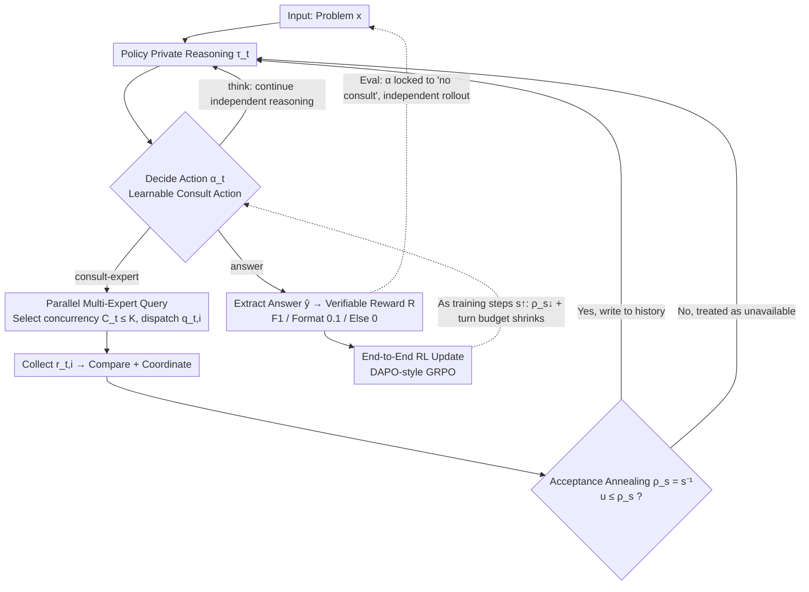

# EAPO: Enhancing Policy Optimization with On-Demand Expert Assistance

**Conference**: ICML 2026  
**arXiv**: [2509.23730](https://arxiv.org/abs/2509.23730)  
**Code**: None  
**Area**: Reinforcement Learning / LLM Reasoning  
**Keywords**: Expert-assisted RL, On-demand consultation, Sparse rewards, Knowledge internalization, Verifiable rewards  

## TL;DR
EAPO treats "consulting an external expert" as a learnable discrete action embedded in the policy space. This allows the LLM to call stronger models on-demand during the RL training phase to obtain intermediate hints. Through a gradually decaying acceptance rate, expert knowledge is internalized into the policy itself. During evaluation, the model performs independent reasoning and consistently out-performs pure self-exploratory RL on mathematical reasoning benchmarks such as AIME and AIMO.

## Background & Motivation

**Background**: The current mainstream paradigm for enhancing LLM reasoning via RL is RLVR (Reinforcement Learning with Verifiable Rewards), represented by outcome-supervised algorithms like GRPO and DAPO. In these methods, the model explores long-chain reasoning paths entirely on its own, receiving a 0/1 reward from a verifier at the end.

**Limitations of Prior Work**: For tasks with massive search spaces like long-form mathematics, pure self-exploration means most rollouts fail to receive a positive reward. This leads to extremely sparse positive samples, high variance in gradient estimation, and slow, unstable training. While test-time scaling solutions like Tree-of-Thoughts, Mixture-of-Agents, and LeaP can compensate by using more compute during inference, they do not improve the policy's intrinsic capability and introduce significant communication and implementation overhead.

**Key Challenge**: There is a structural tension between "needing external guidance during training" and "requiring independence during evaluation." To learn strong reasoning skills, the model must rollout independently; however, independent rollouts make it difficult to obtain positive reward signals. Previous approaches either relied on complete independence (self-exploratory RL) or complete dependence (expert workflows, distillation), lacking a mechanism that dynamically leverages experts during training while removing them during evaluation.

**Goal**: Design an RL framework that allows the policy to seek help from external experts on-demand during training to densify reward signals, while remaining capable of independent reasoning once training is complete.

**Key Insight**: Model "seeking expert help" as a learnable discrete action $\alpha_t$ within the policy's action space. The policy decides whether, when, and how to consult. An acceptance rate annealing mechanism $\rho_s = s^{-1}$ is used to gradually close this channel, forcing the model to internalize the policy derived from expert hints into its own parameters.

**Core Idea**: Transform "consulting experts" into a learnable action coupled with an acceptance rate that decays over training steps, effectively distilling external information into the policy.

## Method

### Overall Architecture

EAPO expands a problem-solving session into a multi-turn trajectory $H_T = \{(\tau_t, \alpha_t, o_t)\}_{t=1}^T$. At each step, the policy first generates private reasoning $\tau_t$, then decides on an action $\alpha_t$ (continue independent reasoning, consult an expert, or output an answer). If consultation is chosen, the environment returns an expert response $o_t$ to be appended to the context; otherwise, $o_t = \varnothing$. The trajectory probability factorizes as $\pi_\theta(\tau_t, \alpha_t \mid H_{t-1}) = \pi_\theta^\tau(\tau_t \mid H_{t-1}) \cdot \pi_\theta^\alpha(\alpha_t \mid H_{t-1}, \tau_t)$. Finally, an end-to-end verifiable reward optimization is performed using $R$ (a combination of F1 and format rewards), targeting $\max_\theta \mathcal{J}_{\text{EAPO}} = \mathbb{E}[R(\mathcal{E}(H_T), g)]$. During evaluation, $\alpha$ is locked to "no consultation," forcing the policy to rollout independently.

Implementation-wise, the policy backbone uses DeepSeek-R1-Distill-Qwen-7B, while the expert pool uses QwQ-32B (heterogeneous and stronger). The training data is DAPO-MATH.

### Key Designs

**1. Learnable "Consult-Expert" Action: Upgrading External Help to a First-Class Citizen**

Previous expert-assisted workflows hardcoded "consulting experts" into an external pipeline, meaning the model never learned *under what conditions* it should ask for help. EAPO extends the action space to include discrete choices like $\{\text{think},\ \text{consult-expert},\ \text{answer}\}$. When a consultation action is triggered, the policy must generate a structured query $q_{t,i}$ for the expert, whose response $r_{t,i}$ is then integrated into the history. The entire trajectory is optimized under the same RL objective, so "when to ask" and "what to ask" are shaped by the reward signal. This design allows the policy to judge problem difficulty and allocate external resources rationally, avoiding both indiscriminate dependency and complete isolation. During training, three rollout modes spontaneously emerge: self-resolution for simple problems, direct consultation (querying 3 experts for comparison) for difficult ones, and decomposition (splitting into sub-problems for separate expert queries) for complex ones.

**2. Parallel Multi-Expert Queries: Decoupling Information Coverage from Interaction Turns**

Long-range reasoning has a limited turn budget. If only one expert can be consulted per turn, the budget might be exhausted before resolution. EAPO allows the policy to choose a concurrency level $C_t \in [0, K]$ in the $t$-th turn, construct a set of queries $\mathcal{Q}_t = \{q_{t,i}\}_{i=1}^{C_t}$ for synchronous dispatch, and collect $o_t = \{r_{t,i}\}_{i=1}^{C_t}$ to form the next context via "comparison + coordination" (where $K=3$). This separates "obtaining multi-perspective evidence" from "consuming an interaction turn," surfacing more evidence within a fixed budget. This recovers instances that the sequential mode fails to solve—Table 2 shows Parallel EAPO outperforms Sequential EAPO by 4 points on AIMO 2025.

**3. Acceptance Rate Annealing + Turn Budget Contraction: Internalizing Expert Knowledge for Independent Evaluation**

Simply adding experts creates a path dependency where the model collapses if the external aid is removed during deployment. EAPO solves this by keeping the consultation channel frequent early on and closing it gradually. Each time an expert returns a response, it is accepted into the history with a probability $\rho_s = s^{-1}$ based on the global training step $s$. Specifically, $u \sim U(0,1)$ is sampled; if $u \le \rho_s$, the response is accepted, otherwise it is treated as unavailable, forcing the policy to continue independently. Simultaneously, the turn budget per episode is reduced from its initial training value toward the evaluation budget. This creates an implicit curriculum: early stages rely on dense expert hints to cross the "zero reward" zone, middle stages force independent attempts when responses are withheld, and late stages see the expert channel almost entirely closed, forcing the policy to rely on learned reasoning patterns. This is essentially online knowledge distillation implemented via RL, where the target is not the teacher's token distribution, but the "advice" given at critical trajectory steps. This is the key to why EAPO out-performs pure RL even during independent rollout in evaluation.

### Loss & Training

The reward function is piecewise: $R = \text{F1}(\hat{y}, g)$ if F1 is non-zero; $R = 0.1$ if F1 = 0 but the format is correct; otherwise $R = 0$. In trajectory generation, $p(o_{t+1} \mid \alpha_{t+1})$ is determined by the expert service and acceptance rate annealing. The optimization algorithm is based on online RL (a DAPO-style GRPO variant), with an implicit penalty on consultation actions (as decaying acceptance rates reduce their expected utility).

## Key Experimental Results

### Main Results

Policy 7B + Expert 32B, trained on DAPO-MATH, evaluated on AIME 2024/2025 + AIMO 2025 using Pass@32 and variance Var:

| Category | Method | Avg Pass@32 ↑ | Avg Var ↓ | Notes |
|---|---|---|---|---|
| Base | DeepSeek-R1-Distill-7B | 42.53 | 0.0947 | Starting point |
| Offline Workflow | Expert-Assisted Workflow | 49.39 | 0.2039 | 7B policy + 3×32B hardcoded experts |
| Offline Workflow | LeaP | 47.08 | 0.1652 | Parallel paths summarizing each other |
| Distillation | LoRA Distill | 43.24 | 0.0969 | Distilled from 32B |
| Online RL | Self-Exploratory RL | 59.16 | 0.0727 | Pure result-driven RL |
| Online RL | **EAPO (Ours)** | **64.07** | **0.0643** | +4.91 vs Self-Exploratory RL |

EAPO achieved a Pass@32 of 64.17 on AIMO 2025, an improvement of ~9 points over self-exploratory RL, with consistently lower variance, indicating improved stability.

### Ablation Study

| Configuration | Avg Pass@32 | Avg Var | Description |
|---|---|---|---|
| Sequential EAPO + 32B Expert | 61.79 | 0.0721 | Single query per turn |
| Parallel EAPO + 14B Expert | 61.55 | 0.0692 | Weaker expert |
| **Parallel EAPO + 32B Expert** | **64.07** | **0.0643** | Full version |
| Homogeneous EAPO (7B Expert = Policy) | 58.85 | 0.0756 | Degenerates to self-exploratory levels |
| Heterogeneous EAPO (Llama-8B Expert) | 60.66 | 0.0727 | Requires complementary abilities |

### Key Findings

- **Expert Capability Floor**: When the expert and policy are homogeneous (the same 7B model), EAPO loses almost all gains (58.85 vs 59.16 for self-exploration). This confirms the framework relies on information injection—"the expert knows what the policy does not"—making complementarity a necessity.
- **Synergy of Parallelism + Large Experts**: Parallel queries primarily improve exploration efficiency and robustness, while expert capacity determines the quality of injected information. Both are orthogonal and indispensable.
- **Cross-Domain Generalization**: Although trained only on DAPO-MATH, EAPO out-performs both the base and self-exploratory RL on benchmarks like HumanEval, HLE, GPQA, MMLU, EvalPlus, HotpotQA, and SimpleQA. This suggests the framework learns a general "consultation-internalization" mechanism rather than math-specific tricks.
- **Diminishing Scale Returns**: Moving from a 7B to a 14B policy shows overall improvements, but marginal gains shrink as the larger models naturally handle more cases independently.

## Highlights & Insights

- Upgrading the "calling external models" logic from pipeline engineering to a policy action with joint optimization is a natural yet under-explored path. It allows RL algorithms to natively express meta-cognitive behaviors like "I don't know, let me ask," resulting in the spontaneous emergence of three rollout modes (self-solve, direct consult, and decomposed consult).
- The use of **explicit temporal decay** via $\rho_s = s^{-1}$ is elegantly simple. It serves as an annealing curriculum for online knowledge distillation, avoiding the loss of intermediate reasoning structures found in offline distillation while bypassing the fragility of hard KL constraints.
- The causal chain "External aid reduces reward sparsity → Policy learns stronger patterns → Internalization enables independent execution" can be transferred to any agent task with long-range sparse rewards, such as learnable "request code review" actions in programming or "query demonstration library" actions in robotics.

## Limitations & Future Work

- The paper does not provide the exact training compute budget. Considering each rollout can trigger up to 3 parallel 32B inferences, plus the high-frequency consultation in early annealing stages, the H100 hours likely far exceed those of the self-exploratory RL baseline. This impacts the fairness of the comparison.
- The "fixed expert" assumption is implicit. The authors do not discuss whether using an updatable LLM as an expert (self-teacher or co-training) would lead to co-drift or collapse.
- The annealing curve $\rho_s = s^{-1}$ is manually set. Its optimality across different task difficulty distributions is unknown; a more principled approach might adjust the rate adaptively based on the policy's own confidence.
- The requirement for heterogeneity is explicit: Homogeneous EAPO is on par with self-exploration, proving the framework cannot create something from nothing via "self-talk." The necessity of an external information source limits its applicability when no stronger expert is available.

## Related Work & Insights

- **vs. Self-Exploratory RL (DAPO / GRPO)**: Pure self-exploration lacks external aid and suffers from sparse rewards. EAPO introduces an expert channel during training to densify rewards and reverts to self-exploration during testing, acting as a special case of "training-evaluation asymmetry."
- **vs. Distillation (Full / LoRA)**: Traditional distillation matches teacher token distributions offline, losing the meta-decision of *when* to ask. EAPO distills intermediate advice at critical steps and lets the policy decide the distillation granularity via RL.
- **vs. Test-Time Scaling (LeaP / ToT / MoA)**: These methods still require multi-model collaboration during deployment, repeating the overhead for every query. EAPO moves this cost to the training phase as a one-time expense, allowing for single-model inference during deployment.
- **vs. Expert-Assisted Workflow**: Hardcoded multi-agent pipelines place consultation outside the policy. EAPO integrates this into the model's behavior, teaching it to allocate external aid adaptively.

## Rating

- Novelty: ⭐⭐⭐⭐ The combination of actionizing "consulting experts" and annealing-based internalization is rare and consistent in RL literature, though individual components are not revolutionary.
- Experimental Thoroughness: ⭐⭐⭐⭐ Covered math and 7 cross-domain benchmarks, including ablations on parallelism, expert size, and homogeneity, but lacked training compute comparisons.
- Writing Quality: ⭐⭐⭐⭐ Clean formulas and a clear hierarchical motivation. The summary of emerging rollout modes is particularly helpful.
- Value: ⭐⭐⭐⭐ Provides a general template for leveraging stronger models during RL training while maintaining independent deployment, which is highly practical for resource-asymmetric industry scenarios.

<!-- RELATED:START -->

## Related Papers

- [\[ICML 2026\] Making Expert Reasoning Learnable with Self-Distillation](making_expert_reasoning_learnable_with_self-distillation.md)
- [\[ICML 2026\] Learning to Route Languages for Multilingual Policy Optimization](learning_to_route_languages_for_multilingual_policy_optimization.md)
- [\[ICLR 2026\] Revisiting Group Relative Policy Optimization: Insights into On-Policy and Off-Policy Training](../../ICLR2026/reinforcement_learning/revisiting_group_relative_policy_optimization_insights_into_on-policy_and_off-po.md)
- [\[ICLR 2026\] Enhancing Generative Auto-bidding with Offline Reward Evaluation and Policy Search](../../ICLR2026/reinforcement_learning/enhancing_generative_auto-bidding_with_offline_reward_evaluation_and_policy_sear.md)
- [\[ICML 2026\] Metis: Learning to Jailbreak LLMs via Self-Evolving Metacognitive Policy Optimization](metis_learning_to_jailbreak_llms_via_self-evolving_metacognitive_policy_optimiza.md)

<!-- RELATED:END -->
