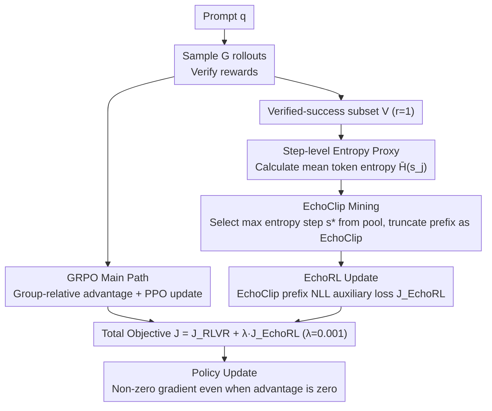

# EchoRL: Reinforcement Learning via Rollout Echoing

**Conference**: ICML 2026  
**arXiv**: [2605.31228](https://arxiv.org/abs/2605.31228)  
**Code**: Mentioned in the paper but the repository link is not explicitly provided  
**Area**: Reinforcement Learning / LLM Reasoning / RLVR / GRPO  
**Keywords**: RLVR, Advantage Degeneration, EchoClip, Step-Level Entropy, GRPO  

## TL;DR
This paper identifies that in the late stages of RLVR training, GRPO-style methods suffer from "advantage degeneration"—where vanishing gradients occur because a group of rollouts all achieve success. The authors propose EchoRL: it identifies the "hardest yet successful" prefix, termed EchoClip, based on **step-level entropy peaks** from verified-success rollouts. This is added to the loss as an auxiliary SFT term, consistently delivering improvements of up to 5.6% ID and 5.0% OOD across 4 RLVR frameworks, 5 backbones, and 10 benchmarks.

## Background & Motivation

**Background**: RLVR (Reinforcement Learning with Verifiable Rewards) has become the de facto standard for post-training LLM reasoning. GRPO is the most widely used framework—removing the critic and replacing the value function with group-relative advantage—forming the foundation for models like DeepSeek-R1 and Qwen-Math.

**Limitations of Prior Work**: As models improve, an increasing number of prompts result in all $G$ rollouts being verified-success. In such cases, the rewards within the group are identical, leading to a standard deviation $\sigma_r=0$. Consequently, the normalized advantage $\hat{A}_i=(r_i-\mu_r)/\sigma_r=0$ holds for all $i$. The GRPO policy gradient $\nabla_\theta J \propto \mathbb{E}[\sum\nabla\log\pi_\theta\cdot w_{i,t}\cdot \hat{A}_i]$ is zeroed out, **consuming significant compute without generating any learning signal**. The authors label this phenomenon "advantage degeneration."

**Key Challenge**: Rewards only reflect the correctness of the final answer, remaining blind to "how the answer was reached." Within the same problem, a rollout using brute-force algebra and one using a clever "logarithmic differentiation trick" both receive a reward of 1. However, the latter contains a **more valuable reasoning path**, which current normalization methods discard as noise. Existing solutions either follow the "rejection sampling / dynamic budget" route (DAPO / Reinforce-Rej / Reinforce-Ada)—discarding degenerate groups at the cost of data efficiency—or the "external golden trajectory supervision" route (LUFFY / UFT / SRFT)—introducing dependence on expensive expert models.

**Goal**: To extract "hidden usable signals" from the model’s own verified-success rollouts and maintain non-zero gradients even during advantage degeneration, without relying on external experts or discarding rollouts.

**Key Insight**: The authors performed a diagnostic analysis comparing the token entropy distributions of expert golden trajectories and current policy verified rollouts. They found that **expert trajectories generally have higher overall entropy**, and within specific trajectories, **information-rich steps are accompanied by sharp entropy peaks**. This translates the question of "which step is important" into "which step has the maximum step-level entropy."

**Core Idea**: Use step-level entropy as a proxy to identify the "hardest yet successful" prefix in verified rollouts as the EchoClip. This is added to the RL objective as an auxiliary NLL loss. Since SFT-style dense supervision does not depend on advantage, it naturally bypasses gradient vanishing.

## Method

### Overall Architecture

EchoRL is a plug-and-play module that can be attached to any RLVR algorithm (GRPO, DAPO, LUFFY, UFT). For each prompt $q$, the standard process still samples $G$ rollouts, calculates group-relative advantages, and performs PPO-style updates. EchoRL inserts two additional steps: (1) **EchoClip Mining**—selecting the most critical prefix $o_{echo}$ from the verified-success subset $V=\{o\mid r(o)=1\}$ based on step-level entropy peaks; (2) **EchoRL Update**—adding the negative log-likelihood of this segment as an auxiliary supervision $\mathcal{J}_{EchoRL}$ to the main loss. The total objective becomes $\mathcal{J}(\theta)=\mathcal{J}_{RLVR}(\theta)+\lambda\mathcal{J}_{EchoRL}(\theta)$, where $\lambda=0.001$. Crucially, when $\hat{A}_i=0$ and $\nabla\mathcal{J}_{RLVR}\to 0$ due to total group success, $\nabla\mathcal{J}_{EchoRL}$ remains non-zero, preventing training stalls.

### Key Designs

**1. Step-level Entropy as a Proxy for "Usable Learning Signals": Quantifying Step Importance**

Since rewards cannot distinguish the value of reasoning steps, EchoRL uses the model's own predictive entropy. The rollout is segmented into reasoning steps $(s_1,\dots,s_M)$ using natural delimiters (e.g., `\n`). Step-level entropy is defined as $\bar{H}(s_j)=\frac{1}{|s_j|}\sum_{x\in s_j}H_\theta(x\mid q,o_{<x})$, representing the mean predictive entropy of all tokens within that step. Mean step-level entropy is used rather than single token entropy to reduce noise from short-term fluctuations like punctuation. This "high entropy = critical step" link is supported by two findings: first, the entropy of expert trajectories is significantly higher than self-generated ones; second, ablation studies show that accuracy collapses faster when high-entropy steps are removed compared to random or low-entropy ones.

**2. EchoClip Mining: Selecting the Unique Critical Prefix**

Given the verified-success set $V=\{o\mid r(o)=1\}$ for a prompt $q$, all steps are aggregated into a pool $\text{Steps}(V)$. The maximum entropy step is identified as $s^*=\arg\max_{s\in\text{Steps}(V)}\bar{H}(s)$. If $o^*\in V$ is the rollout containing $s^*$, the EchoClip is defined as the prefix truncated at the end of $s^*$: $o_{echo}=\text{Prefix}(o^*, s^*)$. Selecting the single maximum entropy step provides more precise localization of "breakthrough moments" than top-k averaging. Truncating to a prefix avoids supervising potentially redundant subsequent steps and allows the model to maintain generation freedom after the critical juncture.

**3. EchoRL Update: Bypassing Advantage Vanishing with Prefix-NLL Loss**

To convert the EchoClip into stable gradients, the auxiliary objective is formulated as the negative log-likelihood on the prefix: $\mathcal{J}_{EchoRL}(\theta)=-\frac{1}{L}\sum_{t=1}^{L}\log\pi_\theta((o_{echo})_t\mid q,(o_{echo})_{<t})$ where $L=|o_{echo}|$. The combined objective is $\mathcal{J}(\theta)=\mathcal{J}_{RLVR}+\lambda\mathcal{J}_{EchoRL}$ with $\lambda=0.001$. The SFT-style token-level NLL is used specifically because its gradient does not depend on group variance, providing valid updates even when $\sigma_r=0$. The small value of $\lambda$ ensures RL remains the primary driver while EchoRL provides "momentum" during degeneration. Unlike LUFFY/UFT, EchoRL requires no external expert trajectories and adds zero additional inference cost.

### Loss & Training

The total objective is $\mathcal{J}(\theta)=\mathcal{J}_{RLVR}(\theta)+\lambda\mathcal{J}_{EchoRL}(\theta)$, $\lambda=0.001$. Parameters include a rollout batch size of 128, update batch size of 64, 8 rollouts per query, and a temperature of 0.6. Implementation is done via verl (text) and EasyR1 (multimodal). Base models include Qwen2.5-1.5B/7B/Math-7B, LLaMA-3.1-8B, and Qwen2.5-VL. Training sets used are OpenR1-Math 45k and Geometry3K.

## Key Experimental Results

### Main Results: EchoRL on Qwen2.5-Math-7B (Excerpts)

| Method | AIME24 | AIME25 | AMC | MATH-500 | Minerva | Olympiad | ID Avg | ARC-c | GPQA | MMLU-Pro | OOD Avg |
|------|--------|--------|-----|----------|---------|----------|--------|-------|------|----------|---------|
| Qwen2.5-Math-7B | 11.4 | 4.9 | 31.3 | 43.6 | 7.4 | 15.6 | 19.0 | 18.2 | 11.1 | 16.9 | 15.4 |
| Qwen2.5-Math-7B-Instruct | 12.9 | 10.2 | 48.5 | 80.4 | 32.7 | 41.0 | 37.6 | 70.3 | 24.7 | 34.1 | 43.0 |
| SFT | 22.2 | 22.3 | 52.8 | 82.6 | 40.8 | 43.7 | 44.1 | 75.2 | 24.7 | 42.7 | 47.5 |
| GRPO | 25.8 | 16.4 | 61.2 | 80.4 | 39.7 | 43.7 | 44.5 | — | — | — | — |
| LUFFY | 29.4 | 23.1 | 65.6 | 87.6 | 37.5 | 57.2 | 50.1 | 80.5 | 39.9 | 53.0 | 57.8 |
| **LUFFY + EchoRL** | **33.4** | **25.7** | **67.5** | **88.9** | 39.0 | 55.1 | **51.9** | **83.6** | **45.3** | **54.1** | **61.0** |
| UFT | 24.8 | 18.1 | 60.5 | 82.6 | 40.1 | 47.8 | 45.7 | 82.2 | 38.9 | 49.6 | 56.9 |
| **UFT + EchoRL** | 27.0 | 21.3 | 62.0 | 84.4 | 40.8 | 49.6 | 47.6 | 82.7 | 43.4 | 53.5 | 59.9 |

LUFFY + EchoRL yielded +1.8% ID and +3.2% OOD. Notably, GPQA increased from 39.9 to 45.3 (+5.4), demonstrating the largest gains on true OOD reasoning tasks.

### Ablation Study (Validating "High Entropy = Critical")

| Deletion Strategy | Accuracy (10% steps removed) | Accuracy (30% steps removed) | Explanation |
|----------|------------------------|------------------------|------|
| Remove High Entropy Steps | Sharp Decrease | Near Random | High entropy steps are reasoning keys |
| Remove Low Entropy Steps | Nearly Unchanged | Acceptable | Low entropy steps are boilerplate |
| Random Removal | Intermediate | Intermediate | Corroborates the above |

### Key Findings
- EchoRL provides positive gains across **all** 4 baseline RLVR methods (GRPO/DAPO/LUFFY/UFT). For LUFFY/UFT, which already use external experts, EchoRL adds an additional 1–3%, indicating that "mining self-generated high-entropy steps" and "using external golden trajectories" are complementary signals.
- OOD gains (up to +5.04%) are more pronounced than ID gains (+5.61% relative), with significant improvements on ARC-c/GPQA/MMLU-Pro, proving that EchoRL enhances **universal reasoning step stability** rather than rote memorization.
- Negligible computational overhead: EchoClip entropy calculations reuse logits already available from the rollout phase. The total training time is comparable to or slightly lower than the original algorithms.

## Highlights & Insights
- **"Entropy peaks as critical steps" is a universal and elegant proxy**: While others use verifiers, PRMs, or external experts, this paper uses the model's own predictive entropy—zero external dependence, near-zero cost, and high interpretability (high entropy = model hesitation at a branch point). This logic can be extended to PRM training, best-of-N selection, or search-based decoding.
- **Bypassing advantage vanishing with an SFT-style loss is a cost-effective engineering trick**: Advantage degeneration is essentially a division-by-zero problem. Instead of trying to adjust the denominator (e.g., via rejection sampling), EchoRL **bypasses the denominator** by injecting gradients via an NLL term.
- **Selecting prefixes over full trajectories is an underrated detail**: EchoRL only supervises the prefix, allowing the model to **retain generation freedom** thereafter. This balances RL exploration with guidance at critical junctures.

## Limitations & Future Work
- Step-level entropy reliability assumes the model is "reasonably calibrated." In early training phases, high entropy might be noise; the authors do not discuss if EchoRL should be delayed.
- The maximization operation over verified-success rollouts collapses to a single trajectory if only one success exists, potentially reducing diversity. Soft selection or top-k EchoClips could be explored.
- The coefficient $\lambda=0.001$ was fixed; optimal $\lambda$ across different scales (e.g., 1.5B models) has not been systematically swept.
- Natural delimiters work for well-formatted CoT but might fail for dense formulas or code blocks. Task-specific tokenizers may be required for industrial deployment.

## Related Work & Insights
- **vs DAPO / Reinforce-Rej / Reinforce-Ada**: These methods discard degenerate prompts or increase budgets, sacrificing data efficiency. EchoRL reuses existing rollouts, improving efficiency.
- **vs LUFFY / UFT / SRFT / SEELE / RelIFT**: These rely on expensive external expert demos. EchoRL is self-sufficient, and experiments show it can be combined with these methods for further gains.
- **vs Process Reward Models (PRM)**: PRMs require expensive step-level annotations. EchoRL replaces PRM scores with entropy for zero extra training.

## Rating
- Novelty: ⭐⭐⭐⭐ The combination of "entropy peak mining + prefix NLL bypass" is quite new for the RLVR pipeline; its engineering simplicity is its strength.
- Experimental Thoroughness: ⭐⭐⭐⭐ Extensive evaluation across 5 backbones, 4 RLVR baselines, and 10 benchmarks with both ID/OOD analysis.
- Writing Quality: ⭐⭐⭐⭐ Clear motivation using a concrete example, with intuitive diagrams and consistent formulas.
- Value: ⭐⭐⭐⭐ Plug-and-play, zero extra compute, and effective across all major RLVR frameworks. High potential for community adoption in libraries like verl/OpenRLHF.

<!-- RELATED:START -->

## Related Papers

- [\[ICML 2026\] DARTS: Distribution-Aware Active Rollout Trajectory Shaping for Accelerating LLM Reinforcement Learning](darts_distribution-aware_active_rollout_trajectory_shaping_for_accelerating_llm_.md)
- [\[ICML 2026\] Single-Rollout Hidden-State Dynamics for Training-Free RLVR Data Selection](single-rollout_hidden-state_dynamics_for_training-free_rlvr_data_selection.md)
- [\[ICLR 2026\] PROS: Towards Compute-Efficient RLVR via Rollout Prefix Reuse](../../ICLR2026/reinforcement_learning/pros_towards_compute-efficient_rlvr_via_rollout_prefix_reuse.md)
- [\[ICML 2026\] InftyThink+: Effective and Efficient Infinite-Horizon Reasoning via Reinforcement Learning](inftythink_effective_and_efficient_infinite-horizon_reasoning_via_reinforcement_.md)
- [\[ICML 2026\] Coupled Variational Reinforcement Learning for Language Model General Reasoning](coupled_variational_reinforcement_learning_for_language_model_general_reasoning.md)

<!-- RELATED:END -->
