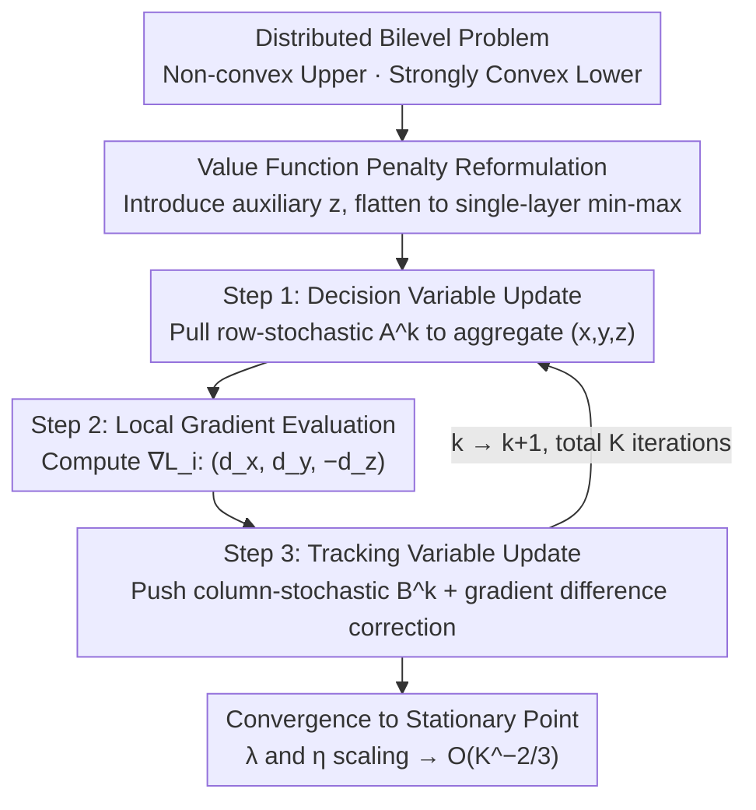

# FAB: A First-Order AB-based Gradient Algorithm for Distributed Bilevel Optimization over Time-Varying Directed Graphs

**Conference**: ICML 2026  
**arXiv**: [2605.06328](https://arxiv.org/abs/2605.06328)  
**Code**: https://anonymous.4open.science/r/FAB-HE66 (Anonymous)  
**Area**: Distributed Optimization / Bilevel Optimization / Reinforcement Learning  
**Keywords**: Push-Pull/AB, Time-Varying Directed Graphs, Bilevel Optimization, First-Order Algorithm, Consensus Error

## TL;DR
This paper proposes FAB—the first purely first-order algorithm for distributed bilevel optimization over time-varying directed graphs. By combining AB/Push-Pull communication with the value function penalty method, it achieves a non-asymptotic $\mathcal{O}(K^{-2/3})$ convergence rate and simultaneously resolves the long-standing open problem regarding the convergence rate of AB/Push-Pull in non-convex scenarios over time-varying directed graphs.

## Background & Motivation
**Background**: Decentralized optimization has become a mainstream paradigm in distributed machine learning. Evolution has progressed from early undirected graph algorithms (EXTRA, Exact-Diffusion, Gradient Tracking) to Push-Sum and Push-DIGing on directed graphs, and further to AB/Push-Pull protocols integrating row-stochastic matrices $A$ and column-stochastic matrices $B$. Recent extensions have incorporated **time-varying directed graphs** to address real-world constraints like communication delays, stragglers, and satellite networks.

**Limitations of Prior Work**: When applying these decentralized algorithms to machine learning tasks, hyperparameter (e.g., regularization $\lambda$) tuning is extremely difficult. The authors observe that instead of brute-force grid searches, it is more effective to treat hyperparameters as upper-level variables in a bilevel optimization (BLO) framework. However, distributed BLO has only been studied for static networks; no provable methods exist for time-varying directed graphs. Furthermore, even in single-level scenarios, the convergence rate of AB/Push-Pull under non-convex objectives on time-varying directed graphs has not been strictly characterized.

**Key Challenge**: (1) Dynamic unbalanced communication introduces persistent consensus drift. In time-varying settings, the Perron-Frobenius eigenvector $\pi$ is no longer fixed, rendering the key analytical tool of $\pi$-invariance from static analysis invalid. (2) There is a rigid trade-off between "approximation accuracy vs. consensus stability": the penalty parameter $\lambda$ must be large to approximate the original BLO problem, but larger $\lambda$ amplifies consensus errors, potentially leading to divergence.

**Goal**: Design a purely first-order, provably convergent distributed bilevel algorithm capable of operating under the most general setting of time-varying directed graphs with a non-convex upper level and strongly convex lower level, while also completing the theoretical convergence analysis for AB/Push-Pull in non-convex time-varying settings.

**Key Insight**: The value function penalty method $\min_{x,y} F(x,y)+\lambda(G(x,y)-\min_z G(x,z))$ transforms the bilevel problem into a single-level one, avoiding second-order Hessian-vector products. By introducing an auxiliary variable $z$ to track $y^*(x)$, the problem is decomposed into a distributable min-max form, which naturally aligns with the push/pull dual-matrix communication of AB/Push-Pull.

**Core Idea**: Use a row-stochastic matrix $A^k$ to pull decision variables $(x,y,z)$ and a column-stochastic matrix $B^k$ to push gradient tracking variables $(t_x,t_y,t_z)$. The gradient descent-ascent updates for the value function penalty objective are embedded directly into the AB/Push-Pull framework, addressing bilevel structures, time-varying directed communication, and first-order gradients simultaneously.

## Method

### Overall Architecture
FAB reformulates the distributed bilevel problem (non-convex upper level, $\mu$-strongly convex lower level):
$\min_x \mathcal{F}^*(x)=F(x,y^*(x))$, $y^*(x)=\arg\min_y G(x,y)$
into an equivalent min-max form with auxiliary variables: $\min_{x,y}\max_z \frac{1}{n}\sum_i \mathcal{L}_i(x,y,z)$, where $\mathcal{L}_i = f_i(x,y)+\lambda(g_i(x,y)-g_i(x,z))$. Each agent $i$ maintains two sets of variables: decision variables $(x_i^k,y_i^k,z_i^k)$ and gradient tracking variables $(t_{x,i}^k,t_{y,i}^k,t_{z,i}^k)$. Each iteration consists of three steps: pulling decision variables via $A^k$, local evaluation of $\nabla \mathcal{L}_i$, and pushing gradient trackers via $B^k$.

### Key Designs

**1. Coupling of AB/Push-Pull + Value Function Penalty: Seamlessly extending single-level primitives to bilevel without second-order derivatives.**
Previous distributed bilevel methods either relied on second-order derivatives (hard to compute accurately in decentralized settings) or were restricted to static undirected graphs. FAB uses the penalty method to rewrite the bilevel objective $\min_{x,y}\max_z F+\lambda(G(x,y)-G(x,z))$ into a single-layer min-max form, bypassing Hessians. $y$ approaches the upper-level optimum via gradient descent while $z$ tracks $y^*(x)$ via gradient ascent. All variables share the same AB/Push-Pull "pull-evaluate-push" structure, requiring no second-order information and fitting time-varying directed communication.

**2. Gradient Tracking Triplet: Recovering unbiased global average gradient estimates on dynamic unbalanced graphs.**
Time-varying directed graphs lack a time-invariant root eigenvector $\pi$. Simple consensus averaging leaves a persistent drift, which is the primary challenge in non-convex analysis. FAB maintains a tracking variable $t$ for each $(x,y,z)$, with the update rule $t^{k+1}_i = \sum_j b_{ij}^k t_j^k + d_i^{k+1} - d_i^k$ (where $d_i^k = \nabla_{\cdot}\mathcal{L}_i$). Column stochasticity ensures $\sum_i t_{\cdot,i}^k = \sum_i d_{\cdot,i}^k$, aligning each agent's step direction with the global average gradient. The difference term $d^{k+1}-d^k$ acts as "self-correction" to cancel consensus drift caused by agent heterogeneity.

**3. Fine-tuned Ratio of Penalty Parameter $\lambda$ and Step Size $\eta$: Provable trade-off between "approximation accuracy" and "consensus stability."**
In bilevel penalties, larger $\lambda$ yields better approximation but amplifies consensus errors, potentially causing divergence. FAB's Lyapunov analysis quantifies this: the descent inequality takes the form $\|\nabla \mathcal{F}^*\|^2 + \frac{8\underline{c}n}{5a^n}\mathcal{C}_{b,3}\lambda \mathbf{V}_D^k \leq \frac{4\mathcal{C}_{gap}}{\lambda^2}+\dots$. Approximation error decays at $\lambda^{-2}$ while consensus error is linearly amplified by $\lambda$. By setting $\lambda = \mathcal{O}(K^{1/3})$ and $\eta = \mathcal{O}(K^{-1/3})$, both terms converge at $K^{-2/3}$. This is a core theoretical contribution: re-balancing the "larger is better" $\lambda$ logic within the framework of distributed consensus errors.

### Loss & Training
Local penalty $\mathcal{L}_i(x,y,z)=f_i(x,y)+\lambda(g_i(x,y)-g_i(x,z))$, with $\lambda=\mathcal{O}(K^{1/3})$; step size $\eta_x^k,\eta_y^k,\eta_z^k=\mathcal{O}(K^{-1/3})$. Assumptions include $\mu$-strongly convex lower level $g_i$, $L_{g,1}$-smoothness, and Hessian Lipschitz continuity. The upper level $f_i$ is $L_{f,1}$-smooth and bounded below (allowing non-convexity). The communication graph is assumed to be $C$-connected with non-zero entries of $A^k, B^k$ lower-bounded by $a,b>0$.

## Key Experimental Results

### Main Results

| Task | Network/Setting | Baselines | FAB Performance |
|------|-----------|---------|----------|
| Distributed RL Policy Evaluation (Linear Bellman) | $\nu\in\{0.1,0.3,0.5\}$, Noise $\omega\in\{1,2,3\}$ | SGP-DL / Push-SAGA-DL / Push-ASGD-DL / AB-DL | Lowest loss and fastest convergence across all connectivity/noise combinations. |
| Fashion-MNIST Data Hyper-cleaning (MLP, 203k params) | $cr\in\{0.4,0.5,0.6\}$, $\rho\in\{0.1,0.5,1\}$ | Same as above | Leading test accuracy across all corruption rates and heterogeneity levels. |
| IMDB Data Hyper-cleaning (BERT-110M Fine-tuning) | Time-varying directed graph | Same as above | Maintains advantage in large-scale NLP settings. |
| MNIST Hyperparameter Tuning (Adversarial corruption) | 100 agents, $cr=0.2,0.4$ | SGP+grid / Push-DIGing+grid / AB+grid | Test accuracy significantly higher than single-level baselines with fixed $\lambda=0.2$. |

### Ablation Study

| Dimension | Observation | Conclusion |
|------|------|------|
| Increase in Network Size $n$ | Convergence performance decreases but not exponentially. | Consistent with the theoretical worst-case $(ab)^{-n}$ bound; actual decay is more moderate. |
| Smaller Connectivity $\nu$ (Sparse) | Both FAB and baselines slow down, but FAB degrades less. | Bilevel + Gradient Tracking is more robust to sparse topologies. |
| Higher Noise $\omega$ | Single-level baselines exhibit significant oscillation. | Bilevel structure acts as built-in adaptive regularization, absorbing gradient noise. |
| Peak Memory | FAB is in the same magnitude as single-level baselines. | First-order design avoids the memory explosion common in second-order methods. |

### Key Findings
- **Resolution of Theoretical Open Problem**: Reducing FAB to a single-level problem (no $\lambda$) yields an $\mathcal{O}((ab)^{-n}K^{-1})$ convergence rate for AB/Push-Pull over non-convex objectives on time-varying directed graphs, matching the centralized gradient descent rate.
- **Bilevel vs. Grid Search**: In motivating experiments, FAB significantly outperformed any single-level method with fixed $\lambda$ under high label noise ($cr=0.4$). The adaptive decay of the $\lambda$ trajectory demonstrates the practical value of bilevel tuning.
- **Network Scale Factor $(ab)^{-n}$**: While theoretically appearing as an exponential penalty, experiments in Figure 6(a) show only slow degradation, similar to worst-case constants in subgradient-push and Push-Pull literature.

## Highlights & Insights
- Integrates "Distributed Optimization," "Bilevel Optimization," and "Time-Varying Directed Graphs"—three traditionally difficult areas—providing the first non-asymptotic convergence guarantee.
- Uses auxiliary variable $z$ to flatten the $\min\max\min$ structure into a single-layer min-max form, elegantly mapping it to the row/column dual-matrix design of AB/Push-Pull. This structure can be generalized to other nested problems like meta-learning and actor-critic.
- Decoupled analytical framework: The "Single-level + Time-varying + Non-convex" subset provides the convergence rate for standard AB/Push-Pull as a byproduct.
- 100% first-order + gradient tracking design allows for easy integration into standard frameworks like PyTorch DDP/RPC without requiring second-order derivative support.

## Limitations & Future Work
- The $(ab)^{-n}$ factor in the convergence constant, while reflecting the worst case, suggests potential performance drops in extremely large-scale and sparse networks; future work may involve tighter task-specific analysis or compressed communication.
- The $\lambda=\mathcal{O}(K^{1/3})$ requirement assumes prior knowledge of $K$; adopting an increasing $\lambda$ scheme (Kwon 2023) could be a path for improvement, though distributed guarantees are not yet established.
- The strongly convex lower-level assumption does not hold for many RL/meta-learning tasks (e.g., non-convex value functions). Relaxing this to PL-conditions or non-convex lower levels is a natural progression.
- The largest model tested was BERT-base (110M); end-to-end viability for large-scale models over inter-continental time-varying communication (e.g., satellite networks) remains to be verified.

## Related Work & Insights
- **vs. AB/Push-Pull Series (Xin & Khan 2018; Pu 2021; Nedić 2025)**: These works focus on single-level problems, primarily under strong convexity. This paper addresses bilevel, non-convex objectives in time-varying settings.
- **vs. Distributed Bilevel (Yang 2022, Zhu 2024)**: Prior works often rely on Hessian-vector products and are limited to static graphs. This is the first first-order solution for both static and time-varying directed graphs.
- **vs. Centralized Bilevel (Kwon 2023, Chen 2025a)**: Local value function penalty methods inspired the reformulation here, but this work specifically addresses the amplification effect between consensus error and $\lambda$.
- **vs. Push-DIGing / SGP**: While also targeting time-varying directed graphs, these are single-level. FAB shows that the same communication primitives can enable hyperparameter adaptation, extending significantly beyond traditional ERM.

## Rating
- Novelty: ⭐⭐⭐⭐⭐ First distributed BLO algorithm for time-varying directed graphs + resolves non-convex time-varying AB/Push-Pull open problem.
- Experimental Thoroughness: ⭐⭐⭐⭐ Covers hyperparameter tuning, data cleaning, and RL; tested across CV and NLP, though lacks ultra-large-scale Federated Learning tests.
- Writing Quality: ⭐⭐⭐⭐ Clear theoretical derivations; challenges and design motivations are well-articulated; Algorithm 1 is compact and readable.
- Value: ⭐⭐⭐⭐ Significant application potential in decentralized ML systems, satellite networks, and automated hyperparameter tuning in Federated Learning.

<!-- RELATED:START -->

## Related Papers

- [\[ICML 2026\] Bilevel Optimization over Saddle Points of Zero-Sum Markov Games](bilevel_optimization_over_saddle_points_of_zero-sum_markov_games.md)
- [\[AAAI 2026\] First-Order Representation Languages for Goal-Conditioned RL](../../AAAI2026/reinforcement_learning/first-order_representation_languages_for_goal-conditioned_rl.md)
- [\[ICML 2026\] Parameter-free Dynamic Regret: Time-varying Movement Costs, Delayed Feedback, and Memory](parameter-free_dynamic_regret_time-varying_movement_costs_delayed_feedback_and_m.md)
- [\[ICLR 2026\] Asynchronous Policy Gradient Aggregation for Efficient Distributed Reinforcement Learning](../../ICLR2026/reinforcement_learning/asynchronous_policy_gradient_aggregation_for_efficient_distributed_reinforcement.md)
- [\[ICLR 2026\] Direct Preference Optimization for Primitive-Enabled Hierarchical RL: A Bilevel Approach](../../ICLR2026/reinforcement_learning/direct_preference_optimization_for_primitive-enabled_hierarchical_rl_a_bilevel_a.md)

<!-- RELATED:END -->
