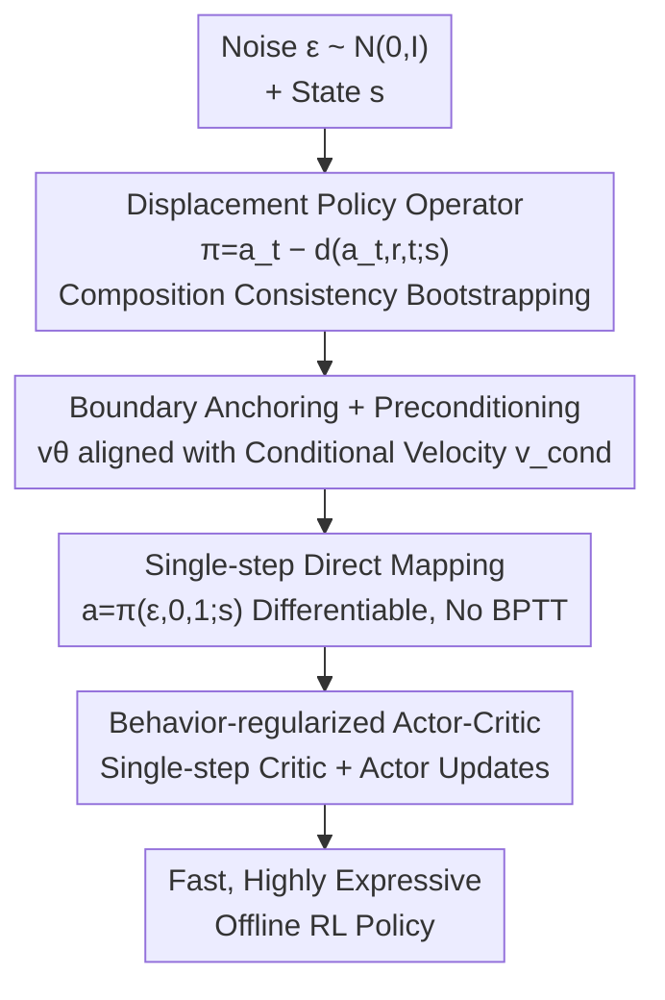

# Fast and Highly Expressive Policy Learning for Offline Reinforcement Learning via Bootstrapped Flow Q-Learning

**Conference**: ICML2026  
**arXiv**: [2606.10613](https://arxiv.org/abs/2606.10613)  
**Code**: To be confirmed  
**Area**: Reinforcement Learning / Offline RL  
**Keywords**: Offline Reinforcement Learning, Flow Matching, Single-step Policy, Bootstrapping, Behavior-regularized Actor-Critic

## TL;DR
Addressing the limitations of multi-step denoising and BPTT in Diffusion Q-Learning—which are slow and unstable—BFQ employs a divide-and-conquer bootstrapping approach for the "noise to action" displacement. By learning short-range displacements (precisely estimable via Flow Matching marginal velocity) and progressively assembling them into a single-step direct mapping, it enables single-step action generation in both training and inference without auxiliary networks, distillation, or multi-stage pipelines, significantly improving both performance and speed on D4RL.

## Background & Motivation
**Background**: Offline RL learns policies from fixed datasets. The core challenges are maintaining **high expressivity** (to capture multimodal action distributions from diverse behaviors) and **computational efficiency** (to facilitate stable value optimization). Recent trends have favored diffusion-based generative policies due to their superior expressivity compared to traditional Gaussian policies. Diffusion Q-Learning (DQL), which replaces the Gaussian policy in TD3+BC with a diffusion policy, has become a strong baseline.

**Limitations of Prior Work**: Diffusion policies generally rely on **multi-step action generation** and require **Backpropagation Through Time (BPTT)** during training. In deployment, multi-step generation reduces action frequency and limits real-time capability; during training, multi-step BPTT is costly and introduces optimization instabilities that hinder convergence. Existing acceleration attempts—such as efficient denoising solvers, IQL-style learning, auxiliary policies with distillation, or Jacobian-based average velocity estimation—either increase algorithmic complexity, require multi-stage training pipelines, or force unfavorable trade-offs between scalability and policy quality.

**Key Challenge**: These inefficiencies and instabilities **fundamentally stem from the multi-step action generation itself**. A natural solution is to directly learn a **single-step** policy while preserving the expressivity of generative models. Although Flow Matching (FM) learns marginal velocity fields more efficiently than diffusion, its induced global trajectories are often **curved** (Figure 2, green arrow), making single-step generation with $\Delta t=1$ inaccurate. Consequently, naive FM policies still require multi-step integration, making BPTT unavoidable for actor-critic integration.

**Goal**: Achieve single-step action generation for both **policy improvement and policy evaluation** using a single policy network trained from scratch, without distillation, multi-stage training, or Jacobian calculations.

**Core Idea**: Instead of directly modeling the marginal velocity, the authors model the **displacement vector** from "noise to clean action." This global displacement can naturally be decomposed recursively into self-similar short-range displacements (divide-and-conquer). Short-range displacements converge to "marginal velocity $\times$ time increment" in the limit and can be accurately solved by standard FM. A shared network is then used to **bootstrap** from short-range to long-range displacements, ultimately learning a single-step direct mapping.

## Method

### Overall Architecture
BFQ is built on a behavior-regularized actor-critic framework, replacing the standard policy with a flow policy capable of **single-step sampling**. It defines a policy operator $\pi(a_t,r,t;s)\triangleq a_t - d(a_t,r,t;s)$, where $d$ is the displacement integral along the flow path from time $t$ to $r$; under true dynamics, $\pi(a_t,r,t;s)=a_r$. Training involves two interleaved tasks: using a **composition consistency loss** to force the network to decompose long-range displacements into two short-range segments (bootstrapping), and a **boundary condition loss** to anchor displacements in infinitesimal intervals to FM conditional velocities (preventing degradation and providing learning signals). After training, sampling reduces to a single differentiable forward pass $a=\pi_\theta(\epsilon, r{=}0, t{=}1; s)$, which is fast and avoids BPTT, allowing both critic and actor updates to rely on single-step action generation.

### Key Designs

**1. Displacement Divide-and-Conquer + Composition Consistency Bootstrapping: Assembling Single-step Mappings from Short-range Segments**

This design directly addresses the "inaccuracy of single-step FM." Rather than modeling marginal velocity, the authors model displacement over a finite interval $[r, t]$ as $d(a_t,r,t;s)\triangleq\int_r^t v(a_\tau,\tau;s)\,d\tau$, defining the policy operator $\pi(a_t,r,t;s)=a_t-d(a_t,r,t;s)$. By the additivity of definite integrals, for any $0\le r\le m\le t\le1$, $d(a_t,r,t)=d(a_m,r,m)+d(a_t,m,t)$. Rewriting this into the policy operator yields the **composition consistency constraint**:

$$\pi(a_t,r,t;s)=\pi\big(\pi(a_t,m,t;s),\,r,m;s\big)$$

Meaning "direct $t$ to $r$" must equal "first $t \to m$, then $m \to r$." During training, a shared network $\pi_\theta$ instantiates this as a bootstrapping loss (with stop-gradients to prevent trivial solutions):

$$\mathcal{L}_{\text{comp}}(\theta)=\mathbb{E}\big[\|\pi_\theta(a_t,r,t;s)-\mathrm{sg}(\tilde a_r)\|_2^2\big],\quad \tilde a_r=\pi_\theta(\pi_\theta(a_t,m,t;s),r,m;s)$$

The intuition is that short-range displacements are easily learned accurately; the model then continuously stitches segments together to bootstrap up to a single-step mapping covering the entire $[0, 1]$ interval.

**2. Boundary Conditions + Velocity Preconditioning: Anchoring Infinitesimal Intervals to FM Conditional Velocity**

Composition consistency alone allows for degenerate solutions. Two boundary conditions are required: for zero-length intervals, $\pi(a_t,t,t;s)=a_t$ (identity); for infinitesimal intervals $\Delta\to0$, $\pi(a_t,t-\Delta,t;s)\approx a_t-\Delta\,v(a_t,t;s)$ (consistency with marginal velocity). However, constraining at $\Delta\to0$ is difficult because the displacement term $\Delta\cdot v_\theta$ becomes negligible, and the critical local velocity information is carried by an update approaching zero, leading to weak signals and unstable optimization.

The solution is **lightweight architectural preconditioning**: the network predicts a velocity-like quantity $v_\theta$, which is used to construct the action update $\pi_\theta(a_t,t-\Delta,t;s)\approx a_t-\Delta\,v_\theta(a_t,t;s)$. For small $\Delta$, the policy directly queries the explicit velocity estimate, anchoring to the local flow dynamics; for large $\Delta$, this constraint naturally yields to the policy's flexibility for non-local transitions. Supervision **reuses existing FM conditional velocity** $v_{\text{cond}}=\epsilon-a$ (avoiding a separate flow teacher), simplifying the boundary loss into numerically stable "instantaneous velocity matching":

$$\mathcal{L}_{\text{bnd}}(\theta)=\mathbb{E}\big[\|v_\theta(a_t,t-\Delta,t;s)-\mathrm{sg}(v_{\text{cond}}(a_t,t\mid a,\epsilon;s))\|_2^2\big]$$

The total behavior cloning objective is a convex combination $\mathcal{L}_{BC}=(1-\lambda)\mathcal{L}_{\text{comp}}+\lambda\mathcal{L}_{\text{bnd}}$. For efficiency, a single component is randomly sampled using $\xi\sim\mathrm{Bernoulli}(\lambda)$ at each step.

**3. Bootstrapped Flow Policy in Behavior-Regularized Actor-Critic: Complete Q-Learning without BPTT**

Integrating the single-step policy into the actor-critic framework makes action sampling a differentiable operation $a=\pi_\theta(\epsilon,r{=}0,t{=}1;s),\ \epsilon\sim\mathcal{N}(0,I)$. The critic uses dual Q-networks with EMA targets. The actor loss treats behavior cloning as a regularizer and maximizes the Q-value:

$$\mathcal{L}(\theta)=\mathcal{L}_{BC}(\theta)-\alpha\,\mathbb{E}_{s\sim\mathcal{D},\,a^\pi\sim\pi_\theta}\big[Q_\phi(s,a^\pi)\big]$$

where $\alpha=\eta/\mathbb{E}_{(s,a)\sim\mathcal{D}}[|Q_\phi(s,a)|]$ is adaptively normalized. Crucially, because actions are generated in a single step, actor gradients backpropagating to parameters **no longer require BPTT**, eliminating recursive graphs and BPTT-induced instability while significantly accelerating training.

### Loss & Training
Both policy and Q-networks use standard MLPs. The policy input is a concatenation of the action latent, current state, and sinusoidal position embeddings (dimension 64) of time steps $t$ and $r$. Parameters $t, r, m$ are sampled uniformly such that $0\le r<m<t\le1$. The boundary offset $\Delta\sim[0,\Delta_{\max}]$ with $\Delta_{\max}=10^{-3}$ is robust. Key hyperparameters include the boundary condition ratio $\lambda$ (default 0.5) and coefficient $\eta$ (grid searched in $\{0.001,\dots,1\}$); Adam optimizer with a learning rate of $3\times10^{-4}$. Results report D4RL normalized scores averaged over 6 seeds and 50 episodes.

## Key Experimental Results

### Main Results
On D4RL, BFQ was compared against non-diffusion policies (BC, TD3-BC, IQL), multi-step diffusion policies (IDQL, DQL, EDP), and single-step flow/diffusion policies (SRPO, SORL, OFQL, FQL). BFQ achieved the highest average scores on MuJoCo locomotion and performed competitively on AntMaze, ranking first on the most difficult AntMaze-Large-Play.

| Domain | DQL (Multi-step) | FQL (Single-step) | OFQL (Single-step) | BFQ (Ours) |
|----|------|------|------|------|
| MuJoCo Avg | 89.0 | 79.2 | 92.5 | **92.8** |
| AntMaze Avg | 81.3 | 79.0 | **84.6** | 83.9 |

(Normalized scores; BFQ increased the MuJoCo average from 89.0 in DQL to 92.8, with significant gains in medium and medium-replay datasets where noise and multimodality are prominent.)

### Efficiency Comparison (MuJoCo, 1M training steps)

| Method | Gen. Steps | Action Freq (Hz) | Training Time (h) |
|------|---------|--------------|-------------|
| **BFQ** | 1 | 851.2 | **7.8** |
| FQL | 1 | 929.6 | 7.9 (5-step distil) |
| DQL | 5 | 238.1 | 11.7 |
| DQL | 50 | 35.5 | 49.5 |

### Ablation Study
Impact of boundary condition ratio $\lambda$ on HalfCheetah:

| $\lambda$ | 1 | 0.75 | **0.5** | 0.25 | 0 |
|-----------|---|------|------|------|---|
| Medium-Expert | 80.9 | 96.1 | **98.5** | 94.0 | −2.5 |
| Medium | 45.3 | 63.7 | **66.1** | 62.1 | −2.5 |
| Medium-Replay | 49.0 | 50.7 | **52.1** | 51.8 | 10.6 |

### Key Findings
- **Boundary Anchoring is Essential**: When $\lambda=0$ (no boundary velocity constraint), the policy collapses (-2.5), indicating that composition consistency bootstrapping requires FM conditional velocity as a "base" to prevent degradation.
- **Single-step is Sufficient**: BFQ matches or exceeds multi-step DQL using only a single step. The action frequency (851.2 Hz) is much higher than DQL’s (35.5 Hz for 50 steps), and training is significantly faster (7.8h vs 49.5h).
- **Expressivity is Preserved**: On multimodal bandit toy data, BFQ’s single-step generation approximates the distribution modeling quality of a 10-step FM (Figure 3).
- **Stability in Sparse Rewards**: In long-horizon sparse reward tasks like AntMaze, BFQ outperforms most single-step baselines (like FQL), suggesting that boundary-conditioned flows provide more stable policy optimization.

## Highlights & Insights
- **Divide-and-Conquer + Bootstrapping Bypasses Inaccuracy**: The core trick is decomposing global displacement into self-similar short-range segments and bootstrapping with stop-gradients. This avoids the difficulty of directly learning curved global trajectories and can be transferred to other single-step flow/diffusion tasks.
- **Preconditioning Solves Numerical Issues**: Predicting a velocity-like quantity and multiplying by $\Delta$ for action updates ensures the identity condition is met while preventing small-$\Delta$ updates from being lost in numerical noise.
- **Achieving True Simplicity**: Using a single network, training from scratch, and reusing FM conditional velocities eliminates the need for auxiliary policies, distillation, multi-stage pipelines, or Jacobian calculations.

## Limitations & Future Work
- Evaluation is focused on D4RL (MuJoCo + AntMaze); performance in higher-dimensional, real-world robotic, or pixel-based environments remains to be verified.
- BFQ slightly trails OFQL on AntMaze (83.9 vs 84.6), leaving room for discussion on whether single-step expressivity is fully sufficient for complex sparse reward tasks.
- The method introduces hyperparameters like $\lambda$, $\eta$, and $\Delta_{\max}$. While default values are robust, the collapse at $\lambda=0$ suggests sensitivity to the boundary condition ratio.

## Related Work & Insights
- **vs DQL (Multi-step Diffusion)**: DQL is expressive but slow and unstable due to BPTT. BFQ maintains expressivity while being single-step and BPTT-free, outperforming MuJoCo scores while being several times faster.
- **vs FQL (Single-step Flow via Distillation)**: FQL requires a distillation process that queries a multi-step flow/diffusion model. BFQ is a single-network, scratch-trained model without distillation and performs better across most tasks.
- **vs OFQL / MeanFlow**: These rely on mean velocity estimation and explicit Jacobian calculations. BFQ avoids Jacobians entirely, using only FM conditional velocity bootstrapping.

## Rating
- Novelty: ⭐⭐⭐⭐⭐ The combination of displacement divide-and-conquer bootstrapping and FM boundary anchoring is highly novel.
- Experimental Thoroughness: ⭐⭐⭐⭐ Comprehensive D4RL comparison + efficiency + ablation, though restricted to standard benchmarks.
- Writing Quality: ⭐⭐⭐⭐⭐ The derivation from pain points to divide-and-conquer intuition to actor-critic integration is logical and clear.
- Value: ⭐⭐⭐⭐⭐ Significantly improves expressivity, speed, and stability without increasing system complexity, making it highly attractive for practical offline RL.

<!-- RELATED:START -->

## Related Papers

- [\[ICLR 2026\] Flow Actor-Critic for Offline Reinforcement Learning (FAC)](../../ICLR2026/reinforcement_learning/flow_actor-critic_for_offline_reinforcement_learning.md)
- [\[ICLR 2026\] PolicyFlow: Policy Optimization with Continuous Normalizing Flow in Reinforcement Learning](../../ICLR2026/reinforcement_learning/policyflow_policy_optimization_with_continuous_normalizing_flow_in_reinforcement.md)
- [\[ICML 2026\] Reverse Flow Matching: A Unified Framework for Online Reinforcement Learning with Diffusion and Flow Policies](reverse_flow_matching_a_unified_framework_for_online_reinforcement_learning_with.md)
- [\[ICLR 2026\] Adaptive Scaling of Policy Constraints for Offline Reinforcement Learning](../../ICLR2026/reinforcement_learning/adaptive_scaling_of_policy_constraints_for_offline_reinforcement_learning.md)
- [\[ICML 2026\] Offline Reinforcement Learning with Generative Trajectory Policies](offline_reinforcement_learning_with_generative_trajectory_policies.md)

<!-- RELATED:END -->
