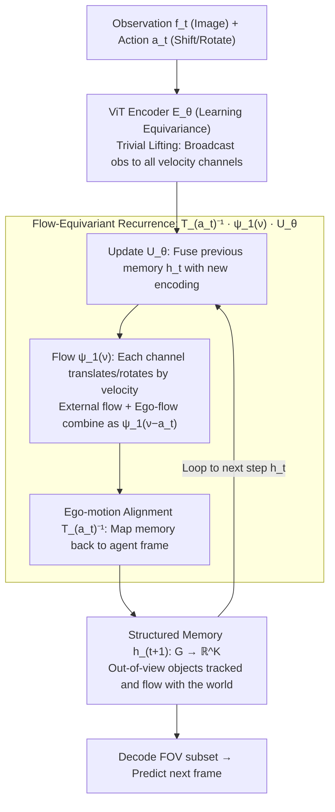

# Flow-Equivariant World Models: Memory for Partially Observed Dynamic Environments

**Conference**: ICML 2026  
**arXiv**: [2601.01075](https://arxiv.org/abs/2601.01075)  
**Code**: To be confirmed  
**Area**: Reinforcement Learning / World Models / Representation Learning  
**Keywords**: World Models, Partially Observable, Flow-Equivariant, Structured Memory, Dynamic Environment Prediction

## TL;DR
FloWM maintains structured dynamic memory in latent space by leveraging **time-parameterized symmetries** (flow equivariance). This solves the problem of objects "disappearing" after moving out of bounds in partially observed environments, achieving long-horizon prediction accuracy far exceeding diffusion and recurrent baselines (SSIM 0.9525 vs. DFoT 0.8885 in 3D Block World 210-step prediction).

## Background & Motivation

**Background**: World models are central to embodied intelligence, requiring the simultaneous prediction of ego-motion and external object dynamics. Existing methods primarily employ large-scale Latent Diffusion Transformers (similar to CogVideoX), which achieve realistic visual quality but exhibit fatal weaknesses in partially observed scenarios where the agent has a limited field of view (FOV).

**Limitations of Prior Work**:
- **Sliding Window Information Loss**: Self-attention windows must discard historical information that exceeds the context length. When the agent turns back to the original view, out-of-bounds objects have vanished from the context, making them untraceable.
- **View-Dependent Memory Fails with Dynamics**: Existing memory-augmented methods (e.g., WORLDMEM) store observations from specific viewpoints, which cannot maintain consistency when external objects move.
- **Long-Horizon Prediction Failure**: Diffusion-based schemes begin to hallucinate after a certain prediction depth (generating objects out of thin air or forgetting existing ones).

**Key Challenge**: The world possesses temporal structure (ego-motion + external object motion), but existing models ignore this structure, relying instead on brute-force encoding via general attention mechanisms. This leads to an inability to distinguish between "temporarily invisible" and "non-existent."

**Goal**: (1) Establish a theoretical framework to formalize structured dynamic memory via flow equivariance; (2) Design a scalable implementation supporting 2D/3D partially observed environments; (3) Verify advantages in long-horizon prediction and downstream planning tasks.

**Key Insight**: Drawing from equivariance in group theory—if a data generation process respects group symmetries, incorporating these symmetries into the model can significantly enhance generalization (as demonstrated in molecular dynamics with up to 1000x improvements). This paper innovates by extending **static group equivariance to time-parameterized flows**, naturally giving rise to structured memory.

**Core Idea**: Maintain a stack of "velocity channels" in latent space, where each channel corresponds to a different motion flow (e.g., velocity vectors). During each update, the entire latent state is first transformed based on the agent's action (achieving ego-motion equivariance) and then fused with new observations (achieving external motion equivariance), allowing memory to automatically align with the world structure.

## Method

### Overall Architecture
The core of FloWM is a **step-by-step recurrence** that strictly separates "invisible" from "non-existent" in latent space. Given the current observation $f_t$ and action $a_t$: observations are first encoded via a ViT encoder and broadcast to a set of "velocity channels" through **trivial lifting**. An update operator $U_\theta$ then fuses this with the previous structured memory. Subsequently, each velocity channel automatically undergoes translation/rotation according to its motion flow $\psi_1(\nu)$ (external motion). Finally, the inverse transformation $T_{a_t}^{-1}$ derived from the agent's action aligns the entire memory back to the current reference frame (ego-motion). The resulting latent state $h_t: G \to \mathbb{R}^K$ is a structured dynamic memory covering the **entire world coordinate space** $G$ (rather than just the current FOV). Objects outside the FOV are continuously remembered and "flow" with the world; during prediction, only the subset of the memory corresponding to the current FOV is decoded.

This scheme is implemented in three layers: establishing the **general flow-equivariant framework** (extending static group equivariance to time-parameterized flows), instantiating specific networks for **2D/3D tasks**, and utilizing flow transformations to maintain **out-of-view objects** (partially observed patches).

**Input**: Observation sequence $\{f_t\}$ (images) + Action sequence $\{a_t\}$ (displacements/rotations)  
**Latent State**: Structured memory $h_t: G \to \mathbb{R}^K$, where $G$ is the world coordinate space  
**Output**: Predicted observation $\hat{f}_{t+1}$ (decoded from the current FOV subset of the latent space)

### Key Designs

**1. Flow-Equivariant Recurrence: Synchronizing memory with world dynamics and ego-motion.**

The fundamental issue with sliding windows and view-dependent memory is the inability to distinguish between "temporarily out of view" and "vanished." Once an object crosses the boundary, self-attention must discard it. The core mechanism is the recurrence $h_{t+1}(\nu) = T_{a_t}^{-1} \psi_1(\nu) \cdot U_\theta[h_t(\nu); E_\theta[f_t, h_t](\nu)]$. The latent state is a stack of "velocity channels," where $\psi_1(\nu)$ is the single-step flow transformation for channel $\nu$, and $T_{a_t}$ is the transformation from agent actions. By explicitly modeling temporal symmetry, objects outside the FOV are not only remembered but their trajectories are updated via the same rules as those inside the FOV. Compared to unstructured self-attention, this drastically reduces learning complexity—achieving 100x faster convergence in experiments.

**2. Velocity Channels and Trivial Lifting: Replacing explicit velocity prediction with algebraic combinations.**

Explicitly predicting the velocity of every external object is fragile and difficult to scale. Instead, the encoder uses "trivial lifting" $E_\theta[f_t; h_t](\nu) = E_\theta[f_t; h_t](\nu')$, broadcasting the same observation to all channels. During updates, the external object flow $\psi_1(\nu)$ and the ego-action flow $\psi_1(-a_t)$ combine algebraically into $\psi_1(\nu - a_t)$, and the velocity channels align themselves automatically. The model learns an implicit velocity representation rather than regressing exact values. Shared parameters across channels reduce latent dimensionality and improve robustness by decoupling ego-motion from external dynamics.

**3. Learning Equivariance in ViT Encoders: Using "weak constraints + strong induction" for expressivity.**

Enforcing exact equivariance in 2D/3D encoders often requires expensive 3D back-projection. The authors forgo explicit equivariance constraints on the encoder, allowing the outer recurrence $T_{a_t}^{-1}\psi_1(\nu)$ to "encourage" the encoder to learn equivariance—mapping first-person views to abstract bird's-eye views while maintaining geometric consistency. Probe network experiments validate this approach: post-training equivariance error dropped from 6.96 to 0.22, allowing object positions to be recovered from the latent space with 96% accuracy, far exceeding the 2.36% of baselines.

## Key Experimental Results

### Main Results: 2D MNIST World (Partially Observed)

| Model | 20-step MSE | 150-step MSE | 20-step PSNR | 150-step PSNR | 150-step SSIM |
|------|--------|---------|----------|-----------|----------|
| **FloWM (Full)** | 0.0005 | **0.0018** | 32.99 | **27.56** | **0.9813** |
| FloWM (No VC) | 0.0041 | 0.0334 | 23.83 | 14.77 | 0.7729 |
| FloWM (No SME) | 0.1234 | 0.1317 | 9.088 | 8.805 | 0.0127 |
| DFoT Baseline | 0.1448 | 0.2111 | 8.394 | 6.755 | 0.2434 |
| DFoT-SSM | 0.1277 | 0.1688 | 8.940 | 7.726 | 0.3146 |

The full FloWM maintains a PSNR of 27.56 at 150 steps (7.5x the training length), while baselines collapse at 20 steps. Learning curves show FloWM converges 100x faster.

### Main Results: 3D Block World (Rigid Dynamics + Partial Observability)

| Model | 70-step MSE | 210-step MSE | 70-step SSIM | 210-step SSIM | Planning Success |
|------|--------|----------|----------|-----------|----------|
| **FloWM (Full)** | 0.000603 | **0.001539** | 0.9673 | **0.9525** | **0.727** |
| FloWM (No VC) | 0.007615 | 0.009614 | 0.9045 | 0.8935 | — |
| FloWM (No SME) | 0.009579 | 0.012625 | 0.8782 | 0.8631 | — |
| DFoT | 0.011759 | 0.021684 | 0.9377 | 0.8885 | 5.571 |
| DreamerV3 RSSM | 0.016360 | 0.016470 | 0.8799 | 0.8782 | 6.449 |

For 210-step predictions (3x training length), FloWM achieves an SSIM of 0.9525, whereas all baselines drop to 0.8-0.89. Baselines exhibit severe hallucinations, while FloWM remains clear. In the "Find Red Block" planning task, FloWM achieves an average distance of 0.727, compared to 5-6 for baselines.

### Key Findings
- Using a probe network to decode object positions from latent space, FloWM achieves 96% accuracy, while DFoT/DFoT-SSM fall below 1%.
- Equivariance error dropped from 6.96 to 0.22 (↓96%) after training, validating the effectiveness of learned equivariance.
- Removing velocity channels (No VC) or ego-motion equivariance (No SME) leads to a sharp decline in performance, indicating both modules are essential.

## Highlights & Insights
- **Elegance of Theoretical Framework**: Uses Lie groups/algebra to unify temporal symmetry, naturally deriving a recurrence for structured memory from the concept of "flow equivariance."
- **Fundamental Insight into POMDPs**: Identifies that failure in existing methods stems from confusing "invisible" with "non-existent." Flow equivariance forces the model to distinguish between the two.
- **Pragmatic Learning Equivariance**: Avoiding exact equivariance constraints (which are costly in 3D) in favor of induction via recurrence demonstrates that models can automatically learn equivariant representations.
- **Transferable Techniques**: The "trivial lifting" of velocity channels can be applied to other multi-model problems, and probe networks offer a robust way to verify if latent spaces have captured intended structures.

## Limitations & Future Work
- Experiments were conducted in controlled environments; validation on real-world self-driving or robotics datasets is missing.
- The latent space mapping assumes a fixed size, which may exceed capacity during very long-term interactions.
- Currently only supports rigid body motion; deformation and soft bodies are not handled.
- Encoder fragility: While learned equivariance proved effective, the process is implicit and lacks theoretical guarantees for large-scale applications.
- Future directions: Extension to continuous velocity families, adaptive latent space sizing, and incorporating explicit depth prediction to strengthen equivariant constraints.

## Related Work & Insights
- **vs. DreamerV3**: Dreamer uses recurrent latent states without spatial structure, confusing viewpoint changes with world changes in POMDPs. FloWM decouples these, leading to 10x better long-horizon performance.
- **vs. Diffusion Forcing (DFoT)**: DFoT relies on sliding windows without explicit memory, leading to hallucinations after 150 steps; FloWM remains precise.
- **vs. WORLDMEM / Memory Banks**: These store historical observations but still rely on self-attention for fusion, failing to handle dynamics. FloWM actively updates memory locations via flow transforms.
- **vs. Neural Mapping / EgoMap**: Early works utilized "structured mapping," but FloWM formalizes and generalizes this via flow-equivariant theory and parameterization.

## Rating
- Novelty: ⭐⭐⭐⭐⭐  Systematically introduces flow equivariance to world models with an elegant theoretical framework.
- Experimental Thoroughness: ⭐⭐⭐⭐  Extensive 2D/3D benchmarks and ablation studies, though environments are relatively simplified (low noise/randomness).
- Writing Quality: ⭐⭐⭐⭐⭐  Clear logic, mathematically rigorous but accessible, with intuitive diagrams.
- Value: ⭐⭐⭐⭐⭐  Provides profound insights into world models for POMDPs; methodology is applicable to SLAM and navigation tasks.

<!-- RELATED:START -->

## Related Papers

- [\[ICML 2025\] PIGDreamer: Privileged Information Guided World Models for Safe Partially Observable RL](../../ICML2025/reinforcement_learning/pigdreamer_privileged_information_guided_world_models_for_safe_partially_observa.md)
- [\[ICML 2026\] Parameter-free Dynamic Regret: Time-varying Movement Costs, Delayed Feedback, and Memory](parameter-free_dynamic_regret_time-varying_movement_costs_delayed_feedback_and_m.md)
- [\[CVPR 2026\] GeoWorld: Geometric World Models](../../CVPR2026/reinforcement_learning/geoworld_geometric_world_models.md)
- [\[CVPR 2026\] DreamSAC: Learning Hamiltonian World Models via Symmetry Exploration](../../CVPR2026/reinforcement_learning/dreamsac_learning_hamiltonian_world_models_via_symmetry_exploration.md)
- [\[ICML 2026\] Break the Block: Dynamic-size Reasoning Blocks for Diffusion Large Language Models via Monotonic Entropy Descent with Reinforcement Learning](break_the_block_dynamic-size_reasoning_blocks_for_diffusion_large_language_model.md)

<!-- RELATED:END -->
