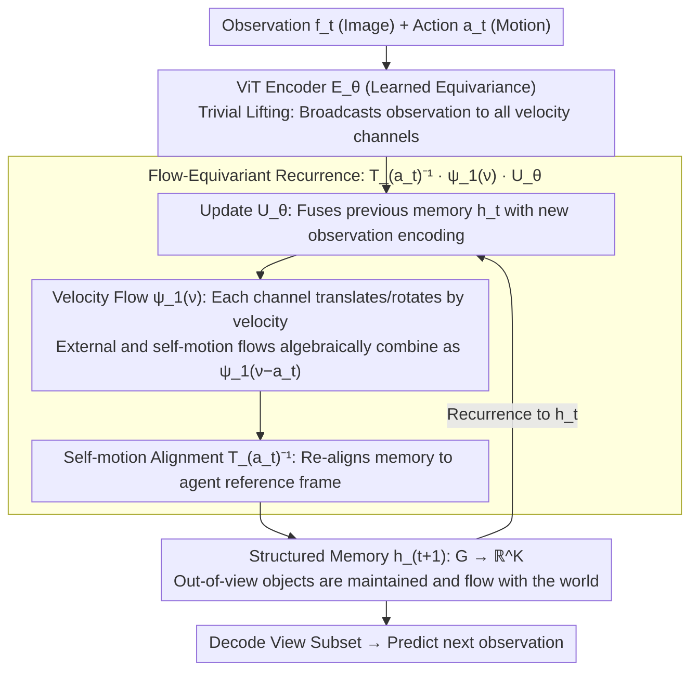

# Flow-Equivariant World Models: Memory for Partially Observed Dynamic Environments

**Conference**: ICML 2026  
**arXiv**: [2601.01075](https://arxiv.org/abs/2601.01075)  
**Code**: To be confirmed  
**Area**: Reinforcement Learning / World Models / Representation Learning  
**Keywords**: World Models, Partial Observability, Flow-Equivariance, Structured Memory, Dynamic Environment Prediction

## TL;DR
FloWM maintains structured dynamic memory by leveraging **time-parameterized symmetries** (flow-equivariance) in the latent space—solving the issue of objects "disappearing" after moving out of the field of view in partially observed environments. It achieves long-horizon prediction accuracy far exceeding diffusion and recurrent baselines (SSIM 0.9525 vs. DFoT 0.8885 in 210-step 3D Block World predictions).

## Background & Motivation

**Background**: World models are central to embodied intelligence, requiring simultaneous prediction of self-motion and external object dynamics. Existing methods primarily employ large-scale Latent Diffusion Transformers (CogVideoX style), which achieve realistic visual quality but exhibit fatal weaknesses in partially observed scenarios where the agent has a limited field of view.

**Limitations of Prior Work**:
- **Sliding Window Information Loss**: Self-attention windows must discard historical information exceeding their range. When the agent turns back to the original view, out-of-bounds objects have vanished from the context, rendering the model unable to track them.
- **Viewpoint-Dependent Memory Cannot Handle Dynamics**: Existing memory-augmentation methods (e.g., WORLDMEM) store observations indexed by specific viewpoints, failing to maintain consistency when external objects move.
- **Long-Horizon Prediction Failure**: Diffusion-based schemes begin to hallucinate after a certain depth (generating objects out of nowhere or forgetting existing ones).

**Key Challenge**: The world possesses temporal structure (self-motion + external dynamics), yet existing models ignore this structure, relying on generic attention to brute-force encode information—resulting in an inability to distinguish between an "object being temporarily invisible" and an "object not existing."

**Goal**: (1) Establish a theoretical framework to formalize structured dynamic memory using flow-equivariance; (2) Design a scalable implementation for 2D/3D partially observed environments; (3) Validate advantages in long-horizon prediction and downstream planning tasks.

**Key Insight**: Leveraging equivariance from group theory—if a data generation process respects group symmetries, incorporating such symmetries into the model significantly improves generalization (as seen in molecular dynamics with up to 1000x improvements). This paper innovates by **extending static group equivariance to time-parameterized flows**, naturally yielding structured memory.

**Core Idea**: Maintain a stack of "velocity channels" in the latent space, where each channel corresponds to a different motion flow (e.g., velocity vectors). During each update, the entire latent state is transformed based on the agent's action (self-motion equivariance), then merged with new observations (external motion equivariance), allowing the memory to align automatically with the world's structure.

## Method

### Overall Architecture
The core of FloWM is a **step-by-step recurrence** that strictly separates "invisible" from "non-existent" in the latent space. Upon receiving current observation $f_t$ and action $a_t$: the observation is encoded via a ViT encoder and broadcast to a set of "velocity channels" through **trivial lifting**. An update operator $U_\theta$ fuses this with the previous structured memory. Each velocity channel then automatically translates/rotates according to its motion flow $\psi_1(\nu)$ (external dynamics). Finally, an inverse transformation $T_{a_t}^{-1}$ derived from the agent's action aligns the entire memory back to the current reference frame (self-motion). The resulting latent state $h_t: G \to \mathbb{R}^K$ constitutes a structured dynamic memory covering the **entire world coordinate space** $G$ (rather than just the current field of view). Objects outside the view are remembered and "flow" with the world; during prediction, only the subset of memory corresponding to the current view is decoded.

This scheme is implemented in three layers: establishing a **general flow-equivariant framework** (extending group equivariance to time-parameterized flows), instantiating specific networks for **2D/3D tasks**, and using flow transformations to maintain **out-of-view objects** (partially observed patches).

**Input**: Observation sequence $\{f_t\}$ (images) + Action sequence $\{a_t\}$ (displacement/rotation)  
**Latent State**: Structured memory $h_t: G \to \mathbb{R}^K$, where $G$ is the world coordinate space  
**Output**: Predicted observation $\hat{f}_{t+1}$ (decoded from a subset of the latent space)

### Key Designs

**1. Flow-Equivariant Recurrence: Separating "Invisible" from "Non-existent"**

The fundamental issue with sliding windows and viewpoint-dependent memory is the failure to distinguish between "object temporarily out of view" and "object disappeared." Once an object crosses the boundary, self-attention windows discard it. The authors' core mechanism is a recurrence formula: $h_{t+1}(\nu) = T_{a_t}^{-1} \psi_1(\nu) \cdot U_\theta[h_t(\nu); E_\theta[f_t, h_t](\nu)]$. The latent state is a stack of "velocity channels," where $\psi_1(\nu)$ is the single-step flow transformation (translation/rotation) for channel $\nu$, and $T_{a_t}$ is the transformation from the agent's action. Each step involves letting memory flow according to channel velocities, merging new observations, and re-aligning everything back to the agent's frame via $T_{a_t}^{-1}$. This ensures out-of-view objects are not only remembered but also updated using the same rules as visible ones. Explicitly modeling temporal symmetry reduces learning complexity significantly—achieving convergence 100x faster than unstructured baselines.

**2. Velocity Channels and Trivial Lifting: Algebraic Combination Instead of Explicit Velocity Prediction**

Explicitly predicting the velocity of every external object is fragile and difficult to scale. Instead, the encoder uses "trivial lifting" $E_\theta[f_t; h_t](\nu) = E_\theta[f_t; h_t](\nu')$, broadcasting the same observation to all channels. During updates, the external object flow $\psi_1(\nu)$ and self-motion flow $\psi_1(-a_t)$ combine algebraically into $\psi_1(\nu - a_t)$, causing velocity channels to sort themselves automatically. The model thus learns an implicit velocity representation rather than regressing specific values. Parameters are shared across channels, minimizing latent dimensionality and ensuring that motion modes (self vs. external) do not interfere, leading to better robustness against unseen dynamics.

**3. Learned Equivairance in ViT Encoder: Trading Exact Constraints for Scalability**

Enforcing exact equivariance in 2D/3D encoders often requires expensive 3D back-projection. The authors forgo explicit constraints on the encoder, instead relying on the outer recurrence $T_{a_t}^{-1}\psi_1(\nu)$ to "encourage" the encoder to learn equivariance—mapping first-person views to abstract top-down views while maintaining geometric consistency. Probe experiments validate this: after training, equivariance error dropped from 6.96 to 0.22, and the model recovered object positions from the latent space with 96% accuracy (compared to 2.36% for baselines). Using feedforward approximation instead of exact constraints preserves performance while enabling stronger encoder expressivity and 3D scalability.

## Key Experimental Results

### Main Results: 2D MNIST World (Partial Observability)

| Model | 20-step MSE | 150-step MSE | 20-step PSNR | 150-step PSNR | 150-step SSIM |
|------|--------|---------|----------|-----------|----------|
| **FloWM (Full)** | 0.0005 | **0.0018** | 32.99 | **27.56** | **0.9813** |
| FloWM (w/o VC) | 0.0041 | 0.0334 | 23.83 | 14.77 | 0.7729 |
| FloWM (w/o SME) | 0.1234 | 0.1317 | 9.088 | 8.805 | 0.0127 |
| DFoT Baseline | 0.1448 | 0.2111 | 8.394 | 6.755 | 0.2434 |
| DFoT-SSM | 0.1277 | 0.1688 | 8.940 | 7.726 | 0.3146 |

The full FloWM maintains a PSNR of 27.56 at 150 steps (7.5x the training length), while baselines collapse at 20 steps. Learning curves indicate FloWM converges 100x faster.

### 3D Block World (Rigid Body Dynamics + Partial Observability)

| Model | 70-step MSE | 210-step MSE | 70-step SSIM | 210-step SSIM | Planning Success |
|------|--------|----------|----------|-----------|----------|
| **FloWM (Full)** | 0.000603 | **0.001539** | 0.9673 | **0.9525** | **0.727** |
| FloWM (w/o VC) | 0.007615 | 0.009614 | 0.9045 | 0.8935 | — |
| FloWM (w/o SME) | 0.009579 | 0.012625 | 0.8782 | 0.8631 | — |
| DFoT | 0.011759 | 0.021684 | 0.9377 | 0.8885 | 5.571 |
| DreamerV3 RSSM | 0.016360 | 0.016470 | 0.8799 | 0.8782 | 6.449 |

At 210-step predictions (3x training length), FloWM achieves an SSIM of 0.9525, whereas all baselines drop to 0.8-0.89. Baselines exhibit severe hallucinations—generating objects, forgetting them, or creating blurry overlays—while FloWM remains clear. In a downstream planning task ("Find the Red Block"), FloWM's average distance is 0.727 vs. 5-6 for baselines.

### Key Findings
- FloWM can recover object positions from the latent space with 96% accuracy via probe networks, compared to less than 1% for DFoT / DFoT-SSM.
- Equivariance error decreased from 6.96 to 0.22 (↓96%) after training, validating the effectiveness of learned equivariance.
- Removing velocity channels (w/o VC) or self-motion equivariance (w/o SME) caused a sharp drop in performance; both components are essential.

## Highlights & Insights
- **Theoretical Elegance**: Unified treatment of temporal symmetry via Lie groups/algebras leads naturally to a structured memory recurrence formula, avoiding ad-hoc mechanisms. It is highly scalable—adding a new symmetry only requires extending the velocity channel set.
- **Fundamental Insight into Partial Observability**: Identifies that failure in existing methods stems from "confusing invisible with non-existent." Flow-equivariance forces the model to distinguish between the two, explaining why generic self-attention is a weakness in this context.
- **Pragmatic Learned Equivariance**: Instead of enforcing exact constraints (which are costly for 3D back-projection), the model relies on the recurrence relation to induce equivariant representations. This "weak constraint + strong induction" philosophy is transferable to other geometric tasks.
- **Transferable Techniques**: The trivial lifting of velocity channels can be applied to other multimodal problems; use of probe networks confirms whether the latent space has learned the intended structure.

## Limitations & Future Work
- Experiments were conducted only in controlled environments (discrete actions, known parameterizations); lacks evaluation on real-world autonomous driving or robotics datasets.
- Latent space mapping assumes a fixed size, which may exceed capacity during long-term interactions.
- Currently supports only rigid body motion; fails to handle deformation or soft bodies.
- Encoder fragility: While learned equivariance proved effective, the process is implicit and lacks theoretical guarantees, potentially leading to failure cases in large-scale applications.
- Future directions: Expanding to continuous velocity families; adaptive latent space sizing; incorporating explicit depth prediction to strengthen the reliability of equivariant constraints.

## Related Work & Insights
- **vs. DreamerV3**: Uses recurrent latent states for dynamics but lacks spatial structure. It confuses viewpoint shifts with world changes under partial observability; FloWM decouples these, leading to 10x better long-horizon performance.
- **vs. Diffusion Forced (DFoT)**: Uses sliding windows + diffusion without explicit memory. It fails (hallucinates) after 150 steps; FloWM remains precise.
- **vs. WORLDMEM / Memory Bank**: Stores historical frames but relies on self-attention for fusion, which fails to handle dynamics. FloWM proactively updates memory locations via flow transformations.
- **vs. Neural Mapping / EgoMap**: Shared the "structured mapping" concept but lacked flow parameterization, formal equivariance theory, and predictive support; FloWM is a modern, generalized formalization of these ideas.

## Rating
- Novelty: ⭐⭐⭐⭐⭐  Systematically introduces flow-equivariance to world models to formalize symmetry under partial observability; the framework is entirely new and elegant.
- Experimental Thoroughness: ⭐⭐⭐⭐  Comprehensive 2D/3D benchmarks and indepth ablation; however, environments are highly simplified (lacking noise/occlusion/stochasticity), making true generalization hard to assess.
- Writing Quality: ⭐⭐⭐⭐⭐  Clear logic, mathematically rigorous but accessible, with intuitive diagrams.
- Value: ⭐⭐⭐⭐⭐  Provides profound insights into world models and partial observability; methodology is applicable to other tasks requiring structured representations (SLAM, navigation).

<!-- RELATED:START -->

## Related Papers

- [\[ICML 2025\] PIGDreamer: Privileged Information Guided World Models for Safe Partially Observable RL](../../ICML2025/reinforcement_learning/pigdreamer_privileged_information_guided_world_models_for_safe_partially_observa.md)
- [\[ICML 2026\] Parameter-free Dynamic Regret: Time-varying Movement Costs, Delayed Feedback, and Memory](parameter-free_dynamic_regret_time-varying_movement_costs_delayed_feedback_and_m.md)
- [\[CVPR 2026\] GeoWorld: Geometric World Models](../../CVPR2026/reinforcement_learning/geoworld_geometric_world_models.md)
- [\[CVPR 2026\] DreamSAC: Learning Hamiltonian World Models via Symmetry Exploration](../../CVPR2026/reinforcement_learning/dreamsac_learning_hamiltonian_world_models_via_symmetry_exploration.md)
- [\[ICML 2026\] Perceptual Flow Network for Visually Grounded Reasoning](perceptual_flow_network_for_visually_grounded_reasoning.md)

<!-- RELATED:END -->
