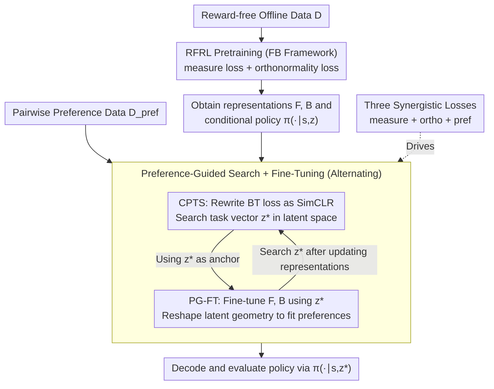

# From Reward-Free Representations to Preferences: Rethinking Offline Preference-Based Reinforcement Learning

**Conference**: ICML 2026  
**arXiv**: [2606.01123](https://arxiv.org/abs/2606.01123)  
**Code**: https://github.com/rl-bandits-lab/FB-PbRL (Available)  
**Area**: Reinforcement Learning / Preference Learning  
**Keywords**: PbRL, Forward-Backward Representation, Contrastive Learning, Zero-Shot RL, Successor Measure

## TL;DR
This paper reformulates Offline Preference-Based Reinforcement Learning (PbRL) within the Forward-Backward (FB) representation space. It proves that under the FB framework, the standard Bradley-Terry preference loss is equivalent to the SimCLR contrastive loss. Consequently, it proposes FB-PbRL: first pretraining FB representations on reward-free offline data, then using a contrastive objective on preference data to search for the task vector $\boldsymbol{z}^\star$ and fine-tune the representations. The entire pipeline avoids training any explicit reward or preference models.

## Background & Motivation
**Background**: The standard approach for offline PbRL involves two stages: first, learning a reward model $r_{\boldsymbol{\psi}}$ from pairwise preference data $(\sigma^{(1)},\sigma^{(2)},y)$ using the BT model (minimizing $\mathcal{L}(\boldsymbol{\psi})=-\mathbb{E}[\mathbb{I}(y=1)\log P_{\boldsymbol{\psi}}(\sigma^{(1)}\succ\sigma^{(2)})+\ldots]$); then, training a policy using existing offline RL algorithms on the dataset labeled by $r_{\boldsymbol{\psi}}$. Alternatively, one might skip the reward and learn a preference model directly.

**Limitations of Prior Work**: Human preferences are extremely expensive—typically, the budget is only a few thousand pairs—making both standard paths difficult. Learning rewards often leads to reward over-optimization and poor generalization (Fig. 2 shows that rewards learned via BT collapse and do not match the ground truth distribution), while directly learning preference models suffers from underfitting and low precision. On low-quality ExORL datasets, these methods struggle to learn effectively.

**Key Challenge**: PbRL suffers from overfitting under scarce supervision, whether through "reward-first" or "direct-preference" learning. Conversely, reward-free representation learning (RFRL) methods (e.g., FB, Laplacian, HILP, PSM) can learn highly general representations on reward-free data, providing near-optimal policies for any reward function zero-shot. However, RFRL requires a ground-truth reward $r(s,a)$ at test-time to assemble the task vector $\boldsymbol{z}_r=\mathbb{E}[\mathbf{B}_\omega(s,a)r(s,a)]$, which is unavailable in the PbRL setting where only preferences exist.

**Goal**: How can RFRL representations be utilized for PbRL without reward supervision? This is decomposed into two sub-problems: (a) How to derive the task vector $\boldsymbol{z}$ directly from preference data? (b) How to adapt the pretrained representation, which is task-agnostic, to a specific preference task?

**Key Insight**: The authors discovered that within the FB framework, if it is assumed that rewards are linearly representable relative to the backward representation $r_{\boldsymbol{\psi}}(s,a)=\mathbf{B}_{\bar\omega}(s,a)^\top\boldsymbol{\psi}$ and the backward representation is orthonormal $\mathbf{H}_\mathbf{B}\approx\mathbf{I}_d$ (which FB pretraining enforces), then the BT preference loss can be analytically rewritten into a SimCLR-style contrastive loss for $\boldsymbol{z}$. This effectively replaces "learning a reward" with "contrastive retrieval in the FB latent space."

**Core Idea**: Instead of learning reward or preference models, the approach transforms preference optimization into contrastive learning over frozen FB backward representations—followed by a fine-tuning step to "align" the pretrained FB geometry with the specific preference task, thereby bypassing reward over-optimization.

## Method

### Overall Architecture
FB-PbRL consists of two stages, taking reward-free offline data $\mathcal{D}$ and pairwise preference data $\mathcal{D}_{\text{pref}}$ as input:

1.  **RFRL Pretraining**: The FB framework (Touati & Ollivier 2021/2023) is used to decompose the successor measure as $\mathcal{M}^{\pi_r^*}(s,a,\{(s',a')\})=\mathbf{F}_\theta(s,a,\boldsymbol{z}_r)^\top\mathbf{B}_\omega(s',a')$. $\mathbf{F}$ and $\mathbf{B}$ are learned on $\mathcal{D}$ alongside the conditional policy $\pi(\cdot\mid s,\boldsymbol{z})$ using measure loss and orthonormality loss (entirely unsupervised).
2.  **Preference-guided search + fine-tune**: Two processes alternate—(i) Contrastive Preference Task Search (CPTS) searches for the anchor vector $\boldsymbol{z}^\star$ using the contrastive preference loss; (ii) Preference-Guided Fine-Tuning (PG-FT) fine-tunes $\mathbf{F}$ and $\mathbf{B}$ using $\boldsymbol{z}^\star$ as an anchor to align the latent geometry with the preference structure. Evaluation is performed via $\pi(\cdot\mid s,\boldsymbol{z}^\star)$.

The process never explicitly constructs rewards. Since $\boldsymbol{z}^\star$ is a low-dimensional vector (typically $d \approx$ hundreds), the optimization cost is significantly lower than training high-capacity reward/preference models.

### Key Designs

**1. CPTS: Analytically rewriting BT preference loss as SimCLR in the FB latent space to search for task vectors rather than learning rewards**

Learning rewards directly under scarce feedback leads to over-optimization (Fig. 2 shows BT rewards collapse to the mean and fail to match the true distribution), which is the primary failure mode of PbRL. The key insight is that under two constraints inherent to FB—linearity of rewards relative to the backward representation $r_{\boldsymbol{\psi}}(s,a)=\mathbf{B}_{\bar\omega}(s,a)^\top\boldsymbol{\psi}$ and orthonormality $\mathbf{H}_\mathbf{B}=\mathbf{I}_d$—the BT preference loss can be analytically rewritten as a contrastive loss. Defining the segment latent representation as $\mathbf{B}_{\bar\omega}(\sigma):=\tfrac{1}{k}\sum_i \mathbf{B}_{\bar\omega}(s_i,a_i)$, and letting $\boldsymbol{z}_\sigma^+,\boldsymbol{z}_\sigma^-$ be the latent codes for the preferred and non-preferred segments, substituting $\boldsymbol{\psi}=\mathbf{H}_\mathbf{B}^{-1}\boldsymbol{z}_{\boldsymbol{\psi}}$ into the BT loss yields:

$$\mathcal{L}_{\text{pref}}(\boldsymbol{z};\bar\omega)=-\mathbb{E}\Big[\log\frac{\exp(\boldsymbol{z}^\top\boldsymbol{z}_\sigma^+)}{\exp(\boldsymbol{z}^\top\boldsymbol{z}_\sigma^+)+\exp(\boldsymbol{z}^\top\boldsymbol{z}_\sigma^-)}\Big],$$

which is the SimCLR contrastive form. Thus, CPTS searches for $\boldsymbol{z}_{\text{CPTS}}^\star=\arg\min_{\boldsymbol{z}}\mathcal{L}_{\text{pref}}$ on frozen FB representations. This is a low-dimensional convex minimizer that avoids overfitting of high-capacity networks and provides formal guarantees that near-optimal control depends on preference coverage and estimation error.

**2. PG-FT: Back-fine-tuning the FB latent space using the current $\boldsymbol{z}^\star$ as an anchor to specialize general representations for the preference task**

During pretraining, $\boldsymbol{z}\sim\mathcal{N}(0,I_d)$ is a task-agnostic prior. The $\boldsymbol{z}_{\text{CPTS}}^\star$ found by CPTS is often far from the clusters induced by preference data $\boldsymbol{z}_\sigma$ (visual evidence in Fig. 3(a)). General RFRL representations are "adequate for any task" but lack sharpness for a specific preference direction. PG-FT treats the FB representations as trainable and updates them alternately: one step updates $\boldsymbol{z}^\star$ via $\nabla_{\boldsymbol{z}}\mathcal{L}_{\text{pref}}(\boldsymbol{z};\omega)$, and the next step fine-tunes $\mathbf{F}_\theta,\mathbf{B}_\omega$ using $\boldsymbol{z}^\star$ as an anchor via $\mathcal{L}_m(\theta,\omega;\boldsymbol{z}^\star)+\lambda\mathcal{L}_{\text{ortho}}(\omega)+\alpha\mathcal{L}_{\text{pref}}(\omega;\boldsymbol{z}^\star)$. The preference signal acts as a task instruction, reshaping the latent geometry to be reward-aligned (Fig. 3(b) shows $\boldsymbol{z}_\sigma$ colored by true returns) and pulling $\boldsymbol{z}^\star$ back into the in-distribution region for more accurate policy decoding.

**3. Alternating training objective with three synergistic losses: Preserving FB geometry while adding preference alignment**

Fine-tuning carries the risk of degrading the general representation. Thus, signals for "geometric validity" and "preference alignment" must constrain each other. The measure loss $\mathcal{L}_m$ is the Bellman residual of the successor measure, ensuring $\mathbf{F}$ and $\mathbf{B}$ still correctly decompose the measure. The orthonormality loss $\mathcal{L}_{\text{ortho}}(\omega)=\|\mathbb{E}[\mathbf{B}_\omega(s,a)\mathbf{B}_\omega(s,a)^\top]-\mathbf{I}_d\|_F^2$ maintains $\mathbf{H}_\mathbf{B}\approx\mathbf{I}_d$, which is the prerequisite for the SimCLR equivalence. The preference loss $\mathcal{L}_{\text{pref}}$ drives both $\boldsymbol{z}^\star$ search and $\mathbf{B}_\omega$ fine-tuning. The loop updates measure + ortho via transitions, updates $\mathbf{B}_\omega$ and $\boldsymbol{z}^\star$ via preferences, and finally updates the policy synchronously using $\mathbf{F}, \mathbf{B}, \boldsymbol{z}^\star$.

### Loss & Training
- Total loss: $\mathcal{L}_m(\theta,\omega;\boldsymbol{z}^\star)+\lambda\mathcal{L}_{\text{ortho}}(\omega)+\alpha\mathcal{L}_{\text{pref}}(\boldsymbol{z}^\star,\omega)$, with default $\alpha=100$.
- Protocol: Standard PbRL Protocol uses 2000 preference pairs; Zero-Shot RL Protocol uses preferences sampled from 400 trajectories (10k transitions) for fair comparison with RFRL baselines.

## Key Experimental Results

### Main Results
16 DMC tasks (Cheetah/Walker/Quadruped/Pointmass, 4 per domain), using RND unsupervised data from ExORL (low quality, no reward supervision). Ours-T = CPTS only, Ours-FT = complete FB-PbRL.

**vs offline PbRL baselines (PbRL Protocol, average return per domain)**:

| Domain | DPPO | OPPO | OPRL | CLARIFY | LIRE | Ours-T | Ours-FT |
|---|---|---|---|---|---|---|---|
| Cheetah | 202.3 | 200.9 | 276.4 | 271.5 | 313.4 | 344.7 | **621.7** |
| Walker | 242.3 | 247.5 | 253.8 | 248.9 | 232.5 | 533.4 | **762.9** |
| Quadruped | 309.1 | 569.3 | 631.1 | 602.9 | 378.7 | 663.4 | **846.9** |
| Pointmass | 16.3 | 24.1 | 337.5 | 317.8 | 102.3 | 69.1 | **570.8** |

Ours-FT is the top performer in almost all 16 tasks. Even Ours-T, which only performs test-time search, outperforms all PbRL baselines, indicating that BT-based methods fail on low-quality data while FB representations are inherently robust to distribution shift.

**vs Zero-Shot RFRL baselines (Zero-Shot Protocol, average return; Ours uses preferences only)**:

| Domain | Laplace | FB | HILP | PSM | RLDP | Ours-FT |
|---|---|---|---|---|---|---|
| Cheetah | 316.5 | 385.6 | 193.5 | 626.0 | 609.6 | **645.4** |
| Walker | 136.7 | **719.9** | 348.1 | 689.1 | 621.6 | 699.4 |
| Quadruped | 601.2 | 561.7 | 289.8 | 618.7 | 612.8 | **826.3** |

Using only preference data, Ours-FT still beats RFRL baselines that use true rewards (e.g., Quadruped average gap 200+).

### Ablation Study

| Configuration | Cheetah | Walker | Quadruped | Description |
|---|---|---|---|---|
| FB-BT-FT (Ensemble BT Reward + FB FT) | 536.6 | 600.6 | 714.1 | "Learn reward then fine-tune" strategy; inferior |
| Ours-FT (Contrastive FT) | **621.7** | **794.5** | **846.9** | Full method |

Additionally, Fig. 5 shows: (a) Performance drops only ~10% when reducing preferences from 2000 to 200 pairs; (b) Robustness against noise $\delta=0.2$; (c) Stability across a wide range of preference coefficients $\alpha$. Table 3 shows Ours-FT scores 89.0/71.2 on Adroit Pen-cloned and MetaWorld Button-Press with human labels, outperforming LiRE and DPPO.

### Key Findings
- **Contrastive FT > Reward FT**: FB-BT-FT is significantly worse than Ours-FT (gap of 80+ points), confirming that using preferences directly as contrastive signals is better than learning a BT reward first; contrastive weights do not exhibit the same collapse patterns.
- **CPTS only is strong**: Ours-T without fine-tuning already beats all PbRL baselines on DMC, proving RFRL pretrained representations are inherently more suitable for sparse supervision than traditional PbRL.
- **Sample Efficiency**: 200 preference pairs achieve performance comparable to 2000 pairs, which is highly beneficial for expensive human labeling. Performance exceeds strong baselines after just 1 hour of fine-tuning.
- **Pointmass-Bottom-Right is a Failure Case**: Uneven RND data coverage combined with sparse signals from 10k transitions led to high variance and poor performance for FB-PbRL in this specific target.

## Highlights & Insights
- **"Preference Loss = Contrastive Loss" is an elegant analytical equivalence**: While BT preference loss is usually seen as a sequence-level probabilistic model, this work reveals it is equivalent to SimCLR under linear rewards and orthonormal backward representations. This bridge between PbRL and RFRL is a powerful conceptual contribution.
- **"Search + Fine-tune" Paradigm**: CPTS provides coarse alignment through low-dimensional convex search, while PG-FT provides fine alignment through high-dimensional representation updates. This "anchor-based" approach could be extended to other multi-task transfer learning scenarios.
- **Bypassing Reward Over-optimization**: Reward hacking is a persistent issue in RLHF. This paper provides a path that does not require training a reward model, which has significant implications for LLM alignment.

## Limitations & Future Work
- The equivalence relies on structural assumptions specific to the FB framework (linear rewards + $\mathbf{H}_\mathbf{B}=\mathbf{I}_d$), which might not generalize to other RFRL architectures like PSM.
- Pretraining cost: While fine-tuning is efficient, FB pretraining requires massive reward-free data and compute.
- Vulnerability in specific cases: Pointmass experiments show that "insufficient coverage + sparse preferences" remains a challenge; future work could integrate active query selection.
- On human preference data like Pen-human, Ours-FT still slightly trails DPPO, suggesting improvements are needed when preference quality varies.

## Related Work & Insights
- **vs DPPO / OPPO (no reward model PbRL)**: These use contrastive learning on trajectory embeddings without RFRL support. FB-PbRL applies it to the successor-measure latent space, leading to significantly better performance (3-5x higher on DMC RND).
- **vs OPRL / CLARIFY (active PbRL)**: These use active queries for efficiency; FB-PbRL achieves high efficiency by using superior representations.
- **vs FB / Laplace / PSM (RFRL)**: These require true rewards at test-time; this work replaces rewards with preferences and uses PG-FT to outperform reward-based baselines.
- **vs RLHF / IPL**: Similar goal (avoiding explicit reward models), but while IPL focuses on "Q-implicit rewards," this work focuses on "task vector search in representation space."

## Rating
- Novelty: ⭐⭐⭐⭐⭐ The BT loss = SimCLR bridge is a significant discovery.
- Experimental Thoroughness: ⭐⭐⭐⭐⭐ Covers 16 tasks, 3 protocols, multiple baselines, and robustness tests.
- Writing Quality: ⭐⭐⭐⭐⭐ Logical progression from reward collapse to analytical equivalence.
- Value: ⭐⭐⭐⭐⭐ Strong evidence for reward-model-free learning, with potential impact on RLHF and LLM alignment.

<!-- RELATED:START -->

## Related Papers

- [\[ICML 2026\] Video-Based Optimal Transport for Feedback-Efficient Offline Preference-Based Reinforcement Learning](video-based_optimal_transport_for_feedback-efficient_offline_preference-based_re.md)
- [\[ICLR 2026\] A Reward-Free Viewpoint on Multi-Objective Reinforcement Learning](../../ICLR2026/reinforcement_learning/a_reward-free_viewpoint_on_multi-objective_reinforcement_learning.md)
- [\[ICLR 2026\] Preference-based Policy Optimization from Sparse-reward Offline Dataset](../../ICLR2026/reinforcement_learning/preference-based_policy_optimization_from_sparse-reward_offline_dataset.md)
- [\[ICML 2026\] Safe Reinforcement Learning with Preference-Based Constraint Inference](safe_reinforcement_learning_with_preference-based_constraint_inference.md)
- [\[ICLR 2026\] Offline Preference-based Value Optimization](../../ICLR2026/reinforcement_learning/offline_preference-based_value_optimization.md)

<!-- RELATED:END -->
