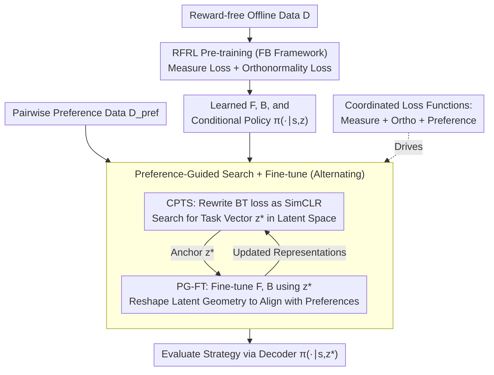

# From Reward-Free Representations to Preferences: Rethinking Offline Preference-Based Reinforcement Learning

**Conference**: ICML 2026  
**arXiv**: [2606.01123](https://arxiv.org/abs/2606.01123)  
**Code**: https://github.com/rl-bandits-lab/FB-PbRL (Yes)  
**Area**: Reinforcement Learning / Preference Learning  
**Keywords**: PbRL, Forward-Backward Representation, Contrastive Learning, Zero-shot RL, Successor Measure

## TL;DR
This paper reformulates offline Preference-based Reinforcement Learning (PbRL) within the Forward-Backward (FB) representation space. It proves that the standard Bradley-Terry preference loss under the FB framework is equivalent to the SimCLR contrastive loss. Consequently, the authors propose FB-PbRL: pre-training FB representations on reward-free offline data, followed by searching for a task vector $\boldsymbol{z}^\star$ using a contrastive objective and fine-tuning the representations on preference data. This pipeline eliminates the need for any explicit reward or preference models.

## Background & Motivation
**Background**: The standard approach for offline PbRL follows two stages: first, training a reward model $r_{\boldsymbol{\psi}}$ from pairwise preference data $(\sigma^{(1)},\sigma^{(2)},y)$ using the BT model (minimizing $\mathcal{L}(\boldsymbol{\psi})=-\mathbb{E}[\mathbb{I}(y=1)\log P_{\boldsymbol{\psi}}(\sigma^{(1)}\succ\sigma^{(2)})+\ldots]$), and then applying off-the-shelf offline RL algorithms on the dataset labeled by $r_{\boldsymbol{\psi}}$; or alternatively, learning a preference model directly to guide the policy.

**Limitations of Prior Work**: Human preferences are extremely expensive—budgets typically only allow for a few thousand pairs—making both standard paths problematic. Learning a reward model often leads to reward over-optimization and poor generalization (Fig. 2 shows that rewards learned by BT often collapse and deviate from the ground truth distribution). Learning a preference model directly frequently suffers from underfitting and low precision. Both categories of methods fail to learn effectively on low-quality datasets like ExORL.

**Key Challenge**: PbRL methods overfit when supervision is scarce, whether using "reward-first" or "direct-preference" strategies. In contrast, Reward-Free Representation Learning (RFRL) methods (e.g., FB, Laplacian, HILP, PSM) can learn highly general representations from reward-free data, enabling near-optimal policies for any reward function zero-shot. However, RFRL requires the ground-truth reward $r(s,a)$ at test-time to assemble the task vector $\boldsymbol{z}_r=\mathbb{E}[\mathbf{B}_\omega(s,a)r(s,a)]$, which is unavailable in PbRL scenarios where only preferences exist.

**Goal**: How to utilize RFRL representations for PbRL in the absence of reward supervision? This is decomposed into two sub-problems: (a) How to derive the task vector $\boldsymbol{z}$ directly from preference data? (b) How to adapt pre-trained task-agnostic representations to specific preference tasks?

**Key Insight**: The authors discover that within the FB framework, if the reward is assumed to be linearly representable by the backward representation $r_{\boldsymbol{\psi}}(s,a)=\mathbf{B}_{\bar\omega}(s,a)^\top\boldsymbol{\psi}$, and the backward representation is approximately orthonormal $\mathbf{H}_\mathbf{B}\approx\mathbf{I}_d$ (an inherent constraint in FB pre-training), then the BT preference loss can be analytically rewritten in a SimCLR contrastive form with respect to $\boldsymbol{z}$. This effectively replaces "reward learning" with "contrastive retrieval in the FB latent space."

**Core Idea**: Instead of learning a reward or preference model, the method optimizes preferences via contrastive learning over frozen FB backward representations, followed by a fine-tuning step to "align" the pre-trained FB geometry with specific preference tasks, thus avoiding reward over-optimization.

## Method

### Overall Architecture
FB-PbRL consists of two stages, taking reward-free offline data $\mathcal{D}$ and pairwise preference data $\mathcal{D}_{\text{pref}}$ as inputs:

1. **RFRL Pre-training**: Utilize the FB framework (Touati & Ollivier 2021/2023) to decompose the successor measure as $\mathcal{M}^{\pi_r^*}(s,a,\{(s',a')\})=\mathbf{F}_\theta(s,a,\boldsymbol{z}_r)^\top\mathbf{B}_\omega(s',a')$. The models $\mathbf{F}$, $\mathbf{B}$, and the conditional policy $\pi(\cdot\mid s,\boldsymbol{z})$ are learned on $\mathcal{D}$ using measure loss and orthonormality loss (fully unsupervised).
2. **Preference-guided search + fine-tune**: Iteratively perform two operations: (i) Contrastive Preference Task Search (CPTS) to find the anchor vector $\boldsymbol{z}^\star$ using a contrastive preference loss, and (ii) Preference-Guided Fine-Tuning (PG-FT) to fine-tune $\mathbf{F}$ and $\mathbf{B}$ using $\boldsymbol{z}^\star$ as an anchor to align the latent geometry with the preference structure. Evaluation is performed using $\pi(\cdot\mid s,\boldsymbol{z}^\star)$.

The entire flow avoids explicit reward construction. $\boldsymbol{z}^\star$ is a low-dimensional vector (typically $d \sim$ hundreds), making optimization significantly cheaper than training high-capacity reward or preference models.

### Key Designs

**1. CPTS: Analytically rewriting BT preference loss as SimCLR in FB latent space to search for task vectors rather than learning rewards.**

Direct reward learning under scarce feedback leads to over-optimization (Fig. 2). The key insight is that under the two constraints inherent to the FB framework—linear reward representation $r_{\boldsymbol{\psi}}(s,a)=\mathbf{B}_{\bar\omega}(s,a)^\top\boldsymbol{\psi}$ and backward representation orthonormality $\mathbf{H}_\mathbf{B}=\mathbf{I}_d$—the BT loss can be rewritten. Defining the segment latent representation as $\mathbf{B}_{\bar\omega}(\sigma):=\tfrac{1}{k}\sum_i \mathbf{B}_{\bar\omega}(s_i,a_i)$, and letting $\boldsymbol{z}_\sigma^+,\boldsymbol{z}_\sigma^-$ be the latent codes for preferred and non-preferred segments, substituting $\boldsymbol{\psi}=\mathbf{H}_\mathbf{B}^{-1}\boldsymbol{z}_{\boldsymbol{\psi}}$ into the BT loss yields:

$$\mathcal{L}_{\text{pref}}(\boldsymbol{z};\bar\omega)=-\mathbb{E}\Big[\log\frac{\exp(\boldsymbol{z}^\top\boldsymbol{z}_\sigma^+)}{\exp(\boldsymbol{z}^\top\boldsymbol{z}_\sigma^+)+\exp(\boldsymbol{z}^\top\boldsymbol{z}_\sigma^-)}\Big],$$

which is the SimCLR contrastive form. CPTS searches for $\boldsymbol{z}_{\text{CPTS}}^\star=\arg\min_{\boldsymbol{z}}\mathcal{L}_{\text{pref}}$ on frozen representations. This minimizer of a low-dimensional convex objective avoids overfitting associated with high-capacity networks and provides formal guarantees based on preference coverage.

**2. PG-FT: Fine-tuning the FB latent space using $\boldsymbol{z}^\star$ as an anchor to specialize general representations for specific preference tasks.**

During pre-training, $\boldsymbol{z}\sim\mathcal{N}(0,I_d)$ serves as a task-agnostic prior. The searched $\boldsymbol{z}_{\text{CPTS}}^\star$ often lies far from the $\boldsymbol{z}_\sigma$ clusters induced by preference data (visualized in Fig. 3(a)). Universal RFRL representations are "good for everything" but not "sharp" for specific directions. PG-FT treats FB parameters as trainable, alternating between: updating $\boldsymbol{z}^\star$ via $\nabla_{\boldsymbol{z}}\mathcal{L}_{\text{pref}}(\boldsymbol{z};\omega)$, and fine-tuning $\mathbf{F}_\theta,\mathbf{B}_\omega$ using $\mathcal{L}_m(\theta,\omega;\boldsymbol{z}^\star)+\lambda\mathcal{L}_{\text{ortho}}(\omega)+\alpha\mathcal{L}_{\text{pref}}(\omega;\boldsymbol{z}^\star)$. Preference signals here act as task instructions, reshaping the latent geometry to be reward-aligned (as seen in Fig. 3(b)) and pulling $\boldsymbol{z}^\star$ back into the in-distribution region for more accurate decoding by $\pi(\cdot\mid s,\boldsymbol{z}^\star)$.

**3. Alternating training objective with triple loss coordination.**

The risk of fine-tuning is destroying the general representation. Thus, "geometric consistency" (FB structure) and "preference alignment" must constrain each other. Measure loss $\mathcal{L}_m$ ensures $\mathbf{F},\mathbf{B}$ still correctly decompose the successor measure; orthonormality loss $\mathcal{L}_{\text{ortho}}$ maintains $\mathbf{H}_\mathbf{B}\approx\mathbf{I}_d$ (the prerequisite for SimCLR equivalence); and preference loss $\mathcal{L}_{\text{pref}}$ drives both $\boldsymbol{z}^\star$ search and $\mathbf{B}_\omega$ fine-tuning. The algorithm updates measure and ortho parameters using transitions, updates $\mathbf{B}_\omega$ and $\boldsymbol{z}^\star$ using preferences, and synchronizes the policy accordingly.

### Loss & Training
- Total Loss: $\mathcal{L}_m(\theta,\omega;\boldsymbol{z}^\star)+\lambda\mathcal{L}_{\text{ortho}}(\omega)+\alpha\mathcal{L}_{\text{pref}}(\boldsymbol{z}^\star,\omega)$, with default $\alpha=100$.
- Protocol: Standard PbRL Protocol uses 2000 preference pairs; Zero-Shot RL Protocol uses preferences from 400 segments (10k transitions) for fair comparison with RFRL baselines.

## Key Experimental Results

### Main Results
Evaluation conducted on 16 DMC tasks using ExORL RND unsupervised data (low-quality, no reward supervision). Ours-T = CPTS only; Ours-FT = full FB-PbRL.

**vs offline PbRL baselines (PbRL Protocol, average return by domain)**:

| Domain | DPPO | OPPO | OPRL | CLARIFY | LIRE | Ours-T | Ours-FT |
|---|---|---|---|---|---|---|---|
| Cheetah | 202.3 | 200.9 | 276.4 | 271.5 | 313.4 | 344.7 | **621.7** |
| Walker | 242.3 | 247.5 | 253.8 | 248.9 | 232.5 | 533.4 | **762.9** |
| Quadruped | 309.1 | 569.3 | 631.1 | 602.9 | 378.7 | 663.4 | **846.9** |
| Pointmass | 16.3 | 24.1 | 337.5 | 317.8 | 102.3 | 69.1 | **570.8** |

Ours-FT achieved the best performance across almost all 16 tasks. Notably, even Ours-T (test-time search only) outperformed all PbRL baselines, suggesting that BT-based methods fail on low-quality data while FB representations are naturally resistant to distribution shift.

**vs Zero-Shot RFRL baselines (Zero-Shot Protocol, average return; Ours uses preferences only)**:

| Domain | Laplace | FB | HILP | PSM | RLDP | Ours-FT |
|---|---|---|---|---|---|---|
| Cheetah | 316.5 | 385.6 | 193.5 | 626.0 | 609.6 | **645.4** |
| Walker | 136.7 | **719.9** | 348.1 | 689.1 | 621.6 | 699.4 |
| Quadruped | 601.2 | 561.7 | 289.8 | 618.7 | 612.8 | **826.3** |

Using only preference data, Ours-FT outperformed RFRL baselines that utilized ground-truth rewards (exceeding them by 200+ points in Quadruped).

### Ablation Study

| Configuration | Cheetah | Walker | Quadruped | Note |
|---|---|---|---|---|
| FB-BT-FT (Reward Model + FB FT) | 536.6 | 600.6 | 714.1 | Inferior to contrastive approach |
| Ours-FT (Contrastive FT) | **621.7** | **794.5** | **846.9** | Full Method |

Additionally, Fig. 5 shows: (a) performance only dropped by ~10% when reducing preferences from 2000 to 200 pairs, remaining stable; (b) robust performance under $\delta=0.2$ label noise; (c) stability across a wide range of $\alpha$ values. Ours-FT also outperformed LIRE and DPPO on real human-labeled Adroit and MetaWorld tasks.

### Key Findings
- **Contrastive FT > Reward FT**: FB-BT-FT was consistently 80+ points lower than Ours-FT, confirming that treating preferences as contrastive signals is more effective than the two-stage reward model approach.
- **Strength of CPTS**: Even without fine-tuning, Ours-T outperformed all PbRL baselines, showing RFRL pre-training provides superior representations for sparse supervision compared to traditional methods.
- **Sample Efficiency**: Robust performance with only 200 preference pairs, which is highly beneficial for expensive human annotation scenarios.
- **Pointmass-Bottom-Right failure**: Performance was unstable due to uneven RND data coverage and sparse preference signals from only 10k transitions.

## Highlights & Insights
- **Preference Loss as Contrastive Loss**: A elegant analytical bridge was established. By revealing that BT loss is equivalent to SimCLR under linear reward and orthogonal backward representation constraints, the authors unify PbRL and RFRL—a methodology applicable to other representation learning domains (e.g., RLHF).
- **"Search + Fine-tune" Paradigm**: CPTS performs coarse alignment via low-dimensional convex search, while PG-FT performs fine alignment via high-dimensional representation updates. This "anchor-search then representation-update" approach mitigates the risk of general representations being ill-suited for specific tasks.
- **Avoiding Reward Hacking**: In RLHF, reward hacking is a constant challenge. This paper demonstrates a viable path that bypasses reward model training entirely, potentially offering a new direction for aligning Large Language Models.

## Limitations & Future Work
- The analytical equivalence heavily relies on specific architectural features of FB (linear reward + orthonormality), which may not generalize to other RFRL architectures like HILP or PSM.
- High pre-training cost: Although fine-tuning is efficient, the initial FB pre-training requires substantial reward-free data and compute.
- Vulnerability to sparse coverage and signals, as seen in Pointmass. Combining this with active query selection (like OPRL) could resolve sampling issues in sparse regions.
- Performance on human-annotated "Pen-cloned" data slightly trailed DPPO, suggesting that pre-training data variety is critical when preference quality varies.

## Related Work & Insights
- **vs DPPO / OPPO**: These methods utilize contrastive learning but operate on trajectory embeddings without pre-trained RFRL representations. FB-PbRL places the contrastive objective in the latent space of successor-measure decomposition, yielding significantly better results (3-5x better on DMC RND).
- **vs OPRL / CLARIFY**: These focus on label efficiency via active queries. This paper achieves high efficiency via "better representations," rivaling active learning performance even with limited pairs.
- **vs RLHF / IPL**: While sharing the goal of bypassing explicit reward models, IPL uses "Q-implicit rewards," whereas this method focuses on "task vector search in representation space," aligning more closely with representation learning trends.

## Rating
- Novelty: ⭐⭐⭐⭐⭐ The "BT loss = SimCLR loss" bridge is a brilliant discovery that fuses two independent research lines.
- Experimental Thoroughness: ⭐⭐⭐⭐⭐ Comprehensive coverage across 16 tasks, multiple protocols, robustness tests, and human-labeled data.
- Writing Quality: ⭐⭐⭐⭐⭐ Logical progression from motivation (reward collapse) to analytical derivation and final algorithm.
- Value: ⭐⭐⭐⭐⭐ Provides strong evidence for PbRL/RLHF without reward models; open-source code enhances its potential impact across RL and LLM alignment.

<!-- RELATED:START -->

## Related Papers

- [\[ICML 2026\] Safe Reinforcement Learning with Preference-Based Constraint Inference](safe_reinforcement_learning_with_preference-based_constraint_inference.md)
- [\[NeurIPS 2025\] Reward-Aware Proto-Representations in Reinforcement Learning](../../NeurIPS2025/reinforcement_learning/reward-aware_proto-representations_in_reinforcement_learning.md)
- [\[ICML 2026\] Offline Reinforcement Learning with Universal Horizon Models](offline_reinforcement_learning_with_universal_horizon_models.md)
- [\[ICML 2026\] Laplacian Representations for Decision-Time Planning](laplacian_representations_for_decision-time_planning.md)
- [\[ICLR 2026\] Reasoning as Representation: Rethinking Visual Reinforcement Learning in Image Quality Assessment](../../ICLR2026/reinforcement_learning/reasoning_as_representation_rethinking_visual_reinforcement_learning_in_image_qu.md)

<!-- RELATED:END -->
