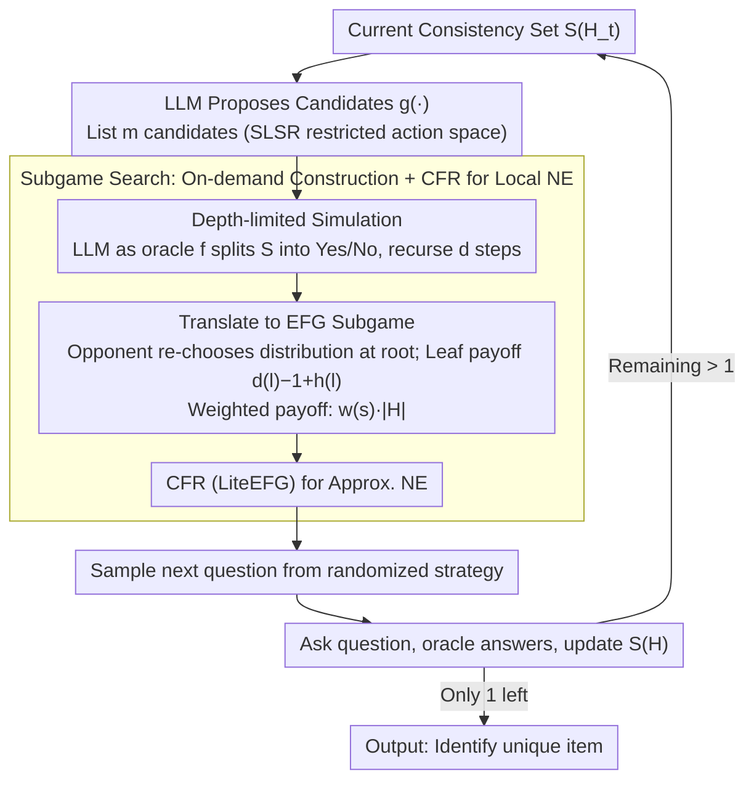

# Game of Thought: Robust Information Seeking with Large Language Models Using Game Theory

**Conference**: ICML 2026  
**arXiv**: [2602.01708](https://arxiv.org/abs/2602.01708)  
**Code**: None  
**Area**: LLM Reasoning / Game Theory / Information Seeking  
**Keywords**: 20 Questions, Nash equilibrium, EFG, subgame search, worst-case optimization

## TL;DR
This paper models active information seeking (e.g., 20 Questions, medical diagnosis, troubleshooting) as a two-player zero-sum Extensive-Form Game (EFG) and proposes Game of Thought (GoT). By using depth-limited subgame construction and applying Counterfactual Regret Minimization (CFR) to solve for Nash Equilibrium (NE), GoT generates "randomized questioning strategies." It significantly reduces worst-case interaction rounds across all datasets, with a 15–40% performance gain over UoT in weighted variants.

## Background & Motivation

**Background**: Equipping LLMs with the ability to proactively clarify and ask questions to complete information is a core capability for agents, medical diagnosis, and troubleshooting. Current mainstream approaches include prompt-based search like Self-Consistency or Tree-of-Thought, and Uncertainty of Thought (UoT) (Hu et al., 2024), which performs depth-limited search to maximize expected information gain in 20 Questions.

**Limitations of Prior Work**: UoT explicitly assumes that the target item is sampled from a uniform distribution. However, in real-world scenarios, the target distribution is often unknown or non-uniform. If an adversary deliberately picks the "hardest to guess" item, UoT's worst-case performance suffers. In high-risk domains like medical diagnosis and troubleshooting, worst-case loss is the critical metric for reliability.

**Key Challenge**: To ensure reliability under unknown distributions and high-risk scenarios, optimization must focus on the worst case. Heuristics that maximize information gain only guarantee average performance and are not robust against an adversary. Furthermore, modeling the opponent as an adversary transforms the problem into an imperfect-information EFG, where constructing the full game tree is prohibitively expensive (e.g., 3763 information sets for 25 candidates takes 5–6 hours).

**Goal**: (1) Define a clean adversarial mathematical model for LLM information seeking; (2) Design an algorithm capable of computing the Nash Equilibrium (NE) within this model; (3) Enable the algorithm to scale to large state spaces via subgame search.

**Key Insight**: View the item selector as a malicious adversary who chooses $s^* \in \mathcal{S}$. The questioner sequentially asks binary questions $q_t$, answered by an oracle $f(q_t, s^*)$. The game ends when $|S(H)|=1$, and the questioner's cost is $|H|$. This constitutes a two-player zero-sum EFG. According to the Von Neumann minimax theorem, $\min_x \max_y u(x,y)=\max_y \min_x u(x,y)$, a randomized NE must exist. Solving for NE is equivalent to optimizing for the worst-case distribution.

**Core Idea**: Formalize the "Strategic Language Search (SLS)" problem as an EFG. Inspired by poker bots, use depth-limited subgame search and CFR to approximate the NE through LLM interfaces.

## Method

### Overall Architecture
The problem is formalized as a quadruple $(\mathcal{S}, \mathcal{Q}, f, g)$: where $\mathcal{S}$ is the set of candidate items, $\mathcal{Q}$ is the set of natural language questions, $f: \mathcal{Q} \times \mathcal{S} \to \{0,1\}$ is the LLM acting as the oracle, and $g$ is the "LLM's proposal of $m$ candidate questions given the remaining set." Each iteration of GoT follows a four-step process: (1) Use the LLM for depth-limited simulation to construct a tree along candidate questions; (2) Translate the tree into an EFG subgame; (3) Compute the approximate NE of the subgame using CFR (LiteEFG); (4) Sample the next question from the questioner’s NE distribution. Repeat until $|S(H)|=1$.

The diagram below illustrates the loop of "expanding subgames → solving NE → sampling questions → updating candidate sets": The SLS/SLSR formalization (Design 1) defines the candidate questions and EFG translation, Subgame Search (Design 2) handles the on-demand construction and CFR solving, and weighted payoffs (Design 3) represent optional branches in the EFG nodes.

### Key Designs

**1. SLS / SLSR / WSLS Formalization: Strictly Analyzing Question Selection as a Two-player Zero-sum EFG**

Heuristics like UoT lack a benchmark for "optimality" and cannot quantify how far they are from the optimal strategy. GoT first formalizes the problem: SLS = (S, Q, f), where the item chooser secretly selects $s^*$, and the questioner sequentially asks $q_t$ to observe $a_t = f(q_t, s^*)$. Let the history be $H_t = (Q_t, A_t)$, and the consistency set be $S(H) = \{s: f(Q(\tau), s) = A(\tau) \, \forall \tau \}$. The game terminates when $|S(H)|=1$, with cost $|H|$. Building on this, SLSR restricts candidates to $m$ questions suggested by $g(S(H))$, while WSLS assigns weights $w(s)$, making the cost $w(s^*)|H|$ to reflect that missing high-risk targets is more costly. Theorem 3.7 proves that when $\mathcal{Q} = \mathcal{Q}_\infty$, an even-split is an NE, which shows that UoT’s strategy is only optimal under a uniform distribution constraint. The EFG formalization treats NE as the "gold standard" for worst-case optimization and separates solvability proofs (Theorem 3.6 NP-completeness) from approximation algorithms.

**2. Subgame Search: On-demand Construction + CFR Avoiding Exponential Trees**

The cost of constructing a full game tree grows exponentially with $|\mathcal{S}|$. However, humans playing 20 Questions only look a few steps ahead. GoT adopts the poker bot approach by expanding a subgame of fixed depth $d$ only upon reaching the current information set $I(H_t)$. The LLM generates $m$ candidate questions. For each candidate $c_i$, the LLM acts as oracle $f$ to split $S(H_t)$ into $Y=\{s:f(c_i,s)=1\}$ and its complement $\bar Y$, recursing for $d$ steps. In the EFG translation, the item chooser re-chooses a distribution over $S(H_t)$ at the subgame root (standard safe subgame search). Leaf payoffs are defined as $d(l)-1+h(l)$, using a heuristic $h(l) := \log_2(|S(l)|)$ as an optimistic lower bound. LiteEFG’s CFR solves for the approximate NE. Theorem 5.1 proves this subgame search is "safe"—allowing the opponent to "re-choose" at the root grants them more power, ensuring the resulting strategy still maintains a worst-case bound in the original game.

**3. Weighted Variant + Weighted Heuristic: Prioritizing "Dangerous Targets"**

UoT’s information gain is weight-agnostic, reducing it to a uniform assumption in weighted scenarios, which might lead to fewer total rounds but misses critical items. In WSLSR, GoT modifies the EFG payoff to $w(s^*) \cdot |H|$. The heuristic is updated to $h(l) = \max_{s \in S(l)} w(s) \cdot (d(l) + \log_2(|S(l)|))$, and weight information is injected into the question prompt. This encourages the LLM to prioritize excluding high-weight items. The minimax structure of the NE automatically assigns probability mass to strategies that identify high-weight items earlier. For example, in a synthetic weight=100 vs. 1 scenario, GoT always directly asks if the item is the high-weight one. Weights are explicitly passed into the game via the payoff function, making "betting big on high weights" a natural outcome of the equilibrium.

### Mechanism: A 20 Questions Example

Suppose the consistency set $S(H_t)$ has 8 animals left. GoT first asks the LLM to propose $m=3$ candidate questions, e.g., "Can it fly?", "Is it larger than a cat?", "Does it live in water?". For each, the LLM acts as oracle $f$ to split the 8 items: "Fly" yields 3 Yes / 5 No; "Larger than cat" yields 4 / 4; "Water" yields 1 / 7. If following information gain (UoT), the 4:4 split of "Larger than cat" would be chosen. However, GoT converts this depth $d=3$ simulation tree into an EFG subgame where the opponent re-picks the hardest distribution at the root. CFR then computes the NE, which results in a randomized strategy (e.g., 0.7 probability for "Larger than cat", 0.3 for "Fly") because the opponent could exploit a deterministic choice. The questioner samples from this distribution, asks the question, and updates the set from 8 to 4 (or 3/5). This "randomization + worst-case optimization" ensures GoT's worst-case rounds are consistently lower than UoT.

### Loss & Training
The LLM is not trained; GPT-4.1 or Qwen-2.5-72B is used directly as $f$ and $g$ to provide questions and answers. All "training" occurs at the EFG solving layer (CFR iterations). CFR converges to an approximate NE in a few hundred iterations within the subgame, making its cost negligible compared to LLM calls. The primary bottleneck is the multi-second latency of LLM API calls.

## Key Experimental Results

### Main Results
Testing on 5 datasets: 20Q-Common (136 items), 20Q-S128, 20Q-Breeds (25), Medical Diagnosis DX (100 diseases), and Troubleshooting FloDial (59 faults). Worst-case interaction length $L_{worst} = \max_{s \in \mathcal{S}} |H^s|$ (lower is better):

| Method | Common (4.1) | S128 (4.1) | Breeds (4.1) | DX (4.1) | FloDial (4.1) |
|--------|-------------|------------|--------------|---------|--------------|
| **Ours (GoT)** | **10.2** | **11.8** | **7.4** | **12.2** | **7.9** |
| UoT | 11 | 13 | 9 | 13 | 9 |
| DP (Direct Prompting) | 13.8 | 16.2 | 7.8 | 16.8 | 12.7 |
| DC (Direct Choice) | 12.9 | 14.6 | 9.3 | 16.2 | 11.6 |

Results are consistent on Qwen-2.5-72B (Ours is optimal, e.g., 10.5 vs UoT 12 on DX).

**Weighted Variant** (worst-case $\max_s w(s)|H^s|$, lower is better):

| Method | Common | Breeds | DX | FloDial |
|--------|--------|--------|-----|---------|
| **Ours (GoT)** | **152.1** | **23.2** | **78.3** | **61.4** |
| UoT | 227.4 | 32.1 | 110.0 | 81.0 |
| DP | 224.0 | 36.9 | 116.0 | 90.1 |

Ours improves over UoT by 15–40%. UoT degrades significantly in weighted scenarios because its information gain is weight-agnostic.

### Ablation Study

| Configuration | DX worst-case | Description |
|------|--------------|------|
| GoT, $d=3, m=3$ | 12.2 | Full model |
| GoT, increasing $d$ | Monotonic Decrease → Plateau | Deeper search approaches locally optimal strategy |
| UoT, increasing $d$ | Almost constant | Information gain does not help worst-case optimization |
| WSLSR Breeds, skew=100 + Correct Q | GoT reaches optimal | Verifies NE solver optimality |
| WSLSR Breeds, skew=100 - Correct Q | Performance drops | NE is limited by the quality of LLM candidate questions |

### Key Findings
- All methods remain 2–3 rounds away from the theoretical lower bound $\log_2(|\mathcal{S}|)$, indicating that LLMs struggle to generate perfectly "bisecting" natural language questions—the fundamental bottleneck of LLM information seeking.
- GoT’s worst-case advantage grows with the weight skew, demonstrating that NE solving's robustness against "unfriendly distributions" is structural rather than a trick.
- On average-case, GoT is comparable to UoT (DX experiment), but the magnitude of GoT's worst-case improvement is similar to UoT's average-case improvement over DP. This suggests GoT "significantly improves the tail without sacrificing the mean."
- Average performance under different priors: Under unfavorable priors $X_{UoT}$, UoT's average performance drops significantly while GoT remains stable, proving GoT is robust to distribution uncertainty itself.

## Highlights & Insights
- This is the first work to cleanly formalize the "questioning strategy" of an LLM agent as an EFG with a Nash Equilibrium, providing a verifiable worst-case optimization framework where others relied on average-case heuristics.
- Applying "Safe subgame search to LLM interfaces" is a natural yet novel transition. While poker AIs have long solved large game trees via approximation, this work provides a clean paradigm for LLM agents that can be extended to negotiation or dialogue policies.
- The presence of Theorem 3.7 and Theorem 5.1 ensures the method has optimality guarantees, which is rare in LLM reasoning papers.
- Using the LLM itself as $g$ to restrict candidate questions is a clever simplification: it narrows the infinite action space to an enumerable set, making CFR feasible.

## Limitations & Future Work
- The authors admit only binary questions are supported; extensions for open-ended answers were not addressed.
- Cost: Each step requires $m^d$ simulation calls (default $27$ calls), which is expensive. Latency-sensitive agents would require aggressive pruning or batching.
- Subgame search is safe but not strictly optimal—deep values outside the subgame are still provided by the $\log_2|S(l)|$ heuristic. Heuristic bias propagates to the global strategy.
- WSLSR performance depends heavily on the quality of candidate questions. GoT’s ceiling is the LLM’s inherent ability to propose good questions; it does not solve how to generate better bisecting questions.
- No comparison was made against MCTS or AlphaZero-style searches; the trade-off between subgame search and MCTS for LLM agents remains an open question.

## Related Work & Insights
- **vs UoT (Hu et al., 2024)**: UoT assumes a uniform distribution to maximize expected info gain. This paper proves that is equivalent to NE when $\mathcal{Q} = \mathcal{Q}_\infty$, but since candidates are finite and distributions unknown, UoT fails in the worst case.
- **vs Tree-of-Thought / Self-Consistency**: These methods search the "answer space," whereas GoT searches the "questioning strategy space" while explicitly considering an adversary.
- **vs Poker Bots (Libratus / Pluribus)**: Technically inherits subgame search and CFR. The novelty lies in adapting it to LLM interfaces and compressing the state space using $S(H)$.
- **Transferable Insights**: (1) Any dialogue or negotiation task can be rewritten as an EFG to find an NE; (2) Using LLMs as $g$ to limit the action space is a universal recipe for compressing decision trees; (3) Worst-case optimization does not have to sacrifice average-case performance.

## Rating
- **Novelty**: ⭐⭐⭐⭐ First formalization of EFG/NE for LLM information seeking. Excellent reuse of classic game theory.
- **Experimental Thoroughness**: ⭐⭐⭐⭐ Solid coverage across 5 datasets, 2 LLMs, and weighted/unweighted scenarios.
- **Writing Quality**: ⭐⭐⭐⭐⭐ Clear formalization, theorem-algorithm flow, and intuitive examples.
- **Value**: ⭐⭐⭐⭐ Sets a benchmark for worst-case optimization in LLM agents, especially relevant for high-risk domains.

<!-- RELATED:START -->

## Related Papers

- [\[ICLR 2026\] Pruning as a Cooperative Game: Surrogate-Assisted Layer Contribution Estimation for Large Language Models](../../ICLR2026/reinforcement_learning/remix_reinforcement_routing_for_mixtures_of_loras_in_llm_finetuning.md)
- [\[ACL 2026\] Understanding Generalization in Role-Playing Models via Information Theory](../../ACL2026/reinforcement_learning/understanding_generalization_in_role-playing_models_via_information_theory.md)
- [\[ICML 2026\] The Shape of Reasoning: Topological Analysis of Reasoning Traces in Large Language Models](the_shape_of_reasoning_topological_analysis_of_reasoning_traces_in_large_languag.md)
- [\[ICLR 2026\] Robust Multi-Objective Controlled Decoding of Large Language Models](../../ICLR2026/reinforcement_learning/robust_multi-objective_controlled_decoding_of_large_language_models.md)
- [\[ICML 2025\] Decoding Rewards in Competitive Games: Inverse Game Theory with Entropy Regularization](../../ICML2025/reinforcement_learning/decoding_rewards_in_competitive_games_inverse_game_theory_with_entropy_regulariz.md)

<!-- RELATED:END -->
