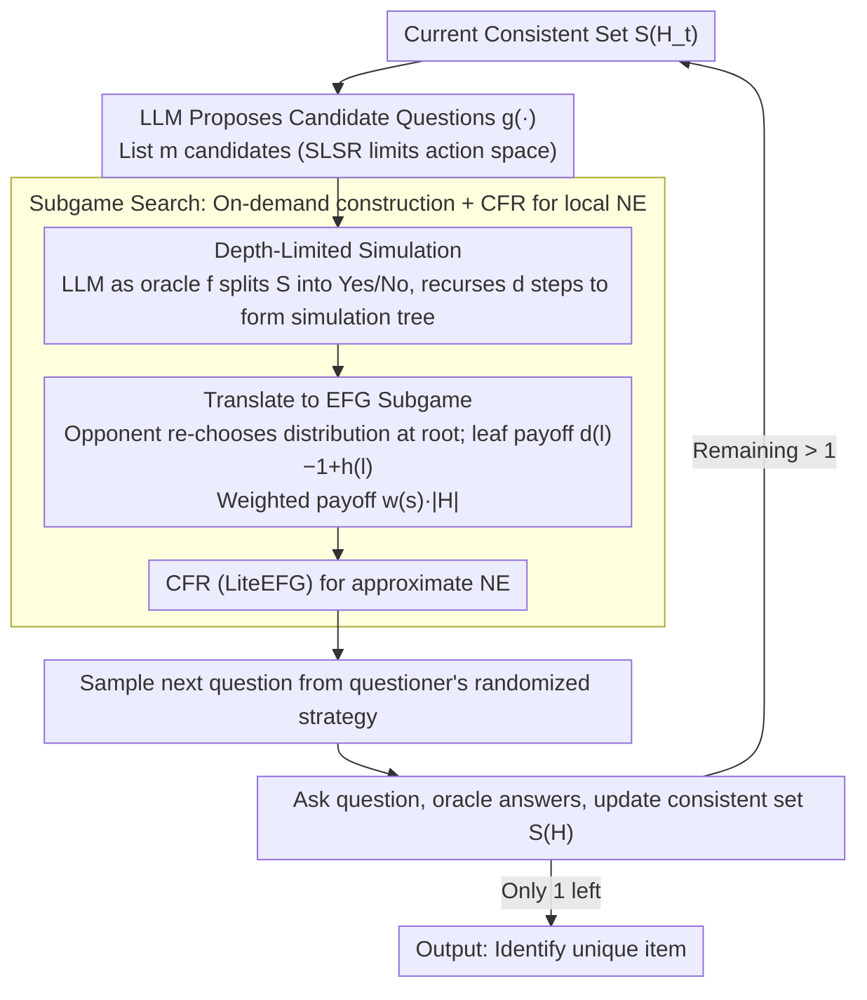

# Game of Thought: Robust Information Seeking with Large Language Models Using Game Theory

**Conference**: ICML 2026  
**arXiv**: [2602.01708](https://arxiv.org/abs/2602.01708)  
**Code**: None  
**Area**: LLM Reasoning / Game Theory / Information Seeking  
**Keywords**: 20 Questions, Nash equilibrium, EFG, subgame search, worst-case optimization

## TL;DR
This paper models LLM active questioning scenarios (20 Questions / medical diagnosis / troubleshooting) as two-player zero-sum Extensive-Form Games (EFG) and proposes Game of Thought (GoT). By using depth-limited subgame construction and CFR to solve for Nash Equilibrium (NE), it generates "randomized questioning strategies." This significantly reduces worst-case interaction rounds across all datasets and achieves a 15–40% improvement over UoT in weighted variants.

## Background & Motivation

**Background**: Enabling LLMs to actively clarify and question to complete information is a core capability in agents, medical diagnosis, and troubleshooting. Current mainstream approaches involve prompt-based searches like Self-Consistency or Tree-of-Thought, as well as Uncertainty of Thought (UoT) proposed by Hu et al. 2024—the latter performs finite-depth search on 20 Questions to maximize expected information gain.

**Limitations of Prior Work**: UoT explicitly assumes that the "target item is drawn from a uniform distribution." However, in real-world scenarios, the target distribution is often unknown and non-uniform. If an opponent deliberately picks the "hardest-to-guess item," UoT’s worst-case performance suffers. In high-stakes scenarios like medical diagnosis or troubleshooting, worst-case loss is the metric that truly determines usability.

**Key Challenge**: To ensure reliability in "unknown distribution + high-risk" scenarios, optimization for the worst case is required. Heuristics maximizing information gain only guarantee an average-case performance and are not robust against an adversary. Furthermore, modeling the opponent as an adversary turns the problem into an imperfect-information EFG, where the cost of constructing a full game tree is prohibitively high (e.g., 3763 infosets for 25 candidates take 5–6 hours).

**Goal**: (1) Define a clean adversarial mathematical model for LLM information seeking; (2) Design an algorithm to compute the Nash Equilibrium (NE) under this model; (3) Implement the algorithm in large state spaces using subgame search.

**Key Insight**: Treat the item selector as a malicious opponent who chooses $s^*$ from $\mathcal{S}$. The questioner sequentially asks binary questions $q_t$, answered by an oracle $f(q_t,s^*)$. The game ends when $|S(H)|=1$, with the questioner's cost being $|H|$. This constitutes a two-player zero-sum EFG. According to the Von Neumann minimax theorem $\min_x \max_y u(x,y)=\max_y \min_x u(x,y)$, a randomized NE must exist. Solving for the NE is equivalent to optimizing for the worst-case distribution.

**Core Idea**: Formalize the "Strategic Language Search (SLS)" problem as an EFG. Inspired by poker bots, use depth-limited subgame search + CFR to approximate the NE via LLM interfaces.

## Method

### Overall Architecture
The problem is formalized as a quadruple $(\mathcal{S},\mathcal{Q},f,g)$, where $\mathcal{S}$ is the set of candidate items, $\mathcal{Q}$ is the set of natural language questions the LLM can generate, $f:\mathcal{Q}\times\mathcal{S}\to\{0,1\}$ is the answer function (LLM as oracle), and $g$ is the set of $m$ candidate questions proposed by the LLM given the remaining items. Each GoT round follows a 4-step process: (1) Use the LLM for depth-limited simulation to build a tree along candidate questions; (2) Translate the tree into an EFG subgame; (3) Use CFR (LiteEFG) to solve for the approximate NE of the subgame; (4) Sample the next question from the questioner's NE distribution. Repeat until $|S(H)|=1$.

The following diagram illustrates the loop of "Subgame Expansion → Solve NE → Sample Question → Update Candidates": the SLS/SLSR formalization (Design 1) occurs at the candidate questions and EFG translation nodes; Subgame Search (Design 2) is the on-demand construction and CFR solving in the middle; Weighted Payoff (Design 3) is an optional branch at the EFG nodes.

### Key Designs

**1. SLS / SLSR / WSLS Formalization: Writing "how the LLM should question" as a strictly analyzable two-player zero-sum EFG**

Heuristics like UoT lack a comparable "optimum," making it impossible to determine how far they are from the optimal strategy. GoT first formalizes the problem: SLS = (S, Q, f), where the item chooser secretly selects $s^*$ and the questioner sequentially asks $q_t$ to observe $a_t=f(q_t,s^*)$. History is $H_t=(Q_t,A_t)$, and the consistent set is $S(H)=\{s:f(Q(\tau),s)=A(\tau)\,\forall\tau\}$. The game ends when $|S(H)|=1$, with the questioner's cost $= |H|$. Building on this, SLSR limits candidate questions to $m$ items output by $g(S(H))$ (realistic as LLMs list limited candidates). WSLS adds weights $w(s)$ to each item, with cost $= w(s^*)|H|$, capturing scenarios where failing to identify a dangerous target is costlier. Theorem 3.7 proves that when $\mathcal{Q}=\mathcal{Q}_\infty$, even-split is the NE—which explains why UoT’s strategy is only optimal under the uniform distribution constraint. The EFG formalization treats NE as the gold standard for "worst-case optimization" and decouples solvability proofs (NP-completeness of best-response in Theorem 3.6) from approximation algorithms.

**2. Subgame Search: On-demand construction + CFR for local NE to avoid exponential full game trees**

The cost of explicitly constructing a full game tree grows exponentially with $|\mathcal{S}|$ (e.g., 5–6 hours for 25 items). However, humans playing 20Q only look a few steps ahead. GoT adopts the poker bot approach by expanding a subgame of fixed depth $d$ only upon reaching the current infoset $I(H_t)$. The LLM generates $g(S(H_t))$ candidate questions. For each candidate $c_i$, the LLM acts as $f$ to split $S(H_t)$ into $Y=\{s:f(c_i,s)=1\}$ and its complement $\bar Y$, recursing $d$ steps to obtain a simulation tree. When translating to an EFG, the item chooser is allowed to "re-choose" a distribution over $S(H_t)$ at the subgame root (a standard safe subgame search practice). The leaf $l$ payoff is $d(l)-1+h(l)$, using a heuristic $h(l):=\log_2(|S(l)|)$ as an optimistic lower bound. Finally, CFR via LiteEFG solves for the approximate NE, and the next question is sampled from the questioner's strategy. Theorem 5.1 proves this subgame search is safe—allowing the opponent to "re-choose" at the root grants them more power, ensuring that the resulting strategy remains bounded in the worst case when applied to the original game.

**3. Weighted variant + Weighted Heuristic: Letting NE prioritize "dangerous targets" automatically**

UoT’s information gain is weight-agnostic and degrades to uniform in weighted scenarios, potentially resulting in "fewer total rounds but missing a critical item." In WSLSR, GoT changes the EFG payoff to $w(s^*)\cdot|H|$. The heuristic is updated to $h(l)=\max_{s\in S(l)} w(s)\cdot(d(l)+\log_2(|S(l)|))$, and question prompts are injected with weight information, encouraging the LLM to exclude high-weight items first. Thus, the minimax structure of the NE automatically assigns probability mass to strategies that identify high-weight items early—for example, when weights are constructed as 100 vs. 1, GoT always asks directly about the high-weight item. Essentially, weights are explicitly passed into the game via the payoff function, making "betting big on high weights" a natural outcome of the equilibrium.

### A Complete Example: One Round of Questioning in 20 Questions

Suppose the current consistent set $S(H_t)$ has 8 candidate animals left. GoT first has the LLM propose $m=3$ candidate questions, such as "Can it fly?", "Is it larger than a cat?", or "Does it live in water?". For each candidate, the LLM acts as oracle $f$ to split these 8 animals into "Yes/No" piles: "Can it fly?" splits into 3 Yes / 5 No; "Larger than a cat?" splits into 4 / 4; "Live in water?" splits into 1 / 7. Considering only information gain (UoT approach), the 4:4 split of "Larger than a cat?" is optimal and would be selected. However, GoT translates this simulation tree of depth $d=3$ into an EFG subgame, allowing the opponent at the root to pick the most difficult distribution to guess, and then solves for the NE via CFR. The NE provides a randomized questioning strategy, perhaps asking "Larger than a cat?" with probability 0.7 and "Can it fly?" with probability 0.3, because if the opponent always gambled against UoT’s deterministic choice, they would be exploited. The questioner samples from this distribution, asks the question, and upon receiving an answer, the candidate set shrinks from 8 to 4 (or 3/5), proceeding to the next round to expand a new subgame until only 1 item remains. This "randomization + worst-case distribution optimization" ensures GoT’s worst-case round count is consistently lower than UoT's.

### Loss & Training
This work does not train LLMs; it uses GPT-4.1 / Qwen-2.5-72B directly as $f$ and $g$ to provide questions and answers. All "training" occurs at the EFG solver layer (CFR iterations). CFR converges to an approximate NE within a subgame in a few hundred iterations, making its cost negligible compared to LLM calls. The primary computational bottleneck is the multi-second latency of LLM calls.

## Key Experimental Results

### Main Results
5 Datasets: 20Q-Common (136 items), 20Q-S128, 20Q-Breeds (25), Medical Diagnosis DX (100 diseases), Troubleshooting FloDial (59 faults). Worst-case interaction length $L_{worst}=\max_{s\in\mathcal{S}}|H^s|$ (lower is better):

| Method | Common (4.1) | S128 (4.1) | Breeds (4.1) | DX (4.1) | FloDial (4.1) |
|--------|-------------|------------|--------------|---------|--------------|
| **GoT** | **10.2** | **11.8** | **7.4** | **12.2** | **7.9** |
| UoT | 11 | 13 | 9 | 13 | 9 |
| DP (Direct Prompting) | 13.8 | 16.2 | 7.8 | 16.8 | 12.7 |
| DC (Direct Choice) | 12.9 | 14.6 | 9.3 | 16.2 | 11.6 |

Results are consistent on Qwen-2.5-72B (GoT optimal across the board, 10.5 vs. UoT 12 on DX).

**Weighted variant** (worst-case $\max_s w(s)|H^s|$, lower is better):

| Method | Common | Breeds | DX | FloDial |
|--------|--------|--------|-----|---------|
| **GoT** | **152.1** | **23.2** | **78.3** | **61.4** |
| UoT | 227.4 | 32.1 | 110.0 | 81.0 |
| DP | 224.0 | 36.9 | 116.0 | 90.1 |

GoT improves relative to UoT by 15–40%; UoT degrades significantly in weighted scenarios because its information gain is weight-agnostic.

### Ablation Study

| Configuration | DX worst-case | Description |
|------|--------------|------|
| GoT, $d$=3, $m$=3 | 12.2 | Full model |
| GoT, increasing $d$ | Monotonic decrease → Plateau | Deeper depth approaches "optimal strategy for current candidate questions" |
| UoT, increasing $d$ | Roughly constant | Information gain does not assist in worst-case optimization |
| WSLSR Breeds, weight skew=100 with correct questions injected | GoT reaches optimum | Validates the optimality of NE solving |
| WSLSR Breeds, weight skew=100 without injection | GoT performance drops significantly | NE is optimal based on the candidate set, limited by LLM candidate quality |

### Key Findings
- All methods are still 2–3 rounds away from the theoretical lower bound $\log_2(|\mathcal{S}|)$, indicating that actual LLMs struggle to generate perfectly bisectional natural language questions—this is the fundamental upper bound for current LLM information seeking.
- GoT’s worst-case advantage increases with weight skewness, showing that the robustness of NE solving against "unfriendly distributions" is structural, not just a trick.
- In the average case, GoT is comparable to UoT (DX experiment), but the magnitude of GoT’s improvement in the worst case is similar to UoT’s improvement over DP in the average case—meaning GoT "significantly improves the tail without sacrificing the mean."
- Average performance under different priors: Under a prior $X_{UoT}$ unfavorable to UoT, UoT’s average performance drops significantly while GoT remains nearly unchanged; this indicates GoT is not just good for the worst case but also robust to distribution uncertainty itself.

## Highlights & Insights
- This is the first work to cleanly formalize the LLM agent "questioning strategy" problem as an Extensive-Form Game solved via Nash Equilibrium, providing an analyzable and verifiable worst-case optimization framework where the community previously relied mostly on mean-based heuristics.
- "Safe subgame search on the LLM interface" is a natural but rarely implemented transfer: poker AI solved approximate solving for large game trees long ago, and this toolkit's application to LLM agents is a clean exemplar. This technical route can be directly applied to other LLM decision scenarios like negotiation and dialogue policy.
- The existence of Theorem 3.7 / Theorem 5.1 ensures the method is not just an engineering implementation but possesses optimality guarantees—a rarity in LLM reasoning improvement research.
- Using the LLM itself as $g$ to limit the candidate question set and then searching for the NE within the range of "LLM-expressible questions" is a clever simplification: it constrains infinite action spaces to enumerable sets, making CFR solvable.

## Limitations & Future Work
- The authors acknowledge that only strictly binary questions are supported; extensions to open-ended answers have not been explored.
- Self-assessment: Each step requires $m^d$ simulation calls to the LLM (default $d=m=3 \to 27$ calls), which is costly; latency-sensitive real-time agents would require more aggressive pruning or batch calling.
- Subgame search is safe but not strictly optimal—the deep value outside the subgame is still provided by the heuristic $\log_2|S(l)|$. Heuristic bias propagates to the global strategy, and the paper does not quantify this bias.
- The performance of WSLSR depends heavily on the quality of candidate questions provided by the LLM (proven in ablation). Thus, GoT’s "ceiling" is actually the LLM’s own questioning ability, leaving the fundamental problem of "how to make LLMs generate better bisection questions" unresolved.
- There is no comparison of GoT under MCTS / AlphaZero-style search; the trade-off between subgame search and MCTS in LLM agents remains an open question.

## Related Work & Insights
- **vs UoT (Hu et al. 2024)**: UoT assumes a uniform distribution to maximize expected info gain; this paper proves that this is equivalent to the NE when $\mathcal{Q}=\mathcal{Q}_\infty$ in Theorem 3.7. However, in reality, candidate questions are limited and distributions are unknown, making UoT’s worst case naturally worse.
- **vs Tree-of-Thought / Self-Consistency**: Those methods search the "answer space"; GoT searches the "questioning strategy space" and explicitly considers an opponent.
- **vs Poker bots (Libratus / Pluribus)**: Technically inherits subgame search + CFR entirely; the novelty lies in adapting it to the LLM interface and compressing the state space using $S(H)$.
- **Transferable Insights**: (1) Any task involving "dialogue / inquiry / negotiation" can be rewritten as an EFG to find a NE; this paper provides the template. (2) Using an LLM as $g$ to limit action space is a universal recipe for compressing infinite decision trees to a searchable scale. (3) "Worst-case optimization can be achieved without losing average performance" is a conclusion worth reflecting on for the direction of LLM reasoning research.

## Rating
- **Novelty**: ⭐⭐⭐⭐ The formalization and implementation of the EFG/NE framework for LLM information seeking is a first. The method itself is a brilliant reuse of classic game theory rather than a completely new algorithm.
- **Experimental Thoroughness**: ⭐⭐⭐⭐ 5 datasets × 2 LLMs × weighted/unweighted × average/worst case provides solid coverage; missing comparisons with MCTS or RL-finetuned LLMs.
- **Writing Quality**: ⭐⭐⭐⭐⭐ Clear formalization, with a seamless flow from Definition—Theorem—Algorithm—Experiment. Examples 1/2/3 make concepts easy to grasp.
- **Value**: ⭐⭐⭐⭐ Establishes a benchmark method for worst-case optimization in the "LLM information seeking" lineage, with practical significance for high-risk scenarios like medical diagnosis.

<!-- RELATED:START -->

## Related Papers

- [\[ICLR 2026\] Pruning as a Cooperative Game: Surrogate-Assisted Layer Contribution Estimation for Large Language Models](../../ICLR2026/reinforcement_learning/remix_reinforcement_routing_for_mixtures_of_loras_in_llm_finetuning.md)
- [\[ACL 2026\] Understanding Generalization in Role-Playing Models via Information Theory](../../ACL2026/reinforcement_learning/understanding_generalization_in_role-playing_models_via_information_theory.md)
- [\[ICML 2026\] The Shape of Reasoning: Topological Analysis of Reasoning Traces in Large Language Models](the_shape_of_reasoning_topological_analysis_of_reasoning_traces_in_large_languag.md)
- [\[ICLR 2026\] Robust Multi-Objective Controlled Decoding of Large Language Models](../../ICLR2026/reinforcement_learning/robust_multi-objective_controlled_decoding_of_large_language_models.md)
- [\[ICML 2026\] Can Large Language Models Generalize Procedures Across Representations?](can_large_language_models_generalize_procedures_across_representations.md)

<!-- RELATED:END -->
