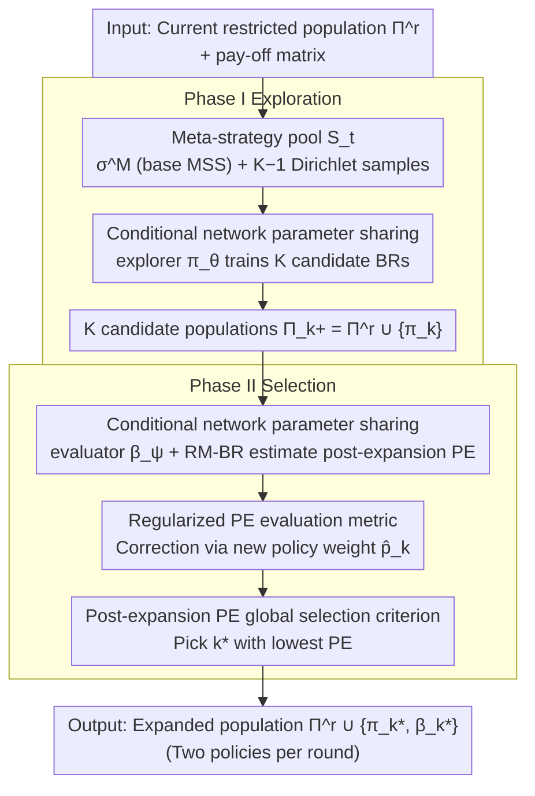

# Global Policy-Space Response Oracles for Two-Player Zero-Sum Games

**Conference**: ICML 2026  
**arXiv**: [2605.28273](https://arxiv.org/abs/2605.28273)  
**Code**: https://github.com/Zhangjy1997/GlobalPSRO (Available)  
**Area**: Reinforcement Learning / Game Theory RL  
**Keywords**: PSRO, Nash Equilibrium, Population Exploitability, Zero-sum Games, DRL

## TL;DR
This paper points out that prevailing PSRO methods focus only on local information from the "restricted game" when expanding the policy population, leading to a worst-case requirement of nearly $N$ pure policies for convergence. It proposes Global PSRO, a two-stage exploration-selection framework that first samples multiple candidate best responses and then selects the optimal expansion by directly scoring the *post-expansion Population Exploitability (PE)*. The costs of multi-candidate training and evaluation are suppressed to acceptable levels through a parameter-shared conditional policy network.

## Background & Motivation
**Background**: Policy-Space Response Oracle (PSRO) is the standard approach for finding Nash Equilibria in large-scale zero-sum games. It maintains a restricted strategy population $\Pi^r$, uses a meta-strategy solver (MSS) to solve for a mixed strategy $\sigma$ in the restricted game, and then uses DRL to learn a best response (BR) $\pi$ against $\sigma$ to iteratively expand $\Pi^r$. Representative MSSs include restricted-game Nash, PRD, AlphaRank, and Uniform.

**Limitations of Prior Work**: MSSs determine the next BR to train based solely on the payoff matrix within $\Pi^r$, being "locally strong but globally useless"—adding a policy strong against the current restricted game often contributes little to reducing the global exploitability. Anytime PSRO / EPSRO mitigate this by expanding exploitability evaluation to the full game to compute SRGB-MSS, but they still only "train one BR according to one meta-strategy" without truly evaluating "how much the population improves after adding this policy."

**Key Challenge**: The ultimate goal of PSRO is to make the *population*, rather than a single policy, approach Nash. However, the selection criteria for all MSSs are based on the "BR on a single meta-strategy," creating a misalignment with the objective. The authors prove a strong negative theorem: for any RGB-MSS $\mathcal{M}$ and any $N$, there exists an $N\times N$ zero-sum game such that $\mathcal{M}$ either fails to converge or requires at least $N-1$ iterations—while a specific oracle MSS requires only $\min\{S+2, N-1\}$ (where $S$ is the support size of the equilibrium).

**Goal**: To shift the expansion decision from "training a BR for the current meta-strategy" to "directly minimizing the PE of the population after adding a candidate," while keeping the cost of multi-candidate training and evaluation affordable in large-scale DRL scenarios.

**Key Insight**: The Population Exploitability $\mathcal{PE}(\Pi^r;\mathcal{G})=\min_{\sigma\in\Delta(\Pi^r)}\epsilon(\sigma)$ is the true measure of "population quality." Since best responses exhibit local stability on the simplex (Proposition 4.1: if the BR of $\sigma$ is unique, the BR remains constant within a neighborhood), a finite candidate pool is sufficient to cover large BR regions.

**Core Idea**: In each iteration, $K$ meta-strategies are sampled to train $K$ candidate BRs. RM-BR is then used to estimate the PE for each *hypothetically expanded population*, and the candidate resulting in the lowest PE is added to $\Pi^r$. A single conditional strategy network $\pi_\theta(a\mid s,\sigma)$ is used to amortize the training and evaluation costs of $K$ candidates into a single set of parameters.

## Method

### Overall Architecture
Global PSRO decomposes each PSRO iteration into two phases. The inputs are the current restricted policy set $\mathbf{\Pi}^r$ and the restricted game payoff matrix $\widehat{\mathbf{U}}$, and the output is the expanded set $\mathbf{\Pi}^r\cup\{\pi_{k^\star},\beta_{k^\star}\}$:

1. **Phase I (Exploration)**: Construct a meta-strategy pool $\mathcal{S}_t=\{\sigma^{\mathcal{M}}\}\cup\{\sigma_k\sim\text{Dirichlet}(\mathbf{1})\}_{k=2}^{K}$ (one from the base RGB-MSS $\mathcal{M}$, others sampled uniformly from the simplex). A conditional policy $\pi_\theta(a\mid s,\sigma)$ is used to train $K$ candidate BRs simultaneously via $\max_\theta\frac{1}{K}\sum_k U(\pi_\theta(\cdot\mid\sigma_k),\sigma_k)$, generating candidate populations $\mathbf{\Pi}_k^+=\mathbf{\Pi}^r\cup\{\pi_k\}$.
2. **Phase II (Selection)**: Estimate $\mathcal{PE}(\mathbf{\Pi}_k^+;\mathcal{G})=\min_\sigma\max_\pi U(\pi,\sigma)$ for each $\mathbf{\Pi}_k^+$. The candidate $k^\star$ with the lowest PE is selected, and both the candidate $\pi_{k^\star}$ and the evaluation byproduct $\beta_{k^\star}$ (the full-game BR against $\rho_{k^\star}$, equivalent to an Anytime-PSRO expansion) are added to the population.

> Two policies are added per round, counting as two iterations in PSRO terms. Theoretical guarantees (Theorems 4.2-4.3): By including $\sigma^{\mathcal{M}}$ and using conservative tie-breaking, Global PSRO inherits the finite-step convergence of the base MSS. In the adversarial game family that stalls RGB-MSS (Sec.3.1), the expected iterations are reduced to $\mathbb{E}[T^\star]\le \min\{2+\tfrac{2S}{1-(1-c)^{K-1}},N-1\}$, which tightens to $\min\{2+2S,N-1\}$ as $K\to\infty$, an order of magnitude faster than the mandatory $N-1$ pure policies.

### Key Designs

**1. Global Selection Criterion Based on Post-expansion PE: Aligning Expansion Objectives**

The flaw in all RGB-MSS methods is focusing solely on local payoffs within the restricted game, resulting in policies that are "locally strong but globally useless." In the worst case, almost the entire strategy space must be added to the population before convergence. Global PSRO aligns the expansion decision with the primary goal of PSRO—making the population approach Nash—by defining the criterion as $\pi^\star\in\arg\min_{\pi\in\mathcal{B}(\Delta(\mathbf{\Pi}^r))}\mathcal{PE}(\mathbf{\Pi}^r\cup\{\pi\};\mathcal{G})$. During evaluation, the candidate population is treated as a new restricted game to solve $\min_{\sigma\in\Delta(\mathbf{\Pi}_k^+)}\max_{\pi\in\mathbf{\Pi}} U(\pi,\sigma)$. Since exact solutions are infeasible in large games, RM-BR is used for approximation: inner-layer regret matching maintains the mixture $\rho_k$, while an outer-layer BR learner pursues $\rho_k$, yielding $\widehat{\mathcal{PE}}_k=U(\beta_k,\rho_k)$. This shifts search from "proxy space" (how to pick a meta-strategy) to "objective space" (population-wide exploitability).

**2. Multi-candidate Training and Evaluation via Conditional Policy Parameter Sharing**

A naive implementation requiring training $K$ independent policies and $K$ evaluation agents would multiply DRL computation by $K$, making it intractable. Global PSRO uses a single conditional explorer $\pi_\theta(a\mid s,\sigma)$ to output $K$ candidate responses simultaneously, with objective $J(\theta)=\tfrac{1}{K}\sum_k U(\pi_\theta(\cdot\mid\sigma_k),\sigma_k)$. Similarly, a conditional evaluator $\beta_\psi(a\mid s,\sigma)$ is used in the selection phase, where the BR learner for candidate $k$ is the slice $\beta_k\triangleq\beta_\psi(\cdot\mid\sigma_k)$. By sharing parameters, the relative overhead of multiple candidates becomes negligible, enabling the "sample-then-select" framework in DRL environments.

**3. Regularized PE Evaluation Metric: Preventing Pseudo-optimal Expansion**

In large games, $\rho_k$ and $\beta_k$ are approximations from RM-BR. If convergence is slow, a new policy $\pi_k$ might have nearly zero weight in the mixture $\rho_k$ while $\widehat{\mathcal{PE}}_k$ appears small due to estimation noise, leading to incorrect selection. The author defines $\hat p_k\triangleq\rho_k(\pi_k)$ and uses the regularized score $\widehat{\mathcal{PE}}_k^{\mathrm{reg}}=(1-\hat p_k)(\widehat{\mathcal{PE}}(\mathbf{\Pi}^r;\mathcal{G})-U(\beta_k,\rho^r))+\widehat{\mathcal{PE}}_k$. Since $U(\beta_k,\rho^r)\le\widehat{\mathcal{PE}}(\mathbf{\Pi}^r;\mathcal{G})$, the term in parentheses is non-negative; a smaller $\hat p_k$ results in a larger penalty. This explicitly encodes "whether the new policy is actually utilized by the population," making selection robust to estimation errors.

### Loss & Training
- The explorer uses PPO to optimize $J(\theta)=\tfrac{1}{K}\sum_k U(\pi_\theta(\cdot\mid\sigma_k),\sigma_k)$. In the selection phase, it alternates between "sampling trajectories by playing $\beta_\psi$ against $\rho_k$ → RM updates $\rho_k$ → DRL updates $\psi$" for a fixed number of steps.
- Each round adds two policies $\{\pi_\theta(\cdot\mid\sigma_{k^\star}),\beta_\psi(\cdot\mid\sigma_{k^\star})\}$. Under parallel implementation, it is compared against base PSRO with an equivalent environment-step budget.

## Key Experimental Results

### Main Results
Environments: Five two-player zero-sum extensive-form games (Kuhn Poker, Liar's Dice, Leduc Poker, Goofspiel with 5 and 13 cards) from OpenSpiel. BRs are trained via PPO, and all methods are matched by environment step budgets. Metric: Population Exploitability (lower is better).

| Dataset / Steps | Ours (Global PSRO) | PSRO w/ Nash | PSRO w/ AlphaRank | Anytime PSRO | NeuPL w/ AlphaRank | PSD-PSRO w/ AlphaRank |
|---|---|---|---|---|---|---|
| Goofspiel-13 @ $19.2\times 10^6$ | **0.305** | 0.579 | 0.459 | 0.404 | 0.244 | 0.599 |
| Goofspiel-13 @ $76.8\times 10^6$ | **0.056** | 0.284 | 0.188 | 0.223 | 0.169 | 0.251 |
| Goofspiel-13 @ $153.6\times 10^6$ | **0.046** | 0.193 | 0.178 | 0.191 | 0.132 | 0.160 |

In large-scale games like Goofspiel-13, Global PSRO reduces PE to 1/3 or 1/4 of the baselines in mid-to-late stages. NeuPL w/ AlphaRank is the strongest competitor but still lags by over 2×. In very small games like Kuhn Poker, where the restricted-game Nash is already close to the full game, Global PSRO performs comparably or slightly worse—aligning with the intuition that global info is less critical in small games.

### Ablation Study
RQ4 conducts five ablations across Kuhn / Liar's / Leduc / Goofspiel-5:

| Configuration | Key Observation | Description |
|---|---|---|
| Full Global PSRO | Best Performance | Complete method. |
| Exploitation only | Significant degradation | Pool contains only $\sigma^{\mathcal{M}}$, equivalent to single-MSS PSRO; confirms gain from multi-candidate selection. |
| Random selection | Significant degradation | Same pool but random selection; shows PE scoring is the key. |
| w/o PE regularization | Moderate degradation | Using raw $\widehat{\mathcal{PE}}_k$ leads to incorrect selection due to estimation noise. |
| Exact PE evaluation | Slight improvement | Serves as an upper bound; indicates RM-BR estimation is already sufficiently informative. |
| Neighbor-search | Degradation | Replacing Dirichlet sampling with local perturbations around $\sigma^{\mathcal{M}}$ lacks diversity. |

Additionally, RQ2 incorporates the diversity regularization of PSD-PSRO into the explorer (conditional input $(\sigma,\lambda)$ where $\lambda\sim\text{Uniform}[0,0.1]$). This yielded significant gains in Leduc Poker, suggested that diversity-driven objectives are orthogonal to this framework.

### Key Findings
- Gains stem from the "scoring criterion change" rather than "parameterization change": Global PSRO maintains lower PE than NeuPL (which also uses a conditional population), proving post-expansion PE selection is the core driver.
- Alignment of theory and practice: The negative theorem in Sec. 3 predicted that RGB-MSS stalls on certain adversarial games; Fig. 1 confirms this asymptotic stall on a custom $100\times 100$ game.
- Final performance is robust to evaluation precision: Replacing estimated PE with exact PE provides only marginal gains, suggesting RM-BR plus regularization captures the relative ranking of candidates sufficiently.

## Highlights & Insights
- **The "Score by Target" Philosophy**: While PSRO research has focused on MSS (picking meta-strategies), MSS remains a proxy. Directly replacing the proxy with the ultimate goal (PE) shifts the search from "proxy space" to "objective space." This design of aligning selection criteria with the final objective can be generalized to other multi-stage training pipelines.
- **Conditional Strategy as a "Free Lunch" for Candidates**: Using $\pi_\theta(a\mid s,\sigma)$ to amortize the training of $K$ candidates makes "sample-then-select" affordable under DRL budgets. This trick is applicable to any pipeline requiring diverse candidates (diverse RL, ensembling, population-based training).
- **Regularized Scoring Against Estimation Noise**: Using the new policy weight $\hat p_k$ as a reliability correction is a valuable design pattern for selection-based methods (e.g., neural architecture search, active learning) that suffer from noisy estimators.

## Limitations & Future Work
- Two-player zero-sum only: PE lacks the saddle-point structure in multi-player general-sum games, meaning $\min$-$\max$ estimation cannot be directly applied.
- Biased estimator in real DRL: When budgets are tight, RM-BR yields $\rho_k$ far from the true least-exploitable mixture. Though mitigated by regularization, a formal error analysis is missing; switching to an upper-confidence bound (UCB-PSRO) might further optimize the budget.
- Fixed $K$ lacks adaptation: Currently, $K$ is a fixed hyperparameter. While Theorem 4.3 suggests larger $K$ is better, gradients for individual candidates are diluted in the explorer. A dynamic $K$ based on PE estimation variance would be more elegant.

## Related Work & Insights
- **vs Anytime PSRO / EPSRO (SRGB-MSS)**: These also use full-game information to find a meta-strategy difficult to exploit globally but still "train one BR for one $\sigma$." Global PSRO elevates expansion decisions to the population level and introduces $\beta_k$ as a byproduct.
- **vs PSD-PSRO (Diversity-driven)**: PSD-PSRO forces diversity via regularization, while Global PSRO judges candidates based on actual PE reduction. The two are orthogonal and showed additive gains in Leduc Poker.
- **vs NeuPL / Simplex-NeuPL (Conditional population)**: These share population parameters through conditional networks but retain traditional selection mechanisms. Global PSRO adopts similar parameterization but contributes a superior selection criterion.

## Rating
- Novelty: ⭐⭐⭐⭐ "Aligning selection with the final goal" + the negative theorem provides a powerful perspective.
- Experimental Thoroughness: ⭐⭐⭐⭐ Covers five games, four baseline categories, comprehensive RQ1-4 ablations, and theoretical validation.
- Writing Quality: ⭐⭐⭐⭐⭐ Sec. 3 clearly articulates the "tool/objective misalignment" of RGB-MSS.
- Value: ⭐⭐⭐⭐ Establishes a new "standard practice" for selection criteria in PSRO-like methods, impacting open-ended multi-agent training and self-play infrastructure.

<!-- RELATED:START -->

## Related Papers

- [\[ICML 2026\] Revisiting Regularized Policy Optimization for Stable and Efficient Reinforcement Learning in Two-Player Games](revisiting_regularized_policy_optimization_for_stable_and_efficient_reinforcemen.md)
- [\[AAAI 2026\] Perturbing Best Responses in Zero-Sum Games](../../AAAI2026/reinforcement_learning/perturbing_best_responses_in_zero-sum_games.md)
- [\[ICML 2026\] Bilevel Optimization over Saddle Points of Zero-Sum Markov Games](bilevel_optimization_over_saddle_points_of_zero-sum_markov_games.md)
- [\[ICML 2025\] Solving Zero-Sum Convex Markov Games](../../ICML2025/reinforcement_learning/solving_zero-sum_convex_markov_games.md)
- [\[ICLR 2026\] SPIRAL: Self-Play on Zero-Sum Games Incentivizes Reasoning via Multi-Agent Multi-Turn Reinforcement Learning](../../ICLR2026/reinforcement_learning/spiral_self-play_on_zero-sum_games_incentivizes_reasoning_via_multi-agent_multi-.md)

<!-- RELATED:END -->
