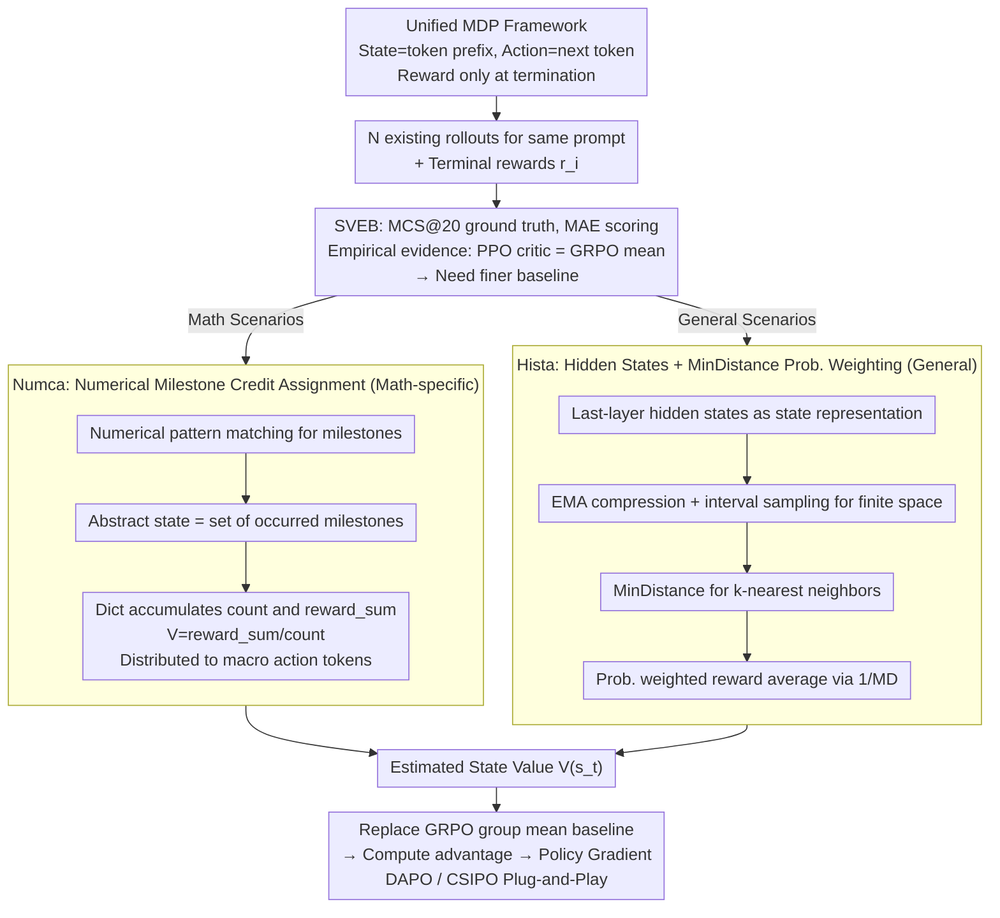

# Hista and Numca: Estimate State Value Effectively for LLM Reinforcement Learning

**Conference**: ICML 2026  
**arXiv**: [2605.29782](https://arxiv.org/abs/2605.29782)  
**Code**: https://github.com/VOXXXX1874/Hista  
**Area**: Reinforcement Learning / LLM Post-training / Credit Assignment  
**Keywords**: LLM RL, GRPO, State Value Estimation, Hindsight, Latent Representation  

## TL;DR
This paper first empirically demonstrates through a newly created State Value Estimation Benchmark (SVEB) that PPO critics in LLM RL almost completely degenerate into the group relative reward baseline of GRPO. It then proposes two state value estimation methods aimed at "no extra rollouts and nearly zero additional compute": Numca Uses numerical milestones to rewrite mathematical reasoning as goal-conditioned RL for credit assignment, while Hista uses the last-layer hidden states of the LLM plus MinDistance for probability-weighted reward averaging. These methods reduce MAE below GRPO/PPO across five SVEB subsets and consistently improve strong algorithms like DAPO/CSIPO on multiple mathematical benchmarks.

## Background & Motivation

**Background**: Since DeepSeek-R1, the RL post-training paradigm represented by GRPO and its successors (DAPO, GSPO, CSIPO) has become the de facto standard for LLM reasoning alignment. Their common framework treats an "entire response" as a single action, using a group mean reward $\bar r$ as the baseline for every token to compute policy gradients. This design bypasses the difficulty of token-level state value estimation but sacrifices the fine-grained credit assignment of a critic in classical RL.

**Limitations of Prior Work**: Upon constructing SVEB, the authors found that widely used PPO critics do not provide "finer guidance than the group mean" in LLM scenarios. PPO-1 (unseen data) scores nearly the same as GRPO (0.169 vs. 0.164), and even PPO-N (seen data) is only slightly better (0.158 vs. 0.164). More directly, the distribution of $\widehat V_{PPO}(s_t)-\widehat V_{GRPO}(s_t)$ is tightly clustered around zero, indicating the PPO critic's output is essentially the group mean reward itself.

**Key Challenge**: Alternative solutions are either non-scalable (PRM and MCTS require expensive annotation or heavy extra rollouts; VAPO/VC-PPO requires training a critic comparable in scale to the actor) or were not designed as "estimation baselines" (PRM is mainly for correctness verification). Given the high "compute tax" of LLM RL training loops, a viable state value estimator must satisfy: no increase in rollouts / no large-scale critic / no extra manual annotation / plug-and-play with existing GRPO-style loops.

**Goal**: (i) Quantify the quality of state value estimation via the SVEB benchmark; (ii) Provide a lightweight, immediately usable method for mathematical reasoning (Numca); (iii) Provide a general-purpose method requiring no priors (Hista) and theoretically prove its superiority over group mean estimators.

**Key Insight**: The authors reframe LLM reasoning within the classical RL MDP framework: the state is the token prefix, the action is the next token, and rewards are only provided upon termination. Thus, the state value $V^\pi(s_t)=\mathbb{E}_\pi[r(s_T)\mid s_t]$ is essentially the "expected future terminal reward starting from this prefix." Any method that can aggregate and average "multiple rollouts starting from $s_t$" based on some similarity is a potential state value estimator. The problem reduces to finding an efficient yet meaningful "state equivalence class" or "state similarity."

**Core Idea**: Use a "cheap similarity" that requires no training—equivalence classes of numerical milestones for math (Numca) or MinDistance between LLM last-layer hidden states for general domains (Hista)—to perform weighted reward averaging over existing rollouts of the same prompt as a fine-grained baseline.

## Method

### Overall Architecture
The authors fit all methods into a unified MDP: state $s_t=(x_1,\dots,x_t)$, action $a_t\in\mathcal V$, deterministic transitions, and reward $r(s_T)$ given at $a_t=\langle\mathrm{eos}\rangle$ or truncation. Given $\mathcal N$ rollouts for a prompt with terminal rewards $r_i$, the goal is to provide $\widehat V(s_t)$ for an intermediate state $s_t$ to serve as the baseline for policy gradients.

SVEB is constructed by selecting prompts, running rollouts with a fixed $\pi$, and uniformly sampling intermediate $s_t$. For each $s_t$, $n$ independent continuations are sampled to obtain $\widehat V(s_t)=\frac{1}{n}\sum_i r(s_T^{(i)})$ (using MCS@20) as the reference ground truth, scored via MAE. The subsets cover number, math, science, general, and programming.

Numca and Hista are designed as "baseline replacements" within the GRPO pipeline—no change in rollout count, no new critics, and no extra labels.

### Key Designs

**1. SVEB: Measuring "Value Estimator Quality" via Measurable MAE**

Previous evaluations of baseline quality depended on downstream RL performance, which mixes optimization noise and algorithmic differences. SVEB computes a reference ground truth $\widehat V(s_t)=\frac{1}{n}\sum_{i=1}^n r(s_T^{(i)})$ for each intermediate state $s_t$ using large-scale Monte Carlo continuations (MCS@20, where $\widehat V(s_t)\to V^\pi(s_t)$ by the law of large numbers). Any estimator can then be scored using $\mathrm{MAE}(f,D_s)=\frac{1}{|D_s|}\sum_j |f(s_t^{(j)},\theta)-\widehat V(s_t^{(j)})|$. Using this offline, reproducible metric, the authors quantify that the PPO critic's output center is essentially the group mean reward itself.

**2. Numca: Numerical Milestones as Anchor Points for Zero-Cost Credit Assignment**

Applying HER by using final states as alternate goals fails in text due to unstructured semantics. However, in math, "calculating a specific intermediate number" is a naturally parsable sub-goal. Numca defines a pattern set $\mathcal P$ (integers, decimals, etc.); a milestone $m$ is a token subsequence matching $\mathcal P$. The state $s_t$ is abstracted as $s_t^M\triangleq\mathbb M(s_t)$, the set of all milestones occurred so far. A dictionary $\mathcal T[s^M]=(\mathrm{count}, \mathrm{reward\_sum})$ is maintained across rollouts. Finally, $V(s^M)=\mathcal T[s^M].\mathrm{reward\_sum}/\mathcal T[s^M].\mathrm{count}$ is distributed across tokens in the macro-action. 

**3. Hista: Probability-Weighted Reward Averaging via Last-Layer Hidden States and MinDistance**

To estimate values for any $s_t$ without domain priors, Hista uses the last-layer hidden states as intrinsic state representations. The distance between two variable-length hidden state sequences is defined via MinDistance:

$$\mathrm{MD}(\mathbf X_1,\mathbf X_2)=\sum_i \min_j \|\mathbf x_{1,i}-\mathbf x_{2,j}\|_2.$$

Theorem 5.2 proves the probability of two states achieving the same final reward is inversely proportional to $\mathrm{MD}$: $P(R_1=R_2)\propto 1/\mathrm{MD}$. Theorem 5.5 further proves that the bias of the probability-weighted estimator $\widehat V_{PW}(s_t)=\sum_i P_{t,i} r_i/\sum_i P_{t,i}$ is no greater than that of a naive average estimator. For efficiency, $\mathbf X_\tau$ is compressed into $\mathbf E_\tau$ using EMA with smoothing $\alpha$, and $V(s_t)$ is computed using $k$-nearest neighbors weighted by $\omega_i=1/\mathrm{MD}(s_t,s_i)$.

### Loss & Training
All methods retain the original clipping, KL regularization, and importance sampling of GRPO/DAPO/CSIPO, only replacing the baseline in the advantage formula: replacing the group mean reward with $\widehat V(s_t)$ provided by Numca or Hista. Neither requires additional training steps or new model parameters.

## Key Experimental Results

### Main Results
MAE across five SVEB subsets (@40 rollouts, reference MCS@20, lower is better):

| Method | Number ↓ | Math ↓ | Science ↓ | General ↓ | Programming ↓ |
|------|----------|--------|-----------|-----------|---------------|
| GRPO@40 | 0.175 | 0.208 | 0.215 | 0.202 | 0.157 |
| PPO-N@40 | 0.159 | 0.187 | 0.198 | 0.185 | 0.144 |
| Numca@40 | **0.132** ↓0.027 | 0.194 ↑0.007 | 0.217 ↑0.019 | 0.200 ↑0.015 | 0.154 ↑0.010 |
| Hista@40 | 0.142 ↓0.017 | **0.145** ↓0.042 | **0.173** ↓0.025 | **0.157** ↓0.028 | **0.119** ↓0.025 |
| MCS@1 (Ref) | 0.223 | 0.235 | 0.272 | 0.283 | 0.162 |
| MCS@2 (Ref) | 0.133 | 0.160 | 0.188 | 0.139 | 0.113 |

Numca significantly outperforms in the Number subset; Hista outperforms GRPO/PPO-N across all subsets and approaches the accuracy of MCS@2.

### Ablation Study
Downstream math evaluation results on Qwen2.5-Math-1.5B-Instruct replacing the GRPO baseline with Numca:

| Benchmark | Qwen | + GRPO | + Numca |
|-----------|------|--------|---------|
| MATH-500 | 0.740 | 0.746 | **0.760** |
| GSM8K | 0.849 | 0.848 | **0.864** |
| MinervaMath | 0.286 | 0.301 | **0.313** |
| OlympiadBench | 0.425 | 0.413 | **0.426** |
| AMC23 | 0.528 | 0.553 | **0.584** |
| AVERAGE | 0.528 | 0.541 | **0.555** |

### Key Findings
- The degeneration of the PPO critic to GRPO is replicated across multiple data sources, suggesting that training a full-scale critic is often a waste of compute in LLM RL.
- Higher estimation accuracy translates to smoother training: Numca's training-validation curves are more stable with higher peaks, proving baseline variance is strongly correlated with policy gradient variance.
- On AIME24&25, Numca did not outperform GRPO, likely due to the small answer space but long intermediate steps, highlighting the necessity of Hista's general-purpose approach.

## Highlights & Insights
- **SVEB as a Standardized Metric**: It provides a measure for baseline quality independent of downstream RL, allowing for cheap ablation before committing to full RL training.
- **Numca as Lightweight Hindsight**: By using "numbers" as milestones, it applies hindsight principles with just a dictionary and regular expressions, reaching accuracy near MCS@2 in numerical tasks.
- **Hista Operationalizes LLMs as Latent Representers**: It leverages last-layer hidden states and probability weighting to achieve peak estimation accuracy without extra models or rollouts, backed by Theorem 5.5.
- **Plugging into Existing Stacks**: Since it only modifies the baseline, it is orthogonal to and improves upon algorithms like DAPO and CSIPO.

## Limitations & Future Work
- Numca depends heavily on numerical density and performs similarly to GRPO in non-mathematical reasoning.
- Hista's MD metric relies on specific theoretical assumptions regarding the LLM latent space that require further empirical validation.
- Evaluation focuses on offline MAE and standard benchmarks, lacking coverage of multi-turn dialogues or long-horizon agent tasks.
- Space complexity of $O((T/d)^2)$ may be problematic for extremely long sequences (e.g., 100k+ tokens), requiring further compression.

## Related Work & Insights
- **vs. PPO / VAPO**: Unlike methods requiring actor-scale critics that often degenerate to the mean, Hista/Numca replace the baseline directly to save training costs.
- **vs. PRM / MCTS**: These rely on expensive process labels or rollouts; Hista reuses existing hidden states at nearly zero cost and provides direct value estimates rather than just verification.
- **vs. HER**: Numca treats "reaching a number" as a hindsight goal, while Hista generalizes "reached semantic state" via hidden states.
- **vs. GRPO / DAPO**: These algorithms focus on KL/IS/clipping. This work is orthogonal, improving the baseline component of these algorithms.

## Rating
- Novelty: ⭐⭐⭐⭐ SVEB + Numca + Hista identifies "baseline quality" as an independent optimization axis.
- Experimental Thoroughness: ⭐⭐⭐⭐ Covers 5 SVEB domains and downstream math tasks across multiple models.
- Writing Quality: ⭐⭐⭐⭐ Clear logical chain from the "PPO degeneration" empirical claim to the proposed solutions.
- Value: ⭐⭐⭐⭐⭐ High engineering utility for industrial LLM post-training with nearly zero extra compute.

<!-- RELATED:START -->

<!-- RELATED:END -->

## Related Papers

- [\[ICML 2026\] DARTS: Distribution-Aware Active Rollout Trajectory Shaping for Accelerating LLM Reinforcement Learning](darts_distribution-aware_active_rollout_trajectory_shaping_for_accelerating_llm_.md)
- [\[ACL 2026\] Efficient Hyperparameter Optimization for LLM Reinforcement Learning](../../ACL2026/reinforcement_learning/efficient_hyperparameter_optimization_for_llm_reinforcement_learning.md)
- [\[ICML 2026\] Multi-Agent Decision-Focused Learning via Value-Aware Sequential Communication](multi-agent_decision-focused_learning_via_value-aware_sequential_communication.md)
- [\[ICLR 2026\] Value Flows](../../ICLR2026/reinforcement_learning/value_flows.md)
- [\[ICML 2026\] LLM-Guided Communication for Cooperative Multi-Agent Reinforcement Learning](llm-guided_communication_for_cooperative_multi-agent_reinforcement_learning.md)

<!-- RELATED:END -->
