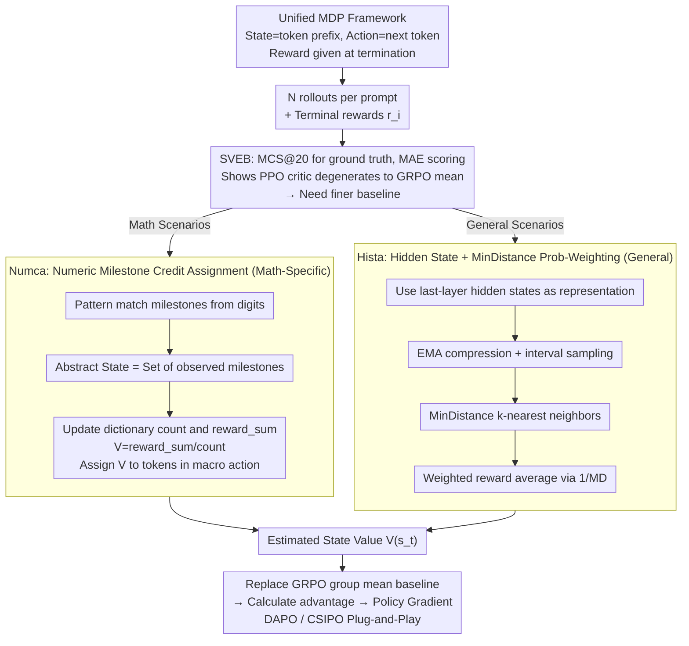

# Hista and Numca: Estimate State Value Effectively for LLM Reinforcement Learning

**Conference**: ICML 2026  
**arXiv**: [2605.29782](https://arxiv.org/abs/2605.29782)  
**Code**: https://github.com/VOXXXX1874/Hista  
**Area**: Reinforcement Learning / LLM Post-training / Credit Assignment  
**Keywords**: LLM RL, GRPO, State Value Estimation, Hindsight, Hidden State Representation  

## TL;DR
This paper empirically demonstrates via a new State Value Estimation Benchmark (SVEB) that the PPO critic in LLM RL almost entirely degenerates into the group average reward baseline of GRPO. It proposes two state value estimation methods aimed at "no extra rollouts and near-zero additional computation": Numca uses numeric milestones to rewrite mathematical reasoning as goal-conditioned RL for credit assignment, while Hista utilizes the LLM's final-layer hidden states and MinDistance for probability-weighted reward averaging. Both methods reduce MAE below GRPO/PPO across five SVEB subsets and yield consistent improvements for strong algorithms like DAPO/CSIPO on multiple mathematical benchmarks.

## Background & Motivation

**Background**: Since DeepSeek-R1, the RL post-training paradigm represented by GRPO and its successors (DAPO, GSPO, CSIPO) has become the de facto standard for LLM reasoning alignment. Their common architecture treats the "entire response" as an action, using a group mean reward $\bar r$ as the baseline for each token before performing policy gradients. This design bypasses the difficulty of token-level state value estimation but sacrifices the fine-grained credit assignment of the classic RL critic.

**Limitations of Prior Work**: Upon constructing SVEB, the authors found that the widely used PPO critic does not provide "guidance finer than the group mean" in LLM scenarios. PPO-1 (unseen data) scores almost identically to GRPO (0.169 vs. 0.164), and even PPO-N (seen data) is only slightly better (0.158 vs. 0.164). More directly, the distribution of $\widehat V_{PPO}(s_t)-\widehat V_{GRPO}(s_t)$ is tightly centered around zero, indicating that the PPO critic's output is essentially the group mean reward itself.

**Key Challenge**: Alternative solutions are either non-scalable (PRM and MCTS require expensive annotation or heavy extra rollouts; VAPO/VC-PPO still require training a critic as large as the actor) or were not originally designed as "baseline estimators" (PRM focuses on correctness verification). The "compute tax" in the LLM RL training loop is extremely high; therefore, a truly viable state value estimator must: not increase the number of rollouts / not introduce a large-model-scale critic / not rely on additional manual annotation / be plug-and-play with existing GRPO-style loops.

**Goal**: (i) Establish a quantifiable metric for "state value estimation quality" (SVEB); (ii) Provide a lightweight, immediately usable method for mathematical reasoning (Numca); (iii) Provide a general-purpose method requiring no priors (Hista) and prove its theoretical superiority over group mean estimators.

**Key Insight**: The authors reframe LLM reasoning within the classic RL MDP framework: the state is the token prefix, the action is the next token, and rewards are provided only at termination. Consequently, the essence of the state value $V^\pi(s_t)=\mathbb{E}_\pi[r(s_T)\mid s_t]$ is the "expected future terminal reward starting from this prefix." Any method that can aggregate and average "multiple rollouts starting from $s_t$" based on some similarity measure is a potential state value estimator. The problem reduces to finding "state equivalence classes" or "state similarities" that are both cheap and meaningful.

**Core Idea**: Utilize a "cheap similarity" that requires no training—equivalence classes of numeric milestones for math (Numca) and MinDistance between LLM final-layer hidden states for general domains (Hista)—to perform weighted reward averaging over existing rollouts under the same prompt as a fine-grained baseline.

## Method

### Overall Architecture
The authors frame all methods within a unified MDP: state $s_t=(x_1,\dots,x_t)$, action $a_t\in\mathcal V$, deterministic transitions, and rewards $r(s_T)$ given only when $a_t=\langle\mathrm{eos}\rangle$ or truncation occurs. Given $\mathcal N$ rollouts for a prompt with terminal rewards $r_i$, the goal is to provide $\widehat V(s_t)$ for an intermediate state $s_t$, which then serves as the baseline for policy gradients like in GRPO.

SVEB is constructed by selecting a set of prompts, running rollouts with a fixed $\pi$, and uniformly sampling intermediate $s_t$. For each $s_t$, $n$ independent continuations are sampled to obtain $\widehat V(s_t)=\frac{1}{n}\sum_i r(s_T^{(i)})$ (using MCS@20) as the reference ground truth. Scoring is based on MAE. Subsets are divided into five domains: number, math, science, general, and programming.

Numca and Hista are designed as "baseline replacements within the GRPO pipeline"—maintaining the rollout count, introducing no new critic, and requiring no extra labels.

### Key Designs

**1. SVEB: Quantifying "Value Estimator Quality" through Monte Carlo Ground Truth MAE**

Previously, baseline quality was evaluated by "whether downstream RL improved," which conflates optimization noise and algorithmic differences. SVEB calculates a reference ground truth for each intermediate state $s_t$ using large-scale Monte Carlo sampling $\widehat V(s_t)=\frac{1}{n}\sum_{i=1}^n r(s_T^{(i)})$ (using MCS@20; by the law of large numbers, $\widehat V(s_t)\to V^\pi(s_t)$). Estimators are then scored using $\mathrm{MAE}(f,D_s)=\frac{1}{|D_s|}\sum_j |f(s_t^{(j)},\theta)-\widehat V(s_t^{(j)})|$. With this offline, reproducible metric, the authors quantify that the PPO critic outputs are essentially group means.

**2. Numca: Numeric Milestones as Hindsight Goals for Zero-Cost Credit Assignment**

Directly applying HER (final states as alternate goals) fails on text due to lack of discrete structure. However, "calculating an intermediate number" in math problems is inherently parsable and verifiable. Numca defines a pattern set $\mathcal P$ (integers, decimals, fractions); a milestone $m$ is a token subsequence matching $\mathcal P$. The state $s_t$ is abstracted as $s_t^M\triangleq\mathbb M(s_t)$, the set of milestones appeared so far. A dictionary $\mathcal T[s^M]=(\mathrm{count}, \mathrm{reward\_sum})$ is maintained across rollouts. $V(s^M)$ is computed as the mean reward of rollouts hitting that abstract state and distributed across corresponding tokens. This process is merely a dictionary lookup with negligible overhead.

**3. Hista: Probability-Weighted Reward Averaging via Latent Representations and MinDistance**

To estimate value for arbitrary $s_t$ without domain priors, Hista uses final-layer hidden states as natural representations. The distance between variable-length latent sequences is defined by MinDistance (MD):

$$\mathrm{MD}(\mathbf X_1,\mathbf X_2)=\sum_i \min_j \|\mathbf x_{1,i}-\mathbf x_{2,j}\|_2.$$

This design is theoretically supported: Theorem 5.2 proves the probability of two states having the same final reward is inversely proportional to MD: $P(R_1=R_2)\propto 1/\mathrm{MD}$. Theorem 5.5 proves that the bias of the probability-weighted estimator $\widehat V_{PW}(s_t)=\sum_i P_{t,i} r_i/\sum_i P_{t,i}$ is no greater than that of the naive mean estimator. Effectively, this converts the intuition that "similar states should have similar rewards" into a theoretically sound weighting scheme.

### Loss & Training
All methods retain the original clipping, KL regularization, and importance sampling mechanisms of GRPO/DAPO/CSIPO. They only replace the baseline in the advantage formula: substituting the group mean reward with $\widehat V(s_t)$ provided by Numca or Hista.

## Key Experimental Results

### Main Results
MAE on five SVEB subsets (@40 rollouts, reference MCS@20, lower is better):

| Method | Number ↓ | Math ↓ | Science ↓ | General ↓ | Programming ↓ |
|------|----------|--------|-----------|-----------|---------------|
| GRPO@40 | 0.175 | 0.208 | 0.215 | 0.202 | 0.157 |
| PPO-N@40 | 0.159 | 0.187 | 0.198 | 0.185 | 0.144 |
| Numca@40 | **0.132** | 0.194 | 0.217 | 0.200 | 0.154 |
| Hista@40 | 0.142 | **0.145** | **0.173** | **0.157** | **0.119** |

Numca excels specifically in the Number subset. Hista outperforms GRPO/PPO-N across all subsets, approaching the accuracy of MCS@2 (which uses double the rollouts).

### Ablation Study
Switching the GRPO baseline to Numca on Qwen2.5-Math-1.5B-Instruct downstream results:

| Benchmark | Qwen | + GRPO | + Numca |
|-----------|------|--------|---------|
| MATH-500 | 0.740 | 0.746 | **0.760** |
| GSM8K | 0.849 | 0.848 | **0.864** |
| AVERAGE | 0.528 | 0.541 | **0.555** |

Training curves indicate that Numca leads to steadier improvement in validation accuracy compared to the fluctuations seen in GRPO/PPO, attributed to variance reduction from the more accurate baseline.

### Key Findings
- The "PPO critic degeneration" is consistent across multiple data sources, suggesting that training a full-scale critic is often a waste of compute in LLM RL.
- Higher estimation accuracy correlates with more stable training curves; improved baselines are the most cost-effective way to reduce policy gradient variance besides increasing rollout counts.
- Numca's limitation on AIME benchmarks (small answer space, long steps) highlights the necessity of the general-purpose Hista method.

## Highlights & Insights
- **SVEB as a Benchmark**: Provides an independent measure of baseline quality, allowing future research to perform cheap ablation studies before committing to full RL training.
- **Lightweight Hindsight**: Numca demonstrates that "milestone" concepts can be applied to text-based RL via simple regex, potentially extendable to code execution stacks or theorem proving steps.
- **LLM as Implicit Encoder**: Hista leverages the final-layer hidden states directly as state representations, avoiding the need for separate representation models and fulfilling the "similar states, similar rewards" intuition with theoretical guarantees.

## Limitations & Future Work
- **Numca's Domain Dependence**: Heavily reliant on numeric density; performs similarly to GRPO in non-math domains.
- **Complexity**: Hista's MD metric has $O((T/d)^2)$ spatial complexity, which might be intensive for extremely long contexts (100k+ tokens), necessitating further compression.
- **Assumptions**: Theoretical assumptions in Hista regarding the latent space of LLMs require further empirical validation across diverse model architectures.

## Related Work & Insights
- **vs. PPO / VAPO**: Unlike methods requiring an actor-sized critic, this work proves such critics often converge to group means, justifying their replacement with lightweight estimators.
- **vs. PRM / MCTS**: Unlike PRM which requires expensive process labels, Hista reuses existing hidden states from the training rollouts at near-zero cost.
- **vs. HER / GCRL**: Numca represents a concrete implementation of hindsight goals for LLMs by treating intermediate numbers as milestones.

## Rating
- Novelty: ⭐⭐⭐⭐ (SVEB, Numca, and Hista collectively optimize a previously overlooked axis in LLM RL).
- Experimental Thoroughness: ⭐⭐⭐⭐ (Extensive coverage across 5 SVEB domains and downstream mathematical benchmarks).
- Writing Quality: ⭐⭐⭐⭐ (Clear logical flow from empirical findings to theoretical justifications).
- Value: ⭐⭐⭐⭐⭐ (Offers immediate engineering gains for RL post-training with near-zero extra compute).

<!-- RELATED:START -->

- **DeepSeek-V3/R1**: Representative of the GRPO paradigm.
- **Lightman et al. 2023**: Process-supervised reward models for math.
- **Andrychowicz et al. 2018**: Hindsight Experience Replay (HER) foundations.

<!-- RELATED:END -->

## Related Papers

- [\[ICML 2026\] DARTS: Distribution-Aware Active Rollout Trajectory Shaping for Accelerating LLM Reinforcement Learning](darts_distribution-aware_active_rollout_trajectory_shaping_for_accelerating_llm_.md)
- [\[ICML 2026\] Multi-Agent Decision-Focused Learning via Value-Aware Sequential Communication](multi-agent_decision-focused_learning_via_value-aware_sequential_communication.md)
- [\[ACL 2026\] Efficient Hyperparameter Optimization for LLM Reinforcement Learning](../../ACL2026/reinforcement_learning/efficient_hyperparameter_optimization_for_llm_reinforcement_learning.md)
- [\[ICLR 2026\] Value Flows](../../ICLR2026/reinforcement_learning/value_flows.md)
- [\[ICLR 2026\] Continuous-Time Value Iteration for Multi-Agent Reinforcement Learning](../../ICLR2026/reinforcement_learning/continuous-time_value_iteration_for_multi-agent_reinforcement_learning.md)

<!-- RELATED:END -->
