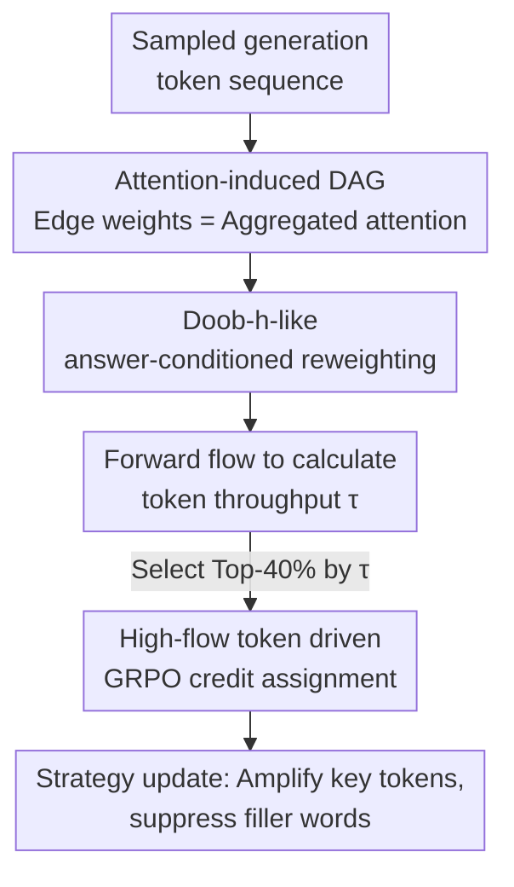

# How Does Reasoning Flow? Tracing Attention-Induced Information Flow for Targeted RL in LLMs

**Conference**: ICML2026  
**arXiv**: [2606.10646](https://arxiv.org/abs/2606.10646)  
**Code**: To be confirmed  
**Area**: LLM Reasoning / Reinforcement Learning  
**Keywords**: Credit Assignment, Attention Information Flow, RLVR, GRPO, Reasoning Skeleton

## TL;DR
A generated trajectory is viewed as an attention-induced Directed Acyclic Graph (DAG). A Doob-h-like reweighting is applied to filter information paths that "actually flow toward the answer," and the "flow throughput" of each token is used for non-uniform credit assignment in GRPO. This concentrates training signals on a few critical tokens supporting the answer, consistently outperforming GRPO and various point-wise heuristics in mathematical reasoning tasks.

## Background & Motivation
**Background**: Reinforcement Learning from Verifiable Rewards (RLVR) has become the primary recipe for enhancing LLM reasoning. Methods like GRPO backpropagate correct/incorrect signals based on "intra-group relative advantage" to the entire trajectory.

**Limitations of Prior Work**: Autoregressive trajectories are long while supervision is extremely sparse (often only a binary signal at the final step), making token-level credit assignment exceptionally difficult. GRPO essentially spreads rewards **uniformly** across every token, implicitly assuming "each word contributes equally," which fails to distinguish decisive reasoning steps from inconsequential phrasing. Classic tools like GAE require accurate state values, but estimating token values externally in natural language is noisy and unstable.

**Key Challenge**: Recent works have begun using internal model signals (entropy, attention statistics, gradient norms) to weight tokens. However, these signals are **point-wise**—they only consider the local saliency of a single token at a given moment, **ignoring the global structure of how information propagates, aggregates, and is forwarded across multiple hops** in the entire sequence. Raw attention itself is noisy: significant attention flows to filler words, formatters, and discarded intermediate hypotheses. Naive propagation causes early but decisive premises to be systematically undervalued, while tokens near the answer are overweighted simply due to "proximity."

**Goal**: To answer a more fundamental question—how exactly does reasoning "flow" from the prompt to the final answer? Based on this, the study aims to derive a globally consistent token-level credit that identifies true "transmission hubs."

**Core Idea**: Construct an attention-induced DAG from the token sequence, perform an **answer-conditioned** flow reorganization to retain only paths reaching the answer, inject a unit flow forward, and use the throughput of each token as the credit weight for GRPO.

## Method

### Overall Architecture
FlowTracer inserts a lightweight analysis step between the "sampling" and "training" phases of RL: an additional forward pass is performed on sampled trajectories to extract attention maps from middle layers (approx. $L/3 \sim 2L/3$). These are used to construct a time-ordered DAG $\mathcal{G}=(V,E)$, where each token is a node and edge weights $W_{ik}=a(x_k,x_i)\ge 0$ are derived from aggregated attention scores, interpreted as the local coupling strength of "how much influence starting from $x_i$ is absorbed by $x_k$" (note that out-degree normalization is not required; $W$ is a linear operator rather than a stochastic kernel).

However, propagating credit directly on the raw attention map has two major flaws: first, attention is normalized by **in-degree**, while the sum of out-degrees $\sum_{k>i}W_{ik}$ can vary, causing influence to be amplified or decayed purely due to graph topology; second, the graph is filled with "answer-irrelevant" dead-end branches, causing credit to decay exponentially along pseudo-paths. Consequently, FlowTracer first performs **answer-conditioned reweighting** to obtain a conserved $W'$, then **calculates forward flow** to obtain the throughput $\tau(k)$ for each token, and finally uses the set of high-throughput tokens to scale the per-token loss in GRPO.

### Key Designs

**1. Doob-h-like Answer-Conditioned Reweighting: Retaining only influence reaching the answer**

This is the core of the paper. To address both "non-conserved out-degrees" and "credit dilution in dead-ends," a virtual sink $s$ is connected to all answer tokens $\mathcal{A}$, and a **reachability potential function** $h(i)$ is defined—representing the total influence starting from node $i$ that eventually reaches the answer: $h(s)=1$, $h(i)=\sum_{k>i}W_{ik}\,h(k)$ (for non-answer nodes). The edge weights are then rewritten as:

$$W'_{ik}\coloneqq\frac{W_{ik}\,h(k)}{h(i)}.$$

This step achieves two properties: first, **local flow conservation** (Theorem 3.1), where for any node with $h(i)>0$, $\sum_{k>i}W'_{ik}=1$ (verified by substituting the definition)—thus intermediate nodes neither create nor lose mass, eliminating topological bias; second, scaling weights by $h(k)/h(i)$ **automatically suppresses edges flowing to dead-ends ($h(k)\approx0$)** and redistributes mass to paths that reach the answer. Tokens with zero reachability are filtered out. This approach of using a harmonic function $h$ to condition general propagation on a target event follows the logic of the Doob h-transform.

**2. Forward Flow Throughput: Injecting unit flow from the question to quantify relay roles**

With conserved $W'$, a clean token-level credit can be assigned. A virtual source $\mathcal{S}$ is connected to all question tokens $\mathcal{Q}$ with an initial flow $f(\mathcal{S}\to i)=1/|\mathcal{Q}|$, which is then propagated forward: $f(k)=\sum_{i<k}f(i)\,W'_{ik}$. Here $f(k)$ represents the portion of effective influence—originating from the question and destined for the answer—that passes through token $x_k$; the edge flow $\phi(i\to k)=f(i)W'_{ik}$ measures the importance of the $x_i\to x_k$ dependency in the reasoning skeleton. The total throughput $\tau(k)=f(k)+\sum_{j>k}\phi(k\to j)$ scores the token. Findings indicate high $\tau$ tokens are not semantic nouns/verbs, but **periodically appearing structural delimiters (punctuation, newlines) and symbolic anchors (resetting variable names, operators)**—they act as "hubs/aggregation checkpoints" that summarize context and broadcast it, forming the reasoning skeleton. A causal verification (see table below) supports this: masking high-flow tokens on GSM8K changes the final answer far more than masking low-flow/random tokens.

**3. High-flow Token Driven GRPO Non-uniform Credit Assignment: Compressing signals onto the skeleton**

Finally, the globally consistent credit is integrated into RLVR. A non-uniform scaling factor $\gamma_{i,t}$ is applied to each token in the GRPO loss:

$$\gamma_t=\begin{cases}\gamma_{\mathrm{flow}}&\text{if } t\in\mathcal{T}_{\mathrm{high\_flow}}\\ 1&\text{otherwise}\end{cases}$$

where $\gamma_{\mathrm{flow}}=1.5$ is the emphasis coefficient, and $\mathcal{T}_{\mathrm{high\_flow}}$ denotes tokens in the top 40% of throughput rankings. This makes policy updates more aggressive for tokens driving the answer and more restrained for fillers. Engineering-wise, this analysis only requires one extra forward pass after sampling, with an overhead of only **2.2%–4.5%**, which is negligible compared to autoregressive sampling and training.

### Loss & Training
Base models: Qwen3-4B/8B (supplemented by Llama-3.1-8B, Llama-3.2-3B); global batch 512, micro-batch 32, 16-step gradient accumulation, learning rate $1\times10^{-6}$, KL and entropy regularization removed; sampling temperature 0.99, top-p=1, top-k=100. 3B/4B models were trained for 500 steps on 8 GPUs, 8B for 600 steps on 16 GPUs. Key hyperparameters (middle layers 15–25, Top-40%, $\gamma_{\mathrm{flow}}=1.5$) were determined via ablation.

## Key Experimental Results

### Causal Intervention: Are high-flow tokens truly the reasoning "skeleton"?

| Masking Target (20%) | Answer Change Rate ↑ | Correctness Reversal Rate ↑ |
|--------|------|------|
| Random 20% | 29.5% | 4.5% |
| Low-flow Bottom-20% | 14.9% | 0.5% |
| High-flow Top-20% | **45.9%** | **14.9%** |

Masking high-flow tokens causes drastic changes in answers and significant reversals in correctness, while low-flow or random masking has minimal impact—confirming that high-flow tokens are causal drivers, not just locally salient.

### Main Results: Mathematical Reasoning (Avg)

| Model / Setting | GRPO | Attention (Strongest Point-wise) | FlowTracer | Gain vs. GRPO |
|--------|------|------|------|------|
| Qwen3-4B · 1K | 37.1 | 38.6 | **39.4** | +2.2 |
| Qwen3-4B · 8K | 44.8 | 47.2 | **48.6** | +3.8 |
| Qwen3-8B · 1K | 39.4 | 41.3 | **43.4** | +4.0 |
| Qwen3-8B · 8K | 50.3 | 50.9 | **52.5** | +2.1 |

The improvement consistently holds across tasks and architectures: Countdown symbolic planning improved from GRPO 52.6 to FlowTracer **63.2 (+10.6)**, and CrossThinkQA from 48.0 to 50.2. Transfers to Llama-3.1-8B (7.7→9.1) and Llama-3.2-3B (4.8→5.9) also show stable gains. Notably, **the advantage increases with context length** (expanding from +2.2 at 1K to +3.8 at 8K on Qwen3-4B), validating the premise that precise credit assignment is more critical as credit dilution worsens in longer chains.

### Ablation Study

| Configuration | Key Finding |
|------|---------|
| Top-k vs Bottom-k | Selecting Top-k by high-flow consistently outperforms GRPO; Bottom-k drops significantly → flow scores correctly identify decisive tokens. |
| Selection Ratio 20%/40%/60% | Top-20% is incomplete; Top-60% introduces noise; **Top-40% provides the best SNR.** |
| Attention Layers (Early/Mid/Late/All) | Middle layers (15–25) are best; averaging all layers dilutes the signal → reasoning skeleton is most prominent in middle layers. |

### Key Findings
- Credit should be placed on "transmission hubs" such as **structural delimiters and symbolic anchors**, rather than semantic content words; the model naturally decouples "logical generation" (high flow) from "fluency maintenance" (low flow).
- Performance gains scale with context length, addressing the "credit dilution" pain point in long-chain reasoning.
- The method is a plug-and-play training-side enhancement with only 2–5% overhead.

## Highlights & Insights
- **Upgrading Credit Assignment from "Point-wise" to "Global Flow"**: Using graph reachability potentials and flow conservation provides a mathematically consistent credit that explains "which tokens actually relay information," rather than just another manual heuristic.
- **Clever Adaptation of Doob h-transform**: Porting a classic probabilistic tool for "conditioning on target events" to attention maps simultaneously solves out-degree non-conservation and dead-end dilution.
- **Transferability**: This "answer-conditioned reweighting + forward flow throughput" framework can be generalized to any scenario requiring the mapping of sequence-level rewards to tokens (e.g., agent trajectories, critical line identification in code generation).

## Limitations & Future Work
- Credit is entirely built on the interpretation of attention as "influence coupling"—the relationship between attention and actual information flow remains debated; masking experiments offer strong but indirect evidence.
- Layer segments, Top-k ratios, and $\gamma_{\mathrm{flow}}$ are empirically chosen; robustness across models or adaptive selection remains to be verified.
- Absolute scores on the hardest competition-level math (e.g., AIME on Llama) remain low; the method provides relative gains rather than a fundamental breakthrough.
- The DAG assumption requires strictly $i<k$ temporal ordering, which might not directly apply to non-autoregressive or backtracking generation paradigms.

## Related Work & Insights
- **vs. Point-wise Heuristics (Entropy / Gradient / Max Attention)**: These only look at local signals and ignore multi-hop relationships; this work explicitly models "multi-hop influence flow under answer conditions," proving consistently superior under the same RL recipe.
- **vs. GRPO / RLVR**: GRPO uses group relative advantage to bypass value estimation but spreads credit uniformly; FlowTracer improves performance by simply replacing token-level weights without changing reward sources.
- **vs. PRM / MCTS (Step-level Supervision)**: Those methods require additional process reward training or search, are prone to reward hacking, and are expensive; FlowTracer's credit comes entirely from within the model with almost zero extra training cost.

## Rating
- Novelty: ⭐⭐⭐⭐⭐ Reframing credit assignment as answer-conditioned attention flow is a fresh and consistent perspective.
- Experimental Thoroughness: ⭐⭐⭐⭐ Extensive tasks, causal intervention, and ablations, though larger models and broader RL algorithms could further validate it.
- Writing Quality: ⭐⭐⭐⭐⭐ Clear chain of motivation-mechanism-verification, balancing intuition with theorems.
- Value: ⭐⭐⭐⭐ Plug-and-play with minimal overhead; practical value for long-chain reasoning RL.

<!-- RELATED:START -->

## Related Papers

- [\[ICLR 2026\] RL Grokking Recipe: How Does RL Unlock and Transfer New Algorithms in LLMs?](../../ICLR2026/reinforcement_learning/rl_grokking_recipe_how_does_rl_unlock_and_transfer_new_algorithms_in_llms.md)
- [\[ICML 2026\] Perceptual Flow Network for Visually Grounded Reasoning](perceptual_flow_network_for_visually_grounded_reasoning.md)
- [\[ICML 2026\] Reverse Flow Matching: A Unified Framework for Online Reinforcement Learning with Diffusion and Flow Policies](reverse_flow_matching_a_unified_framework_for_online_reinforcement_learning_with.md)
- [\[ICML 2026\] How Reasoning Evolves from Post-Training Data: An Empirical Study Using Chess](how_reasoning_evolves_from_post-training_data_an_empirical_study_using_chess.md)
- [\[ICML 2026\] Fast and Highly Expressive Policy Learning for Offline Reinforcement Learning via Bootstrapped Flow Q-Learning](fast_and_highly_expressive_policy_learning_for_offline_reinforcement_learning_vi.md)

<!-- RELATED:END -->
