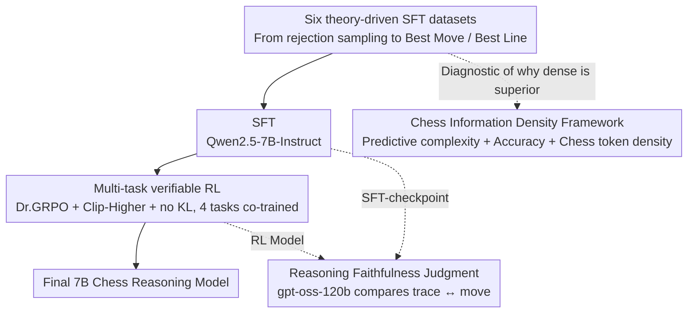

# How Reasoning Evolves from Post-Training Data: An Empirical Study Using Chess

**Conference**: ICML 2026  
**arXiv**: [2604.05134](https://arxiv.org/abs/2604.05134)  
**Code**: https://github.com/(lang-chess) (Available)  
**Area**: Reinforcement Learning / LLM Reasoning / Verifiable RL  
**Keywords**: SFT-to-RL, Reasoning Faithfulness, Chess Reasoning, Information Density, GRPO

## TL;DR
The authors utilize "training LLMs to play chess" as a clean experimental testbed for verifiable RL. By systematically comparing the impact of six self-constructed SFT datasets on RL, they find that while "direct prediction of the Best Move" achieves the highest scores, it leads to unfaithful reasoning after RL. Conversely, "predicting the Best Line (multi-step moves)" yields comparable performance but results in more stable RL and more faithful reasoning. Furthermore, they distill three metrics from SFT checkpoints to predict ultimate RL performance. Finally, their 7B model outperforms gpt-oss-120b on multiple chess benchmarks.

## Background & Motivation

**Background**: Currently, training LLMs to "learn to reason" is almost exclusively conducted in math and code domains because these fields possess massive high-quality data and allow for automated verification. Models like R1 / DeepSeek-R1 and Kimi k1.5 have achieved significant leaps via RL combined with verifiable rewards.

**Limitations of Prior Work**: Controlled experiments are difficult to perform. Training data for math and code are already very mature, and base models possess strong inherent capabilities, making it hard to isolate "which type of training data drives the gain in RL." Meanwhile, the research community primarily evaluates "reasoning quality" through final accuracy, with almost no systematic investigation into "whether RL is truly learning reasoning vs. merely shifting the answer distribution."

**Key Challenge**: To conduct a granular causal analysis of "SFT data $\rightarrow$ RL behavior," one must find a domain where LLMs are naturally weak (to avoid base model interference) but where sufficient verifiable rewards are available. Simultaneously, this domain must allow for a clear definition of "whether reasoning is faithful to the answer."

**Goal**: (a) How do different SFT data (programmatic / rejection sampling / synthetic / Best Move / Best Line) affect SFT and final RL performance? (b) How does RL alter the distribution of move quality, hallucination rates, and reasoning strategies? (c) Which SFT-checkpoint metrics can predict post-RL performance?

**Key Insight**: The authors select chess as the "ideal testbed"—LLMs traditionally perform poorly (avoiding strong base bias), it has an episodic MDP structure, and superhuman oracles like Stockfish provide verifiable rewards and synthetic data. Additionally, chess allows for an easy definition of "whether reasoning is consistent with the final move" (using gpt-oss-120b as a judge).

**Core Idea**: Perform systematic SFT $\rightarrow$ RL ablations using Qwen2.5-7B and introduce a "chess information density" framework (predictive complexity + accuracy + chess token density) to explain why certain datasets produce stable and strong RL. The work distills key designs for "faithful reasoning."

## Method

### Overall Architecture
Unified base: Qwen2.5-7B-Instruct. Board states use visual ASCII format (FEN and spaced FEN were tested but found to have uneven tokenization); moves use UCI format. The task suite includes four components: Predict Move (selecting the optimal move given a board), Best Move / Worst Move (5-way choice), and Legal Moves (IoU evaluation). The pipeline: first, a fixed 15M token SFT and 8k samples for RL (Dr. GRPO + Clip-Higher + no KL) are used for ablation to select the strongest recipe, which is then scaled to 60M+60M token SFT + more RL. The entire study follows a "data $\rightarrow$ SFT $\rightarrow$ RL $\rightarrow$ analysis" pipeline: six theory-driven SFT datasets are fed into Qwen2.5-7B for SFT. The resulting SFT checkpoints undergo multi-task verifiable RL to produce the final model. Two analytical tools are used throughout: gpt-oss-120b as a judge to measure "reasoning faithfulness" (comparing trace $\leftrightarrow$ move) and a lightweight 0.5B model to measure "chess information density." The former explains why Best Line is more credible than Best Move, while the latter explains why dense data performs better given the same token count.

### Key Designs

**1. Six theory-driven SFT datasets: Injecting board understanding, decision-making, and reasoning formats from different angles to isolate contributions via ablation.**

The study focuses on "which SFT data makes RL more stable and stronger," so the six datasets are not arbitrary; each corresponds to a different structure within the MDP. ① General Instruction Following (Magpie Llama 3.3 70B) for regularization; ② Rejection Sampling using Llama 4 Maverick to generate and retain correct samples across four evaluation tasks, injecting "teacher-style" reasoning; ③ Guided Synthetic providing the teacher with a 5-ply sequence + start/end boards to write verbalized $n$-step bootstrapping containing the transition function $\mathcal{T}(s_t,a_t)$ and value $V(s_t)$; ④ Verbalized Alpha-Beta Pruning, entirely programmatic—using Stockfish for softmax sampling to recursively construct minimax trees and verbalize the search process; ⑤ Best Move: direct output of the optimal UCI move given a board, approximating behavior cloning $\pi_\theta(a_t|s_t)$; ⑥ Best Line: outputting a 4-6 ply optimal move sequence with final centipawn delta, approximating $n$-step bootstrapping with $V$ and $\mathcal{T}$. These ablations compare the effectiveness of different inductive biases rather than just scores.

**2. Verifiable RL environment and Dr. GRPO settings: Running multi-task RL across four tasks simultaneously to avoid single-task reward hacking.**

Rewards are entirely programmatic—Predict Move uses normalized rank ($r \in [0,1]$, optimal is 1), Best/Worst Move checks selection correctness, and Legal Moves uses IoU. The algorithm uses Dr. GRPO (removing GRPO's length normalization) + Clip-Higher (increasing the PPO clip upper bound to encourage exploration) + removing the KL penalty. 8k samples are distributed across the four tasks, then scaled up. A key finding was that RL on the single Predict Move task was prone to reward hacking; multi-tasking forces the model to "know which moves are legal/good/bad," resulting in higher move quality and better robustness. Task diversity proves more valuable than single-point intensive training, a counter-intuitive but practical conclusion.

**3. Determination of "Reasoning Faithfulness" and the advantage of Best Line: Turning the consistency between "reasoning trace and final move" into a comparable scalar.**

Only looking at final scores would lead to the incorrect conclusion that "Best Move and Best Line are similar in effect." Faithfulness allows for the differentiation of training paths. Using gpt-oss-120b as a judge, the authors score the alignment between the reasoning trace and the final answer. Results show that checkpoints from Best Move data, after RL, exhibit severe inconsistency between reasoning and moves (typical "decide first, then justify"), whereas Best Line retains faithfulness after RL. The attribution: Best Line forces the model to learn $V$ and $\mathcal{T}$ within the token sequence, effectively internalizing a mini world model; Best Move only learns policy $\pi_\theta$, so RL improves latent ability while the surface reasoning stays decoupled from the answer (echoing Turpin et al. 2023). This metric allows researchers to choose paths that are both high-performing and credible, which is vital for safety and interpretability.

**4. Chess Information Density framework: Explaining "why dense datasets train better given equal tokens."**

In ablations where the number of training tokens is fixed, "which dataset is superior" boils down to "how much useful information is packed into those tokens." Lacking a standard information theory definition, the authors define this metric via three dimensions: ① Predictive complexity—whether the data remains difficult to predict throughout training; ② Accuracy—whether tokens are correctly grounded to the board and task; ③ Chess token density—whether predicting a token truly requires board understanding and strategy (the "gold content" per token in Best Move is far higher than the natural language redundancy in Rejection Sampling). To quantify "predictive complexity," the authors SFT Qwen2.5-0.5B on 4M unique tokens for 2 epochs and count the percentage of tokens assigned a probability $>0.995$ (i.e., "memorized"). High percentages indicate trivial/sparse information. Best Line / Best Move showed the lowest trivial token ratios (0% / 28.6%), being truly "dense," while Verbalized Alpha-Beta Pruning jumped to 71%—programmatic search scripts were quickly memorized, with only sparse move decisions and evaluations remaining uncertain. This explains why it hindered performance when trained alone. This tool is a generalizable diagnostic for any verifiable RL domain.

### Loss & Training
- SFT used LlamaFactory, RL used veRL; Dr. GRPO + Clip-Higher + no KL; the scaling phase used a two-stage curriculum: 60M tokens of Best Move-All followed by 60M tokens of Best Line-All.

## Key Experimental Results

### Main Results

| Benchmark | Qwen2.5-7B base | gpt-oss-120b | Ours 7B (Best Move + Best Line) |
|---|---|---|---|
| Best Move (1 of 5) | Near random 0.2 | Strong | **Exceeds gpt-oss-120b** |
| Worst Move | Near random 0.2 | Strong | **Exceeds gpt-oss-120b** |
| Predict Move (move quality) | Low | Medium | **Significant Lead** |
| Legal Moves (IoU) | Low | Medium | **Lead** |

| Dataset | Pre-SFT trivial token% | Post-SFT trivial token% | Property |
|---|---|---|---|
| Best Line | 0.00% | 24.0% | Dense (High Density) |
| Best Move | 0.04% | 28.6% | Dense (High Density) |
| Factual Board Answering | 0.04% | 62.5% | Some sub-tasks collapsed |
| Verbalized Alpha-Beta Pruning | 4.31% | 71.0% | Most search phrases memorized |
| Guided Synthetic | 2.90% | 9.77% | Medium |
| Rejection Sampling | 12.69% | 20.8% | Natural language redundancy |

### Ablation Study

| Training Recipe | Final Score | RL Stability | Reasoning Faithfulness |
|---|---|---|---|
| Single-task RL (Predict Move) | Poor, prone to hack | Unstable | Average |
| Multitask Rejection Sampling | Medium | Average | Average |
| Best Move (focused) | High | Unstable | **Unfaithful** |
| Best Move-All (full data) | Highest | Unstable | **Unfaithful** |
| Best Line (focused) | High | **Stable** | **Faithful** |
| Best Line-All | High | **Stable** | **Faithful** |
| Incl. Verbalized Alpha-Beta | Dragged performance | — | — |

### Key Findings
- "Dataset diversity > single strongest component"—Best Move-All and Best Line-All outperformed their focused versions, even when including Verbalized Alpha-Beta Pruning (which was harmful individually); this suggests diversity acts as an implicit regularizer during RL.
- RL consistently shifted the move quality distribution to the right and suppressed hallucination rates, even without explicit rewards for these side effects; notably, move accuracy within the trace (whether moves mentioned in reasoning are legal) became a strong predictor for post-RL performance.
- RL models trained on Best Line are stronger on OOD evals (unseen during training), indicating they learned something closer to a policy + value "world model," whereas Best Move learned a more fragile pure policy.
- Regression analysis shows that three SFT-checkpoint metrics (avg eval score / cited move legality / LLM reasoning score) significantly correlate with RL success, suggesting a cost-effective strategy: screen checkpoints with cheap SFT evaluation before committing to expensive RL.

## Highlights & Insights
- Shifting reasoning research from "which RL algorithm is better" to "which SFT data is better" provides a more helpful perspective for practitioners—RL algorithm variations are limited, but data recipe differences are vast.
- The "Chess Information Density" concept decomposes why dense data works into three measurable dimensions, providing a diagnostic framework transferable to other verifiable RL domains (e.g., SAT, circuits, theorem proving).
- Proposing "reasoning faithfulness" as a first-order metric and demonstrating the "high score but unfaithful" phenomenon warns the alignment community: pursuing task accuracy alone can lead models to learn implicit "rationalization."
- The finding that multi-task SFT + multi-task RL suppresses reward hacking is highly practical for industry as a near-zero-cost stabilization method.

## Limitations & Future Work
- Conducted only on the Qwen2.5-7B base; generalization across families (Llama / Mistral) is unverified.
- "Reasoning faithfulness" judged by gpt-oss-120b may contain self-preference bias (Panickssery 2024); no cross-judge control was performed.
- In full-game play, it still loses to OpenAI o3, attributed to a distribution mismatch between training positions (mid-to-late game focus) and openings. This work is not a "general chess agent" but a strong model for "chess puzzles and mid-game reasoning."
- Lacks multi-round RL and tree-search integration, leaving clear room for improvement.

## Related Work & Insights
- **vs DeepSeek-R1 / Kimi k1.5**: While they showed RL+verifiable reward emergent reasoning in math/code, this work provides quantitative conclusions on "which SFT data makes RL stable/faithful" in a controlled environment.
- **vs Quiet-STaR / STaR**: Those works assume the existence of "successful reasoning" for bootstrapping; this work shows dense programmatic data (Best Move/Line) is more effective than synthetic samples, suggesting future reasoning data should prioritize "task density over natural language."
- **vs DeepMind 270M Chess Transformer**: That was pure next-move prediction without reasoning; this work uses 7B + reasoning traces, proving the "language reasoning + RL" path can achieve both chess capability and interpretable traces (though still weaker than search-based engines).
- Insight: Treating Best Line's "multi-step moves + value" as "explicit world-model SFT" can be applied to dialogue (multi-turn planning + terminal value), agentic tasks (multi-step actions + reward assessment), and code (multi-step execution + output prediction), essentially moving RL's "bootstrap" forward into the SFT phase.

## Rating
- Novelty: ⭐⭐⭐⭐ Innovative use of chess for RL reasoning research; the information density and faithfulness metrics are solid methodological contributions.
- Experimental Thoroughness: ⭐⭐⭐⭐⭐ Comprehensive ablations across 6 data types, multi-tasks, and diverse metrics.
- Writing Quality: ⭐⭐⭐⭐ Clear structure with three research questions leading to three sets of experiments and conclusions.
- Value: ⭐⭐⭐⭐ Provides a reproducible empirical baseline for the "SFT data $\rightarrow$ RL behavior" mapping; the focus on reasoning faithfulness is valuable for safety research.

<!-- RELATED:START -->

## Related Papers

- [\[ACL 2026\] Scaling Behaviors of LLM Reinforcement Learning Post-Training: An Empirical Study](../../ACL2026/reinforcement_learning/scaling_behaviors_of_llm_reinforcement_learning_post-training_an_empirical_study.md)
- [\[ICML 2026\] Provable Benefit of Curriculum in Transformer Tree-Reasoning Post-Training](provable_benefit_of_curriculum_in_transformer_tree-reasoning_post-training.md)
- [\[ICML 2026\] CPMöbius: Iterative Coach–Player Reasoning for Data-Free Reinforcement Learning](cpmobius_iterative_coach-player_reasoning_for_data-free_reinforcement_learning.md)
- [\[ICML 2026\] D$^2$Evo: Dual Difficulty-Aware Self-Evolution for Data-Efficient Reinforcement Learning](d2evo_dual_difficulty-aware_self-evolution_for_data-efficient_reinforcement_lear.md)
- [\[ICML 2026\] Single-Rollout Hidden-State Dynamics for Training-Free RLVR Data Selection](single-rollout_hidden-state_dynamics_for_training-free_rlvr_data_selection.md)

<!-- RELATED:END -->
