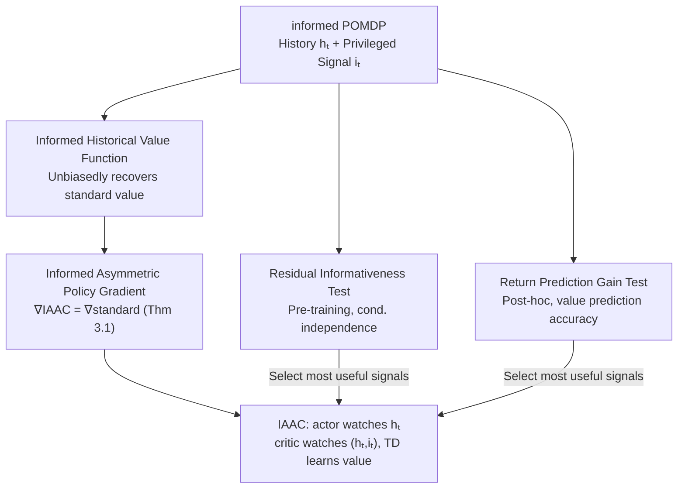

# Informed Asymmetric Actor-Critic: Leveraging Privileged Signals Beyond Full-State Access

**Conference**: ICML2026  
**arXiv**: [2509.26000](https://arxiv.org/abs/2509.26000)  
**Code**: https://github.com/EbiDa/informed-asymmetric-a2c  
**Area**: Reinforcement Learning / Partial Observability / Actor-Critic  
**Keywords**: Asymmetric actor-critic, privileged information, POMDP, unbiased policy gradient, informativeness criteria  

## TL;DR
This paper relaxes the "asymmetric actor-critic" requirement from "the critic must observe the full environment state" to "the critic can observe any state-dependent privileged signals." It proves that any such signals yield unbiased policy gradients and proposes two informativeness tests to identify the most useful signals. Experiments demonstrate that carefully selected partial privileged signals can match or even outperform full-state asymmetric baselines while using less state information.

## Background & Motivation
**Background**: Many real-world tasks are Partially Observable Markov Decision Processes (POMDPs), where optimal actions depend on the history of observations and actions, typically encoded using RNNs. **Asymmetric actor-critic** is a popular approach utilizing extra training-time information: the actor only observes the history $h_t$, while the critic observes privileged information during training. Performance gains come from more accurate value estimation without increasing the actor's input (since privileged info is unavailable during deployment).

**Limitations of Prior Work**: Existing asymmetric actor-critic methods almost exclusively assume that the critic has access to the **full environment state** $s_t$. However, this is often impractical in reality—many extra signals available during training (multi-view robot sensors, simulator internals, expert policies, representations from foundation models) are **neither the full state nor Markovian**, yet they contain useful information. Early state-conditioned critics by Pinto et al., while empirically strong, are generally ill-defined in POMDPs without strict assumptions like state-decodability. Baisero & Amato corrected the unbiasedness using "history-state value functions" but remain tied to the "full state."

**Key Challenge**: There is a gap between "fragmentary partial privileged signals available in reality" and "full-state critic theory." **Asymmetric actor-critic under partial privileged signals lacks both unbiasedness guarantees and criteria for signal selection.**

**Goal**: (1) Relax the critic's privileged information from "full state" to "any state-dependent signal" while maintaining unbiased policy gradients; (2) Provide actionable informativeness criteria to answer "which signal to choose."

**Key Insight**: Formulation via informed POMDPs—supplementing a standard POMDP with an "information variable" $i_t\sim I(i_t\mid s_t)$, assuming observations $o_t$ are conditionally independent of $s_t$ given $i_t$. This abstraction naturally unifies "full state" and "extra training-time signals" into the same framework.

**Core Idea**: Define an "informed historical value function" using the informed POMDP and prove that its expectation over $i_t$ unbiasedly recovers the standard historical value. Thus, any $i_t$ provides an unbiased gradient. Two informativeness tests are proposed to select signals based on their additional contribution to predicting future returns.

## Method

### Overall Architecture
The approach consists of two parts. **Part 1 (Theory)**: Define informed historical Q-functions $Q^\pi(h_t,i_t,a_t)$ and informed historical values $V^\pi(h_t,i_t)$ on the informed POMDP. Prove they unbiasedly recover standard values when taking expectations over $i_t$. Define the informed asymmetric policy gradient and prove it is **identically equal** to the standard policy gradient (Theorem 3.1). This relaxes the critic's information from full state to any state-conditioned signal. The architecture, IAAC (informed asymmetric actor-critic), uses an actor observing $h_t$ and an informed critic observing $(h_t, i_t)$, utilizing TD learning for the critic and constructing low-variance advantage estimates via TD errors.

**Part 2 (Signal Selection)**: Since any $i_t$ is unbiased, differences lie in the **variance** of value estimation. Criteria are needed to select signals most informative for predicting returns. Two complementary criteria are provided: the **Residual Informativeness Test** (pre-training, based on conditional independence) and the **Return Prediction Gain Test** (post-hoc, based on improvements in value prediction accuracy). Both can perform hypothesis-test-based screening for feature subsets $c_t=(c_t^1,\dots,c_t^M)$.

### Key Designs

**1. Informed Historical Value functions + Unbiased Policy Gradients: Relaxing "Full State" to "Any State-Dependent Signal"**

Addressing the gap where "existing theory only supports full-state critics," Ours defines informed historical Q-functions $Q^\pi(h_t,i_t,a_t)=\mathbb{E}^\pi[G_t\mid h_t,i_t,a_t]$ and values $V^\pi(h_t,i_t)$ on informed POMDPs, where $i_t\sim I(i_t\mid s_t)$ is any state-dependent privileged signal. The core lemma shows that their expectations over $i_t$ unbiasedly recover the standard quantities: $\mathbb{E}_{i_t\mid h_t}[Q^\pi(h_t,i_t,a_t)]=Q^\pi(h_t,a_t)$ (Lemma A.2). The informed asymmetric policy gradient is defined as:

$$\nabla_\theta^{\text{IAAC}}J(\pi_\theta)=\mathbb{E}\Big[\sum_t\gamma^t Q^\pi(h_t,i_t,a_t)\nabla_\theta\log\pi_\theta(a_t\mid h_t)\Big],$$

and is proven to be **identically equal** to the standard policy gradient $\nabla_\theta J(\pi_\theta)$ (Theorem 3.1). This outcome is significant: it demonstrates that training a critic with any state-dependent privileged signal **does not introduce gradient bias**. The full-state critic (Baisero & Amato) is merely a special case where $i_t=s_t$. Signal selection affects optimization only by "changing the variance of value estimation" without altering asymptotic optimality. An immediate corollary is that state-conditioned expert policies $i_t=a_t^\star\sim\pi^\star(\cdot\mid s_t)$ can be fed as privileged signals, allowing the critic to use oralce information without forcing the actor to imitate an expert that might be non-deployable or suboptimal under partial observability. Why can "less information be better"? Because $i_t$ reduces uncertainty about the state ($\mathbb{E}_{i_t\mid h_t}[H(s_t\mid h_t,i_t)]\le H(s_t\mid h_t)$) and reduces the variance of the value target via the law of total variance ($\mathbb{E}_{i_t\mid h_t}[\mathrm{Var}(G_t\mid h_t,i_t)]\le\mathrm{Var}(G_t\mid h_t)$), particularly effective in environments with severe "value aliasing."

**2. Residual Informativeness Test: Determining "Additional Predictive Power" Pre-training**

After relaxation, any signal is valid, but not all are useful. A criterion is needed **before training**. Starting from whether $i_t$ carries information about future returns $G_t$ beyond $(h_t,a_t)$, this is formulated as a conditional independence hypothesis $\mathbb{H}_0^{\text{CI}}:G_t\perp i_t\mid h_t,a_t$. Rejecting it implies $i_t$ has non-redundant information. Since samples under the CI hypothesis are unavailable, **residual independence** is tested instead: first regress out the parts explained by $(h_t,a_t)$ to get residuals $e_{G_t}:=G_t-\mathbb{E}[G_t\mid h_t,a_t]$ and $e_{i_t}:=i_t-\mathbb{E}[i_t\mid h_t,a_t]$, then test $\mathbb{H}_0^{\text{res}}:e_{G_t}\perp e_{i_t}$. CI implies residual independence (the converse is not necessarily true), making the residual test a **necessary but not sufficient** condition for $i_t$ having additional predictive power. To generate null hypothesis samples, a surrogate $\tilde G_t^{\text{null}}=\tilde G_t-\mathbb{E}[\tilde G_t]+\mathbb{E}[G_t\mid h_t,a_t]$ is constructed. Implementation uses an RNN to encode history into $z_t$, Random Forests for cross-fitting conditional means, and HSIC or Mutual Information to measure residual dependence $\rho$, followed by an episode-level permutation test to calculate empirical $p$-values. If $p<\alpha$, $i_t$ is judged $\alpha$-residually informative. The advantage is that it **does not require a trained actor or critic**; even episodes from a random policy can be used.

**3. Return Prediction Gain Test: Quantifying Signal Contribution Post-hoc**

The second criterion quantifies signal value directly from the critic's primary task: return prediction. Comparing a symmetric critic $\hat Q(h_t,a_t)$ and an informed critic $\hat Q(h_t,i_t,a_t)$, the episode-level squared error gain is defined as:

$$L^{\tau_j}:=\frac{1}{T_j}\sum_{t=0}^{T_j-1}\big((\hat Q(h_t,a_t)-G_t)^2-(\hat Q(h_t,i_t,a_t)-G_t)^2\big),$$

where $L^{\tau_j}>0$ indicates that $i_t$ improved return prediction for that episode. This defines $(\epsilon, \delta)$-predictive informativeness: test $\mathbb{H}_0:\mathbb{E}[L^\tau]\le\epsilon$. Rejecting it at significance $\delta$ means the signal is useful. Implementation switches based on sample size: bootstrap for small $N$, one-sided $t$-test for large $N$ ($N>1,000$). While a **post-hoc** criterion, it also only requires episodes from an arbitrary fixed policy and serves as a complement to the residual test—one checking statistical dependence, the other checking actual improvement in prediction accuracy. Both support screening feature subsets $\mathcal{Z}\subseteq\{1,\dots,M\}$ to pick the one with the largest effect size or smallest $p$-value.

## Key Experimental Results

### Main Results
Evaluated on 6 navigation tasks (Heaven-Hell-3, Shopping-5, Car-Flag, Cleaner, Memory-Four-Rooms-7x7/9x9) and 6 POPGym environments. Partial privileged signals were customized for each task, with identical actor inputs across methods. Informed-asym-A2C is compared with three A2C variants: symmetric A2C (critic sees history $\hat V(h)$), asym-A2C-hs (history-state critic $\hat V(h,s)$), and asym-A2C-s (pure state critic $\hat V(s)$, navigation only). Curves represent 20 independent runs with 100-episode moving averages.

| Environment | Key Phenomenon | Conclusion |
|------|---------|------|
| Car-Flag | informed-asym-A2C exceeds all baselines in speed and return | Partial signals > Full state |
| Memory-Four-Rooms-7x7/9x9 | Outperforms both asymmetric baselines | Partial signals > Full state |
| Shopping-5 | Faster convergence than asym-A2C-hs, equivalent return | Match full state, faster |
| Heaven-Hell-3 | Stronger than A2C / asym-A2C-s, slightly behind asym-A2C-hs | Close to full state |
| Concentration | Full-state variants struggle (high-dim irrelevant features) | Full state hindered by noise |
| Position Cart Pole | Both asymmetric variants significantly beat A2C | Asymmetric is effective |

**General Conclusion**: Asymmetric critics using appropriately constructed partial privileged signals can match or even surpass full-state critics while using **strictly less** information, challenging the assumption that full state is necessary for asymmetric actor-critic.

### Ablation Study (Informativeness Criteria)
On a synthetic informed POMDP ($|\mathcal{S}|=20$, $|\mathcal{A}|=4$, states containing 5D latent Gaussian features $s_t\in\mathbb{R}^5$, reward is linear in features), observations are noiseless $o_t=(s_t^1,s_t^2)$, while reward weights are concentrated on $s_t^4,s_t^5$. Symmetric A2C baseline AUC is approx. $1.06\times10^5$.

| Privileged Signal $i_t$ | Residual Dep. $\rho_{\text{obs}}$ | Pred. Gain $L_\tau$ | AUC |
|------|------|------|------|
| $[s^1,s^2]$ | 3.0e-05 | -1.4e-02 | 1.07e+05 |
| $[s^1,s^2,s^3]$ (incl. irrelevant $s^3$) | 5.5e-05 | 0.007 | 1.08e+05 |
| $[s^1,s^2,s^4,s^5]$ (incl. relevant $s^4,s^5$) | **7.6e-05** | **0.064** | **1.23e+05** |
| $[s^1,s^2,s^3,s^4,s^5]$ (Full state) | 7.0e-05 | 0.056 | 1.19e+05 |

**Key Findings**:
- **Signals with $s^4,s^5$ show strongest evidence and highest AUC**: Both criteria identify subsets containing reward-correlated components as more informative, corresponding to the highest learning performance (AUC 1.23e+05).
- **Full state is not always best**: Including all 5 dimensions (including irrelevant $s^3$) resulted in a lower AUC (1.19e+05), confirming that irrelevant features act as "structural noise" that hinders value estimation, even with high-capacity approximators (analagous to "noisy TV").
- **Criteria Effectiveness**: Both criteria automatically identify reward-relevant subsets from a pool of candidates in a data-driven manner without manual feature engineering; performance is driven by whether reward-relevant information is present, not just the quantity of information.

## Highlights & Insights
- **An unbiasedness theorem opens the design space**: Theorem 3.1 relaxes critic signals from "full state" to "any state-dependent signal" without bias. This makes fragmentary signals like expert actions, simulator internals, and foundation model representations valid "fuel"—the most critical "Aha!" moment.
- **Using expert info correctly**: Expert actions can be used by the critic for value estimation without forcing the actor to imitate the expert (which is proven suboptimal in POMDPs), skillfully bypassing the bias trap of asymmetric imitation.
- **Signal selection as a core design dimension**: Two actionable tests (one pre-training, one post-hoc, neither requiring a trained policy) turn "signal selection" from guesswork into hypothesis testing, directly transferable to any scenario needing training-time auxiliary variables.
- **Empirical proof for counter-intuitive conclusions**: More state information $\neq$ better learning. Irrelevant features introduce structural noise—a strong reminder against the engineering habit of "feeding the full state wherever possible."

## Limitations & Future Work
- **Reliance on regression quality**: The residual test requires estimating $\mathbb{E}[G_t\mid h_t,a_t]$ and $\mathbb{E}[i_t\mid h_t,a_t]$. If regression errors do not decrease with sample size, the test might deviate from nominal significance or lose statistical power. Cross-fitting helps, but high-dimensional history remains challenging.
- **Unbiasedness $\neq$ Learnability**: Theory guarantees unbiasedness and the possibility of variance reduction, but $V^\pi(h_t,i_t)$ is not necessarily easier to approximate than $V^\pi(h_t)$. Gains depend on whether "value aliasing" is significant.
- **Scalability**: Experiments focused on small-to-medium discrete navigation/POPGym tasks and synthetic POMDPs. Stability in high-dimensional continuous control or real robotics requires further validation.
- **Limited coverage of random policies**: While pre-training tests can use random samples, poor coverage of the state-action space may lead to biased informativeness assessments.

## Related Work & Insights
- **vs Baisero & Amato (2022) History-State Critic**: They used a full-state critic to fix unbiasedness—this is a **special case** of Ours where $i_t=s_t$. Ours relaxes this to any signal and adds selection criteria.
- **vs Asymmetric Imitation Learning (Warrington et al., 2021)**: Imitating a full-state expert is suboptimal in POMDPs. Ours lets the critic use expert info for values without forcing actor imitation, avoiding gradient bias.
- **vs Causal/Bandit Variable Selection (Lee & Bareinboim)**: They rely on explicit causal models to identify irrelevant variables; Ours identifies signals purely based on their statistical utility for value estimation without assuming causal structure.
- **vs Model-based Privileged Info (Informed Dreamer, etc.)**: Those methods inject extra signals into the world model; Ours follows the actor-critic route, directly impacting value estimation.

## Rating
- Novelty: ⭐⭐⭐⭐⭐ Relaxing asymmetric critics from full state to any signal with unbiasedness proofs and selection criteria is a framework-level contribution.
- Experimental Thoroughness: ⭐⭐⭐⭐ 12 benchmarks + synthetic POMDPs show clear alignment between criteria and performance, though mostly in discrete environments.
- Writing Quality: ⭐⭐⭐⭐ Rigorous derivations with clear lemmas/theorems; informed POMDP notation is dense but necessary.
- Value: ⭐⭐⭐⭐⭐ Provides the theoretical foundation and tools for using fragmentary training-time signals in asymmetric RL, high practical significance.

<!-- RELATED:START -->

## Related Papers

- [\[ICLR 2026\] Chunking the Critic: A Transformer-based Soft Actor-Critic with N-Step Returns](../../ICLR2026/reinforcement_learning/chunking_the_critic_a_transformer-based_soft_actor-critic_with_n-step_returns.md)
- [\[AAAI 2026\] Risk-Sensitive Exponential Actor Critic](../../AAAI2026/reinforcement_learning/risk-sensitive_exponential_actor_critic.md)
- [\[ICLR 2026\] Flow Actor-Critic for Offline Reinforcement Learning (FAC)](../../ICLR2026/reinforcement_learning/flow_actor-critic_for_offline_reinforcement_learning.md)
- [\[ICLR 2026\] Simplicial Embeddings Improve Sample Efficiency in Actor-Critic Agents](../../ICLR2026/reinforcement_learning/simplicial_embeddings_improve_sample_efficiency_in_actorcritic_agents.md)
- [\[ICLR 2026\] Neural+Symbolic Approaches for Interpretable Actor-Critic Reinforcement Learning](../../ICLR2026/reinforcement_learning/neuralsymbolic_approaches_for_interpretable_actor-critic_reinforcement_learning.md)

<!-- RELATED:END -->
