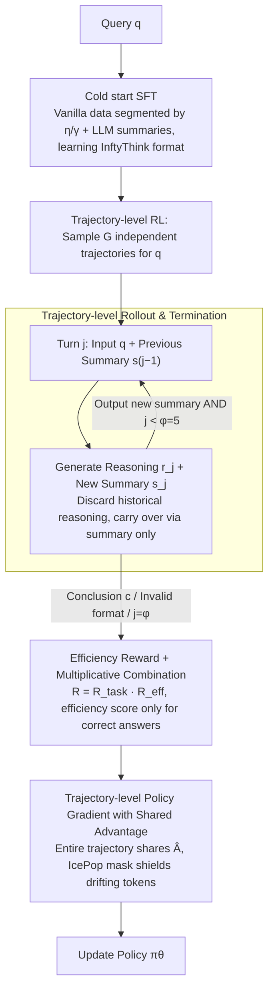

# InftyThink+: Effective and Efficient Infinite-Horizon Reasoning via Reinforcement Learning

**Conference**: ICML 2026  
**arXiv**: [2602.06960](https://arxiv.org/abs/2602.06960)  
**Code**: https://zju-real.github.io/InftyThink-Plus  
**Area**: LLM Reasoning / Reinforcement Learning / Efficient Inference  
**Keywords**: Iterative Reasoning, Trajectory-level RL, GRPO, Summarized CoT, Efficiency Reward

## TL;DR
This paper upgrades the "iterative reasoning + explicit summarization" paradigm from pure SFT to end-to-end RL, proposing InftyThink+: using trajectory-level GRPO to simultaneously optimize three decisions—"when to summarize, what to retain, and how to resume"—coupled with an efficiency reward. It improves AIME24 accuracy by 21% and reduces latency by 32.8% on DeepSeek-R1-Distill-Qwen-1.5B.

## Background & Motivation

**Background**: Current large reasoning models (DeepSeek-R1, o1, etc.) rely on "inference-time scaling"—enhancing complex reasoning capabilities by generating ultra-long chains-of-thought (CoT) within `<think>...</think>` for decomposition, planning, and reflection.

**Limitations of Prior Work**: Directly tying reasoning depth to context length hits three walls: (1) the quadratic complexity of self-attention causes costs to explode for ultra-long reasoning; (2) hard limits of the maximum context window truncate difficult problems before a conclusion is reached; (3) "lost-in-the-middle"—as sequences lengthen, it becomes harder to utilize early critical information, dragging down reasoning quality.

**Key Challenge**: Existing "iterative reasoning" solutions (token pruning, latent space compression, Markovian Thinker fixed chunking, or the original InftyThink) either use heuristic hard-cuts or rely solely on SFT to mimic data formats. **No one has optimized the three core decisions: "when to compress, what to compress, and how to resume"**—which are critical to the success of iterative reasoning. A poor early summary pollutes all subsequent iterations; an unnecessary iteration wastes compute; premature termination sacrifices accuracy.

**Goal**: To upgrade "iterative reasoning" from "format imitation" to "policy optimization"—allowing the model to learn when to summarize, how to extract key states, and how to resume reasoning using the summary.

**Key Insight**: Iterative reasoning is essentially a sequential decision-making problem with long-range consequences, which must be optimized using **trajectory-level RL** over the entire multi-turn sequence rather than token-by-token imitation. However, the "single query → multiple generations" structure of InftyThink does not directly align with the "single query → multiple independent trajectories" assumption of standard GRPO, requiring a redesign of rollouts, rewards, and gradient estimation.

**Core Idea**: Cold-start SFT for format learning + trajectory-level GRPO for policy learning; rewards are accumulated at the trajectory level, advantages are shared within the trajectory, and a quadratic-decay "less-iteration-more-reward" efficiency term is added.

## Method

### Overall Architecture

The input is a single query $q$, and the output is a multi-turn iterative trajectory $\mathcal{O}_i = \{o_i^1, o_i^2, \ldots, o_i^{n_i}\}$. Each turn $o_i^j$ consists of a "reasoning segment $r_j$ + summary $s_j$". The next turn only sees the query and the latest summary $s_{j-1}$, discarding historical reasoning. The trajectory terminates when the model outputs a final conclusion $c$ (instead of a new `
`), or is forced to stop at a maximum iteration limit $\varphi$. Training consists of two stages:

1.  **Cold start (SFT)**: Existing vanilla reasoning data $(q, r, c)$ is segmented using two hyperparameters $\eta$ (max segment length, 6k) and $\gamma$ (max summary length, 1k). Summaries $\{s_1, \ldots, s_{n-1}\}$ are generated by an external LLM to create InftyThink-formatted training samples (Eq. 1), teaching the model to produce valid multi-turn outputs using special `
...
` and `<history>...</history>` tokens.
2.  **Trajectory-level RL (Modified GRPO)**: Full multi-iteration rollouts are performed on the DeepScaleR dataset, scored by trajectory, and optimized using shared advantages.

### Key Designs

**1. Trajectory-level Rollout & Termination: Expanding "one query → one generation" to "one query → multi-turn iterative trajectory"**
Standard GRPO rollouts assume each trajectory is a continuous generation, which cannot be directly fed into a "segment-summarize-resume" loop. InftyThink+ redesigns the rollout: given query $q$, the prompt for turn $j$ is $q + s_{j-1}$ ($s_0$ is empty for $j=1$). After generating $o_i^j$, the new summary $s_j$ is extracted as the sole input for the next turn—all historical reasoning segments are discarded. A trajectory terminates if the model outputs a conclusion instead of a summary, outputs an invalid format, or reaches the limit $\varphi=5$. For each query, $G$ independent trajectories are sampled as a group for GRPO. This hard limit $\varphi$ constrains training costs and prevents infinite loops of summarizing without concluding.

**2. Efficiency Reward & Multiplicative Combination: Adding a "less iteration reward" only for correct trajectories**
Vanilla RL encourages longer CoT, causing latency to explode. Thus, pressure is applied to the number of iterations. The task reward is binary: $\mathcal{R}_{\text{task}}(\mathcal{O}_i) = \mathbb{I}[\operatorname{Verify}(o_i^{n_i}, gt) = \text{Correct}]$. The efficiency reward uses quadratic decay: $\mathcal{R}_{\text{eff}}(\mathcal{O}_i) = 1 - ((n_i - 1)/\varphi)^2$, providing a full score for $n_i=1$ and decreasing smoothly. Crucially, they are combined **multiplicatively**: $\mathcal{R}(\mathcal{O}_i) = \mathcal{R}_{\text{task}} \cdot \mathcal{R}_{\text{eff}}$. This ensures only correct trajectories receive the efficiency reward, preventing the model from taking shortcuts by terminating early incorrectly. The quadratic curve is more elegant than a hard length penalty: light punishment early on to encourage exploration, with steep penalties near $\varphi$ to curb redundant iterations.

**3. Shared Advantage Policy Gradient: Assigning positive gradients to early "good summaries," even without an answer**
The causal chain in iterative reasoning is "early good summary → late correct answer." A poor early summary pollutes later turns, so the advantage must backpropagate across turns. InftyThink+ shares the same advantage $\hat{A}_t = (\mathcal{R}(\mathcal{O}_i) - \mu)/\sigma$ for all tokens in a trajectory ($\mu, \sigma$ calculated across $G$ trajectories of the query). The loss is averaged at the token level across all turns to avoid dilution in long trajectories. Furthermore, an **IcePop** token-level gradient mask is introduced to mask tokens where log-probabilities differ significantly between the inference engine (SGLang) and training engine (FSDP), stabilizing numerical drift in large-scale RL engineering.

### Loss & Training
Two stages: (1) SFT using OpenThoughts-114K with Qwen3-4B-Instruct-2507 synthesizing intermediate summaries. Loss is calculated only on reasoning segments and summary tokens; query/history tokens are masked. (2) RL using DeepScaleR-Preview, global batch 128, 1000 steps (500 for Qwen3-4B-Base), $\varphi=5$. Asynchronous rollout via verl + AgentLoop, using SGLang + FSDP and PRIME-Math for verification.

## Key Experimental Results

### Main Results
Base model is DeepSeek-R1-Distill-Qwen-1.5B (mean of 32 samples, T=0.7). ACC is accuracy (%), LAT is average inference latency (s).

| Setting | AIME24 ACC↑ | AIME25 ACC↑ | GPQA_D ACC↑ | Mean ACC↑ | Mean LAT↓ |
|---|---|---|---|---|---|
| Vanilla (SFT only) | 26.67 | 24.48 | 29.40 | 41.69 | 110.96 |
| Vanilla + RL (task) | 38.75 | 31.04 | 29.81 | 47.31 | 149.44 |
| InftyThink+ (SFT only) | 29.48 | 27.92 | 32.31 | 44.06 | 77.57 |
| InftyThink+ RL (task) | **50.94** | **35.83** | **37.50** | **53.96** | 100.21 |
| InftyThink+ RL (task+eff) | 43.96 | 32.92 | 35.46 | 50.58 | **48.37** |

Similar results hold for Qwen3-4B-Base: InftyThink+ RL (task) Mean ACC 58.71 vs Vanilla RL 57.13, Mean LAT 265s vs 535s.

### Ablation Study (Summarization Timing Policy, AIME24 ACC %)

| Timing Policy | w/o RL | w/ RL | Description |
|---|---|---|---|
| Adaptive (Ours) | 29.48 | 50.94 | InftyThink+ Default |
| Random (3-6k tokens) | 28.54 (-0.94) | 47.92 (-3.02) | Gap widens after RL |
| Fixed (Every 5k tokens) | 28.44 (-1.04) | 48.44 (-2.50) | Gap widens after RL |

### Key Findings
- **RL dividends are larger for InftyThink+**: Task-only RL provides +5.62 Mean ACC for Vanilla, but +9.89 for InftyThink+—with a particularly huge gap on AIME24 (+21.46 vs +12.08), showing explicit summaries provide "high-level states" that are easier for RL to optimize.
- **Efficiency rewards achieve true Pareto improvement**: Compared to SFT only, Task+eff raises Mean ACC by 6.51 points and reduces latency by 29.20s; compared to task-only RL, it trades ~3 points of ACC for halved latency.
- **Adaptive timing is irreplaceable**: The stronger the RL, the higher the cost of forced fixed/random segmentation (drops of -2.5 to -3.0 after RL), showing RL learns a genuine "summarize when needed" policy rather than just counting iterations.
- **RL training itself is 18.2% faster**: Because each iteration's context is bounded, the rollout phase is not bogged down by ultra-long sequences.

## Highlights & Insights
- **"Multiplicative Reward + Shared Advantage" is a robust template for multi-stage trajectory optimization**: Multiplicative combination blocks shortcuts like incorrect early termination; shared advantage allows "no answer but high contribution" intermediate steps to receive signals. This can be directly ported to agent multi-turn tool use or long-term planning.
- **Quadratic decay efficiency reward vs. linear**: The "loose early, tight late" curve naturally balances exploration and convergence, proving much more elegant than hard length penalties.
- **IcePop token-level gradient masking** provides a simple solution to the engineering reality of "rollout backend ≠ training backend," addressing the true bottleneck of large-scale RL stability.
- **Paradigm Inspiration**: Converting "Long CoT" from a "one-off long sequence" to "multi-turn bounded context with summaries" effectively amortizes attention complexity from $O(L^2)$ to $O(\varphi \cdot (L/\varphi)^2)$. The theoretical latency reduction matches the measured 32.8%—this route has strong transfer value for downstream agent tasks limited by inference time.

## Limitations & Future Work
- Main baselines are limited to 1.5B and 4B models; the stability and return curves of trajectory-level RL on ultra-large models (30B+) still need validation.
- Summary quality evaluation was only an indirect ablation (replacing with an external LLM); a direct measure of summary semantic fidelity is lacking.
- The efficiency reward trade-off is fixed as multiplicative; dynamic weights or fine-grained control for a multi-objective Pareto front were not explored.
- $\varphi=5$ is a hard limit; its sufficiency for extremely hard problems requiring 10+ turns is unknown. Adaptive $\varphi$ or hierarchical iteration is a natural next step.

## Related Work & Insights
- **vs. InftyThink (Yan et al., 2025)**: This work uses the same paradigm (adaptive iteration boundaries + explicit summaries) but upgrades training from pure SFT to cold-start + trajectory-level RL, moving from "learning format" to "learning policy."
- **vs. Markovian Thinker / Delethink (Aghajohari et al., 2025)**: They split reasoning into fixed-size chunks + RL to achieve linear compute but ignore the natural structure of reasoning; Ours allows adaptive segmentation based on content.
- **vs. Long CoT + Standard RL**: Vanilla RL encourages longer CoT, causing latency and costs to explode; InftyThink+ compresses latency while extending reasoning depth, achieving a "win-win" in efficiency and performance.

## Rating
- Novelty: ⭐⭐⭐⭐ Fully integrated trajectory-level RL into "iterative summarized reasoning," with rollout/reward/advantage modifications.
- Experimental Thoroughness: ⭐⭐⭐⭐ Two base models, four benchmarks, 3 timing ablations + summary quality replacement + training acceleration.
- Writing Quality: ⭐⭐⭐⭐ The structure of "Three Pain Points - Three Decisions - Three Designs" is symmetrical and clear.
- Value: ⭐⭐⭐⭐ Directly useful for context-limited or long-range agent reasoning scenarios; the multiplicative reward/shared advantage paradigm is highly reusable.

<!-- RELATED:START -->

## Related Papers

- [\[ACL 2026\] A Goal Without a Plan Is Just a Wish: Efficient and Effective Global Planner Training for Long-Horizon Agent Tasks (EAGLET)](../../ACL2026/reinforcement_learning/a_goal_without_a_plan_is_just_a_wish_efficient_and_effective_global_planner_trai.md)
- [\[ICML 2026\] Offline Reinforcement Learning with Universal Horizon Models](offline_reinforcement_learning_with_universal_horizon_models.md)
- [\[ICML 2026\] Long-Horizon Model-Based Offline Reinforcement Learning Without Explicit Conservatism](long-horizon_model-based_offline_reinforcement_learning_without_explicit_conserv.md)
- [\[ICML 2026\] D$^2$Evo: Dual Difficulty-Aware Self-Evolution for Data-Efficient Reinforcement Learning](d2evo_dual_difficulty-aware_self-evolution_for_data-efficient_reinforcement_lear.md)
- [\[ICML 2026\] Coupled Variational Reinforcement Learning for Language Model General Reasoning](coupled_variational_reinforcement_learning_for_language_model_general_reasoning.md)

<!-- RELATED:END -->
