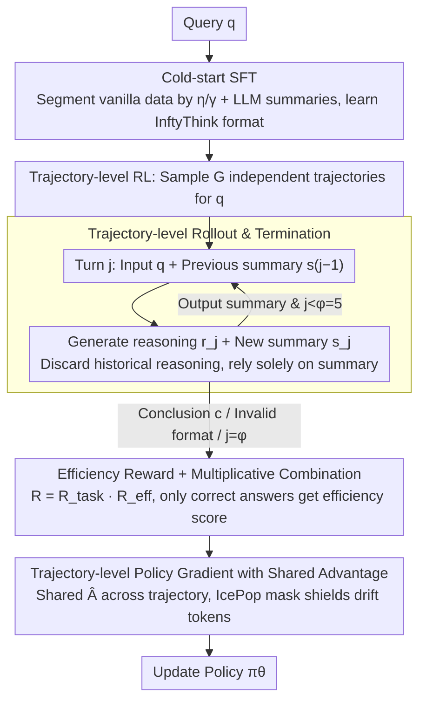

# InftyThink+: Effective and Efficient Infinite-Horizon Reasoning via Reinforcement Learning

**Conference**: ICML 2026  
**arXiv**: [2602.06960](https://arxiv.org/abs/2602.06960)  
**Code**: https://zju-real.github.io/InftyThink-Plus  
**Area**: LLM Reasoning / Reinforcement Learning / Efficient Inference  
**Keywords**: Iterative Reasoning, Trajectory-level RL, GRPO, Summarized CoT, Efficiency Measurement

## TL;DR
This paper upgrades the "iterative reasoning + explicit summary" paradigm from pure SFT to end-to-end RL, proposing InftyThink+. By using trajectory-level GRPO to simultaneously optimize three decisions—"when to summarize, what to retain, and how to continue"—and incorporating an efficiency reward, it achieves a 21% increase in AIME24 accuracy and a 32.8% reduction in latency on DeepSeek-R1-Distill-Qwen-1.5B.

## Background & Motivation

**Background**: Current large-scale reasoning models (e.g., DeepSeek-R1, o1) rely on "test-time scaling," enhancing complex reasoning capabilities by generating ultra-long chains-of-thought (CoT) within `<think>...</think>` tags for decomposition, planning, and reflection.

**Limitations of Prior Work**: Directly tying reasoning depth to context length faces three major hurdles: (1) the quadratic complexity of self-attention causes costs to explode for ultra-long reasoning; (2) hard constraints on the maximum context window truncate difficult problems before a conclusion is reached; (3) "lost-in-the-middle"—as sequences lengthen, utilized early critical information becomes harder to access, which degrades reasoning quality.

**Key Challenge**: Existing "iterative reasoning" solutions (e.g., token pruning, latent space compression, Markovian Thinker's fixed chunking, and the original InftyThink) either use heuristic hard cuts or rely solely on SFT to imitate data formats. **None optimize the three critical decisions: "when to compress, what to compress, and how to continue"**—which are the keys to successful iterative reasoning. A poor early summary pollutes all subsequent iterations; an unnecessary iteration wastes compute; and premature termination sacrifices accuracy.

**Goal**: To upgrade "iterative reasoning" from "format imitation" to "policy optimization," enabling the model to learn to summarize at appropriate moments, distill key states, and reason further based on summaries.

**Key Insight**: Iterative reasoning is essentially a sequential decision-making problem with long-range consequences. It must be optimized using **trajectory-level RL** to address the entire multi-turn trajectory rather than token-by-token imitation. However, InftyThink’s "single query → multiple generations" structure does not align directly with standard GRPO’s "single query → multiple independent trajectories" assumption, requiring a redesign of rollouts, rewards, and gradient estimation.

**Core Idea**: Cold-start SFT for format learning and trajectory-level GRPO for policy optimization. Rewards are accumulated at the trajectory level, advantages are shared within the trajectory, and a quadratically decaying "fewer iterations, higher reward" efficiency term is introduced.

## Method

### Overall Architecture

The input is a single query $q$, and the output is a multi-turn iterative trajectory $\mathcal{O}_i = \{o_i^1, o_i^2, \ldots, o_i^{n_i}\}$. Each turn $o_i^j$ consists of a "reasoning segment $r_j$ + summary $s_j$." The next turn takes only the query and the latest summary $s_{j-1}$ as input, discarding historical reasoning. The trajectory terminates when the model outputs a final conclusion $c$ (instead of a new `
`) or reaches the maximum iteration limit $\varphi$. Training is conducted in two stages:

1.  **Cold start (SFT)**: Vanilla reasoning data $(q, r, c)$ is segmented using two hyperparameters $\eta$ (max segment length, 6k) and $\gamma$ (max summary length, 1k), with summaries $\{s_1, \ldots, s_{n-1}\}$ generated by an external LLM. This produces InftyThink-formatted training samples (Equation 1), teaching the model to produce valid multi-turn outputs using special tokens like `
...
` and `<history>...</history>`.
2.  **Trajectory-level RL (GRPO Adaptation)**: Complete multi-iteration rollouts are performed on the DeepScaleR dataset, with scoring at the trajectory level and optimization via shared advantages.

### Key Designs

**1. Trajectory-level Rollout & Termination: Expanding "Single Query → Single Generation" to "Single Query → Multi-turn Trajectory"**

Standard GRPO rollouts assume each trajectory is a continuous generation, which cannot be directly applied to the "segment-summarize-resume" loop. InftyThink+ redesigns the rollout: given query $q$, turn $j$ formats the prompt as $q + s_{j-1}$ ($s_0$ is empty for $j=1$). After generating $o_i^j$, the new summary $s_j$ is extracted as the sole input for the next turn—all previous reasoning segments are discarded. Trajectories terminate if the model outputs a conclusion instead of a summary, outputs an invalid format, or reaches the limit $\varphi=5$. For each query, $G$ independent trajectories are sampled as a group. The hard limit $\varphi$ constrains training costs and prevents the model from entering infinite synthesis loops.

**2. Efficiency Reward & Multiplicative Combination: Adding a "Few-iteration Reward" only for correct trajectories**

Vanilla RL encourages longer CoT, which causes latency costs to explode. Thus, pressure is applied to the iteration count. The task reward is binary: $\mathcal{R}_{\text{task}}(\mathcal{O}_i) = \mathbb{I}[\operatorname{Verify}(o_i^{n_i}, gt) = \text{Correct}]$. The efficiency reward uses quadratic decay: $\mathcal{R}_{\text{eff}}(\mathcal{O}_i) = 1 - ((n_i - 1)/\varphi)^2$, which is maximal at $n_i=1$ and decreases smoothly. Crucially, these are combined **multiplicatively** $\mathcal{R}(\mathcal{O}_i) = \mathcal{R}_{\text{task}} \cdot \mathcal{R}_{\text{eff}}$ rather than additively—ensuring that only correct trajectories receive an efficiency reward. This prevents the model from taking shortcuts by terminating prematurely to save iterations. The quadratic decay is more elegant than a hard length penalty: it is lenient initially to encourage exploration and steepens near $\varphi$ to curb redundant iterations.

**3. Shared Advantage Trajectory-level Policy Gradient: Assigning positive gradients to early "good summaries"**

The causal chain of iterative reasoning is "early good summary → late correct answer." A bad early summary pollutes all subsequent turns; thus, advantages must backpropagate across turns. Within the GRPO framework, InftyThink+ shares a single advantage $\hat{A}_t = (\mathcal{R}(\mathcal{O}_i) - \mu)/\sigma$ across all tokens in a trajectory ($\mu$ and $\sigma$ are calculated across $G$ trajectories). The loss is a token-level average across all turns to prevent long-trajectory losses from being diluted. Additionally, the IcePop token-level gradient mask is introduced to mask tokens where log-probabilities differ significantly between the inference engine (SGLang) and training engine (FSDP), stabilizing the numerical drift common in large-scale RL engineering.

### Loss & Training
Two stages: (1) SFT uses OpenThoughts-114K with summaries synthesized by Qwen3-4B-Instruct-2507; loss is calculated only on reasoning and summary tokens, with query/history tokens masked. (2) RL uses DeepScaleR-Preview, global batch 128, 1000 steps (500 for Qwen3-4B-Base), $\varphi=5$, asynchronous rollout via verl + AgentLoop, and answer verification via PRIME-Math.

## Key Experimental Results

### Main Results
Base model DeepSeek-R1-Distill-Qwen-1.5B (mean of 32 samples, T=0.7). ACC denotes accuracy (%), and LAT denotes average inference latency (seconds):

| Setting | AIME24 ACC↑ | AIME25 ACC↑ | GPQA_D ACC↑ | Avg. ACC↑ | Avg. LAT↓ |
|---|---|---|---|---|---|
| Vanilla (Cold-start only) | 26.67 | 24.48 | 29.40 | 41.69 | 110.96 |
| Vanilla + RL (task) | 38.75 | 31.04 | 29.81 | 47.31 | 149.44 |
| InftyThink+ (Cold-start only) | 29.48 | 27.92 | 32.31 | 44.06 | 77.57 |
| InftyThink+ RL (task) | **50.94** | **35.83** | **37.50** | **53.96** | 100.21 |
| InftyThink+ RL (task+eff) | 43.96 | 32.92 | 35.46 | 50.58 | **48.37** |

Results are consistent on Qwen3-4B-Base: InftyThink+ RL (task) yields 58.71 Avg. ACC vs. 57.13 Vanilla RL, with latency reduced from 535s to 265s.

### Ablation Study (Summary Timing Policy, AIME24 ACC %)

| Timing Policy | w/o RL | w/ RL | Description |
|---|---|---|---|
| Adaptive (Model decided) | 29.48 | 50.94 | InftyThink+ default |
| Random (3-6k tokens) | 28.54 (-0.94) | 47.92 (-3.02) | Gap widens after RL |
| Fixed (Every 5k tokens) | 28.44 (-1.04) | 48.44 (-2.50) | Gap widens after RL |

### Key Findings
- **RL dividends are higher for InftyThink+**: task-only RL provides a +5.62 Avg. ACC gain for Vanilla, but a +9.89 gain for InftyThink+ (especially on AIME24, +21.46 vs. +12.08), indicating explicit summaries provide more optimizable "high-level states" for RL.
- **Efficiency rewards achieve true Pareto improvements**: Compared to cold-start, task+eff increases Avg. ACC by 6.51 and reduces latency by 29.20s; compared to task-only RL, it sacrifices ~3 points in ACC for a 50% latency reduction.
- **Adaptive timing is irreplaceable**: As RL strengthens, the cost of forced fixed/random segmentation increases, suggesting RL learns a true "content-aware" summarization policy.
- **RL training speedup of 18.2%**: Since each turn's context is bounded, the rollout phase is not bottlenecked by ultra-long sequences.

## Highlights & Insights
- **"Multiplicative Reward + Shared Advantage" is an effective template for multi-stage trajectory optimization**: Multiplicative rewards eliminate incorrect "shortcuts," while shared advantages provide signals for "answerless but contributory" intermediate steps. This is directly applicable to agentic multi-turn tool use or long-range planning.
- **Quadratic vs. Linear Efficiency Rewards**: The "loose early, tight late" curve naturally balances exploration and convergence, proving much more elegant than hard length penalties.
- **IcePop Token-level Gradient Mask**: This provides a simple solution to the engineering reality of "rollout backend ≠ training backend," addressing a major bottleneck in the stability of large-scale RL systems.
- **Paradigm Shift**: Converting "Long CoT" from a one-time long sequence to multi-turn bounded contexts with summaries effectively reduces attention complexity from $O(L^2)$ to $O(\varphi \cdot (L/\varphi)^2)$. The theoretical reduction aligns with the observed 32.8% latency decrease, offering high transfer value for constrained downstream agent tasks.

## Limitations & Future Work
- The main experiments are limited to 1.5B and 4B models; the stability and return curves of trajectory-level RL on ultra-large models (30B+) remain to be verified.
- Summary quality was only assessed via indirect ablation (replacing with external LLMs), lacking direct semantic fidelity metrics.
- The efficiency reward trade-off is fixed as multiplicative; dynamic weights or multi-objective Pareto front controls were not explored.
- $\varphi=5$ is a hard limit; its sufficiency for extremely difficult problems requiring 10+ turns is unknown. Adaptive $\varphi$ or hierarchical iteration is a natural next step.

## Related Work & Insights
- **vs. InftyThink (Yan et al., 2025)**: This work uses the same paradigm (model-decided boundaries + explicit summaries) but upgrades training from pure SFT to cold-start + trajectory-level RL—moving from "learning format" to "learning policy."
- **vs. Markovian Thinker / Delethink (Aghajohari et al., 2025)**: Those methods use fixed chunk sizes + RL to achieve linear compute but ignore the natural structure of reasoning; this work allows adaptive content-driven segmentation.
- **vs. Long CoT + Standard RL**: Vanilla RL encourages longer CoT, causing latency and costs to explode; InftyThink+ increases reasoning depth while suppressing latency, achieving a true "efficiency-effectiveness" win.
- **vs. Token Pruning / Latent Compression (Xia et al., 2025; Zhang et al., 2025)**: Those are input-side compression methods that risk losing future critical information; this work uses output-side explicit summaries optimized by RL.

## Rating
- Novelty: ⭐⭐⭐⭐ Seamlessly integrates trajectory-level RL into "iterative summarized reasoning," with adapted rollout, reward, and advantage mechanisms.
- Experimental Thoroughness: ⭐⭐⭐⭐ Two base models, four benchmarks, 3 types of timing ablations, summary quality replacement, and training speedup.
- Writing Quality: ⭐⭐⭐⭐ Clear symmetry between three pain points, three decisions, and three design components.
- Value: ⭐⭐⭐⭐ High engineering value for context-limited or long-range agent reasoning; the multiplicative reward/shared advantage paradigm is highly reusable.

<!-- RELATED:START -->

## Related Papers

- [\[ACL 2026\] A Goal Without a Plan Is Just a Wish: Efficient and Effective Global Planner Training for Long-Horizon Agent Tasks (EAGLET)](../../ACL2026/reinforcement_learning/a_goal_without_a_plan_is_just_a_wish_efficient_and_effective_global_planner_trai.md)
- [\[ICML 2026\] Offline Reinforcement Learning with Universal Horizon Models](offline_reinforcement_learning_with_universal_horizon_models.md)
- [\[ICML 2026\] D$^2$Evo: Dual Difficulty-Aware Self-Evolution for Data-Efficient Reinforcement Learning](d2evo_dual_difficulty-aware_self-evolution_for_data-efficient_reinforcement_lear.md)
- [\[ICML 2026\] Long-Horizon Model-Based Offline Reinforcement Learning Without Explicit Conservatism](long-horizon_model-based_offline_reinforcement_learning_without_explicit_conserv.md)
- [\[ICML 2026\] Coupled Variational Reinforcement Learning for Language Model General Reasoning](coupled_variational_reinforcement_learning_for_language_model_general_reasoning.md)

<!-- RELATED:END -->
