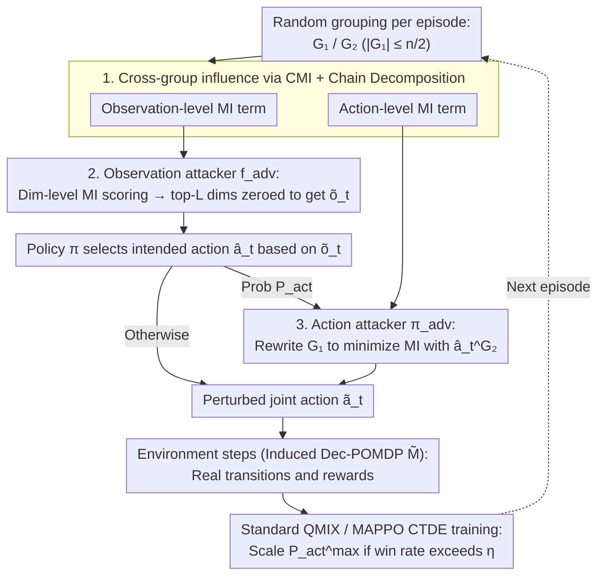

# Interaction-Breaking Adversarial Learning Framework for Robust Multi-Agent Reinforcement Learning

**Conference**: ICML 2026  
**arXiv**: [2605.18024](https://arxiv.org/abs/2605.18024)  
**Code**: https://sunwoolee0504.github.io/IBAL  
**Area**: Reinforcement Learning / Multi-Agent / Robust MARL  
**Keywords**: MARL, CTDE, Mutual Information, Adversarial Training, Collaborative Robustness  

## TL;DR
This paper characterizes "mutual influence" between agents using conditional mutual information from an information-theoretic perspective. It designs attackers that simultaneously mask observations and perturb actions to minimize cross-group mutual information. By doing so, it trains IBAL policies that maintain stable decision-making even when collaborative components fail. IBAL significantly outperforms existing robust MARL methods under various attacks and "missing teammate" perturbations in SMAC / SMACv2 / LBF.

## Background & Motivation

**Background**: Cooperative MARL typically adopts the Centralized Training with Decentralized Execution (CTDE) framework, such as VDN and QMIX, which decompose the joint action-value $Q^{tot}$ into individual utilities $Q^i$. While this tight coupling allows agents to learn sophisticated collaborative strategies, it also makes the policies extremely sensitive to "interaction patterns rarely seen during training."

**Limitations of Prior Work**: Existing robust MARL works (adversarial regularization in Lin et al. 2020, critical-moment action attacks in ROMANCE/EGA, sequential targeted attacks in Wolfpack, RL attackers in ATLA, etc.) mostly frame robustness as "value-oriented" perturbations—where the attacker selects actions to minimize $Q^i$ or adds FGSM noise to observations. These objectives implicitly assume that "perturbations only occur at the input level of a single agent" and do not directly destroy the "dependency structure between agents." Consequently, when attacks truly sever collaborative links (e.g., making one group unable to see the other), the defenses of these methods collapse.

**Key Challenge**: There is a structural mismatch between training and execution in CTDE. Training-phase value decomposition assumes agents can consistently "read" each other, whereas in real-world deployment, collaboration may be interrupted by communication failures, visual occlusions, or unit fatalities, leading the policy to encounter interaction patterns almost never seen in the training distribution.

**Goal**: (i) Quantify "cross-agent influence" in a manner independent of the $Q^{tot}$ structure; (ii) construct attackers capable of directly eliminating this influence; (iii) learn a set of policies robust to "collaborative collapse" under such attacks, which can further generalize to non-parametric perturbations like "missing teammates."

**Key Insight**: The authors randomly partition $n$ agents into two groups $G_1, G_2$ and use conditional mutual information $\mathcal{I}(\boldsymbol{o}_{t+1}^{G_1}, \boldsymbol{a}_t^{G_1}; \boldsymbol{a}_t^{G_2} \mid \boldsymbol{\tau}_t)$ to characterize the influence of $G_2$ on $G_1$. Following the chain rule for mutual information, this is decomposed into observation-level and action-level terms. An observation attacker masks observations while an action attacker rewrites actions to minimize these terms, resulting in an attack that disrupts collaborative channels without relying on value estimation.

**Core Idea**: Use the minimization of cross-group mutual information for "interaction breakage" as the adversarial training objective. It is proven that this is equivalent to standard MARL optimization on an induced Dec-POMDP with perturbed transitions, thus reducing the "robustness to collaborative collapse" problem to a standard value learning problem.

## Method

### Overall Architecture
IBAL wraps a "grouping-attacking-training" loop outside the standard CTDE cycle: at the start of each episode, $k \sim \mathrm{Unif}(\{0,\dots,K\})$ and a group $G_1 \subset \mathcal{N}$ are randomly sampled (with $|G_1| \le n/2$ to prevent excessive attack strength), with $G_2 = \mathcal{N}\setminus G_1$. At each step, an observation attacker $\boldsymbol{f}_{\mathrm{adv}}$ identifies the top-$L$ dimensions of $G_1$'s observations that encode $G_2$ based on mutual information scores and sets them to zero. The policy $\boldsymbol{\pi}$ selects intended actions $\hat{\boldsymbol{a}}_t$ based on the masked observations $\tilde{\boldsymbol{o}}_t$. With probability $P_{\mathrm{act}}$, an action attacker $\boldsymbol{\pi}_{\mathrm{adv}}$ is triggered to replace $G_1$'s sub-actions with $\tilde{\boldsymbol{a}}_t^{\mathrm{min},G_1}$, which minimizes mutual information with $\hat{\boldsymbol{a}}_t^{G_2}$. The environment proceeds with the perturbed joint action $\tilde{\boldsymbol{a}}_t$, and while transitions and rewards follow real dynamics, it is equivalently treated as sampling from a new induced Dec-POMDP $\tilde{\mathcal{M}}$ with "perturbed transitions," allowing for optimization via standard CTDE optimizers like QMIX or MAPPO.

The theoretical support is Theorem 4.2: treating the "observation attack $\to$ policy $\to$ action attack" sequence as a composite policy $\boldsymbol{\pi}_{\mathrm{adv}} \circ \boldsymbol{\pi} \circ \boldsymbol{f}_{\mathrm{adv}}$, its value on the Joint-Adversarial Dec-POMDP $\mathcal{M}^J$ is exactly equal to the value $\tilde{V}_{\boldsymbol{\pi}}(s_t)$ of the original policy $\boldsymbol{\pi}$ on an induced Dec-POMDP $\tilde{\mathcal{M}}$ where the state is expanded to $\tilde{s}_t = (s_t, \tilde{\boldsymbol{a}}_t)$ and the transition becomes $\tilde{P}(\tilde{s}_{t+1}\mid \tilde{s}_t, \hat{\boldsymbol{a}}_t) := P(s_{t+1}\mid s_t, \hat{\boldsymbol{a}}_t)\cdot \boldsymbol{\pi}_{\mathrm{adv}}(\tilde{\boldsymbol{a}}_t\mid s_t, \hat{\boldsymbol{a}}_t)$. This equivalence transforms "learning an optimal policy under an attacker" back into "learning an optimal policy in a new environment," enabling the use of standard QMIX losses without specialized minimax optimization.

### Key Designs

**1. Characterization and Chain Decomposition of Cross-Group Influence via CMI: Measuring "$G_2$'s influence on $G_1$" using a metric decoupled from the value function, then splitting it into two attackable components.**

Value-oriented attacks only measure "how much the value is dropped," which fails to express "how much the collaborative link is severed." Furthermore, if value estimates themselves are unreliable (e.g., QMIX monotonic mixing distorts estimates for non-optimal actions), the attack direction becomes skewed. IBAL takes a different approach: defining $G_2$'s influence on $G_1$ as the conditional mutual information $\mathcal{I}(\boldsymbol{o}_{t+1}^{G_1}, \boldsymbol{a}_t^{G_1}; \boldsymbol{a}_t^{G_2} \mid \boldsymbol{\tau}_t)$, which is decomposed via the chain rule into an observation-level term $\mathcal{I}(\boldsymbol{o}_{t+1}^{G_1}; \boldsymbol{a}_t^{G_2} \mid \boldsymbol{a}_t^{G_1}, \boldsymbol{\tau}_t)$ and an action-level term $\mathcal{I}(\boldsymbol{a}_t^{G_1}; \boldsymbol{a}_t^{G_2} \mid \boldsymbol{\tau}_t)$. The observation term measures how much $G_2$'s actions change what $G_1$ sees (e.g., units entering $G_1$'s field of view), while the action term measures the coordination between $G_1$ and $G_2$. Mutual information directly corresponds to information flow and is independent of QMIX's structural assumptions, providing consistent attack directions even in regions with distorted value estimates.

**2. Observation Attack: Dimension-level MI upper bound + Zero-masking.**

To mask the $L$ dimensions in $G_1$'s observations that most inform them about $G_2$, direct calculation of MI for all $L$-dimension subsets is computationally prohibitive. Using Lemma 4.3, the authors approximate the group-level observation MI as the sum of dimension-level MI plus a group redundancy term $\mathcal{R}(G_1;G_2)$, and empirically show this redundancy is negligible. Thus, the optimal mask is approximated by scoring each dimension $D^{i,*} = \arg\max_{D^i:|D^i|=L}\sum_{d\in D^i}\sum_{j\in G_2}\mathcal{I}(o^i_{d,t+1}; a^j_t \mid a^i_t, \boldsymbol{\tau}_t)$ and setting selected dimensions to $\tilde{o}^i_{d,t}=0$. Dimension-level MI is estimated using the CLUB estimator and computed only once per (agent, dimension); when grouping changes, it is simply re-aggregated. Zero-masking is chosen over Gaussian noise or FGSM because, by the data processing inequality $\mathcal{I}(f(X);Y\mid Z)\le \mathcal{I}(X;Y\mid Z)$, deterministic zeroing eliminates signals most effectively, whereas noisy perturbations may retain residual MI.

**3. Action Attack + Adaptive Attack Intensity Scheduling.**

After the policy provides intended collaborative actions $\hat{\boldsymbol{a}}_t$, $G_1$'s actions are rewritten to minimize mutual information with $\hat{\boldsymbol{a}}_t^{G_2}$ as $\tilde{\boldsymbol{a}}_t^{\mathrm{min},G_1} := \arg\min_{\boldsymbol{a}_t^{G_1}} \mathcal{I}(\boldsymbol{a}_t^{G_1}; \hat{\boldsymbol{a}}_t^{G_2}\mid \boldsymbol{\tau}_t)$. The attacker outputs $\langle \tilde{\boldsymbol{a}}_t^{\mathrm{min},G_1}, \hat{\boldsymbol{a}}_t^{G_2}\rangle$ with probability $P_{\mathrm{act}}$. Crucially, attack intensity follows a curriculum: $P_{\mathrm{act}}\sim\mathrm{Unif}(1/K, P_{\mathrm{act}}^{\max})$, where the upper bound is increased $P_{\mathrm{act}}^{\max}\leftarrow \min(1,\alpha P_{\mathrm{act}}^{\max})$ whenever the average win rate $\bar\sigma$ exceeds a threshold $\eta$. A fixed $P_{\mathrm{act}}$ would decouple learning progress and attack difficulty—weak policies would be crushed instantly, while strong ones would lack challenge. The adaptive schedule incorporates curriculum-like difficulty, and the lower bound $1/K$ ensures non-trivial attacks even for weak policies.

### Loss & Training
Value losses follow the standard objectives of the chosen backbone (QMIX or MAPPO), with the caveat that sampled transitions originate from $\tilde{\mathcal{M}}$. CLUB and KL estimators are updated online alongside the policy. All SMAC experiments are run for 10M steps on QMIX, initialized from a 1M-step pre-trained QMIX for fair comparison. Observation masking is symmetrized (masking both $G_1$ and $G_2$) to prevent training bias. The maximum group size $K\le n/2$ is a key hyperparameter searched per scenario ($K=1$ for 2s3z, $K=4$ for 8m).

## Key Experimental Results

### Main Results
Baselines include Vanilla QMIX, Rand-Obs/Rand-Act, FGSM, ATLA, ERNIE, ROMANCE, and WALL. Test sets use different seeds to evaluate true generalization.

| Evaluation Setting | Vanilla QMIX | ROMANCE / WALL | IBAL (Ours) |
|----------|-------------|-----------------------------|------------|
| Natural (No attack) | Med—High | Similar to Vanilla | On par with Vanilla |
| FGSM / EGA / Wolfpack Attack | Significant drop | Good on own attack type; fails on Interaction-Breaking | High win rates across all |
| Interaction-Breaking Attack (Ours) | Severe collapse | Severe collapse | Significantly highest |
| Dis-1 / Dis-2 (Teammate missing) | Sharp decline | Generally large drops | Gap widens further |
| HP-15 (Ally initial HP -15%) | Degradation | Slightly better, still drops | Clear lead |
| LBF / SMACv2 Natural Perf | Hampered by randomness | Similar to Vanilla | Higher, showing generic robustness |
| MAPPO backbone | — | — | Improved robustness; backbone-agnostic |

### Ablation Study
| Configuration | 8m Dis-1 Win Rate (%) | Explanation |
|------|-------------------|------|
| IBAL Full | 88.4 ± 3.3 | Full method |
| w/o adaptive prob. (Fixed $P_{\mathrm{act}}=1/K$) | Noticeable drop | Curriculum intensity is vital |
| w/ random masking (Random $L$ dims) | Decline | MI-guided is more effective than random |
| w/o Observation Attack | Substantial drop | Obs/Action attacks are not interchangeable |
| IBAL + Gaussian noise (Replace zero) | 78.1 ± 13.3 (8m) | Residual MI weakens the attack |
| IBAL + FGSM (Replace zero) | 38.5 ± 7.4 (8m) | FGSM is strong for vision, weak for cutting info flow |

### Key Findings
- Attacking with "MI-minimized actions" manifests as purposeful "retreating to disengage from $G_2$," whereas value-minimization attacks under QMIX's monotonic mixing often trigger unreliable estimates, resulting in oscillatory jitter.
- IBAL policies learn emergency behaviors for collaborative collapse: in 8m, a healthy teammate moves forward to replace a mangled one; in MMM, low-HP units actively approach Medivacs that have been driven away. These behaviors are rare in standard training.
- Larger $K$ is not always better: $K=1$ is optimal for 2s3z, while 8m is stable up to $K=4$. Excessive $K$ hinders learning, reflecting a trade-off between attack strength and learnability.

## Highlights & Insights
- **Value-oriented vs. Information-oriented Attacks**: This paper shifts the focus of robust MARL from "dropping the value" to "dropping the information flow," providing a new attack surface more relevant to real-world scenarios like hijacked communication or occluded vision.
- **Dimension-level MI Upper Bound**: This turns MI attacks into an engineerable solution. Computing scores once per (agent, dimension) and aggregating them avoids the computational explosion typically associated with MI attacks.
- **Equivalence of JA-Dec-POMDP to Induced Dec-POMDP**: This bypasses complex minimax training, allowing the attack-defense training to share a single CTDE implementation. This simplicity is why IBAL can be easily integrated into both QMIX and MAPPO.
- "Missing teammates" (Dis-$\ell$) as a non-parametric perturbation is implicitly covered by MI attacks and random grouping, explaining IBAL's massive lead in these scenarios.

## Limitations & Future Work
- Introduces several hyperparameters ($K, L, P_{\mathrm{act}}^{\max}, \alpha, \eta$) requiring small-scale searches across tasks.
- Requires continuous training of CLUB/KL estimators, incurring "moderate" computational overhead compared to vanilla QMIX.
- Evaluation is focused on the SMAC family and LBF; verification in real communication-impaired (bandwidth limits, packet loss) or heterogeneous (UGV + UAV) scenarios is lacking.
- The current adversary is "information-cutting"; it does not yet cover "active misleading" (e.g., injecting forged observations), which is a natural next step.

## Related Work & Insights
- **vs. ROMANCE / EGA**: These use RL-learned attackers to minimize value estimates. IBAL uses MI minimization, which is independent of Q-network structures and remains effective in regions where QMIX estimates are unreliable.
- **vs. Wolfpack/WALL**: While Wolfpack sequentially attacks individuals to "amplify damage," IBAL severs dependencies between groups. WALL is strong against its own attack but collapses against MI-based attacks.
- **vs. MI for Communication/Role Discovery**: Previous works use MI as a positive reward/regularizer to promote coordination. This work uses "MI minimization" as an adversarial objective, representing a "dual usage" of the same tool.

## Rating
- Novelty: ⭐⭐⭐⭐⭐ First to systematically utilize "interaction breakage" as an attack surface, supported by MI upper bounds and JA-Dec-POMDP equivalence.
- Experimental Thoroughness: ⭐⭐⭐⭐ Six SMAC scenarios + LBF + SMACv2 + MAPPO backbone + comprehensive ablations, though lacking real-world communication scenarios.
- Writing Quality: ⭐⭐⭐⭐ Clear transition between theoretical derivation and engineering implementation; Fig. 2 visualization is insightful.
- Value: ⭐⭐⭐⭐ High practical value for collaboration-sensitive deployments; backbone-agnostic with low migration cost.

<!-- RELATED:START -->

## Related Papers

- [\[ICML 2026\] Vulnerable Agent Identification in Large-Scale Multi-Agent Reinforcement Learning](vulnerable_agent_identification_in_large-scale_multi-agent_reinforcement_learnin.md)
- [\[ICML 2026\] LLM-Guided Communication for Cooperative Multi-Agent Reinforcement Learning](llm-guided_communication_for_cooperative_multi-agent_reinforcement_learning.md)
- [\[AAAI 2026\] ChartEditor: A Reinforcement Learning Framework for Robust Chart Editing](../../AAAI2026/reinforcement_learning/charteditor_a_reinforcement_learning_framework_for_robust_chart_editing.md)
- [\[ICLR 2026\] Robust Deep Reinforcement Learning against Adversarial Behavior Manipulation](../../ICLR2026/reinforcement_learning/robust_deep_reinforcement_learning_against_adversarial_behavior_manipulation.md)
- [\[AAAI 2026\] MARS: A Meta-Adaptive Reinforcement Learning Framework for Risk-Aware Multi-Agent Portfolio Management](../../AAAI2026/reinforcement_learning/mars_a_meta-adaptive_reinforcement_learning_framework_for_risk-aware_multi-agent.md)

<!-- RELATED:END -->
