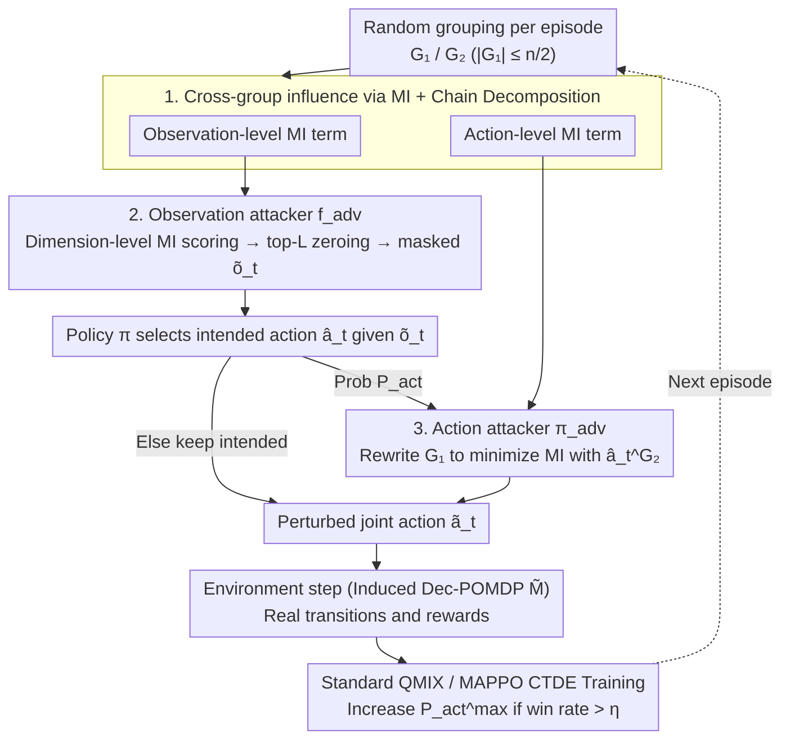

# Interaction-Breaking Adversarial Learning Framework for Robust Multi-Agent Reinforcement Learning

**Conference**: ICML 2026  
**arXiv**: [2605.18024](https://arxiv.org/abs/2605.18024)  
**Code**: https://sunwoolee0504.github.io/IBAL  
**Area**: Reinforcement Learning / Multi-Agent / Robust MARL  
**Keywords**: MARL, CTDE, Mutual Information, Adversarial Training, Collaborative Robustness  

## TL;DR
From an information-theoretic perspective, this paper characterizes the "mutual influence" between agents using conditional mutual information. It designs attackers that simultaneously mask observations and perturb actions to minimize cross-group mutual information. Consequently, the IBAL policy is trained to maintain stable decision-making even during collaborative collapses. It significantly outperforms existing robust MARL methods under various attacks and "missing teammate" perturbations in SMAC / SMACv2 / LBF.

## Background & Motivation

**Background**: Cooperative MARL typically adopts the Centralized Training with Decentralized Execution (CTDE) framework, such as VDN and QMIX, which decompose the joint action value $Q^{tot}$ into individual utilities $Q^i$. This tight coupling during training allows agents to learn sophisticated collaborative strategies but makes them extremely sensitive to "interaction patterns rarely seen during training."

**Limitations of Prior Work**: Existing robust MARL works (e.g., adversarial regularization in Lin et al. 2020, critical-moment action attacks in ROMANCE/EGA, serial targeted attacks in Wolfpack, and RL attackers in ATLA) mostly frame robustness as "value-oriented" perturbations. Attackers either select actions that minimize $Q^i$ or add FGSM noise to observations. These objectives implicitly assume that "perturbations occur only at individual agent inputs" and do not directly disrupt the "dependency structure between agents." Consequently, when attacks truly sever collaboration links (e.g., making one group invisible to another), these defense methods collapse.

**Key Challenge**: There is a structural assumption mismatch between training and execution in CTDE. Training assumes agents can reliably "read" each other via value decomposition, whereas real-world deployment may disrupt collaboration due to communication failure, occlusion, or unit death, leading to interaction breaks never encountered in the training distribution.

**Goal**: (i) Quantify "cross-agent influence" in a manner independent of the $Q^{tot}$ structure; (ii) Construct attackers capable of directly erasing this influence; (iii) Learn a set of policies robust to "collaboration collapse" that further generalize to non-parametric perturbations like "missing teammates."

**Key Insight**: The authors randomly partition $n$ agents into two groups $G_1$ and $G_2$. They characterize the influence of $G_2$ on $G_1$ using conditional mutual information $\mathcal{I}(\boldsymbol{o}_{t+1}^{G_1}, \boldsymbol{a}_t^{G_1}; \boldsymbol{a}_t^{G_2} \mid \boldsymbol{\tau}_t)$ and decompose it into observation-level and action-level terms via the chain rule of MI. By using an observation-masking attacker and an action-rewriting attacker to minimize these two terms respectively, they derive an attack that deliberately sever the collaboration channel without relying on value estimation.

**Core Idea**: The "interaction-breaking" objective (minimizing cross-group MI) is used for adversarial training. The authors prove this is equivalent to standard MARL optimization on an induced Dec-POMDP with perturbed transitions, thereby reducing the "collaboration collapse robustness" problem to a standard value learning problem.

## Method

### Overall Architecture
IBAL wraps a "grouping-attack-training" loop around the CTDE training cycle. At the start of each episode, $k \sim \mathrm{Unif}(\{0,\dots,K\})$ and $G_1 \subset \mathcal{N}$ are randomly sampled (with $|G_1| \le n/2$ to prevent over-powering the attack), and $G_2 = \mathcal{N}\setminus G_1$. In each environment step, the observation attacker $\boldsymbol{f}_{\mathrm{adv}}$ identifies the top $L$ dimensions of the $G_1$ observation components directed toward $G_2$ based on MI scores and sets them to zero. The policy $\boldsymbol{\pi}$ selects an intended action $\hat{\boldsymbol{a}}_t$ based on the masked observation $\tilde{\boldsymbol{o}}_t$. With probability $P_{\mathrm{act}}$, the action attacker $\boldsymbol{\pi}_{\mathrm{adv}}$ replaces $G_1$'s sub-actions with $\tilde{\boldsymbol{a}}_t^{\mathrm{min},G_1}$, which minimizes the MI with $\hat{\boldsymbol{a}}_t^{G_2}$. The environment progresses using the perturbed joint action $\tilde{\boldsymbol{a}}_t$. Transitions and rewards follow real dynamics but are equivalently viewed as samples from a new "induced Dec-POMDP" $\tilde{\mathcal{M}}$ with perturbed transitions, allowing direct optimization via standard CTDE optimizers like QMIX or MAPPO.

Theoretical support is provided by Theorem 4.2: Viewing the "observation attack $\to$ policy $\to$ action attack" sequence as a composite policy $\boldsymbol{\pi}_{\mathrm{adv}} \circ \boldsymbol{\pi} \circ \boldsymbol{f}_{\mathrm{adv}}$, its value on the Joint-Adversarial Dec-POMDP $\mathcal{M}^J$ is exactly equal to the value $\tilde{V}_{\boldsymbol{\pi}}(s_t)$ of the original policy $\boldsymbol{\pi}$ on an induced Dec-POMDP $\tilde{\mathcal{M}}$ where the state is augmented as $\tilde{s}_t = (s_t, \tilde{\boldsymbol{a}}_t)$ and the transition becomes $\tilde{P}(\tilde{s}_{t+1}\mid \tilde{s}_t, \hat{\boldsymbol{a}}_t) := P(s_{t+1}\mid s_t, \hat{\boldsymbol{a}}_t)\cdot \boldsymbol{\pi}_{\mathrm{adv}}(\tilde{\boldsymbol{a}}_t\mid s_t, \hat{\boldsymbol{a}}_t)$. This equivalence turns "learning the optimal policy under an attacker" back into "learning the optimal policy in a new environment," allowing the direct use of the QMIX loss without specialized minimax optimization.

### Key Designs

**1. MI-based influence characterization and chain decomposition: Measure "influence of $G_2$ on $G_1$" using a metric decoupled from value functions and split into two attackable components.**

Value-oriented attacks only measure "how much the value is dropped" and cannot express "how much the collaboration link is severed." Furthermore, if value estimates themselves are unreliable (e.g., QMIX monotonic mixing distorts estimates for non-optimal actions), the attack direction becomes distorted. IBAL defines the influence of $G_2$ on $G_1$ as the conditional mutual information $\mathcal{I}(\boldsymbol{o}_{t+1}^{G_1}, \boldsymbol{a}_t^{G_1}; \boldsymbol{a}_t^{G_2} \mid \boldsymbol{\tau}_t)$, which is decomposed via the chain rule into an observation term $\mathcal{I}(\boldsymbol{o}_{t+1}^{G_1}; \boldsymbol{a}_t^{G_2} \mid \boldsymbol{a}_t^{G_1}, \boldsymbol{\tau}_t)$ and an action term $\mathcal{I}(\boldsymbol{a}_t^{G_1}; \boldsymbol{a}_t^{G_2} \mid \boldsymbol{\tau}_t)$. The observation term measures how much $G_2$'s actions change what $G_1$ sees next, while the action term measures the coordination between $G_1$ and $G_2$. MI directly corresponds to information flow and is independent of QMIX's structural assumptions, providing consistent attack directions even in regions with distorted value estimates.

**2. Observation Attack: Dimension-level MI upper bound + Zero-masking**

To identify the $L$ dimensions in $G_1$'s observations that most inform them about $G_2$, the authors use Lemma 4.3 to upper bound the group-level observation MI as the sum of dimension-level MI plus a group redundancy term $\mathcal{R}(G_1;G_2)$. Empirically, the redundancy term is negligible. Thus, the optimal mask is approximated by scoring each dimension individually: $D^{i,*} = \arg\max_{D^i:|D^i|=L}\sum_{d\in D^i}\sum_{j\in G_2}\mathcal{I}(o^i_{d,t+1}; a^j_t \mid a^i_t, \boldsymbol{\tau}_t)$. Selected dimensions are zeroed: $\tilde{o}^i_{d,t}=0$. Dimension-level MI is trained using the CLUB estimator. Zero-masking is chosen over Gaussian noise or FGSM because, by the Data Processing Inequality, deterministic zeroing removes signals more effectively, whereas noisy perturbations may retain residual MI.

**3. Action Attack + Adaptive Attack Intensity Scheduling**

After the policy provides the intended action $\hat{\boldsymbol{a}}_t$, $G_1$'s actions are rewritten to $\tilde{\boldsymbol{a}}_t^{\mathrm{min},G_1} := \arg\min_{\boldsymbol{a}_t^{G_1}} \mathcal{I}(\boldsymbol{a}_t^{G_1}; \hat{\boldsymbol{a}}_t^{G_2}\mid \boldsymbol{\tau}_t)$ with probability $P_{\mathrm{act}}$. The action-level MI is estimated using a shared KL-divergence estimator. Crucially, the attack intensity follows a curriculum: $P_{\mathrm{act}}\sim\mathrm{Unif}(1/K, P_{\mathrm{act}}^{\max})$. When the average win rate $\bar\sigma$ exceeds threshold $\eta$, the upper bound is scaled: $P_{\mathrm{act}}^{\max}\leftarrow \min(1,\alpha P_{\mathrm{act}}^{\max})$. This adaptive scheduling builds difficulty into training; the lower bound $1/K$ ensures non-trivial attacks even for weak policies.

### Loss & Training
The value loss follows the standard objective of the chosen backbone (QMIX or MAPPO), using transitions sampled from $\tilde{\mathcal{M}}$. CLUB and KL estimators are updated online alongside the policy. All SMAC experiments are run for 10M steps, initialized from a 1M-step pre-trained QMIX for fair comparison. "Mutual shielding" in observations is symmetrized to avoid training bias. The grouping limit $K\le n/2$ is a key hyperparameter searched per scenario ($K=1$ for 2s3z, $K=4$ for 8m).

## Key Experimental Results

### Main Results
Baselines include Vanilla QMIX, Rand-Obs/Rand-Act, FGSM, ATLA, ERNIE, ROMANCE, and WALL. Evaluated attacks include Nat. / Rand. / FGSM / EGA / Wolfpack / Ours.

| Evaluation Setting | Vanilla QMIX | ROMANCE / WALL (Strong Baselines) | IBAL (Ours) |
|----------|-------------|-----------------------------|------------|
| Natural (No attack) | Med—High | Similar to Vanilla | No weaker than Vanilla |
| FGSM / EGA / Wolfpack attacks | Significant drop | Good against own attack; collapses under Interaction-Breaking | Maintains high win rate across all attacks |
| Interaction-Breaking attack (Ours) | Worst collapse | Worst collapse | Significantly highest |
| Dis-1 / Dis-2 (Teammate disabled) | Sharp decline | General large drop | Gap widens further |
| HP-15 (Ally initial HP -15%) | Degradation | Slightly better but still drops | Clearly leading |
| LBF / SMACv2 Natural Perf. | Hampered by randomness | Similar to Vanilla | Even higher; proves robustness to randomness |
| MAPPO backbone | — | — | Robustness gains also observed |

### Ablation Study

| Configuration | 8m Dis-1 Win Rate (%) | 说明 |
|------|-------------------|------|
| IBAL Full | 88.4 ± 3.3 | Full Method |
| w/o adaptive prob. (Fixed $P_{\mathrm{act}}=1/K$) | Significant drop | Curriculum attack intensity is critical |
| w/ random masking (Random $L$ dims) | Decline | MI-guided is more effective than random |
| w/o Observation Attack | Substantial drop | Obs/Act attacks are not mutually replaceable |
| w/o Action Attack | Substantial drop | Same as above |
| IBAL + Gaussian noise (Replace zero) | 78.1 ± 13.3 (8m) / 71.9 ± 22.1 (MMM) | Residual MI weakens attack |
| IBAL + FGSM (Replace zero) | 38.5 ± 7.4 (8m) / 77.6 ± 3.6 (MMM) | FGSM is weaker for cutting information flow |

### Key Findings
- IBAL's "MI-minimizing action" attack manifests as directional "retreating to disengage from $G_2$" in trajectory visualizations. Value-minimization attacks often trigger unreliable estimates under QMIX's monotonic mixing, resulting in oscillatory jitter.
- IBAL policies learn emergency behaviors for collaborative collapse: in 8m, healthy allies move forward to replace damaged frontlines; in MMM, low-HP units actively approach medivacs being driven away. These behaviors are rare in standard training and are forced by "frequent interaction breaks."
- Increasing the maximum grouping $K$ isn't always better: 2s3z is optimal at $K=1$, while 8m remains stable up to $K=4$, reflecting a trade-off between attack intensity and learnability.

## Highlights & Insights
- **Value-oriented vs. Information-oriented**: This paper expands robust MARL from "dropping value" to "dropping information flow," providing a novel attack surface relevant to communication hijacking or occlusion in deployment.
- **Dimension-level MI upper bounds** transform MI-based attacks from theoretical concepts to engineering solutions. Scoring each dimension once and aggregating prevents the computational explosion typically associated with MI attacks.
- **JA-Dec-POMDP to Induced Dec-POMDP equivalence** avoids true minimax training, allowing the use of standard CTDE implementations for adversarial training. This is why IBAL can be easily integrated with both QMIX and MAPPO.
- Training against "missing teammates" is implicitly covered by MI attacks and random grouping, leading to substantial leads in Dis-$\ell$ settings.

## Limitations & Future Work
- Several hyperparameters ($K, L, P_{\mathrm{act}}^{\max}, \alpha, \eta$) are introduced, requiring small-scale searches across tasks.
- Continuous training of CLUB/KL estimators adds a "moderate" computational cost relative to vanilla QMIX.
- Evaluation is focused on SMAC and LBF; verification in heterogeneous multi-agent scenarios or real-world communication constraints (packet loss) is pending.
- Attackers focus on "information cutting" rather than "misleading injection" (e.g., providing false observations), which remains a natural next step.

## Related Work & Insights
- **vs ROMANCE / EGA**: These use RL-learned attackers to minimize value estimates. IBAL minimizes cross-group MI, which is independent of the Q-network structure and thus backbone-agnostic and effective even where value estimates are unreliable.
- **vs Wolfpack/WALL**: Wolfpack sequentially attacks individuals within a group, whereas IBAL severs group-level dependencies. WALL is strong against its own attack but collapses under MI-based attacks.
- **vs ATLA**: ATLA trains an RL observation attacker. IBAL provides a closed-form MI attack with a grouping curriculum, avoiding the instability of adversarial RL training.
- **vs MI for communication/role discovery**: Previous works use MI as a positive reward/regularizer. IBAL uses "minimal MI" as an adversarial target, representing a "dual usage" of the same tool.

## Rating
- Novelty: ⭐⭐⭐⭐⭐ First to systematically treat "interaction breaks" as an attack surface for MARL robustness.
- Experimental Thoroughness: ⭐⭐⭐⭐ Extensive scenarios and backbone tests, though lacking real communication environments.
- Writing Quality: ⭐⭐⭐⭐ Clear theoretical derivation and integration with implementation.
- Value: ⭐⭐⭐⭐ High practical value for scenarios where collaboration is fragile; backbone-agnostic.

<!-- RELATED:START -->

## Related Papers

- [\[ICLR 2026\] Distributionally Robust Cooperative Multi-agent Reinforcement Learning with Value Factorization](../../ICLR2026/reinforcement_learning/distributionally_robust_cooperative_multi-agent_reinforcement_learning_with_valu.md)
- [\[ICML 2026\] Vulnerable Agent Identification in Large-Scale Multi-Agent Reinforcement Learning](vulnerable_agent_identification_in_large-scale_multi-agent_reinforcement_learnin.md)
- [\[ICML 2026\] LLM-Guided Communication for Cooperative Multi-Agent Reinforcement Learning](llm-guided_communication_for_cooperative_multi-agent_reinforcement_learning.md)
- [\[AAAI 2026\] ChartEditor: A Reinforcement Learning Framework for Robust Chart Editing](../../AAAI2026/reinforcement_learning/charteditor_a_reinforcement_learning_framework_for_robust_chart_editing.md)
- [\[ICLR 2026\] Bayesian Robust Cooperative Multi-Agent Reinforcement Learning Against Unknown Adversaries](../../ICLR2026/reinforcement_learning/bayesian_robust_cooperative_multi-agent_reinforcement_learning_against_unknown_a.md)

<!-- RELATED:END -->
