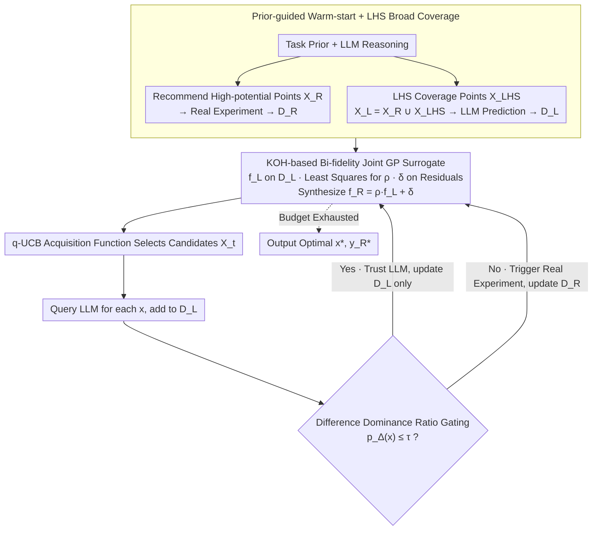

# LABO: LLM-Accelerated Bayesian Optimization through Broad Exploration and Selective Experimentation

**Conference**: ICML 2026  
**arXiv**: [2605.22054](https://arxiv.org/abs/2605.22054)  
**Code**: Not disclosed  
**Area**: Bayesian Optimization / LLM Acceleration / Multi-fidelity / Scientific Discovery  
**Keywords**: Bayesian Optimization, LLM Prior, Multi-fidelity, KOH Model, Gating Criterion  

## TL;DR
This paper proposes LABO, which integrates LLMs as "low-fidelity" evaluation sources into the Bayesian Optimization loop. It decomposes the ground-truth experiment $f_R$ using a Kennedy–O'Hagan joint Gaussian Process into a scaled LLM prediction $\rho f_L$ plus a residual process $\delta$. A "Difference Dominance Ratio" $p_\Delta = \sigma_\delta^2/(\rho^2\sigma_L^2 + \sigma_\delta^2)$ is used as a gating mechanism to decide whether each candidate warrants an expensive real-world experiment. This allows broad exploration via nearly free LLM queries while concentrating expensive experiments in regions where the LLM is untrustworthy. LABO significantly outperforms vanilla BO, LLAMBO, BOPRO, and CAKE across 6 scientific optimization tasks (e.g., COF, Fullerene) under the same real-world budget.

## Background & Motivation

**Background**: Scientific formulation optimization (drug discovery, catalyst design, molecular engineering) involves expensive evaluations for each trial. Bayesian Optimization (BO) is the mainstream approach—using a Gaussian Process (GP) surrogate to model the objective, an acquisition function (EI, UCB) to balance exploration and exploitation, and iteratively suggesting candidates. Recent works have started integrating LLMs into BO: LLAMBO uses LLMs for initialization and candidate suggestion, BOPRO performs BO in the latent space of LLM embeddings, and CAKE injects LLM priors into the GP kernel.

**Limitations of Prior Work**: Existing LLM+BO methods treat LLMs as "suggestion providers" integrated into sampling, surrogates, or acquisition functions, but **fail to fully exploit the fact that LLM evaluation costs are orders of magnitude lower than real experiments**. An LLM inference cost is negligible, while chemical synthesis may take days and thousands of dollars. Current methods only call LLMs lightly during initialization or local decision-making, rather than systemically using them as independently sampleable "low-fidelity sources." Additionally, BO itself faces two persistent challenges: cold-start (lack of initial data) and exploration difficulties in high-dimensional search spaces.

**Key Challenge**: To leverage the low-cost, broad-coverage capability of LLMs, they must be integrated into the surrogate as an evaluation source. However, LLM predictions systematically deviate from ground truth (due to mismatched chemical intuition or reasoning hallucinations). Uncritically trusting them misleads the surrogate. The core problem is how to dynamically balance "broad exploration via LLMs" and "saving real experiments only where LLMs are trustworthy."

**Goal**: Design a BO framework that simultaneously addresses: (i) how to fuse heterogeneous LLM signals and real-world fidelity into a unified probabilistic surrogate; (ii) whether to expend an additional real experiment for a given candidate at each step.

**Key Insight**: The multi-fidelity simulation field has a mature Kennedy–O'Hagan (KOH) joint GP framework, which treats high-fidelity as a linear transformation of low-fidelity plus a residual process, modeled by separate GPs. The authors treat the LLM as a low-fidelity source ("knowledge fidelity," distinct from traditional numerical simulation fidelity) within the KOH framework. They use the variance proportion of the residual GP as an interpretable uncertainty metric to trigger real experiments.

**Core Idea**: Use KOH to decompose the real objective as $f_R(x) = \rho f_L(x) + \delta(x)$, where $f_L$ fits LLM predictions and $\delta$ fits the discrepancy between the LLM and reality. The Difference Dominance Ratio $p_\Delta(x) = \sigma_\delta^2(x)/(\rho^2\sigma_L^2(x) + \sigma_\delta^2(x))$ is compared against a threshold $\tau$. A high $p_\Delta$ indicates uncertainty primarily stems from LLM unreliability, necessitating a real experiment; a low $p_\Delta$ implies the LLM is trustworthy, updating only $f_L$.

## Method

### Overall Architecture
LABO consists of a warm-start phase and an optimization loop. Warm-start: The LLM recommends a few high-potential points $\mathcal{X}_R$ based on task priors $\mathcal{P}$ for real experiments to obtain $\mathcal{D}_R$, while a set of space-filling points $\mathcal{X}_L$ (ensuring $\mathcal{X}_R \subset \mathcal{X}_L$) is generated via Latin Hypercube Sampling for LLM prediction to obtain $\mathcal{D}_L$. Optimization loop: Each round starts by training $f_L \sim \mathcal{GP}(0, k_L)$ on $\mathcal{D}_L$, estimating $\rho$ via least squares, and training $\delta \sim \mathcal{GP}(0, k_\delta)$ on the residuals $\{(x, y_R - \rho y_L)\}$ to synthesize $f_R = \rho f_L + \delta$. Then, q-UCB selects a batch of candidates $\mathcal{X}_t$. For every $x \in \mathcal{X}_t$, an LLM query is performed and added to $\mathcal{D}_L$, followed by calculating $p_\Delta(x)$ to decide whether to trigger a real experiment for $\mathcal{D}_R$, until the real budget is exhausted. The data flow is illustrated below:

### Key Designs

**1. KOH-based Bi-fidelity Joint GP Surrogate: Integrating the LLM as a Cheap Instrument**

Previous LLM+BO works treated the LLM as a "suggestion provider," ignoring its extremely low cost compared to real experiments. LABO's conceptual shift is treating the LLM as an independent low-fidelity evaluation source within the mature Kennedy–O'Hagan framework: assuming $f_L(x)\sim\mathcal{GP}(0,k_L)$ is trained on all LLM evaluations, and the residual $\delta(x)\sim\mathcal{GP}(0,k_\delta)$ is trained on the difference between real experiments and LLM predictions. The real objective is $f_R(x)=\rho f_L(x)+\delta(x)$, with mean $\mu_R=\rho\mu_L+\mu_\delta$ and variance $\sigma_R^2=\rho^2\sigma_L^2+\sigma_\delta^2$. $\rho$ is calibrated via $\rho=\arg\min_\rho\sum_{\mathcal{D}_R}(y_R-\rho y_L)^2$. The two GPs are independent but linked via $\rho$, so increasing LLM queries alone improves $(\mu_R,\sigma_R^2)$. This modeling **adaptively identifies systematic bias**—if the LLM is accurate, the residual variance is small; if not, the residual GP absorbs the deviation. Compared to treating LLMs as difficult-to-tune prior means or unstable kernels (as in CAKE), KOH is more interpretable with fewer hyperparameters.

**2. Difference Dominance Ratio Gating: Letting the Model Decide Experimentation Worthiness**

With the joint surrogate, the core question is whether to spend an expensive experiment on candidate $x$. LABO avoids manual cost-benefit ratios, calculating instead the "proportion of uncertainty contributed by the residual GP":

$$p_\Delta(x) = \frac{\sigma_\delta^2(x)}{\rho^2\sigma_L^2(x) + \sigma_\delta^2(x)},$$

If $p_\Delta(x)\le\tau$, only the LLM is queried to update $\mathcal{D}_L$; otherwise, a real experiment is triggered for $\mathcal{D}_R$. The intuition is clear: if uncertainty is dominated by the residual $\delta$, the LLM is unreliable at $x$ and an experiment is needed to reduce error. If dominated by the LLM variance $\sigma_L^2$, the LLM simply hasn't explored near that point, and additional cheap LLM queries suffice. The authors prove this gating causes the "real experimental region" to converge to a stable subset $\mathcal{X}_R^*$ in finite steps and provide a cumulative regret bound where the key term $\Psi_T(\mathcal{X}_R^*)\ll\Psi_T(\mathcal{X})$.

**3. Prior-guided Warm-start + LHS Broad Coverage: Solving Cold-start and High-dimensional Exploration**

Cold-start and high-dimensional exploration are independent pain points in BO. LABO uses the LLM to fill two roles: (1) recommending high-potential points $\mathcal{X}_R$ via in-context reasoning based on scientific priors (literature, constraints) to provide initial ground truth; (2) using Latin Hypercube Sampling for a set of coverage points $\mathcal{X}_L=\mathcal{X}_R\cup\mathcal{X}_{\text{LHS}}$ (50 points in the paper) for LLM prediction, fitting the global structure of $f_L$ from the start. The constraint $\mathcal{X}_R\subset\mathcal{X}_L$ ensures paired data is available to train $\rho$ and $\delta$ immediately. The LLM acts as both an "expert" and a "cheap simulator."

### Loss & Training
All main experiments use $\tau = 0.75$, batch size of 2, 3 initial real points, 50 warm-up LLM evaluations, q-UCB acquisition function, and an RBF kernel, without per-task tuning. The LLM backend is primarily Intern S1 241B, with ablations on Intern-S1-mini 7B, Qwen3-235B (Instruct/Thinking), and DeepSeek V3.1 685B.

## Key Experimental Results

### Main Results

| Task (Dim) | Evaluation | LABO | Vanilla BO | LLAMBO | BOPRO | CAKE |
|------------|------------|------|------------|--------|-------|------|
| COF (14D) | Final Obj | **Best** | Behind | Early speed, stuck local | Early speed, stuck local | High variance |
| Sandwich (20D) | Final Obj | **Best** | Behind | Stuck | Stuck | High variance |
| PCE10 (4D) | Convergence | **Best** | Fast conv, low final | — | — | — |
| Fullerene (3D) | Final Obj 0.9512 | **Best** | Behind | — | — | — |
| Flow Battery (3D) | Final | **Best** | — | — | — | — |
| P3HT (5D) | Final | **Best** | — | — | — | — |

LABO is optimal across all 6 scientific tasks with significantly lower variance than baselines (especially CAKE); the advantage is greatest in high-dimensional tasks (COF, Sandwich) as LLM broad sampling is more efficient than pure BO.

### Ablation Study

| $\tau$ | COF Final | COF Iter to 90% | COF L/R Ratio | Fullerene Final | Fullerene L/R Ratio |
|--------|----------|-------------------|------------|----------------|------------------|
| 0.60 | 10.778±0.276 | 24.60±2.51 | 1.52±0.29 | 0.9490 | 1.54 |
| 0.70 | 11.070 | 15.83 | 2.00 | 0.9511 | 2.00 |
| **0.75** | **11.228** | **14.17** | **2.68** | **0.9512** | **3.87** |
| 0.80 | 11.134 | 14.80 | 3.44 | 0.9506 | 5.69 |
| 0.85 | 11.171 | 12.60 | 5.26 | 0.9499 | 14.60 |

### Key Findings
- Even when providing vanilla BO with the same LLM initialization points, LABO leads significantly, proving gains come from the bi-fidelity loop, not just starting points.
- Replacing LLM predictions with uniform random values causes performance to collapse, proving LLM scientific priors provide actual signal.
- Stronger LLM backends perform better: Qwen3-Thinking > Qwen3-Instruct (reasoning helps); DeepSeek 685B ≈ Intern-S1 241B > Intern-S1-mini 7B. LABO is robust to backend choice.
- $\tau = 0.75$ is the "sweet spot": lower $\tau$ relies too much on real experiments; higher $\tau$ over-trusts biased LLM predictions. LABO automatically adjusts budget allocation based on task complexity (L/R ratio).
- Visualization reveals LLM query points cover the entire space while real experiments concentrate in low-reliability high-potential sub-regions.

## Highlights & Insights
- Re-positioning LLMs as "knowledge fidelity sources" instead of "suggestion generators" is the breakthrough. Once treated as another instrument, mature multi-fidelity tools like KOH become applicable.
- Using $p_\Delta$ (uncertainty ratio) for gating is far more robust and interpretable than manual cost/benefit thresholds.
- The framework makes no structural assumptions about LLM accuracy, allowing the residual GP to take over automatically when LLMs are wrong—a practical engineering stance toward "unreliable but cheap" signals.

## Limitations & Future Work
- Risk of LLM bias: If an LLM is biased toward mainstream compounds in its training data, LABO might miss novel discoveries.
- Constant $\rho$: The assumption that the LLM-to-real relationship is a global constant may be flawed; a local $\rho(x)$ might be needed for different chemical categories.
- Scaling: Experiments were conducted with small batches (2 candidates per step); performance in large-scale wet-lab parallel batches remains to be seen.

## Related Work & Insights
- **vs LLAMBO**: LLAMBO uses LLMs to suggest points, but decision-making stays with the acquisition function. LABO treats the LLM as a source, feeding it directly into the likelihood calculation and surrogate.
- **vs CAKE**: CAKE injects priors into kernels, which can be unstable. LABO's decoupled GPs via KOH are more robust.
- **vs Traditional Multi-fidelity BO**: While traditional methods use lower-accuracy physical simulations, LABO introduces "knowledge fidelity" derived from language models using the same rigorous frameworks.

## Rating
- Novelty: ⭐⭐⭐⭐
- Experimental Thoroughness: ⭐⭐⭐⭐
- Writing Quality: ⭐⭐⭐⭐
- Value: ⭐⭐⭐⭐ 

<!-- RELATED:START -->

## Related Papers

- [\[ACL 2026\] DPEPO: Diverse Parallel Exploration Policy Optimization for LLM-based Agents](../../ACL2026/reinforcement_learning/dpepo_diverse_parallel_exploration_policy_optimization_for_llm-based_agents.md)
- [\[ACL 2026\] Semantic-Space Exploration and Exploitation in RLVR for LLM Reasoning](../../ACL2026/reinforcement_learning/semantic-space_exploration_and_exploitation_in_rlvr_for_llm_reasoning.md)
- [\[NeurIPS 2025\] Gradient-Variation Online Adaptivity for Accelerated Optimization with Hölder Smoothness](../../NeurIPS2025/reinforcement_learning/gradient-variation_online_adaptivity_for_accelerated_optimization_with_hölder_sm.md)
- [\[ACL 2026\] Efficient Hyperparameter Optimization for LLM Reinforcement Learning](../../ACL2026/reinforcement_learning/efficient_hyperparameter_optimization_for_llm_reinforcement_learning.md)
- [\[NeurIPS 2025\] Optimizing the Unknown: Black Box Bayesian Optimization with Energy-Based Model and Reinforcement Learning](../../NeurIPS2025/reinforcement_learning/optimizing_the_unknown_black_box_bayesian_optimization_with_energy-based_model_a.md)

<!-- RELATED:END -->
